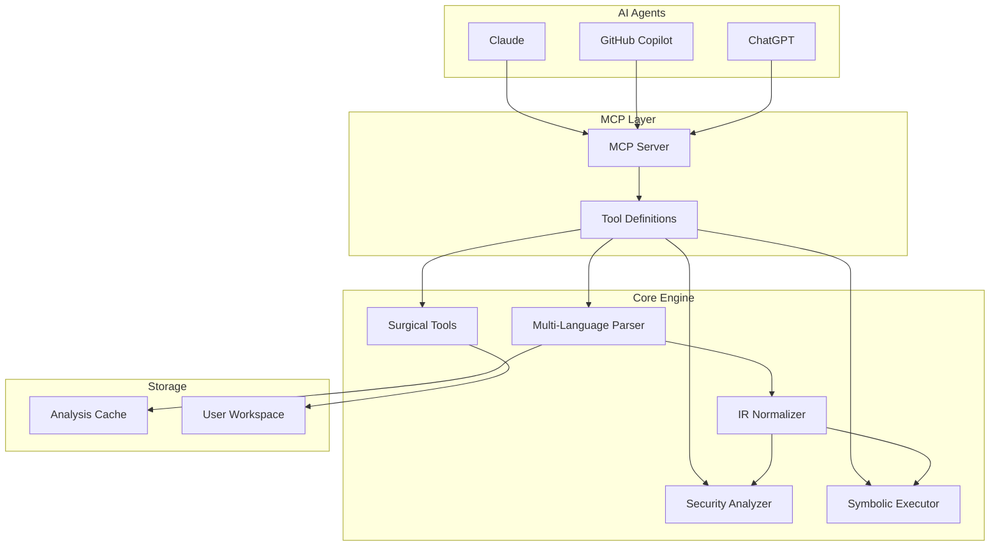
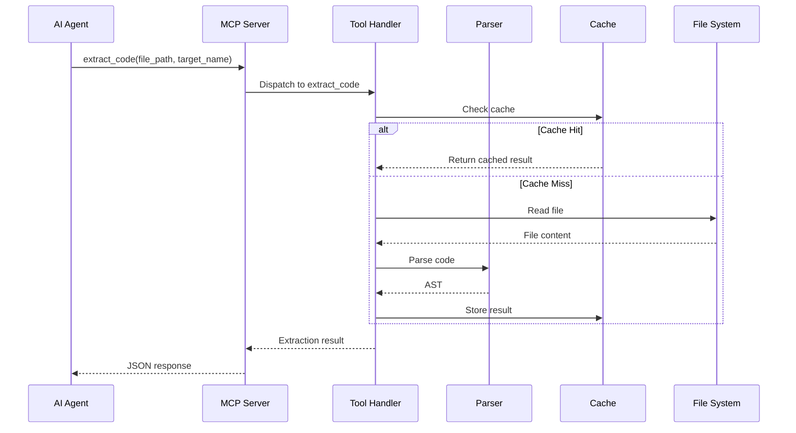
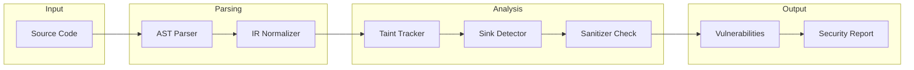
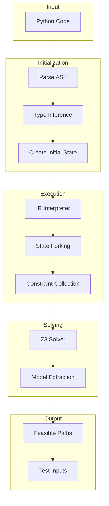
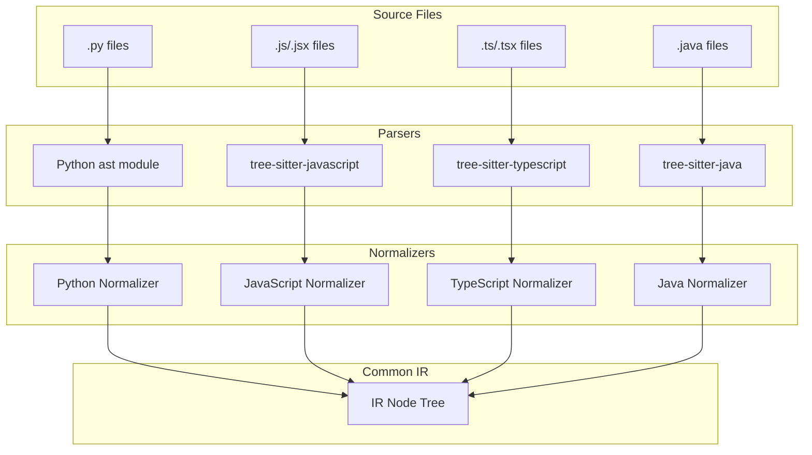
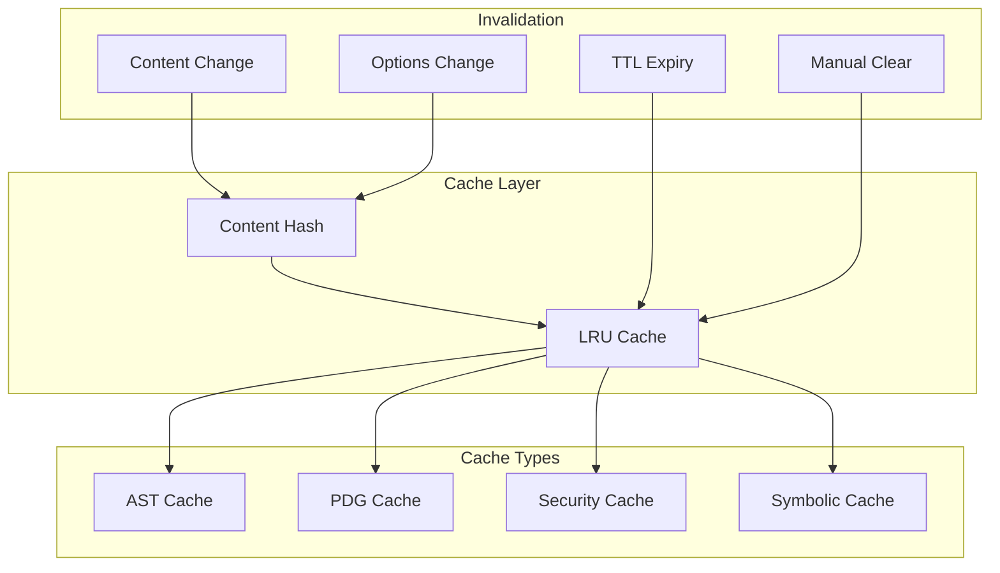
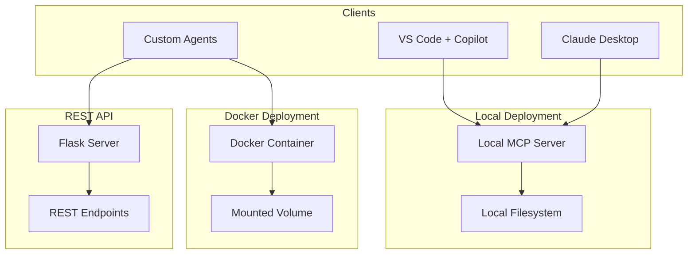

<!-- [20251215_DOCS] Architecture: Component Diagrams -->

# Code Scalpel Component Diagrams

This document provides visual representations of Code Scalpel's architecture using Mermaid diagrams.

---

## High-Level Architecture

---

## MCP Tool Request Flow

---

## Security Analysis Pipeline

---

## Symbolic Execution Engine

---

## Multi-Language Parser Architecture

---

## Surgical Extraction Flow

```mermaid
flowchart LR
    subgraph "Request"
        Req[extract_code request]
    end
    
    subgraph "Extraction"
        Find[Find Symbol]
        Extract[Extract Code]
        Deps[Resolve Dependencies]
    end
    
    subgraph "Cross-File"
        Imports[Analyze Imports]
        Resolve[Resolve Modules]
        ExtDeps[Extract External Deps]
    end
    
    subgraph "Response"
        Code[Extracted Code]
        Context[Context Dependencies]
        Tokens[Token Estimate]
    end
    
    Req --> Find
    Find --> Extract
    Extract --> Deps
    Deps --> Imports
    Imports --> Resolve
    Resolve --> ExtDeps
    ExtDeps --> Code
    Code --> Context
    Context --> Tokens
```

---

## Cache Architecture

---

## Deployment Options

