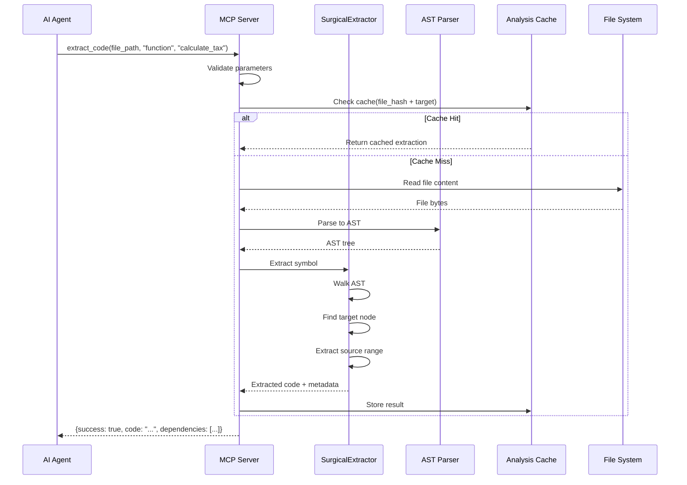
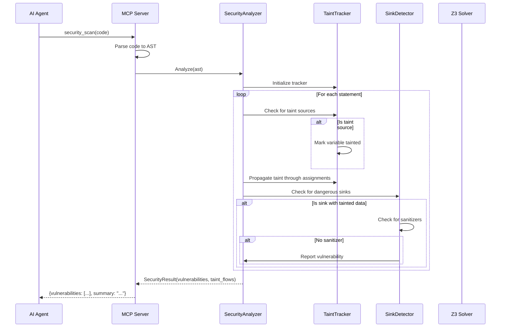
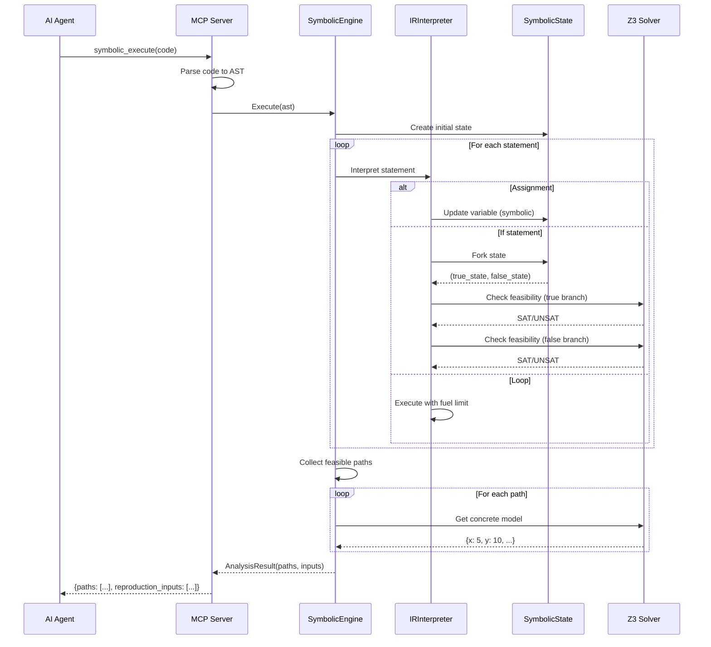
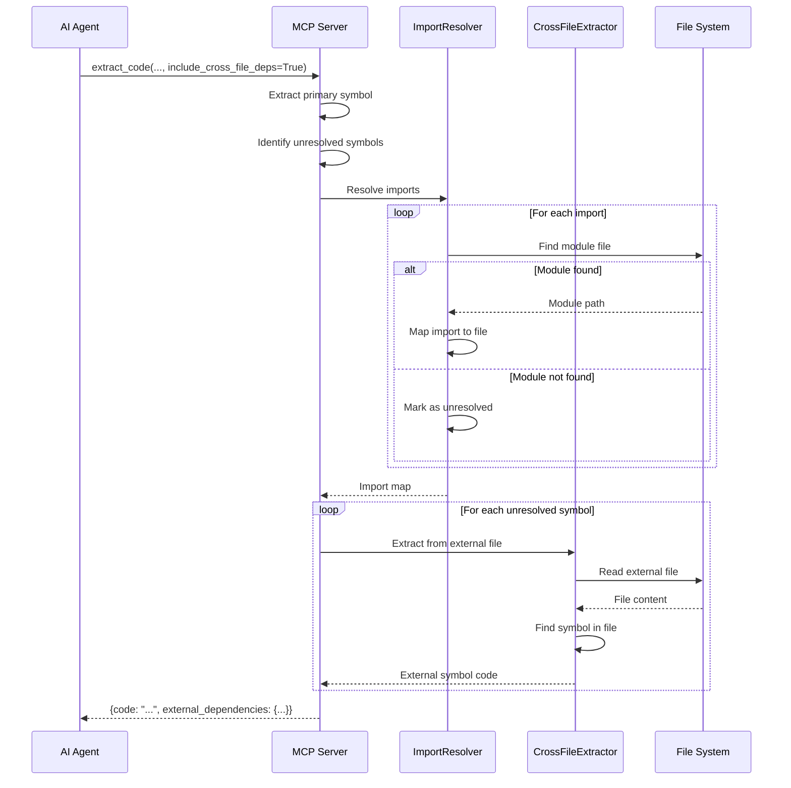
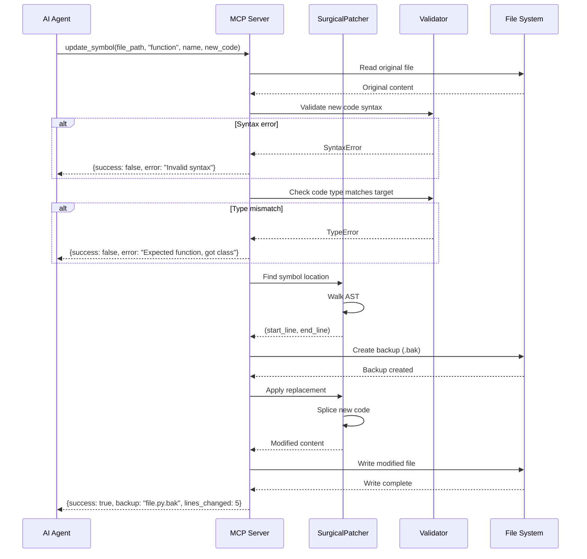
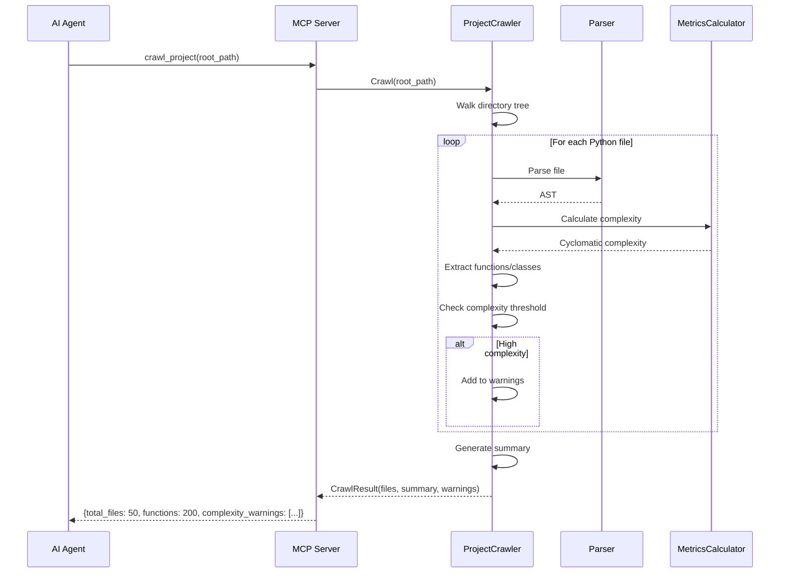
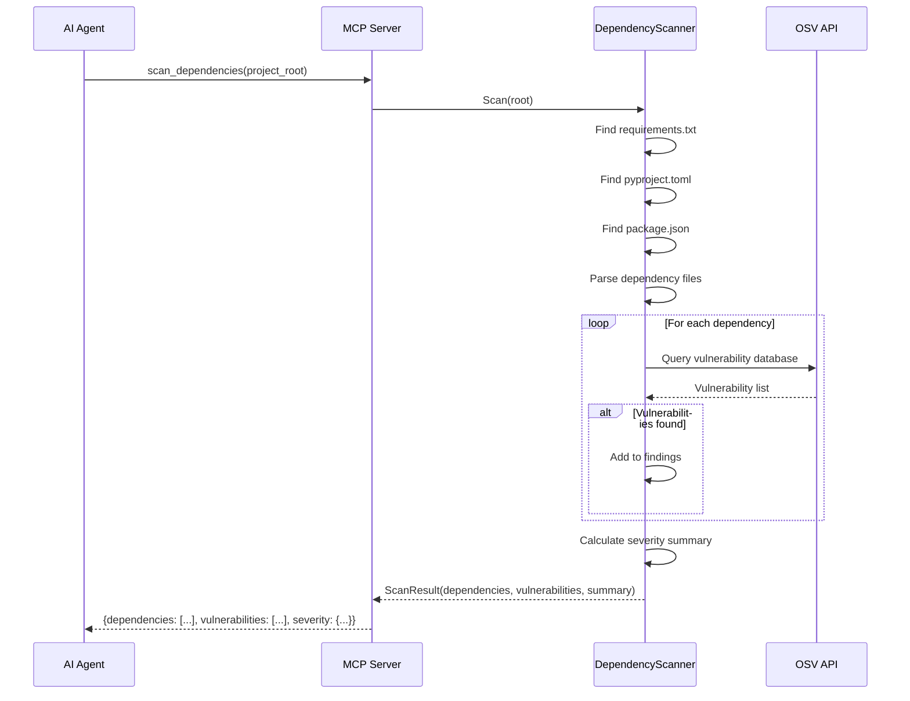
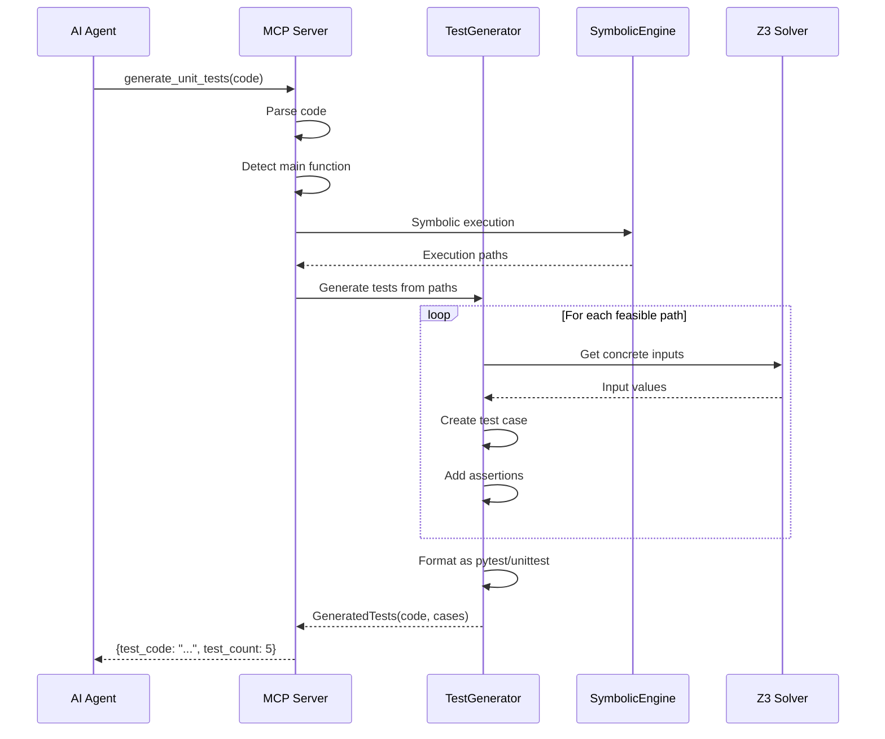

<!-- [20251215_DOCS] Architecture: Sequence Diagrams -->

# Code Scalpel Sequence Diagrams

This document provides detailed sequence diagrams for key Code Scalpel operations.

---

## 1. Code Extraction Workflow

---

## 2. Security Scan Workflow

---

## 3. Symbolic Execution Workflow

---

## 4. Cross-File Dependency Resolution

---

## 5. Safe Symbol Update Workflow

---

## 6. Project Crawl Workflow

---

## 7. Dependency Vulnerability Scan

---

## 8. Test Generation Workflow

