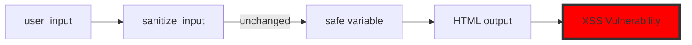

# Phase 2: Asset Preparation Requirements

**Timeline**: Week 1 (7 days)
**Objective**: Prepare all testing environments, fixtures, and visual assets needed for recording the 12 demo scripts.

---

## Table of Contents

1. [Overview](#overview)
2. [Test Environment Setup](#test-environment-setup)
3. [Fixture Preparation](#fixture-preparation)
4. [Recording Equipment Configuration](#recording-equipment-configuration)
5. [Visual Assets Creation](#visual-assets-creation)
6. [Verification Checklist](#verification-checklist)

---

## Overview

Phase 2 prepares everything needed to execute the recording scripts created in Phase 1. This includes:

- Setting up isolated test environments
- Preparing all test fixtures from Ninja Warrior suite
- Configuring recording equipment and software
- Creating visual assets (diagrams, tables, overlays)
- Verifying all commands and outputs work as documented

**Success Criteria**: All 12 demos can be executed end-to-end with expected outputs.

---

## Test Environment Setup

### 1. Demo Workspace Creation

Create isolated demo workspace to avoid contaminating production codebase.

```bash
# Create demo workspace
mkdir -p ~/code-scalpel-demos
cd ~/code-scalpel-demos

# Clone Code Scalpel for demos
git clone https://github.com/yourusername/code-scalpel.git
cd code-scalpel

# Install in editable mode
pip install -e .

# Verify installation
code-scalpel --version
```

**Expected Output**: Version number displayed (e.g., `code-scalpel 1.3.4`)

### 2. Tier Configuration

Set up configuration files for each tier demonstration.

#### Community Tier Setup

```bash
# Copy community limits
cp .code-scalpel/limits.toml.example .code-scalpel/limits.toml

# Verify community tier limits
code-scalpel get-capabilities
```

**Expected**: Community tier features (50-100 files, depth 1-3)

#### Pro Tier Setup

```bash
# Configure Pro tier (requires license)
# Copy Pro license JWT to .code-scalpel/license.jwt
# Verify Pro features enabled

code-scalpel get-capabilities
```

**Expected**: Pro tier features (500-1000 files, cross-file analysis, audit trails)

#### Enterprise Tier Setup

```bash
# Configure Enterprise tier (requires license)
# Copy Enterprise license JWT
# Verify Enterprise features

code-scalpel get-capabilities
```

**Expected**: Enterprise features (compliance, unlimited scale, distributed execution)

### 3. MCP Server Configuration

Configure Code Scalpel MCP server for Claude Desktop integration.

```bash
# Create MCP server config
mkdir -p ~/.config/claude-desktop

# Add Code Scalpel MCP server
cat > ~/.config/claude-desktop/mcp_settings.json <<EOF
{
  "mcpServers": {
    "code-scalpel": {
      "command": "code-scalpel",
      "args": ["mcp"],
      "env": {
        "CODE_SCALPEL_TIER": "enterprise"
      }
    }
  }
}
EOF
```

**Verification**:
- Open Claude Desktop
- Start new conversation
- Type: "Use code-scalpel tools"
- Verify tools are available

### 4. Test Data Isolation

Ensure each demo has isolated test data to avoid conflicts.

```bash
# Create demo-specific directories
mkdir -p ~/code-scalpel-demos/{vibe-coder,developer,tech-leader}

# Set up Git for clean state tracking
cd ~/code-scalpel-demos
git init
git add .
git commit -m "Initial demo workspace"
```

---

## Fixture Preparation

### 1. Ninja Warrior Fixtures

Copy all required fixtures from the test suite.

```bash
# Source fixtures location
NINJA_WARRIOR_PATH="tests/mcp_tool_verification/mcp_inspector/code-scalpel-ninja-warrior"

# Create fixtures directory
mkdir -p ~/code-scalpel-demos/fixtures

# Copy fixtures (customize based on available fixtures)
# Note: Ninja Warrior fixtures may not exist yet - prepare alternatives
```

### 2. Required Fixtures by Demo

#### Vibe Coder Demo 1: Large File (2000 lines)

**Location**: `fixtures/large_file_2000_lines.py`

**Requirements**:
- Python file with 2000+ lines
- 50+ function definitions
- Realistic legacy code patterns
- One target function: `process_payment`

**Creation Script**:
```python
# generate_large_file.py
def generate_large_file(output_path: str, num_lines: int = 2000):
    with open(output_path, 'w') as f:
        # Write header
        f.write('"""Large legacy system file for demo purposes."""\n\n')
        f.write('import os\nimport sys\nfrom typing import Dict, List, Optional\n\n')

        # Generate 50 functions with ~40 lines each
        for i in range(50):
            f.write(f'def function_{i}(param1: str, param2: int) -> Dict:\n')
            f.write(f'    """Function {i} does something."""\n')
            f.write(f'    result = {{}}\n')

            # Add complexity
            for j in range(35):
                f.write(f'    # Line {j} of function_{i}\n')
                f.write(f'    result["key_{j}"] = param1 + str(param2 + {j})\n')

            f.write(f'    return result\n\n')

        # Add target function
        f.write('def process_payment(amount: float, user_id: str) -> bool:\n')
        f.write('    """Process payment transaction."""\n')
        f.write('    if amount <= 0:\n')
        f.write('        return False\n')
        f.write('    # Payment processing logic\n')
        f.write('    return True\n')

# Run script
generate_large_file('fixtures/large_file_2000_lines.py', 2000)
```

**Verification**:
```bash
wc -l fixtures/large_file_2000_lines.py  # Should show ~2000
code-scalpel extract-code fixtures/large_file_2000_lines.py process_payment
```

#### Vibe Coder Demo 2: Fake Sanitizer

**Location**: `fixtures/fake_sanitizer.py`

**Content**:
```python
"""Anti-hallucination test: Fake sanitizer function."""

def sanitize_input(user_data: str) -> str:
    """Sanitizes user input for safe use."""
    # BUG: Does nothing! Returns input unchanged
    return user_data

def handler(user_input: str) -> str:
    """Handle user input and render HTML."""
    safe = sanitize_input(user_input)
    return f"<div>{safe}</div>"  # XSS vulnerability!
```

**Verification**:
```bash
code-scalpel security-scan fixtures/fake_sanitizer.py
# Expected: XSS vulnerability detected
```

#### Vibe Coder Demo 3: Refactor Scenario

**Location**: `fixtures/refactor_scenario/`

**Structure**:
```
fixtures/refactor_scenario/
├── models.py
├── api.py
├── queries.sql
└── config.json
```

**models.py**:
```python
class User:
    def __init__(self, user_id: str, name: str):
        self.user_id = user_id  # Will be renamed to account_id
        self.name = name

    def to_dict(self):
        return {"user_id": self.user_id, "name": self.name}
```

**api.py**:
```python
from models import User

def get_user(user_id: str):
    # Direct reference
    return User(user_id=user_id, name="Test")

def update_user(data: dict):
    # Dict key reference
    user_id = data["user_id"]
    return user_id
```

**queries.sql**:
```sql
-- String reference in SQL
SELECT * FROM users WHERE user_id = ?;
```

**config.json**:
```json
{
  "database": {
    "primary_key": "user_id"
  }
}
```

**Verification**:
```bash
code-scalpel simulate-refactor fixtures/refactor_scenario/models.py \
  --old-name user_id --new-name account_id
# Expected: 8 locations found
```

#### Developer Demo 1: Type Evaporation

**Location**: `fixtures/type_evaporation/`

**Structure**:
```
fixtures/type_evaporation/
├── backend/
│   ├── models.py
│   └── api.py
└── frontend/
    └── api_client.ts
```

**backend/models.py**:
```python
from pydantic import BaseModel

class User(BaseModel):
    id: int  # Changed from str to int
    name: str
    email: str
```

**backend/api.py**:
```python
from fastapi import FastAPI
from models import User

app = FastAPI()

@app.get("/users/{user_id}")
def get_user(user_id: int) -> User:
    return User(id=user_id, name="Test", email="test@example.com")
```

**frontend/api_client.ts**:
```typescript
// Still uses string!
interface User {
  id: string;  // Type mismatch
  name: string;
  email: string;
}

async function getUser(userId: string): Promise<User> {
  const response = await fetch(`/users/${userId}`);
  return response.json();
}
```

**Verification**:
```bash
code-scalpel type-evaporation-scan fixtures/type_evaporation/
# Expected: Type mismatch detected (backend expects int, frontend sends string)
```

#### Developer Demo 2: Hidden Edge Case

**Location**: `fixtures/hidden_bug/edge_case_puzzle.py`

**Content**:
```python
"""Password validation with hidden edge case."""

def validate_password(password: str, min_length: int = 8) -> bool:
    """Validate password meets requirements."""
    if len(password) < min_length:
        return False

    # Hidden bug: negative min_length bypasses all checks
    if min_length < 0:
        return True

    # Check complexity
    has_upper = any(c.isupper() for c in password)
    has_lower = any(c.islower() for c in password)
    has_digit = any(c.isdigit() for c in password)

    return has_upper and has_lower and has_digit
```

**Verification**:
```bash
code-scalpel symbolic-execute fixtures/hidden_bug/edge_case_puzzle.py \
  --function validate_password
# Expected: 47 paths explored, edge case found (min_length < 0)
```

#### Tech Leader Demo 1: Typosquat

**Location**: `fixtures/typosquat_trap/requirements.txt`

**Content**:
```txt
requests==2.31.0
pyaml==23.5.9    # Typosquat! Should be PyYAML
flask==3.0.0
```

**Verification**:
```bash
code-scalpel scan-dependencies fixtures/typosquat_trap/ \
  --enable-typosquat-detection
# Expected: Typosquat detected (pyaml vs PyYAML)
```

#### Tech Leader Demo 2: Policy Violations

**Location**: `fixtures/policy_violations/risky_commit.py`

**Content**:
```python
"""Code with multiple policy violations."""
import os
import hashlib

def process_data(user_input):
    # Violation 1: No docstring
    # Violation 2: SQL injection
    query = f"SELECT * FROM users WHERE name = '{user_input}'"

    # Violation 3: Weak hashing (MD5)
    hash_val = hashlib.md5(user_input.encode()).hexdigest()

    # Violation 4: os.system with user input
    os.system(f"echo {user_input}")

    return query, hash_val
```

**Verification**:
```bash
code-scalpel code-policy-check fixtures/policy_violations/risky_commit.py
# Expected: 4 violations found
```

### 3. Fixture Organization

Organize all fixtures in a consistent structure:

```
~/code-scalpel-demos/fixtures/
├── vibe-coder/
│   ├── large_file_2000_lines.py
│   ├── fake_sanitizer.py
│   └── refactor_scenario/
├── developer/
│   ├── type_evaporation/
│   ├── hidden_bug/
│   └── large_legacy_file.py
└── tech-leader/
    ├── typosquat_trap/
    ├── policy_violations/
    └── monorepo_sample/
```

---

## Recording Equipment Configuration

### 1. Screen Recording Software

**Option A: OBS Studio (Recommended)**

**Installation**:
```bash
# macOS
brew install --cask obs

# Ubuntu
sudo apt install obs-studio

# Windows
# Download from https://obsproject.com/
```

**Configuration**:
1. Open OBS Studio
2. Settings → Video:
   - Base Resolution: 1920×1080
   - Output Resolution: 1920×1080
   - FPS: 30
3. Settings → Output:
   - Output Mode: Advanced
   - Encoder: x264
   - Rate Control: CBR
   - Bitrate: 6000 Kbps
4. Settings → Audio:
   - Sample Rate: 48kHz
   - Channels: Stereo

**Scene Setup**:
- Scene 1: Full screen (IDE + terminal)
- Scene 2: Split screen (IDE left, terminal right)
- Scene 3: Browser only (for documentation references)

**Option B: Camtasia** (Commercial alternative)

### 2. Audio Equipment

**Microphone Setup**:

**Recommended**: Blue Yeti USB Microphone

**Configuration**:
- Pattern: Cardioid (front pickup only)
- Gain: 50-60% (adjust for your voice)
- Monitoring: Off (use headphones)

**Software Settings**:
- System audio input: Blue Yeti
- Sample rate: 48kHz
- Bit depth: 24-bit
- Monitor latency: Low

**Audio Test**:
```bash
# Record 30-second test
# Say: "This is a test of the Code Scalpel demo recording"
# Play back and verify:
# - No background noise
# - Clear voice
# - No clipping (levels stay below 0dB)
```

### 3. Terminal Configuration

**iTerm2 Setup (macOS)**:

```bash
# Install iTerm2
brew install --cask iterm2

# Configure profile
# Preferences → Profiles → Text:
# - Font: Menlo Regular 18pt
# - Use ligatures: Yes
# - Anti-aliasing: Subpixel

# Preferences → Profiles → Colors:
# - Load preset: "Solarized Dark" or "Nord"
# - Increase contrast if needed

# Preferences → Profiles → Window:
# - Columns: 120
# - Rows: 40
```

**Color Scheme Testing**:
```bash
# Test readability
echo -e "\033[31mError message\033[0m"
echo -e "\033[32mSuccess message\033[0m"
echo -e "\033[33mWarning message\033[0m"
```

**Alternative: Windows Terminal** (Windows 11)

### 4. IDE Configuration

**VS Code Setup**:

```json
// settings.json for recording
{
  "editor.fontSize": 16,
  "editor.lineHeight": 24,
  "terminal.integrated.fontSize": 16,
  "workbench.colorTheme": "GitHub Dark",
  "editor.minimap.enabled": false,
  "editor.renderWhitespace": "none",
  "workbench.statusBar.visible": true,
  "window.zoomLevel": 1
}
```

**Extensions for Demo**:
- Better Comments (color-coded comments)
- Error Lens (inline error display)
- GitLens (git blame inline)

### 5. Recording Workspace

**Physical Setup**:
- Clean desk (no clutter in frame)
- Good lighting (natural or ring light)
- Quiet environment (close windows, turn off fans)
- External monitor (optional: 27" 4K for more screen space)

**Digital Preparation**:
- Close unnecessary apps
- Disable notifications:
  - macOS: Do Not Disturb mode
  - Windows: Focus Assist
- Hide desktop icons
- Clean browser bookmarks bar
- Prepare demo directories

---

## Visual Assets Creation

### 1. Comparison Tables

Create all comparison tables as PNG images for overlays.

**Template**: Use Figma or Keynote

**Example: Token Comparison**:
```
┌─────────────────┬──────────────┬──────────────┐
│ Approach        │ Tokens Used  │ Cost         │
├─────────────────┼──────────────┼──────────────┤
│ Standard Agent  │ 15,000       │ $0.45        │
│ Code Scalpel    │ 200          │ $0.006       │
│ Savings         │ 75x less     │ 75x cheaper  │
└─────────────────┴──────────────┴──────────────┘
```

**Export**: 1920×400px PNG with transparent background

**Required Tables**:
1. Token usage comparison (Vibe Coder #1)
2. LLM vs Code Scalpel accuracy (Vibe Coder #2)
3. IDE vs Code Scalpel refactoring (Vibe Coder #3)
4. Type checking results (Developer #1)
5. Surgical edit costs (Developer #2)
6. Symbolic execution paths (Developer #3)
7. Supply chain scan results (Tech Leader #2)
8. Monorepo performance (Tech Leader #4)

### 2. Mermaid Diagrams

Generate Mermaid diagrams and export as PNG.

**Example: Data Flow for XSS Demo**:


**Export Process**:
```bash
# Install mermaid CLI
npm install -g @mermaid-js/mermaid-cli

# Generate PNG
mmdc -i diagram.mmd -o diagram.png -w 1920 -H 1080 -b transparent
```

**Required Diagrams**:
1. Taint flow (Vibe Coder #2)
2. Type evaporation data flow (Developer #1)
3. Symbolic execution CFG (Developer #3)
4. Supply chain dependency graph (Tech Leader #2)
5. CI/CD pipeline with security gates (Tech Leader #3)

### 3. On-Screen Overlays

Create branded overlays for key stats and CTAs.

**Lower-Third Template**:
```
┌────────────────────────────────────────┐
│ Code Scalpel                           │
│ [stat]: [value]                        │
└────────────────────────────────────────┘
```

**Dimensions**: 1920×200px (bottom 10% of screen)

**Font**: Inter Bold 48pt, white text on dark semi-transparent background

**Required Overlays**:
1. "75x cheaper" (Vibe Coder #1)
2. "Graph-based analysis = ground truth" (Vibe Coder #2)
3. "Parse-before-write prevents broken code" (Vibe Coder #3)
4. "Graph sees what context windows miss" (Developer #1)
5. "30x cheaper, 10x ROI" (Developer #2)
6. "NASA-grade verification" (Developer #3)
7. "SOC2 in 60 seconds" (Tech Leader #1)
8. "Zero-day supply chain detection" (Tech Leader #2)
9. "12x ROI" (Tech Leader #3)
10. "1200x faster updates" (Tech Leader #4)

### 4. Thumbnail Templates

Create YouTube thumbnail templates (1280×720px).

**Design Elements**:
- Code Scalpel logo (top-left)
- Persona icon (Vibe Coder/Developer/Tech Leader)
- Pillar badge (Cheaper/Accurate/Safer/Governable)
- Key stat (e.g., "75x CHEAPER")
- Contrasting colors (high visibility)

**Export**: 6 variations (2 per persona)

---

## Verification Checklist

### Pre-Recording Verification

Run through each demo script and verify:

#### For Each Demo:

- [ ] **Fixture exists and is accessible**
  ```bash
  ls -la fixtures/[demo-fixture-path]
  ```

- [ ] **Commands execute successfully**
  ```bash
  # Test all commands from recording script
  code-scalpel [tool-name] [args]
  ```

- [ ] **Expected outputs match documentation**
  - Compare actual output to "Expected Outputs" section
  - Verify numbers (token counts, time, file counts)
  - Check error messages and warnings

- [ ] **Timing is accurate**
  - Run through script with timer
  - Adjust step durations if needed
  - Total time should match ±30 seconds

- [ ] **Visual assets are prepared**
  - Diagrams exported as PNG
  - Tables created and exported
  - Overlays ready in OBS scenes

#### Environment Verification:

- [ ] **Recording software configured**
  - OBS scenes set up
  - Audio levels tested
  - Video quality verified

- [ ] **Terminal readable**
  - Font size 18pt minimum
  - High contrast theme
  - Command history cleared

- [ ] **IDE configured**
  - Font size 16pt minimum
  - Theme has good contrast
  - Unnecessary panels hidden

- [ ] **MCP server connected**
  - Claude Desktop recognizes tools
  - Tools respond correctly
  - Tier features available

#### Per-Persona Checklist:

**Vibe Coder Demos**:
- [ ] Demo 1: Large file fixture (2000 lines)
- [ ] Demo 2: Fake sanitizer fixture
- [ ] Demo 3: Refactor scenario (4 files)
- [ ] Demo 4: Audit log example

**Developer Demos**:
- [ ] Demo 1: Type evaporation (backend + frontend)
- [ ] Demo 2: Large file for surgical edit
- [ ] Demo 3: Hidden bug fixture
- [ ] Demo 4: Custom policy YAML

**Tech Leader Demos**:
- [ ] Demo 1: Multi-file codebase for compliance
- [ ] Demo 2: Typosquat requirements.txt
- [ ] Demo 3: Risky commit fixture
- [ ] Demo 4: Large repo (or simulation data)

### Dry Run Checklist

**Complete a full dry run of each demo**:

1. Set up environment
2. Follow recording script step-by-step
3. Record actual output vs expected output
4. Note any discrepancies
5. Adjust script or fixtures as needed
6. Verify timing (target ±30 seconds)

**Success Criteria**: All 12 demos execute successfully with correct outputs.

---

## Phase 2 Completion Criteria

### Required Deliverables:

1. ✅ Demo workspace set up and configured
2. ✅ All 12 fixtures prepared and tested
3. ✅ Recording equipment configured and tested
4. ✅ 8 comparison tables created (PNG)
5. ✅ 5 Mermaid diagrams created (PNG)
6. ✅ 10 on-screen overlays created (PNG)
7. ✅ 6 thumbnail templates created (PNG)
8. ✅ All commands verified to work
9. ✅ Dry run completed for at least 3 demos (1 per persona)
10. ✅ Documentation updated with any script changes

### Sign-Off Checklist:

- [ ] Team lead approves fixture quality
- [ ] Visual assets match brand guidelines
- [ ] Recording quality meets standards (1080p, clear audio)
- [ ] All MCP tools accessible in demo environment
- [ ] Tier configurations verified (Community, Pro, Enterprise)

**Once complete**: Proceed to Phase 3 (Recording)

---

## Troubleshooting

### Common Issues:

**Issue**: MCP tools not available in Claude Desktop

**Solution**:
```bash
# Check MCP config
cat ~/.config/claude-desktop/mcp_settings.json

# Restart Claude Desktop
# Verify tools with: "List available MCP tools"
```

**Issue**: Commands take too long (>30 seconds)

**Solution**:
- Use smaller fixtures (reduce file count)
- Pre-index with `crawl_project` before recording
- Edit recording at 1.5x speed

**Issue**: Audio has background noise

**Solution**:
- Use noise reduction in Audacity
- Record in quieter environment
- Use directional microphone (cardioid pattern)

**Issue**: Screen recording drops frames

**Solution**:
- Lower OBS encoder preset ("veryfast" instead of "medium")
- Close resource-intensive apps
- Record to SSD, not HDD

---

## Next Steps

After Phase 2 completion:

→ **Phase 3: Recording** (Weeks 2-3)
  - Record Developer demos first (highest impact)
  - Then Vibe Coder and Tech Leader demos
  - 2-3 demos per week

---

**Phase 2 Owner**: [Assign team member]
**Phase 2 Due Date**: [Week 1 completion date]
**Phase 2 Status**: Not Started

---

*Last Updated*: 2026-02-08
*Document Version*: 1.0
