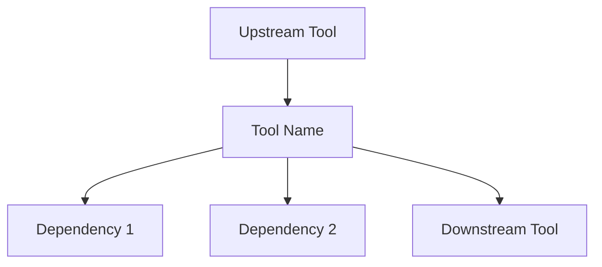
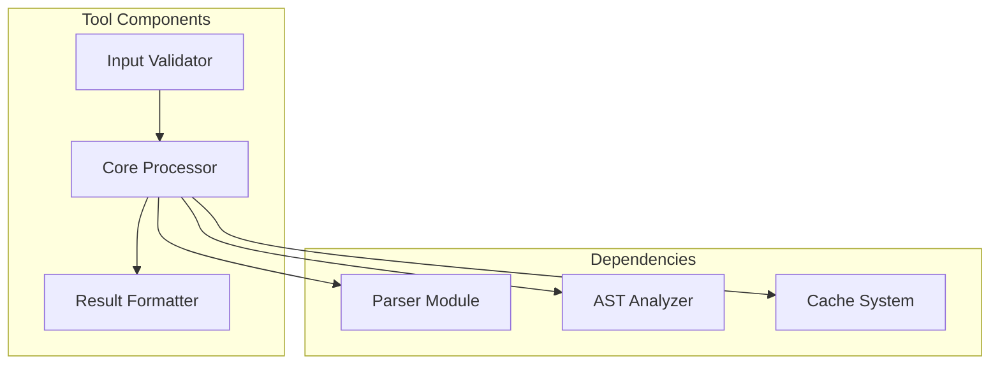
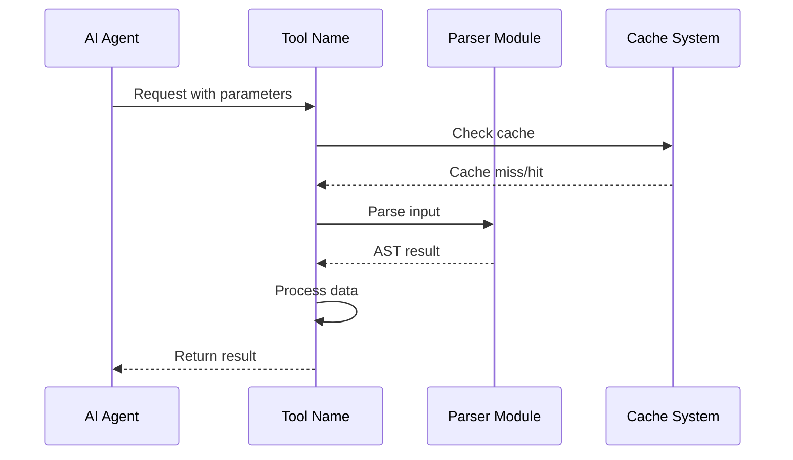

# [Tool Name] - Deep Dive Documentation

> [20260103_DOCS] Created comprehensive tool documentation template for Code Scalpel MCP tools

**Document Type:** Tool Deep Dive Reference  
**Version:** [Tool Version]  
**Last Updated:** [Date]  
**Status:** [Stable | Beta | Experimental]  
**Tier Availability:** [Community | Pro | Enterprise | All Tiers]

---

## Table of Contents

1. [Executive Summary](#executive-summary)
2. [Technical Overview](#technical-overview)
3. [Features and Capabilities](#features-and-capabilities)
4. [API Specification](#api-specification)
5. [Usage Examples](#usage-examples)
6. [Architecture and Implementation](#architecture-and-implementation)
7. [Testing Evidence](#testing-evidence)
8. [Performance Characteristics](#performance-characteristics)
9. [Security Considerations](#security-considerations)
10. [Integration Patterns](#integration-patterns)
11. [Tier-Specific Behavior](#tier-specific-behavior)
12. [Known Limitations](#known-limitations)
13. [Roadmap and Future Plans](#roadmap-and-future-plans)
14. [Troubleshooting](#troubleshooting)
15. [References and Related Tools](#references-and-related-tools)

---

## Executive Summary

### Purpose Statement
[One paragraph describing what this tool does and why it exists. Focus on the problem it solves for AI agents.]

### Key Benefits
- **Benefit 1:** [Description]
- **Benefit 2:** [Description]
- **Benefit 3:** [Description]

### Quick Stats
| Metric | Value |
|--------|-------|
| **Version** | [Version number] |
| **Release Date** | [Date] |
| **Test Coverage** | [Percentage] |
| **Performance** | [Key metric, e.g., "< 100ms for typical operations"] |
| **Languages Supported** | [Python, JavaScript, TypeScript, Java, etc.] |
| **Token Efficiency** | [Token cost vs alternative approaches] |

### When to Use This Tool
- **Primary Use Case:** [Description]
- **Secondary Use Cases:** [List]
- **Not Suitable For:** [When NOT to use this tool]

---

## Technical Overview

### Core Functionality
[2-3 paragraphs explaining what the tool does at a technical level, including algorithms, techniques, or approaches used.]

### Design Principles
1. **Principle 1:** [e.g., "Token efficiency first"]
2. **Principle 2:** [e.g., "Server-side processing"]
3. **Principle 3:** [e.g., "No hallucination risk"]

### System Requirements
- **Python Version:** [Minimum version]
- **Dependencies:** [Key dependencies]
- **Memory:** [Typical/maximum memory usage]
- **CPU:** [Processing requirements]

### Integration Context
[Describe how this tool fits into the broader Code Scalpel ecosystem. What other tools does it work with?]



---

## Features and Capabilities

### Core Features

#### Feature 1: [Feature Name]
**Description:** [Detailed description]

**Capabilities:**
- Capability A: [Description]
- Capability B: [Description]
- Capability C: [Description]

**Version History:**
- v1.0.0: Initial implementation
- v1.5.0: [Enhancement description]
- v2.0.0: [Major update description]

#### Feature 2: [Feature Name]
[Same structure as Feature 1]

### Advanced Features

#### Advanced Feature 1: [Feature Name]
**Tier Requirement:** [Pro | Enterprise]  
**Description:** [Detailed description]

**Use Cases:**
1. [Use case 1]
2. [Use case 2]
3. [Use case 3]

### Experimental Features
> **Warning:** These features are in active development and may change without notice.

- **Feature X:** [Description and status]
- **Feature Y:** [Description and status]

---

## API Specification

### Function Signature

```python
def tool_name(
    required_param_1: str,
    required_param_2: int,
    optional_param_1: Optional[str] = None,
    optional_param_2: bool = True,
    **kwargs
) -> ToolResult:
    """
    [Docstring describing the tool's purpose and behavior]
    
    Args:
        required_param_1: [Description]
        required_param_2: [Description]
        optional_param_1: [Description]
        optional_param_2: [Description]
        
    Returns:
        ToolResult: [Description of return value structure]
        
    Raises:
        ToolError: [When this exception is raised]
        ValidationError: [When validation fails]
    """
```

### Parameters

#### Required Parameters

| Parameter | Type | Description | Example |
|-----------|------|-------------|---------|
| `required_param_1` | `str` | [Detailed description] | `"example_value"` |
| `required_param_2` | `int` | [Detailed description] | `42` |

#### Optional Parameters

| Parameter | Type | Default | Description | Example |
|-----------|------|---------|-------------|---------|
| `optional_param_1` | `str` | `None` | [Description] | `"value"` |
| `optional_param_2` | `bool` | `True` | [Description] | `False` |

### Return Value Structure

```python
class ToolResult:
    """
    Result object returned by [tool_name]
    """
    success: bool              # Whether operation succeeded
    data: Dict[str, Any]       # Primary result data
    metadata: Dict[str, Any]   # Operational metadata
    warnings: List[str]        # Non-fatal warnings
    errors: List[str]          # Error messages (if any)
    
    # Tool-specific fields
    field_1: [Type]            # [Description]
    field_2: [Type]            # [Description]
```

### Error Handling

| Error Type | Condition | Recovery Strategy |
|------------|-----------|-------------------|
| `ValidationError` | [When it occurs] | [How to handle] |
| `ProcessingError` | [When it occurs] | [How to handle] |
| `TimeoutError` | [When it occurs] | [How to handle] |

---

## Usage Examples

### Example 1: Basic Usage

**Scenario:** [Describe what this example demonstrates]

```python
# Setup
from code_scalpel.mcp_tools import tool_name

# Execute
result = tool_name(
    required_param_1="example_value",
    required_param_2=42
)

# Process results
if result.success:
    print(f"Operation completed: {result.data}")
else:
    print(f"Errors: {result.errors}")
```

**Expected Output:**
```json
{
  "success": true,
  "data": {
    "key": "value"
  },
  "metadata": {
    "execution_time_ms": 45,
    "items_processed": 10
  }
}
```

### Example 2: Advanced Usage

**Scenario:** [Describe advanced use case]

```python
# [More complex example with multiple parameters and error handling]
```

### Example 3: Integration with Other Tools

**Scenario:** [Describe how this tool works with other Code Scalpel tools]

```python
# [Example showing tool pipeline or composition]
```

### Example 4: AI Agent Integration

**Scenario:** [Show how an AI agent (Claude, Copilot, etc.) would use this tool]

```python
# [Example from AI agent perspective, showing MCP protocol interaction]
```

### Common Patterns

#### Pattern 1: [Pattern Name]
```python
# [Code example of common usage pattern]
```

#### Pattern 2: [Pattern Name]
```python
# [Code example of another common pattern]
```

---

## Architecture and Implementation

### Component Architecture



### Algorithm Overview

#### Primary Algorithm
**Name:** [Algorithm name]  
**Complexity:** [Time/Space complexity]  
**Description:** [How the algorithm works]

**Pseudocode:**
```
1. Step 1: [Description]
2. Step 2: [Description]
3. Step 3: [Description]
4. Return result
```

### Data Flow



### Key Implementation Details

#### Detail 1: [Aspect]
[Explanation of implementation detail, design decisions, tradeoffs]

#### Detail 2: [Aspect]
[Explanation of another important implementation detail]

### Dependencies

| Dependency | Version | Purpose |
|------------|---------|---------|
| `module_1` | `>=1.0.0` | [Why it's needed] |
| `module_2` | `>=2.5.0` | [Why it's needed] |

---

## Testing Evidence

### Test Coverage

| Test Category | Tests | Coverage | Status |
|---------------|-------|----------|--------|
| Unit Tests | [Number] | [Percentage] | ✅ Passing |
| Integration Tests | [Number] | [Percentage] | ✅ Passing |
| Security Tests | [Number] | [Percentage] | ✅ Passing |
| Performance Tests | [Number] | N/A | ✅ Passing |
| Edge Case Tests | [Number] | [Percentage] | ✅ Passing |

### Test Execution Summary

```json
{
  "test_suite": "[Tool Name] Test Suite",
  "version": "[Version]",
  "execution_date": "[Date]",
  "total_tests": [Number],
  "passed": [Number],
  "failed": 0,
  "skipped": 0,
  "duration_seconds": [Number],
  "coverage": {
    "statement": "[Percentage]",
    "branch": "[Percentage]",
    "combined": "[Percentage]"
  }
}
```

### Critical Test Cases

#### Test Case 1: [Test Name]
**Purpose:** [What this test verifies]  
**Input:** [Test input]  
**Expected Output:** [Expected result]  
**Status:** ✅ Passing  
**Evidence:** `tests/test_[tool_name].py::test_case_1`

#### Test Case 2: [Test Name]
[Same structure]

### Adversarial Testing

**Adversarial Test Suite:** [Number] tests covering edge cases, malicious inputs, boundary conditions

| Test Category | Tests | Status |
|---------------|-------|--------|
| Buffer Overflow | [Number] | ✅ Handled |
| Injection Attempts | [Number] | ✅ Blocked |
| Malformed Input | [Number] | ✅ Validated |
| Resource Exhaustion | [Number] | ✅ Limited |

### Regression Testing

**Regression Suite:** [Number] tests ensuring previous bugs don't reoccur

**Recent Bug Fixes Verified:**
- [Bug ID/Date]: [Description] - Test: `test_[name]`
- [Bug ID/Date]: [Description] - Test: `test_[name]`

---

## Performance Characteristics

### Benchmarks

#### Benchmark 1: [Operation Type]
**Test Configuration:** [Description of benchmark setup]

| Input Size | Execution Time | Memory Usage | Throughput |
|------------|----------------|--------------|------------|
| Small (< 100 LOC) | [Time] | [Memory] | [Ops/sec] |
| Medium (100-1K LOC) | [Time] | [Memory] | [Ops/sec] |
| Large (1K-10K LOC) | [Time] | [Memory] | [Ops/sec] |
| Very Large (> 10K LOC) | [Time] | [Memory] | [Ops/sec] |

#### Benchmark 2: [Operation Type]
[Same structure]

### Performance Characteristics

**Best Case:** [Description and conditions]  
**Average Case:** [Description and conditions]  
**Worst Case:** [Description and conditions]

### Optimization Strategies

1. **Strategy 1:** [Description of optimization and impact]
2. **Strategy 2:** [Description of optimization and impact]
3. **Strategy 3:** [Description of optimization and impact]

### Scalability

**Horizontal Scalability:** [Can this be parallelized? How?]  
**Vertical Scalability:** [How does it scale with more resources?]  
**Limits:** [Known scalability limits]

### Token Efficiency Analysis

**Token Cost Comparison:**

| Approach | Token Cost | Notes |
|----------|-----------|-------|
| Using This Tool | [Number] tokens | [Context] |
| Alternative 1 | [Number] tokens | [Context] |
| Alternative 2 | [Number] tokens | [Context] |

**Savings:** [Percentage or absolute token reduction]

---

## Security Considerations

### Threat Model

**Assets Protected:**
- [Asset 1]: [Description]
- [Asset 2]: [Description]

**Threat Actors:**
- [Actor 1]: [Description and motivation]
- [Actor 2]: [Description and motivation]

**Attack Vectors:**
- [Vector 1]: [Description and mitigation]
- [Vector 2]: [Description and mitigation]

### Security Features

#### Input Validation
- **Method:** [How inputs are validated]
- **Sanitization:** [What sanitization is applied]
- **Rejection Criteria:** [When inputs are rejected]

#### Output Safety
- **Escaping:** [What output escaping is performed]
- **Filtering:** [What data is filtered from output]
- **Confidentiality:** [How sensitive data is protected]

#### Execution Safety
- **Sandboxing:** [Is code executed in a sandbox?]
- **Resource Limits:** [What limits are enforced?]
- **Timeout Protection:** [How timeouts prevent DoS?]

### Security Testing

**Security Scan Results:**
```json
{
  "scan_date": "[Date]",
  "vulnerabilities_found": 0,
  "critical": 0,
  "high": 0,
  "medium": 0,
  "low": 0,
  "scanner": "[Tool name]",
  "scan_type": ["SAST", "Taint Analysis", "Dependency Scan"]
}
```

### CWE Coverage

| CWE ID | Vulnerability Type | Detection | Mitigation |
|--------|-------------------|-----------|------------|
| CWE-XX | [Type] | [How detected] | [How prevented] |
| CWE-YY | [Type] | [How detected] | [How prevented] |

### Compliance

**Relevant Standards:**
- **OWASP Top 10:** [Mapping to relevant categories]
- **CWE/SANS Top 25:** [Mapping to relevant weaknesses]
- **SOC 2:** [Relevant controls implemented]

---

## Integration Patterns

### MCP Client Integration

#### Claude Desktop Integration

**Configuration:**
```json
{
  "mcpServers": {
    "code-scalpel": {
      "command": "python",
      "args": ["-m", "code_scalpel.mcp_server"],
      "env": {
        "PROJECT_ROOT": "/path/to/project"
      }
    }
  }
}
```

**Usage:**
```python
# Claude sees this as an available tool
# Agent invokes: [tool_name](param1="value", param2=42)
```

#### VS Code Copilot Integration

**Configuration:**
[Describe VS Code setup]

**Usage:**
[Show how Copilot uses this tool]

### Framework Integration

#### LangChain Integration

```python
from langchain.tools import Tool
from code_scalpel.mcp_tools import tool_name

langchain_tool = Tool(
    name="[tool_name]",
    func=tool_name,
    description="[Description for LangChain agent]"
)
```

#### AutoGen Integration

```python
from autogen import Tool
from code_scalpel.mcp_tools import tool_name

autogen_tool = Tool(
    name="[tool_name]",
    function=tool_name,
    description="[Description for AutoGen agent]"
)
```

#### CrewAI Integration

```python
from crewai import Tool
from code_scalpel.mcp_tools import tool_name

crewai_tool = Tool(
    name="[tool_name]",
    func=tool_name,
    description="[Description for CrewAI agent]"
)
```

### Custom Integration

**Minimal Integration Example:**
```python
# Direct Python usage without framework
from code_scalpel.mcp_tools import tool_name

result = tool_name(param1="value")
```

---

## Tier-Specific Behavior

### Community Tier
**Features:**
- [List of features available in Community tier]
- [Limitations compared to higher tiers]

**Limits:**
- [Specific limits: file count, operation count, etc.]

**Token Overhead:** [Approximate token cost]

### Pro Tier
**Additional Features:**
- [Pro-exclusive feature 1]
- [Pro-exclusive feature 2]

**Enhanced Capabilities:**
- [Capability enhancement 1]
- [Capability enhancement 2]

**Limits:**
- [Pro tier limits]

**Token Overhead:** [Approximate token cost]

### Enterprise Tier
**Additional Features:**
- [Enterprise-exclusive feature 1]
- [Enterprise-exclusive feature 2]

**Enterprise Capabilities:**
- [Advanced capability 1]
- [Advanced capability 2]
- [Compliance features]

**Limits:**
- [Enterprise tier limits or "No limits"]

**Token Overhead:** [Approximate token cost]

### Tier Comparison Table

| Feature | Community | Pro | Enterprise |
|---------|-----------|-----|------------|
| Feature 1 | ✅ Basic | ✅ Enhanced | ✅ Full |
| Feature 2 | ❌ | ✅ | ✅ |
| Feature 3 | ❌ | ❌ | ✅ |
| [Limit Type] | [Value] | [Value] | Unlimited |

---

## Known Limitations

### Current Limitations

#### Limitation 1: [Description]
**Impact:** [How this affects usage]  
**Workaround:** [Possible workaround if any]  
**Planned Fix:** [Timeline or version for fix]

#### Limitation 2: [Description]
[Same structure]

### Language Support

| Language | Support Level | Notes |
|----------|--------------|-------|
| Python | ✅ Full | [Version support] |
| JavaScript | ✅ Full | [Details] |
| TypeScript | ✅ Full | [Details] |
| Java | ⚠️ Partial | [Limitations] |
| [Other] | ❌ Not Yet | [Planned support] |

### Edge Cases

**Known Edge Cases:**
1. **Edge Case 1:** [Description and behavior]
2. **Edge Case 2:** [Description and behavior]
3. **Edge Case 3:** [Description and behavior]

### Resource Constraints

- **Maximum Input Size:** [Limit]
- **Maximum Execution Time:** [Timeout]
- **Memory Ceiling:** [Limit]
- **Concurrency Limit:** [If applicable]

---

## Roadmap and Future Plans

### Planned Enhancements

#### v[Next Version] (Target: [Date])
- **Feature 1:** [Description]
- **Feature 2:** [Description]
- **Improvement 1:** [Description]

#### v[Future Version] (Target: [Date])
- **Major Feature 1:** [Description]
- **Major Feature 2:** [Description]

### Under Consideration

**Community Requests:**
- [Request 1]: [Status and likelihood]
- [Request 2]: [Status and likelihood]

**Research Areas:**
- [Research Area 1]: [Description]
- [Research Area 2]: [Description]

### Deprecation Notices

**Deprecated Features:**
- **Feature X:** [Deprecated in vX.X.X, removed in vY.Y.Y]
  - **Reason:** [Why deprecated]
  - **Migration Path:** [How to migrate]

---

## Troubleshooting

### Common Issues

#### Issue 1: [Error Message or Problem]
**Symptoms:** [How users experience this]  
**Cause:** [Root cause]  
**Solution:**
```bash
# Step 1: [Command or action]
# Step 2: [Command or action]
```

#### Issue 2: [Error Message or Problem]
[Same structure]

### Debugging

**Enable Debug Mode:**
```python
import logging
logging.basicConfig(level=logging.DEBUG)
```

**Debug Output Location:** [Where logs are written]

**Verbose Mode:**
```python
result = tool_name(param1="value", verbose=True)
```

### Error Messages

| Error Code | Message | Meaning | Solution |
|------------|---------|---------|----------|
| `ERR_001` | [Message] | [Explanation] | [Fix] |
| `ERR_002` | [Message] | [Explanation] | [Fix] |

### Performance Issues

**Symptom:** [Performance problem]  
**Diagnosis:** [How to confirm this is the issue]  
**Resolution:** [How to fix]

### Getting Help

**Support Channels:**
- GitHub Issues: [URL]
- Documentation: [URL]
- Community: [URL]

**When Reporting Issues:**
1. Include tool version
2. Provide minimal reproduction case
3. Attach debug logs
4. Specify OS and Python version

---

## References and Related Tools

### Related Code Scalpel Tools

- **[Tool Name]:** [Relationship and when to use together]
- **[Tool Name]:** [Relationship and when to use together]
- **[Tool Name]:** [Relationship and when to use together]

### External References

- [Reference 1]: [URL] - [Description]
- [Reference 2]: [URL] - [Description]
- [Reference 3]: [URL] - [Description]

### Academic Papers

- [Author et al., Year]: "[Title]" - [Relevance]
- [Author et al., Year]: "[Title]" - [Relevance]

### Standards and Specifications

- [Standard Name]: [URL] - [Relevance]
- [Specification Name]: [URL] - [Relevance]

### Further Reading

- **Getting Started Guide:** [Link to docs]
- **API Reference:** [Link to docs]
- **Architecture Overview:** [Link to docs]
- **MCP Integration Guide:** [Link to docs]

---

## Document Metadata

**Template Version:** 1.0.0  
**Created:** 2026-01-03  
**Last Updated:** 2026-01-03  
**Maintained By:** Code Scalpel Team  
**Review Cycle:** Quarterly

**Change History:**
- 2026-01-03: Initial template creation
- [Date]: [Changes]

**Quality Checklist:**
- [ ] All sections completed
- [ ] Code examples tested
- [ ] Performance benchmarks current
- [ ] Security scan completed
- [ ] Test coverage verified
- [ ] Links validated
- [ ] Peer reviewed
- [ ] User tested

---

## Appendices

### Appendix A: Complete API Reference
[Detailed API reference if needed]

### Appendix B: Configuration Options
[All configuration options and environment variables]

### Appendix C: Migration Guides
[Version-to-version migration guides]

### Appendix D: Performance Tuning
[Advanced performance tuning guide]

---

**End of Template**

> **Usage Instructions:** 
> 1. Copy this template for each Code Scalpel tool
> 2. Replace all `[bracketed]` placeholders with actual content
> 3. Remove sections not applicable to the specific tool
> 4. Add tool-specific sections as needed
> 5. Run spell check and link validation
> 6. Have another team member review before publishing
