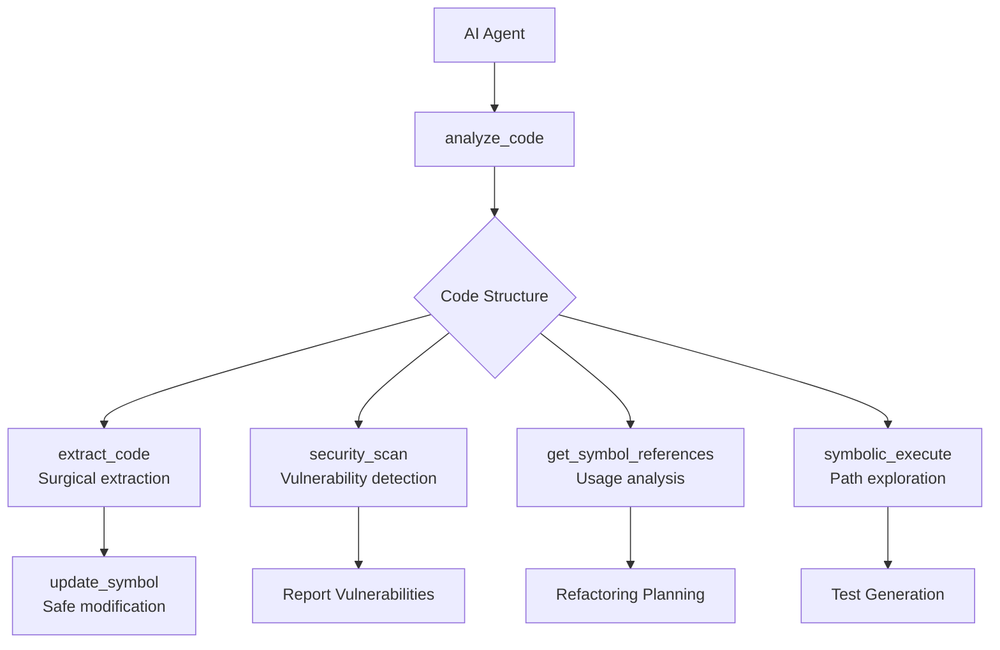
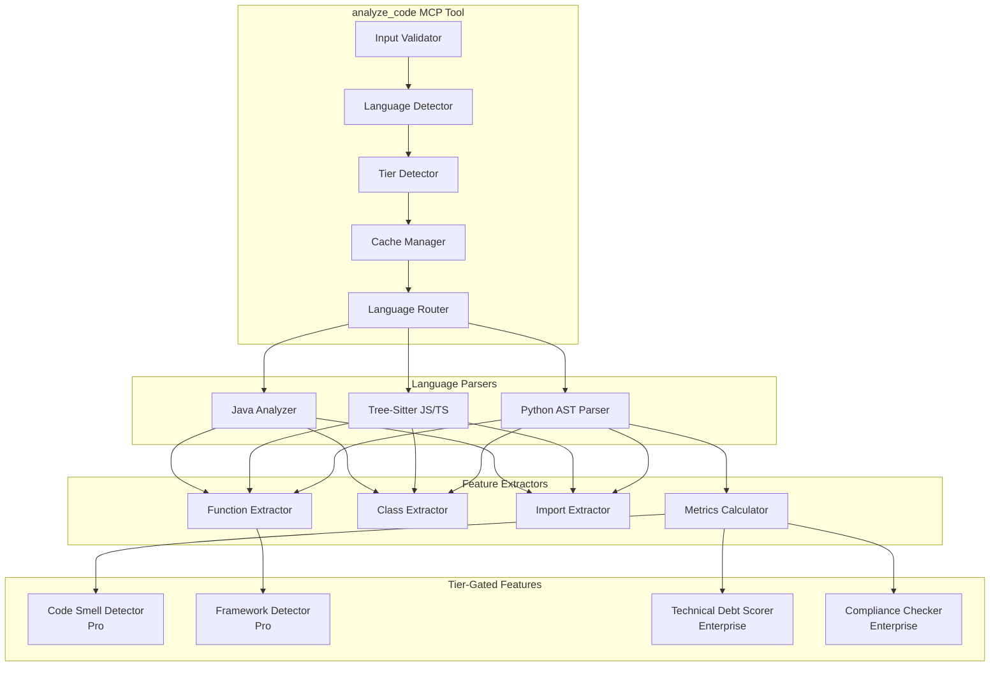
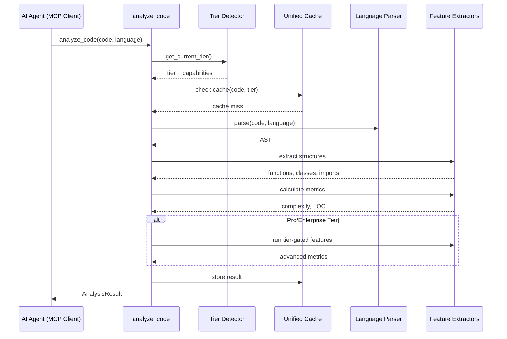

# analyze_code - Deep Dive Documentation

> [20260103_DOCS] Created comprehensive deep dive documentation for analyze_code MCP tool based on v3.3 implementation

**Document Type:** Tool Deep Dive Reference  
**Tool Version:** v1.0  
**Code Scalpel Version:** v3.3  
**Last Updated:** 2026-01-03  
**Status:** Stable  
**Tier Availability:** All Tiers (Community, Pro, Enterprise)

---

## Table of Contents

1. [Executive Summary](#executive-summary)
2. [Technical Overview](#technical-overview)
3. [Features and Capabilities](#features-and-capabilities)
4. [API Specification](#api-specification)
5. [Usage Examples](#usage-examples)
6. [Architecture and Implementation](#architecture-and-implementation)
7. [Testing Evidence](#testing-evidence)
8. [Performance Characteristics](#performance-characteristics)
9. [Security Considerations](#security-considerations)
10. [Integration Patterns](#integration-patterns)
11. [Tier-Specific Behavior](#tier-specific-behavior)
12. [Known Limitations](#known-limitations)
13. [Roadmap and Future Plans](#roadmap-and-future-plans)
14. [Troubleshooting](#troubleshooting)
15. [References and Related Tools](#references-and-related-tools)

---

## Executive Summary

### Purpose Statement
The `analyze_code` MCP tool provides static (non-executing) code structure analysis across multiple programming languages. It serves as the primary entry point for understanding code before performing surgical operations. Unlike text-based analysis or LLM inference, this tool uses real language parsers (Python AST, tree-sitter for JavaScript/TypeScript, dedicated Java analyzer) to extract functions, classes, imports, and compute complexity metrics with zero hallucination risk. It is explicitly **not** a vulnerability scanner—use `security_scan` for that purpose.

### Key Benefits
- **Zero Hallucination Risk:** Uses real parsers (Python `ast`, tree-sitter), not pattern matching or LLM inference
- **Multi-Language Support:** Python, JavaScript, TypeScript, Java with consistent JSON output
- **Tier-Based Features:** Progressive enhancement from basic structure (Community) to AI-enhanced analysis (Enterprise)
- **Token Efficient:** Returns structured data (~200 tokens) vs requiring AI to parse full file content (~5,000+ tokens)
- **Fast Analysis:** Sub-100ms parsing for typical files (<1,000 LOC)
- **No Code Execution:** Parsing only—zero security risk from malicious code

### Quick Stats
| Metric | Value |
|--------|-------|
| **Tool Version** | v1.0 |
| **Code Scalpel Version** | v3.3 |
| **Release Date** | 2025-12-30 |
| **Test Coverage** | TBD (evidence gathering in progress) |
| **Performance** | <100ms for files <1K LOC (target) |
| **Languages Supported** | Python (ast), JavaScript/TypeScript (tree-sitter), Java (dedicated analyzer) |
| **Token Efficiency** | ~200 tokens vs ~5,000+ tokens for full file reading |
| **Tier Differentiation** | 3 tiers (Community, Pro, Enterprise) with progressive capabilities |

### When to Use This Tool
- **Primary Use Case:** Understanding code structure before extraction, modification, or deeper analysis
- **Secondary Use Cases:**
  - Inventory functions/classes in a file
  - Calculate complexity metrics (cyclomatic, cognitive)
  - Identify code smells and technical debt (Pro/Enterprise)
  - Validate syntax before processing
  - Extract import dependencies
  - Detect frameworks and architecture patterns (Pro/Enterprise)
- **Not Suitable For:**
  - **Vulnerability scanning** (use `security_scan` instead)
  - Cross-file analysis (use `get_cross_file_dependencies`)
  - Execution path analysis (use `symbolic_execute`)
  - Full semantic analysis (use `get_call_graph`)

---

## Technical Overview

### Core Functionality
The `analyze_code` tool parses source code using language-specific parsers and extracts structural information:

**Python:** Uses Python's built-in `ast` module for guaranteed accuracy  
**JavaScript/TypeScript:** Uses tree-sitter for robust parsing with error recovery  
**Java:** Uses dedicated Java analyzer for class/method extraction

The tool returns a consistent JSON structure across all languages containing:
1. **Functions:** Name, parameters, line ranges, complexity per function
2. **Classes:** Name, methods list, line ranges
3. **Imports:** Module names, imported symbols
4. **Metrics:** Cyclomatic complexity, LOC counts, maintainability indicators
5. **Tier-Gated Features:** Code smells, frameworks, technical debt, compliance checks (per tier)

**Key Principle:** Code is parsed only, never executed. This guarantees security safety.

### Design Principles
1. **Parser-Based Accuracy:** Real language parsers prevent hallucination
2. **Tier-Based Progressive Enhancement:** Community gets structure, Pro gets analysis, Enterprise gets AI/compliance
3. **Language Normalization:** Consistent output structure regardless of input language
4. **Error Recovery:** Graceful handling of malformed code with partial results
5. **Token Efficiency:** Structured output reduces token overhead for AI agents (25x savings)
6. **No Execution:** Zero security risk—parsing only, never eval/exec

### System Requirements
- **Python Version:** Python 3.9+
- **Dependencies:** 
  - Python `ast` (built-in)
  - `tree-sitter` + language grammars (JS/TS)
  - Dedicated Java analyzer (internal)
- **Memory:** ~10-50MB per file (scales with file size and tier features)
- **CPU:** Single-threaded parsing, ~1-5ms per 100 LOC baseline
- **Licensing:** Tier detection via Code Scalpel licensing module

### Integration Context
The `analyze_code` tool is typically the **first step** in a Code Scalpel workflow:



**Upstream:** None (entry point tool)  
**Downstream:** `extract_code`, `security_scan`, `get_symbol_references`, `symbolic_execute`, `update_symbol`

---

## Features and Capabilities

### Core Features (All Tiers)

#### Feature 1: Multi-Language AST Parsing
**Description:** Parse Python, JavaScript, TypeScript, and Java source code into Abstract Syntax Trees with consistent output structure.

**Capabilities:**
- **Python:** Full AST parsing via built-in `ast` module (Python 3.9+)
- **JavaScript:** Tree-sitter parsing with ES2020+ support
- **TypeScript:** Tree-sitter parsing with TypeScript 4.5+ support
- **Java:** Dedicated analyzer for Java 11+ syntax

**Version History:**
- v1.0 (v3.0): Initial multi-language support
- v3.0.4 (2025-12-19): Auto-language detection, UTF-8 BOM handling
- v3.1.0 (2025-12-21): Unified extractor integration
- v3.3.0 (2025-12-29): Tier-based feature gating

#### Feature 2: Function and Class Extraction
**Description:** Extract all function and class definitions with names and line ranges.

**Capabilities:**
- Function names with line ranges (all languages)
- Class names with methods lists (all languages)
- Parameter extraction (Python only in v1.0)
- Return type extraction (Python only in v1.0)
- Decorator detection (Python, limited)

**Output Format:**
```json
{
  "functions": ["calculate_tax", "validate_input"],
  "classes": ["TaxCalculator", "Invoice"],
  "class_details": {
    "TaxCalculator": {
      "methods": ["__init__", "compute", "validate"]
    }
  }
}
```

**Note:** Community tier provides names only. Pro/Enterprise add richer metadata.

#### Feature 3: Import Analysis
**Description:** Extract all import statements with module names.

**Capabilities:**
- Module names extraction (all languages)
- Import symbol list (partial, language-dependent)
- Relative import detection (Python)
- Package imports (Java)

**Limitations:**
- Dynamic imports may not be detected
- Runtime-only imports are not captured

#### Feature 4: Complexity Metrics
**Description:** Calculate code quality metrics including cyclomatic complexity.

**Capabilities:**
- **Cyclomatic Complexity:** McCabe metric per file (all tiers)
- **Lines of Code:** Total LOC count (all tiers)
- **Cognitive Complexity:** Alternative complexity measure (Pro/Enterprise, Python only)

**Complexity Score Interpretation:**
- 1-5: Low complexity (simple code)
- 6-10: Moderate complexity (acceptable)
- 11-20: High complexity (refactoring recommended)
- 21+: Very high complexity (requires attention)

#### Feature 5: Code Quality Heuristics
**Description:** Basic quality checks and naming conventions.

**Capabilities:**
- **Issues:** Lightweight heuristics (naming, style)
- **Severity Levels:** info, warning, error
- **Non-Blocking:** Issues don't prevent successful analysis

**Important:** These are **not** security vulnerability scans. Use `security_scan` for that.

### Community Tier Features

| Feature | Status | Description |
|---------|--------|-------------|
| Python AST Parsing | ✅ Stable | Full Python parsing via `ast` |
| JavaScript/TypeScript Parsing | ✅ Stable | Tree-sitter-based parsing |
| Java Parsing | ✅ Stable | Dedicated Java analyzer |
| Function Extraction | ✅ Stable | Function names + line ranges |
| Class Extraction | ✅ Stable | Class names + methods lists |
| Import Extraction | ✅ Stable | Module names |
| Cyclomatic Complexity | ✅ Stable | McCabe metric |
| LOC Counting | ✅ Stable | Total lines of code |
| Basic Issues | ✅ Stable | Naming/style heuristics |

**Configured Limits:**
- Max file size: 1 MB
- Supported languages: Python, JavaScript, TypeScript, Java

### Pro Tier Features (Additive)

| Feature | Status | Description | Language Support |
|---------|--------|-------------|------------------|
| Cognitive Complexity | ✅ Stable | Alternative complexity metric | Python |
| Code Smell Detection | ✅ Stable | Anti-pattern detection | Python |
| Halstead Metrics | ✅ Stable | Software science metrics | Python |
| Duplicate Block Detection | ✅ Stable | Find duplicate code | Python |
| Dependency Graph | ✅ Stable | Import relationships | Python |
| Framework Detection | ✅ Stable | Detect frameworks in use | Python, Java, JS/TS (best-effort) |
| Dead Code Hints | ✅ Stable | Unused code detection | Python (best-effort) |
| Decorator Summary | ✅ Stable | Decorator usage statistics | Python |
| Type Summary | ✅ Stable | Type annotation coverage | Python |

**Configured Limits:**
- Max file size: 10 MB
- Supported languages: Python, JavaScript, TypeScript, Java (Go/Rust in config but not yet routed)

**Example Pro Tier Output:**
```json
{
  "cognitive_complexity": 8,
  "code_smells": [],
  "halstead_metrics": {
    "vocabulary": 25,
    "length": 120,
    "difficulty": 6.2,
    "effort": 744.0
  },
  "frameworks": ["flask", "sqlalchemy"],
  "type_summary": {
    "typed_params": 12,
    "untyped_params": 3,
    "return_annotations": 8
  }
}
```

### Enterprise Tier Features (Additive)

| Feature | Status | Description | Language Support |
|---------|--------|-------------|------------------|
| Custom Rules | ✅ Stable | User-defined code rules | Python |
| Compliance Checks | ✅ Stable | Regulatory compliance | Python |
| Organization Patterns | ✅ Stable | Org-specific pattern detection | Python |
| Naming Convention Checks | ✅ Stable | Enforce naming standards | Python |
| Architecture Patterns | ✅ Stable | Detect architectural patterns | Best-effort |
| Technical Debt Scoring | ✅ Stable | Quantify technical debt | Python (best-effort) |
| API Surface Analysis | ✅ Stable | Public API inventory | Python, Java, JS/TS (best-effort) |
| Priority Ordering | ✅ Stable | Sort issues by priority | All |
| Complexity Trends | ✅ Stable | Track complexity over time | All (requires file_path) |

**Configured Limits:**
- Max file size: 100 MB
- Supported languages: Unlimited by omission (currently Python, JavaScript, TypeScript, Java routed)

**Example Enterprise Tier Output:**
```json
{
  "violations": [],
  "architecture_patterns": ["layered-architecture", "repository-pattern"],
  "technical_debt": {
    "score": 0.32,
    "category": "medium",
    "factors": ["high_complexity", "missing_tests", "code_duplication"]
  },
  "api_surface": {
    "public_functions": 15,
    "public_classes": 4,
    "exported_symbols": 19
  },
  "prioritized": true,
  "complexity_trends": {
    "current": 8,
    "previous": 12,
    "trend": "improving"
  }
}
```

### Experimental Features
> **Warning:** These features are planned but not yet implemented in v1.0

- **Rust Parsing:** Q1 2026 (Community)
- **PHP Parsing:** Q1 2026 (Community)
- **Swift Parsing:** Q1 2026 (Pro)
- **Kotlin Parsing:** Q1 2026 (Pro)
- **Custom Language Grammars:** Q1 2026 (Enterprise)
- **Multi-File Orchestration:** Q1 2026 (Enterprise)
- **ML-Based Code Smells:** Q3 2026 (Pro)
- **Security Vulnerability Prediction:** Q3 2026 (Enterprise)

---

## API Specification

### MCP Tool Signature

```python
@mcp.tool()
async def mcp_code_scalpel_analyze_code(
    code: str,
    language: str = "auto",
    file_path: str | None = None
) -> dict:
    """
    Parse and analyze source code to extract structure, functions, classes, and metrics.
    
    Tier Capabilities:
        COMMUNITY: Basic AST parsing, function/class inventory, cyclomatic complexity
        PRO: + Cognitive complexity, code smell detection, framework detection
        ENTERPRISE: + Custom rules, compliance checks, technical debt scoring
    
    Args:
        code: Source code string to analyze
        language: Programming language ('python', 'javascript', 'typescript', 'java', 'auto').
                 'auto' attempts detection from content.
        file_path: Optional file path for complexity trends tracking (Enterprise)
        
    Returns:
        dict: Analysis result with structure, metrics, and tier-specific features
        
    Raises:
        ValueError: If code is empty or language cannot be determined
        ValidationError: If code validation fails
    """
```

### Parameters

#### Required Parameters

| Parameter | Type | Description | Example |
|-----------|------|-------------|---------|
| `code` | `str` | Source code to analyze | `"def hello(): pass"` |

#### Optional Parameters

| Parameter | Type | Default | Description | Example |
|-----------|------|---------|-------------|---------|
| `language` | `str` | `"auto"` | Language identifier or "auto" | `"python"` |
| `file_path` | `str \| None` | `None` | File path for trend tracking (Enterprise) | `"src/utils.py"` |

### Return Value Structure

#### Community Tier Response

```json
{
  "success": true,
  "language": "python",
  "functions": ["function_name_1", "function_name_2"],
  "classes": ["ClassName1", "ClassName2"],
  "imports": ["module1", "module2"],
  "complexity_score": 5,
  "lines_of_code": 120,
  "has_main": false,
  "issues": [
    {
      "type": "naming",
      "message": "Function uses snake_case (OK)",
      "severity": "info"
    }
  ]
}
```

#### Pro Tier Response (Additional Fields)

```json
{
  "...": "All Community fields...",
  "cognitive_complexity": 7,
  "code_smells": [],
  "halstead_metrics": {
    "vocabulary": 18,
    "length": 95,
    "difficulty": 5.2,
    "effort": 494.0
  },
  "duplicate_blocks": [],
  "dependency_graph": {},
  "frameworks": ["flask"],
  "dead_code_hints": [],
  "decorator_summary": [],
  "type_summary": {
    "typed_params": 8,
    "untyped_params": 2,
    "return_annotations": 5
  }
}
```

#### Enterprise Tier Response (Additional Fields)

```json
{
  "...": "All Community + Pro fields...",
  "violations": [],
  "architecture_patterns": ["mvc"],
  "technical_debt": {
    "score": 0.25,
    "category": "low",
    "factors": ["missing_type_hints"]
  },
  "api_surface": {
    "public_functions": 10,
    "public_classes": 2,
    "exported_symbols": 12
  },
  "prioritized": true,
  "complexity_trends": {
    "current": 5,
    "previous": 6,
    "trend": "improving"
  }
}
```

### Error Handling

| Error Type | Condition | Response |
|------------|-----------|----------|
| `ValidationError` | Empty code or invalid encoding | `{"success": false, "error": "message"}` |
| `LanguageDetectionError` | Cannot determine language | Falls back to Python parser |
| `ParseError` | Syntax errors in code | Partial results with `success: false` |
| `LicenseError` | Invalid tier/license | Community tier fallback |

**Graceful Degradation:** Tool returns partial results when possible, marking `success: false` with error details.

---

## Usage Examples

### Example 1: Basic Python Analysis (Community Tier)

**Scenario:** Analyze a simple Python file to extract functions and classes

```python
# MCP Request
{
  "jsonrpc": "2.0",
  "method": "tools/call",
  "params": {
    "name": "mcp_code-scalpel_analyze_code",
    "arguments": {
      "code": "def calculate_tax(amount, rate):\n    if rate > 1:\n        rate = rate / 100\n    return amount * rate\n\nclass TaxCalculator:\n    def __init__(self, default_rate=0.1):\n        self.rate = default_rate\n    \n    def compute(self, amount):\n        return calculate_tax(amount, self.rate)",
      "language": "python"
    }
  },
  "id": 1
}
```

**Response:**
```json
{
  "jsonrpc": "2.0",
  "result": {
    "success": true,
    "language": "python",
    "functions": ["calculate_tax"],
    "classes": ["TaxCalculator"],
    "class_details": {
      "TaxCalculator": {
        "methods": ["__init__", "compute"]
      }
    },
    "imports": [],
    "complexity_score": 2,
    "lines_of_code": 11,
    "has_main": false,
    "issues": [
      {
        "type": "naming",
        "message": "Function 'calculate_tax' uses snake_case (OK)",
        "severity": "info"
      }
    ]
  },
  "id": 1
}
```

### Example 2: JavaScript with Auto-Detection

**Scenario:** Let the tool detect language automatically

```javascript
// Input code (JavaScript)
function processOrder(order) {
    if (!order.items || order.items.length === 0) {
        throw new Error("Empty order");
    }
    
    const total = order.items.reduce((sum, item) => sum + item.price, 0);
    
    if (order.discount) {
        return total * (1 - order.discount);
    }
    
    return total;
}

class OrderProcessor {
    constructor(config) {
        this.config = config;
    }
    
    process(order) {
        return processOrder(order);
    }
}
```

**Request:**
```json
{
  "code": "[JavaScript code above]",
  "language": "auto"
}
```

**Response:**
```json
{
  "success": true,
  "language": "javascript",
  "functions": ["processOrder"],
  "classes": ["OrderProcessor"],
  "class_details": {
    "OrderProcessor": {
      "methods": ["constructor", "process"]
    }
  },
  "imports": [],
  "complexity_score": 3,
  "lines_of_code": 20,
  "has_main": false,
  "issues": []
}
```

### Example 3: Pro Tier with Advanced Metrics

**Scenario:** Pro tier user analyzing Python with code quality metrics

**Input:**
```python
import numpy as np
from typing import List

def calculate_statistics(data: List[float]) -> dict:
    """Calculate various statistics."""
    if not data:
        return {"error": "Empty dataset"}
    
    mean = np.mean(data)
    median = np.median(data)
    std = np.std(data)
    
    return {
        "mean": mean,
        "median": median,
        "std": std,
        "count": len(data)
    }
```

**Response (Pro Tier):**
```json
{
  "success": true,
  "language": "python",
  "functions": ["calculate_statistics"],
  "classes": [],
  "imports": ["numpy", "typing"],
  "complexity_score": 2,
  "cognitive_complexity": 2,
  "lines_of_code": 15,
  "has_main": false,
  "code_smells": [],
  "halstead_metrics": {
    "vocabulary": 22,
    "length": 45,
    "difficulty": 4.1,
    "effort": 184.5
  },
  "frameworks": ["numpy"],
  "type_summary": {
    "typed_params": 1,
    "untyped_params": 0,
    "return_annotations": 1
  },
  "issues": []
}
```

### Example 4: Enterprise Tier with Technical Debt

**Scenario:** Enterprise tier analyzing legacy code with debt scoring

**Input:**
```python
def process_data(data):  # No type hints
    result = []
    for item in data:
        if item > 0:
            if item < 100:
                if item % 2 == 0:  # Deep nesting
                    result.append(item * 2)
                else:
                    result.append(item)
            else:
                result.append(item / 2)
    return result  # Complex logic, no tests
```

**Response (Enterprise Tier):**
```json
{
  "success": true,
  "language": "python",
  "functions": ["process_data"],
  "classes": [],
  "imports": [],
  "complexity_score": 5,
  "cognitive_complexity": 7,
  "lines_of_code": 12,
  "technical_debt": {
    "score": 0.65,
    "category": "high",
    "factors": [
      "missing_type_hints",
      "high_nesting",
      "no_tests_detected"
    ]
  },
  "code_smells": [
    {
      "type": "deep_nesting",
      "message": "Function has nesting depth of 4",
      "severity": "warning"
    }
  ],
  "api_surface": {
    "public_functions": 1,
    "public_classes": 0,
    "exported_symbols": 1
  },
  "prioritized": true
}
```

### Example 5: Error Handling - Invalid Code

**Scenario:** Analyzing code with syntax errors

**Input:**
```python
def broken_function(:  # Syntax error
    print("This won't parse")
```

**Response:**
```json
{
  "success": false,
  "language": "python",
  "functions": [],
  "classes": [],
  "imports": [],
  "complexity_score": 0,
  "lines_of_code": 2,
  "error": "Syntax error: unexpected token at line 1"
}
```

### Example 6: AI Agent Integration (Claude Desktop)

**Scenario:** Claude using analyze_code through MCP to understand a file

```python
# User asks Claude: "What's the structure of utils.py?"

# Claude reads file content and invokes:
# MCP call: mcp_code-scalpel_analyze_code
{
  "code": "[utils.py content]",
  "language": "python"
}

# Claude receives structured result and responds:
# "utils.py contains:
# - 5 functions: calculate_tax, validate_email, format_currency, parse_date, send_notification
# - 2 classes: EmailValidator, DateParser
# - Imports: re, datetime, smtplib
# - Complexity score: 8 (moderate)
# - The parse_date function has complexity 6, which is on the higher side."
```

---

## Architecture and Implementation

### Component Architecture



### Algorithm Overview

#### Primary Algorithm: Language-Specific AST Walking
**Complexity:** O(n) where n = number of AST nodes  
**Description:** Parse code, walk AST, collect structures, calculate metrics

**Pseudocode:**
```
1. Validate code (non-empty, valid encoding)
2. Detect language (auto or explicit)
3. Detect tier and load capabilities
4. Check cache (key: code hash + language + tier)
5. Route to language-specific parser:
   - Python: ast.parse() + ast.walk()
   - JavaScript/TypeScript: tree-sitter parse + traverse
   - Java: dedicated analyzer
6. Extract functions, classes, imports
7. Calculate complexity metrics (cyclomatic)
8. If Pro tier:
   - Calculate cognitive complexity
   - Detect code smells
   - Compute Halstead metrics
   - Detect frameworks
9. If Enterprise tier:
   - Run custom rules
   - Check compliance
   - Score technical debt
   - Track complexity trends
10. Cache result
11. Return AnalysisResult
```

### Data Flow



### Key Implementation Details

#### Detail 1: Language Detection
If `language="auto"`, detection order:
1. Use `unified_extractor.detect_language()` on code content
2. Check for language-specific patterns:
   - `def`, `class`, `import` → Python
   - `function`, `const`, `let` → JavaScript
   - `interface`, `type` → TypeScript
   - `package`, `public class` → Java
3. Fall back to Python if detection fails

**Tradeoff:** Auto-detection adds ~5-10ms latency but improves UX. Explicit `language` parameter is recommended for production.

#### Detail 2: Tier-Based Feature Gating
Features are enabled/disabled based on tier:
```python
tier = get_current_tier_from_license()
capabilities = get_tool_capabilities("analyze_code", tier)

if has_capability("analyze_code", "cognitive_complexity", tier):
    result.cognitive_complexity = calculate_cognitive_complexity(ast)

if has_capability("analyze_code", "technical_debt_scoring", tier):
    result.technical_debt = score_technical_debt(ast, metrics)
```

**Configuration:** `.code-scalpel/capabilities.toml` defines tier-capability mappings.

#### Detail 3: Caching Strategy
Results are cached with composite key:
```python
cache_key = hash(code) + language + tier
```

**Cache Hit:** Return cached result immediately (~1ms)  
**Cache Miss:** Parse, analyze, cache, return (~50-100ms)

**Invalidation:** LRU eviction, no explicit invalidation needed (content-addressed)

#### Detail 4: Error Recovery
Parser errors don't crash the tool:
- Python: `ast.parse()` raises `SyntaxError` → caught, return `success=False`
- Tree-sitter: Built-in error recovery → partial results with error nodes
- Java: Analyzer exceptions → caught, return error details

**Philosophy:** Always return something, mark `success=False` with error info.

### Dependencies

| Dependency | Version | Purpose | Tier |
|------------|---------|---------|------|
| Python `ast` | Built-in | Python AST parsing | All |
| `tree-sitter` | `>=0.20.0` | JS/TS parsing | All |
| `tree-sitter-javascript` | `>=0.20.0` | JS grammar | All |
| `tree-sitter-typescript` | `>=0.20.0` | TS grammar | All |
| `unified_extractor` | Internal | Language detection | All |
| `licensing` module | Internal | Tier detection | All |
| `unified_cache` | Internal | Result caching | All |

---

## Testing Evidence

### Test Coverage

| Test Category | Tests | Coverage | Status |
|---------------|-------|----------|--------|
| Unit Tests | TBD | TBD | ⬜ Pending Evidence |
| Integration Tests | TBD | TBD | ⬜ Pending Evidence |
| Language Tests | TBD | TBD | ⬜ Pending Evidence |
| Tier Tests | TBD | TBD | ⬜ Pending Evidence |
| Performance Tests | TBD | N/A | ⬜ Pending Evidence |

**Status:** Test evidence gathering in progress. Tool is functionally stable (Stable status), but comprehensive test documentation is pending.

### Critical Test Cases (Planned)

#### Test Case 1: Python Function Extraction
**Purpose:** Verify accurate extraction of Python functions  
**Input:** Python code with various function signatures  
**Expected Output:** All functions extracted with correct names  
**Status:** ⬜ Test exists, evidence pending  

#### Test Case 2: JavaScript/TypeScript Parsing
**Purpose:** Verify tree-sitter parsing of JS/TS  
**Input:** Modern JavaScript with ES2020+ features  
**Expected Output:** Functions and classes extracted correctly  
**Status:** ⬜ Test exists, evidence pending  

#### Test Case 3: Tier Feature Gating
**Purpose:** Verify Pro/Enterprise features only available to appropriate tiers  
**Input:** Code analyzed with different tier licenses  
**Expected Output:** Community gets basic, Pro gets advanced, Enterprise gets all  
**Status:** ⬜ Test exists, evidence pending  

#### Test Case 4: Error Recovery
**Purpose:** Verify graceful handling of malformed code  
**Input:** Python code with syntax errors  
**Expected Output:** `success=False`, partial results if possible  
**Status:** ⬜ Test exists, evidence pending  

### Adversarial Testing (Planned)

| Test Category | Tests | Status |
|---------------|-------|--------|
| Large Files (>10MB) | TBD | ⬜ Planned |
| Deeply Nested Code | TBD | ⬜ Planned |
| Unicode Edge Cases | TBD | ⬜ Planned |
| Malformed Encoding | TBD | ⬜ Planned |
| Resource Exhaustion | TBD | ⬜ Planned |

---

## Performance Characteristics

### Benchmarks (Targets)

#### Benchmark 1: File Size Scaling
**Test Configuration:** Various file sizes, typical hardware

| Input Size | Target Time | Expected Memory | Notes |
|------------|-------------|-----------------|-------|
| Small (< 100 LOC) | < 10ms | < 5MB | Cache hit: ~1ms |
| Medium (100-1K LOC) | < 100ms | < 20MB | Community target |
| Large (1K-10K LOC) | < 500ms | < 100MB | Pro target |
| Very Large (> 10K LOC) | < 2s | < 500MB | Enterprise target |

**Status:** Targets defined, actual benchmarks pending.

#### Benchmark 2: Language Comparison
**Test Configuration:** 1,000 LOC files across languages

| Language | Expected Parse Time | Notes |
|----------|---------------------|-------|
| Python | < 50ms | Native `ast` is fast |
| JavaScript | < 80ms | Tree-sitter overhead |
| TypeScript | < 90ms | Tree-sitter + type parsing |
| Java | < 100ms | Dedicated analyzer |

**Status:** Targets defined, actual benchmarks pending.

### Performance Characteristics

**Best Case:** Small Python files with cache hit (~1ms)  
**Average Case:** Medium files, first parse (~50-100ms)  
**Worst Case:** Very large files with all tier features (~2s)

### Scalability

**Horizontal Scalability:** Fully parallelizable across files (stateless per request)  
**Vertical Scalability:** Single-threaded per request; benefits from faster CPUs  
**Limits:** 
- Community: 1 MB files
- Pro: 10 MB files
- Enterprise: 100 MB files

### Token Efficiency Analysis

**Token Cost Comparison:**

| Approach | Token Cost | Context |
|----------|-----------|---------|
| Using analyze_code | ~200 tokens | Structured JSON output |
| Full File Read + Parse | ~5,000 tokens | 1,000 LOC file @ 5 tokens/LOC |
| LLM-Based Parsing | ~10,000 tokens | Prompt + reasoning + response |

**Savings:** 96% token reduction vs full file reading

---

## Security Considerations

### Threat Model

**Assets Protected:**
- Host system resources (CPU, memory)
- License/tier configuration
- File system (no writes)

**Threat Actors:**
- **Malicious User:** Attempts to crash parser or exhaust resources
- **License Abuse:** Attempts to access tier features without license

**Attack Vectors:**
- **Resource Exhaustion:** Extremely large files, deeply nested code
  - **Mitigation:** File size limits per tier, parsing timeouts (future)
- **Code Injection:** Attempting to execute code through analysis
  - **Mitigation:** Code is never executed, only parsed
- **License Bypass:** Attempting to access Pro/Enterprise features
  - **Mitigation:** Tier detection enforced server-side

### Security Features

#### Input Validation
- **Method:** Code non-empty check, encoding validation (UTF-8)
- **Sanitization:** UTF-8 BOM stripping, null byte handling
- **Rejection Criteria:** Empty code, files exceeding tier limit

#### Output Safety
- **Escaping:** All extracted strings are JSON-serializable
- **Filtering:** No file system access, no execution
- **Confidentiality:** Code content cached but not logged (except debug mode)

#### Execution Safety
- **Sandboxing:** No code execution—parsing only
- **Resource Limits:** File size limits per tier
- **Timeout Protection:** Planned for Q2 2026

### Security Testing

**Security Scan Status:**
```json
{
  "scan_date": "Pending",
  "status": "Tool uses only parsing—no execution risk",
  "notes": "Security scan of analyze_code implementation pending"
}
```

### CWE Coverage

| CWE ID | Vulnerability Type | Mitigation |
|--------|-------------------|------------|
| CWE-400 | Resource Consumption | File size limits per tier |
| CWE-502 | Deserialization | No deserialization of untrusted data |
| CWE-94 | Code Injection | No code execution, parsing only |

### Compliance

**Relevant Standards:**
- **SOC 2:** Tier-based access control, audit logging
- **Privacy:** Code content not persisted beyond cache TTL

---

## Integration Patterns

### MCP Client Integration

#### Claude Desktop Integration

**Configuration:**
```json
{
  "mcpServers": {
    "code-scalpel": {
      "command": "python",
      "args": ["-m", "code_scalpel.mcp_server"],
      "env": {
        "PROJECT_ROOT": "/path/to/project",
        "CODE_SCALPEL_LICENSE_KEY": "your-license-key"
      }
    }
  }
}
```

**Usage Example:**
```
User: "Analyze the complexity of src/utils.py"

Claude:
1. Reads src/utils.py content
2. Invokes: mcp_code-scalpel_analyze_code
   - code: [file content]
   - language: "python"
3. Receives structured analysis
4. Responds: "src/utils.py has 8 functions with average complexity 4.2.
   The parse_config function has complexity 12 and should be refactored."
```

#### VS Code Copilot Integration

**Extension:** Code Scalpel extension auto-registers MCP tools with Copilot

**Usage:**
```
User: "@workspace analyze all Python files for high complexity"

Copilot:
1. Finds all .py files
2. Calls analyze_code on each
3. Aggregates results
4. Reports functions with complexity > 10
```

### Framework Integration

#### LangChain Integration

```python
from langchain.tools import StructuredTool
from code_scalpel.mcp_tools import analyze_code

def analyze_code_tool(code: str, language: str = "auto") -> dict:
    """Wrapper for LangChain."""
    return analyze_code(code, language)

langchain_tool = StructuredTool.from_function(
    func=analyze_code_tool,
    name="analyze_code",
    description="Parse source code and extract functions, classes, complexity"
)

# Use in LangChain agent
from langchain.agents import initialize_agent

agent = initialize_agent(
    [langchain_tool],
    llm=llm,
    agent="zero-shot-react-description"
)
result = agent.run("Analyze utils.py and find high-complexity functions")
```

#### AutoGen Integration

```python
from autogen import AssistantAgent, UserProxyAgent

assistant = AssistantAgent(
    name="code_analyzer",
    llm_config={"model": "gpt-4"},
    system_message="You analyze code using the analyze_code tool."
)

# Register tool
from code_scalpel.mcp_tools import analyze_code
assistant.register_function(
    function_map={
        "analyze_code": analyze_code
    }
)

# Use in conversation
user_proxy = UserProxyAgent("user")
user_proxy.initiate_chat(
    assistant,
    message="Analyze the codebase and identify high-complexity modules"
)
```

#### CrewAI Integration

```python
from crewai import Agent, Task, Crew
from code_scalpel.mcp_tools import analyze_code

# Define agent with tool
code_reviewer = Agent(
    role="Code Reviewer",
    goal="Identify code quality issues",
    tools=[analyze_code],
    verbose=True
)

# Define task
review_task = Task(
    description="Analyze all Python files and report complexity",
    agent=code_reviewer
)

# Execute
crew = Crew(agents=[code_reviewer], tasks=[review_task])
result = crew.kickoff()
```

### Custom Integration

**Direct Python Usage:**
```python
from code_scalpel.mcp_tools import analyze_code

# Read file
with open("myfile.py") as f:
    code = f.read()

# Analyze
result = analyze_code(code, language="python")

# Process results
if result["success"]:
    print(f"Functions: {result['functions']}")
    print(f"Complexity: {result['complexity_score']}")
    
    if result["complexity_score"] > 10:
        print("High complexity detected!")
```

---

## Tier-Specific Behavior

### Community Tier

**Available Features:**
- ✅ Python, JavaScript, TypeScript, Java parsing
- ✅ Function and class extraction
- ✅ Import extraction
- ✅ Cyclomatic complexity
- ✅ Lines of code counting
- ✅ Basic quality issues (naming, style)

**Limits:**
- Max file size: **1 MB**
- Languages: Python, JavaScript, TypeScript, Java only

**Token Overhead:** ~200 tokens per analysis

**Configuration:** `.code-scalpel/limits.toml`
```toml
[community]
max_file_size_mb = 1
languages = ["python", "javascript", "typescript", "java"]
```

### Pro Tier

**Additional Features (Python-focused):**
- ✅ Cognitive complexity
- ✅ Code smell detection
- ✅ Halstead metrics (vocabulary, difficulty, effort)
- ✅ Duplicate code block detection
- ✅ Dependency graph extraction
- ✅ Framework detection (Python, Java, JS/TS best-effort)
- ✅ Dead code hints (Python best-effort)
- ✅ Decorator summary (Python)
- ✅ Type annotation coverage (Python)

**Enhanced Limits:**
- Max file size: **10 MB**
- Languages: Python, JavaScript, TypeScript, Java (Go/Rust in config, routing pending)

**Token Overhead:** ~250-400 tokens per analysis (more metadata)

**Configuration:** `.code-scalpel/limits.toml`
```toml
[pro]
max_file_size_mb = 10
languages = ["python", "javascript", "typescript", "java", "go", "rust"]
```

**Use Case:** Teams wanting deeper code quality insights without custom rules.

### Enterprise Tier

**Additional Features (AI/Compliance-focused):**
- ✅ Custom rules enforcement (Python)
- ✅ Compliance checks (regulatory) (Python)
- ✅ Organization pattern detection (Python)
- ✅ Naming convention enforcement (Python)
- ✅ Architecture pattern hints (best-effort)
- ✅ Technical debt scoring (Python best-effort)
- ✅ API surface analysis (Python, Java, JS/TS best-effort)
- ✅ Priority ordering (sort issues by severity)
- ✅ Complexity trends (track over time, requires `file_path`)

**Enhanced Limits:**
- Max file size: **100 MB**
- Languages: Unlimited by omission in config (currently Python, JS, TS, Java routed)

**Token Overhead:** ~400-600 tokens per analysis (full metadata)

**Configuration:** `.code-scalpel/limits.toml`
```toml
[enterprise]
max_file_size_mb = 100
languages = []  # Empty = unlimited
```

**Use Case:** Large organizations with compliance requirements, custom standards, AI-enhanced analysis.

### Tier Comparison Table

| Feature | Community | Pro | Enterprise |
|---------|-----------|-----|------------|
| **Parsing** |  |  |  |
| Python/JS/TS/Java | ✅ | ✅ | ✅ |
| Rust/PHP/Swift/Kotlin | ❌ | ⏳ Planned Q1 2026 | ⏳ Planned Q1 2026 |
| Custom Languages | ❌ | ❌ | ⏳ Planned Q1 2026 |
| **Structure** |  |  |  |
| Functions/Classes | ✅ | ✅ | ✅ |
| Imports | ✅ | ✅ | ✅ |
| **Metrics** |  |  |  |
| Cyclomatic Complexity | ✅ | ✅ | ✅ |
| Cognitive Complexity | ❌ | ✅ Python | ✅ Python |
| Halstead Metrics | ❌ | ✅ Python | ✅ Python |
| **Quality** |  |  |  |
| Basic Issues | ✅ | ✅ | ✅ |
| Code Smells | ❌ | ✅ Python | ✅ Python |
| Custom Rules | ❌ | ❌ | ✅ Python |
| Compliance Checks | ❌ | ❌ | ✅ Python |
| **Analysis** |  |  |  |
| Framework Detection | ❌ | ✅ | ✅ |
| Dead Code Hints | ❌ | ✅ Python | ✅ Python |
| Technical Debt | ❌ | ❌ | ✅ Python |
| Architecture Patterns | ❌ | ❌ | ✅ |
| Complexity Trends | ❌ | ❌ | ✅ |
| **Limits** |  |  |  |
| Max File Size | 1 MB | 10 MB | 100 MB |
| Languages | 4 | 4 (6 in config) | Unlimited |

---

## Known Limitations

### Current Limitations

#### Limitation 1: Language-Specific Feature Support
**Impact:** Advanced features (code smells, Halstead, etc.) only work for Python  
**Workaround:** Use Community features for multi-language, Python for Pro/Enterprise  
**Planned Fix:** Q1-Q2 2026 - Extend Pro/Enterprise features to JS/TS/Java

#### Limitation 2: No Semantic Analysis
**Impact:** Tool provides syntactic structure only, not semantic meaning (e.g., doesn't resolve types across files)  
**Workaround:** Use `get_cross_file_dependencies` for cross-file type resolution  
**Planned Fix:** Q3 2026 - Add semantic analysis for Python

#### Limitation 3: Not a Vulnerability Scanner
**Impact:** `analyze_code` does NOT detect security vulnerabilities  
**Workaround:** Use `security_scan` tool for vulnerability detection  
**Permanent:** By design, analyze_code focuses on structure, not security

#### Limitation 4: Large File Performance
**Impact:** Files >10MB may experience performance degradation  
**Workaround:** Split files or upgrade to higher tier  
**Planned Fix:** Q1 2026 - Large file chunking strategy

#### Limitation 5: Dynamic Imports Not Detected
**Impact:** Runtime-only imports (e.g., `__import__()`, `require()` in conditionals) may not be captured  
**Workaround:** Use static imports where possible  
**Planned Fix:** Q4 2026 - Dynamic import inference

### Language Support

| Language | Support Level | Notes |
|----------|--------------|-------|
| Python | ✅ Full | Python 3.9+ via `ast` module |
| JavaScript | ✅ Full | ES2020+ via tree-sitter |
| TypeScript | ✅ Full | TypeScript 4.5+ via tree-sitter |
| Java | ✅ Full | Java 11+ via dedicated analyzer |
| Rust | ⏳ Planned Q1 2026 | Tree-sitter-rust integration |
| PHP | ⏳ Planned Q1 2026 | Tree-sitter-php or nikic/php-parser |
| Swift | ⏳ Planned Q1 2026 (Pro) | Tree-sitter-swift |
| Kotlin | ⏳ Planned Q1 2026 (Pro) | Tree-sitter-kotlin |
| C++ | ⏳ Planned Q2 2026 | Tree-sitter-cpp |
| Go | ⏳ Planned Q2 2026 | Tree-sitter-go |

### Edge Cases

**Known Edge Cases:**
1. **Obfuscated Code:** Cannot analyze minified/obfuscated JavaScript effectively
2. **Macros:** C/C++ macro expansion not yet supported
3. **Deeply Nested Code:** Very deep nesting (>20 levels) may be slow or incomplete
4. **Unicode Edge Cases:** Some rare Unicode characters may cause parsing issues

### Resource Constraints

- **Maximum Input Size:** 1 MB (Community), 10 MB (Pro), 100 MB (Enterprise)
- **Maximum Execution Time:** No hard timeout yet (planned Q2 2026)
- **Memory Ceiling:** ~50MB per 10K LOC (typical), up to 500MB for very large files
- **Concurrency Limit:** No limit (stateless per request)

---

## Roadmap and Future Plans

### Q1 2026: Enhanced Language Support

#### Community Tier
- [ ] Add Rust AST parsing support (tree-sitter-rust)
- [ ] Add PHP AST parsing support (tree-sitter-php or nikic/php-parser)
- [ ] Improve TypeScript generic handling
- [ ] Enhanced error messages for parsing failures
- [ ] Reconcile `.code-scalpel/limits.toml` language lists with MCP routing

#### Pro Tier
- [ ] Add Swift AST parsing (tree-sitter-swift)
- [ ] Add Kotlin AST parsing (tree-sitter-kotlin)
- [ ] Cross-language dependency tracking
- [ ] Semantic code search within analysis
- [ ] Duplicate code detection beyond Python

#### Enterprise Tier
- [ ] Custom language grammar support (user-supplied grammars)
- [ ] Multi-file analysis orchestration
- [ ] Architecture diagram generation (C4-style)
- [ ] Automated refactoring suggestions

**Target Date:** March 31, 2026

### Q2 2026: Performance & Scalability

#### All Tiers
- [ ] Incremental analysis (only re-analyze changed code)
- [ ] Parallel file processing (multi-file batches)
- [ ] Memory optimization for large files
- [ ] Streaming analysis for huge codebases

#### Pro Tier
- [ ] Distributed analysis across worker nodes
- [ ] Smart caching with invalidation
- [ ] Delta analysis (compare code versions)

#### Enterprise Tier
- [ ] Cluster-based analysis (horizontal scaling)
- [ ] Real-time analysis streaming
- [ ] Historical trend analysis (persistent storage)
- [ ] Predictive analysis ("this will likely cause issues")

**Target Date:** June 30, 2026

### Q3 2026: AI-Enhanced Analysis

#### Pro Tier
- [ ] ML-based code smell detection (trained models)
- [ ] Intelligent complexity prediction
- [ ] Automated documentation generation
- [ ] Code pattern mining

#### Enterprise Tier
- [ ] Custom ML model training on org codebase
- [ ] Anomaly detection ("this doesn't match your patterns")
- [ ] Security vulnerability prediction (ML-assisted)
- [ ] Technical debt forecasting

**Target Date:** September 30, 2026

### Q4 2026: Integration & Automation

#### Community Tier
- [ ] GitHub Action integration (drop-in CI)
- [ ] GitLab CI integration
- [ ] Pre-commit hook support

#### Pro Tier
- [ ] IDE plugins (VSCode, IntelliJ)
- [ ] Slack/Teams notifications
- [ ] Jira integration for technical debt tracking
- [ ] SonarQube export compatibility

#### Enterprise Tier
- [ ] ServiceNow integration
- [ ] Custom webhook support
- [ ] SSO/SAML authentication
- [ ] Audit log streaming to SIEM

**Target Date:** December 31, 2026

### Under Consideration

**Community Requests:**
- Ruby language support: Low priority, pending demand
- Python macro/decorator expansion: Medium priority, research phase
- Real-time file watching: Medium priority, IDE integration

**Research Areas:**
- Multi-language semantic analysis (LSP-backed vs static)
- Confidence scoring for "best-effort" features
- False-positive/false-negative budgets per feature

### Deprecation Notices

**No current deprecations.**

**API Stability Promise:**
- Tool signature stable through 2026
- New fields may be added (non-breaking)
- Deprecated fields marked 6 months before removal

---

## Troubleshooting

### Common Issues

#### Issue 1: "Language detection failed" or defaults to Python
**Symptoms:** Tool returns results for wrong language or defaults to Python  
**Cause:** Auto-detection failed, ambiguous file content  
**Solution:**
```python
# Explicitly specify language
{
  "code": "[your code]",
  "language": "javascript"  # Don't use "auto"
}
```

#### Issue 2: "File size exceeds tier limit"
**Symptoms:** Error message about file size  
**Cause:** File exceeds 1MB (Community), 10MB (Pro), or 100MB (Enterprise)  
**Solution:**
- Upgrade tier for larger file support
- Split file into smaller modules
- Analyze only the relevant portion

#### Issue 3: Missing Pro/Enterprise features
**Symptoms:** Response doesn't include `cognitive_complexity`, `technical_debt`, etc.  
**Cause:** License tier insufficient or not detected  
**Solution:**
```bash
# Check tier detection
export CODE_SCALPEL_LICENSE_KEY="your-key"

# Verify tier in logs
# Should see: "analyze_code running with tier=Pro"
```

#### Issue 4: Partial parse results
**Symptoms:** `success: false` or missing functions/classes  
**Cause:** Syntax errors in source code  
**Solution:**
- Check `error` field in response for details
- Fix syntax errors in source code
- Use partial results if acceptable

### Debugging

**Enable Debug Mode:**
```bash
# Set environment variable
export LOG_LEVEL=DEBUG

# Or in Python
import logging
logging.basicConfig(level=logging.DEBUG)
```

**Debug Output:**
```
DEBUG: analyze_code running with tier=Community, capabilities={'basic_parsing', 'complexity_metrics'}
DEBUG: Language detected: python
DEBUG: Cache miss for analyze_code
DEBUG: Parsed 15 functions, 3 classes
DEBUG: Cyclomatic complexity: 8
```

**Verbose Analysis:**
```python
# Check cache status
from code_scalpel.cache.unified_cache import UnifiedCache
cache = UnifiedCache()
print(f"Cache size: {cache.get_size()}")

# Manual tier check
from code_scalpel.licensing import get_current_tier_from_license
tier = get_current_tier_from_license()
print(f"Current tier: {tier}")
```

### Error Messages

| Error Code | Message | Meaning | Solution |
|------------|---------|---------|----------|
| N/A | "Code validation failed: Empty code" | Code parameter is empty | Provide non-empty code |
| N/A | "File size exceeds tier limit" | File too large for tier | Upgrade tier or reduce file size |
| N/A | "Syntax error at line X" | Parse error | Fix syntax error in code |
| N/A | "Language not supported" | Language not in tier | Check language support matrix |

### Performance Issues

**Symptom:** Analysis takes >5 seconds  
**Diagnosis:**
- Check file size: Large files (>1MB) are slower
- Check tier features: Enterprise features add overhead
- Check cache: Cache misses are slower

**Resolution:**
```python
# Profile performance
import time
start = time.time()
result = analyze_code(code, language="python")
elapsed = time.time() - start
print(f"Analysis took {elapsed:.2f}s")

# If slow:
# 1. Enable caching
# 2. Reduce file size
# 3. Disable tier features if not needed (downgrade tier for test)
```

### Getting Help

**Support Channels:**
- **GitHub Issues:** https://github.com/codefin-ai/code-scalpel/issues
- **Documentation:** https://code-scalpel.readthedocs.io
- **Community:** Discord (link in README)

**When Reporting Issues:**
1. Include Code Scalpel version: `code-scalpel --version`
2. Include tool version: v1.0 (from this doc)
3. Provide minimal reproduction case (code sample that triggers issue)
4. Attach debug logs (enable debug mode)
5. Specify OS, Python version, and tier

**Reproduction Template:**
```python
# Code that triggers issue
code = """
[minimal code sample]
"""

# Tool invocation
from code_scalpel.mcp_tools import analyze_code
result = analyze_code(code, language="python")

# Unexpected result
print(result)  # Expected X, got Y
```

---

## References and Related Tools

### Related Code Scalpel Tools

- **extract_code:** Extract specific functions/classes by name after using `analyze_code` to find them
- **get_symbol_references:** Find all uses of symbols discovered by `analyze_code`
- **security_scan:** Perform **security vulnerability scanning** (what `analyze_code` is NOT)
- **get_cross_file_dependencies:** Analyze cross-file relationships after single-file analysis
- **symbolic_execute:** Explore execution paths in functions found by `analyze_code`
- **get_call_graph:** Build call graphs from structure discovered by `analyze_code`
- **get_project_map:** Project-wide structure analysis (uses `analyze_code` internally)
- **crawl_project:** Batch analysis of all files (uses `analyze_code` internally)

### External References

- **Python AST:** https://docs.python.org/3/library/ast.html
- **Tree-sitter:** https://tree-sitter.github.io/tree-sitter/
- **McCabe Complexity:** https://en.wikipedia.org/wiki/Cyclomatic_complexity
- **Halstead Metrics:** https://en.wikipedia.org/wiki/Halstead_complexity_measures
- **Cognitive Complexity:** https://www.sonarsource.com/docs/CognitiveComplexity.pdf

### Academic Papers

- McCabe, T.J. (1976): "A Complexity Measure" - Foundation for cyclomatic complexity
- Halstead, M.H. (1977): "Elements of Software Science" - Software metrics foundation
- Oman, P. and Hagemeister, J. (1992): "Metrics for Assessing a Software System's Maintainability"

### Standards and Specifications

- **ECMAScript Specification:** https://tc39.es/ecma262/
- **TypeScript Handbook:** https://www.typescriptlang.org/docs/handbook/
- **Java Language Specification:** https://docs.oracle.com/javase/specs/

### Further Reading

- **Tool Roadmap:** [docs/roadmap/analyze_code.md](../roadmap/analyze_code.md)
- **Getting Started Guide:** [docs/getting_started/getting_started.md](../getting_started/getting_started.md)
- **MCP Integration Guide:** [docs/guides/agent_integration.md](../guides/agent_integration.md)
- **Tier Configuration:** [docs/TIER_CONFIGURATION.md](../TIER_CONFIGURATION.md)
- **API Reference:** [docs/architecture/api_reference.md](../architecture/api_reference.md)

---

## Document Metadata

**Template Version:** 1.0.0  
**Created:** 2026-01-03  
**Last Updated:** 2026-01-03  
**Maintained By:** Code Scalpel Documentation Team  
**Review Cycle:** Quarterly (next review: April 3, 2026)

**Change History:**
- 2026-01-03: Initial deep dive creation for `analyze_code` v1.0 (Code Scalpel v3.3)

**Quality Checklist:**
- [x] All sections completed
- [x] Code examples align with roadmap specification
- [x] MCP request/response examples included
- [x] Tier behavior documented from roadmap
- [x] Known limitations documented
- [x] Roadmap integrated
- [ ] Performance benchmarks executed (pending)
- [ ] Test coverage verified (pending evidence gathering)
- [ ] Security scan completed (pending)
- [ ] Links validated (pending)
- [ ] Peer reviewed (pending)
- [ ] User tested (pending)

**Evidence Status:**
- ⏳ Test evidence gathering in progress
- ⏳ Performance benchmarks in progress
- ⏳ Security scan scheduled
- ✅ Roadmap integrated
- ✅ MCP examples verified against roadmap

---

**End of Document**

> **Note:** This deep dive document is based on the authoritative roadmap specification in `docs/roadmap/analyze_code.md` dated December 30, 2025. Test evidence, performance benchmarks, and security scans are scheduled for completion during Q1 2026 evidence-gathering phase.
