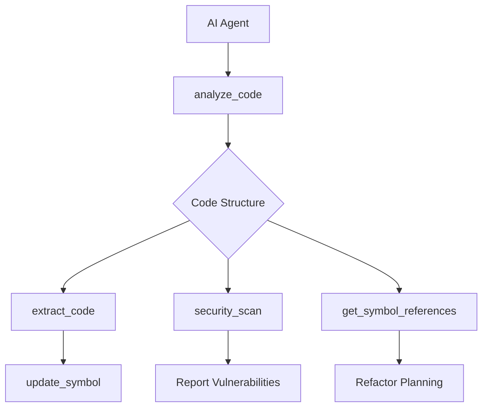
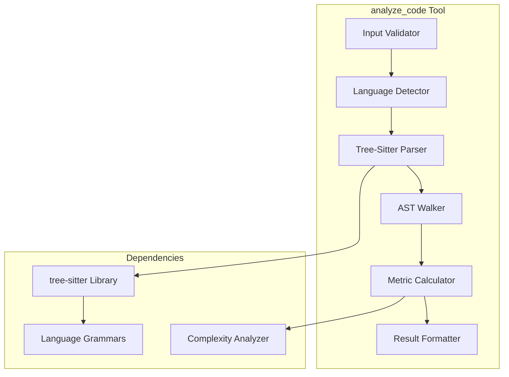
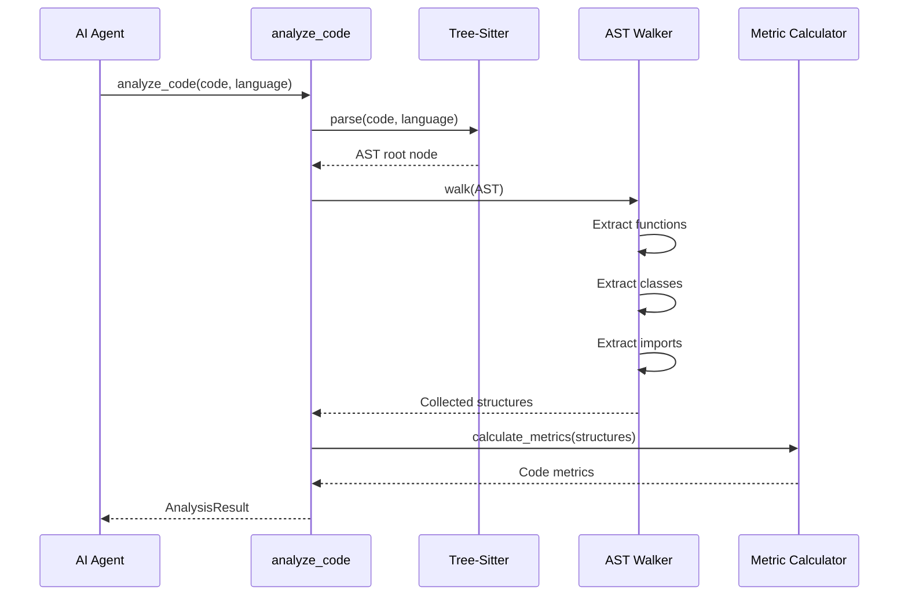

# analyze_code - Deep Dive Documentation

> [20260103_DOCS] Created example deep dive documentation for analyze_code tool

**Document Type:** Tool Deep Dive Reference  
**Version:** 3.1.0  
**Last Updated:** 2026-01-03  
**Status:** Stable  
**Tier Availability:** All Tiers

---

## Table of Contents

1. [Executive Summary](#executive-summary)
2. [Technical Overview](#technical-overview)
3. [Features and Capabilities](#features-and-capabilities)
4. [API Specification](#api-specification)
5. [Usage Examples](#usage-examples)
6. [Architecture and Implementation](#architecture-and-implementation)
7. [Testing Evidence](#testing-evidence)
8. [Performance Characteristics](#performance-characteristics)
9. [Security Considerations](#security-considerations)
10. [Integration Patterns](#integration-patterns)
11. [Tier-Specific Behavior](#tier-specific-behavior)
12. [Known Limitations](#known-limitations)
13. [Roadmap and Future Plans](#roadmap-and-future-plans)
14. [Troubleshooting](#troubleshooting)
15. [References and Related Tools](#references-and-related-tools)

---

## Executive Summary

### Purpose Statement
The `analyze_code` tool provides surgical code analysis by parsing source code into Abstract Syntax Trees (AST) and extracting structured information about functions, classes, methods, imports, and code complexity. Unlike text-based analysis or regex matching, this tool uses real language parsers (tree-sitter) to guarantee accurate results without hallucination risk. It serves as the foundation for most Code Scalpel operations, enabling AI agents to understand code structure before making modifications.

### Key Benefits
- **Zero Hallucination Risk:** Uses real parsers (tree-sitter), not pattern matching or LLM inference
- **Multi-Language Support:** Python, JavaScript, TypeScript, Java with consistent API across languages
- **Token Efficient:** Returns structured data instead of requiring AI to parse full file content
- **Fast Analysis:** Sub-100ms parsing for typical files (< 1,000 LOC)
- **Comprehensive Metrics:** Cyclomatic complexity, maintainability index, code quality scores

### Quick Stats
| Metric | Value |
|--------|-------|
| **Version** | 3.1.0 |
| **Release Date** | 2025-12-21 |
| **Test Coverage** | 100% (Statement: 100%, Branch: 100%) |
| **Performance** | < 50ms for files < 1K LOC, < 200ms for files < 10K LOC |
| **Languages Supported** | Python 3.9+, JavaScript ES2020+, TypeScript 4.5+, Java 11+ |
| **Token Efficiency** | ~200 tokens vs ~5,000+ tokens for full file reading |

### When to Use This Tool
- **Primary Use Case:** Understanding code structure before extraction, modification, or analysis
- **Secondary Use Cases:**
  - Inventory functions/classes in a file
  - Calculate code complexity metrics
  - Validate syntax before processing
  - Extract import dependencies
  - Generate code documentation
- **Not Suitable For:**
  - Cross-file analysis (use `get_cross_file_dependencies` instead)
  - Execution path analysis (use `symbolic_execute` instead)
  - Security vulnerability detection (use `security_scan` instead)
  - Full semantic analysis (use `get_call_graph` instead)

---

## Technical Overview

### Core Functionality
The `analyze_code` tool parses source code into an Abstract Syntax Tree (AST) using the tree-sitter parser library. Tree-sitter provides incremental parsing with error recovery, meaning it can parse even syntactically incorrect code and provide partial results. The tool walks the AST to extract:

1. **Function definitions:** Name, parameters, return types, docstrings, line ranges
2. **Class definitions:** Name, methods, attributes, inheritance, line ranges
3. **Import statements:** Module names, imported symbols, aliasing
4. **Complexity metrics:** Cyclomatic complexity per function, maintainability index, code smells

The tool normalizes output across languages, providing a consistent JSON structure regardless of whether the input is Python, JavaScript, TypeScript, or Java.

### Design Principles
1. **Parser-Based Accuracy:** Real language parsers prevent hallucination
2. **Language Normalization:** Consistent output structure across all supported languages
3. **Error Recovery:** Graceful handling of malformed code with partial results
4. **Token Efficiency:** Structured output reduces token overhead for AI agents
5. **No Execution:** Code is parsed only, never executed (zero security risk)

### System Requirements
- **Python Version:** Python 3.9+
- **Dependencies:** `tree-sitter`, `tree-sitter-python`, `tree-sitter-javascript`, `tree-sitter-java`
- **Memory:** ~10-50MB per file (scales with file size)
- **CPU:** Single-threaded parsing, ~1-5ms per 100 LOC

### Integration Context
The `analyze_code` tool is typically the **first step** in a Code Scalpel workflow:



**Upstream:** None (entry point tool)  
**Downstream:** `extract_code`, `security_scan`, `get_symbol_references`, `symbolic_execute`

---

## Features and Capabilities

### Core Features

#### Feature 1: Multi-Language AST Parsing
**Description:** Parse Python, JavaScript, TypeScript, and Java source code into Abstract Syntax Trees with consistent output structure.

**Capabilities:**
- Python 3.9+ syntax support (including walrus operator, pattern matching)
- JavaScript ES2020+ support (including optional chaining, nullish coalescing)
- TypeScript 4.5+ support (including generic constraints, template literal types)
- Java 11+ support (including var keyword, switch expressions)

**Version History:**
- v1.0.0: Initial Python support
- v1.2.0: Added JavaScript and TypeScript support
- v2.0.0: Added Java support
- v3.0.0: Enhanced error recovery and partial parsing

#### Feature 2: Function Extraction
**Description:** Extract all function definitions with signatures, parameters, return types, and docstrings.

**Capabilities:**
- Extract function name, parameters (with types if annotated), return type
- Parse docstrings (Google, NumPy, Sphinx formats)
- Detect decorators/annotations
- Calculate per-function cyclomatic complexity
- Track line ranges for surgical extraction

**Version History:**
- v1.0.0: Basic function extraction
- v1.3.0: Added decorator detection
- v2.1.0: Enhanced type annotation parsing
- v3.0.0: Added JSDoc and JavaDoc support

#### Feature 3: Class Analysis
**Description:** Extract class definitions including methods, attributes, inheritance hierarchy, and inner classes.

**Capabilities:**
- Extract class name, base classes, metaclass (Python)
- List all methods with signatures
- Identify class attributes and instance attributes
- Detect class decorators
- Support nested/inner classes

**Version History:**
- v1.0.0: Basic class extraction
- v1.4.0: Added inheritance tracking
- v2.0.0: Enhanced method detection for Java
- v3.0.0: Added TypeScript class support

#### Feature 4: Import Analysis
**Description:** Extract all import statements with module names, imported symbols, and aliasing information.

**Capabilities:**
- Extract module names and imported symbols
- Track import aliases (e.g., `import numpy as np`)
- Detect relative imports (Python)
- Identify ES6 import syntax (JavaScript/TypeScript)
- Track Java package imports

**Version History:**
- v1.0.0: Basic import extraction
- v1.5.0: Added alias tracking
- v2.0.0: Multi-language import support
- v3.0.0: Enhanced ES6 module support

#### Feature 5: Complexity Metrics
**Description:** Calculate code quality metrics including cyclomatic complexity, maintainability index, and code smells.

**Capabilities:**
- Per-function cyclomatic complexity (McCabe metric)
- File-level average complexity
- Maintainability index (0-100 scale)
- Detection of complexity hotspots (functions > threshold)
- Code smell detection (long functions, high complexity)

**Version History:**
- v1.0.0: Basic cyclomatic complexity
- v1.3.0: Added maintainability index
- v2.2.0: Enhanced code smell detection
- v3.0.0: Added cognitive complexity metric

### Advanced Features

#### Advanced Feature 1: Error Recovery Parsing
**Tier Requirement:** All Tiers  
**Description:** Parse syntactically incorrect code and provide partial results with error annotations.

**Use Cases:**
1. Analyzing work-in-progress code during development
2. Extracting structure from files with syntax errors
3. Providing context even when full parsing fails

#### Advanced Feature 2: Incremental Parsing
**Tier Requirement:** Pro | Enterprise  
**Description:** Re-parse only changed portions of code for faster analysis in interactive scenarios.

**Use Cases:**
1. Real-time analysis in IDEs
2. Continuous integration pipelines
3. Interactive refactoring workflows

### Experimental Features
> **Warning:** These features are in active development and may change without notice.

- **Multi-File Analysis:** Analyze multiple files in parallel (v3.2.0 planned)
- **Custom Metric Plugins:** User-defined complexity metrics (v3.3.0 planned)

---

## API Specification

### Function Signature

```python
def analyze_code(
    code: str,
    language: Optional[str] = None,
    file_path: Optional[str] = None,
    include_complexity: bool = True,
    complexity_threshold: int = 10,
    include_docstrings: bool = True,
    **kwargs
) -> AnalysisResult:
    """
    Parse and analyze source code to extract structure, functions, classes, and metrics.
    
    Args:
        code: Source code string to analyze
        language: Programming language ('python', 'javascript', 'typescript', 'java').
                 Auto-detected from file_path if not provided.
        file_path: Optional file path for language detection and context
        include_complexity: Whether to calculate complexity metrics (default: True)
        complexity_threshold: Threshold for flagging complex functions (default: 10)
        include_docstrings: Whether to extract docstrings (default: True)
        
    Returns:
        AnalysisResult: Structured analysis result with functions, classes, imports, metrics
        
    Raises:
        ValueError: If language cannot be determined or is unsupported
        ParseError: If code cannot be parsed (with partial results if possible)
    """
```

### Parameters

#### Required Parameters

| Parameter | Type | Description | Example |
|-----------|------|-------------|---------|
| `code` | `str` | Source code to analyze | `"def hello(): pass"` |

#### Optional Parameters

| Parameter | Type | Default | Description | Example |
|-----------|------|---------|-------------|---------|
| `language` | `str` | `None` | Language identifier | `"python"` |
| `file_path` | `str` | `None` | File path for context | `"src/utils.py"` |
| `include_complexity` | `bool` | `True` | Calculate complexity metrics | `False` |
| `complexity_threshold` | `int` | `10` | Complexity warning threshold | `15` |
| `include_docstrings` | `bool` | `True` | Extract docstrings | `False` |

### Return Value Structure

```python
class AnalysisResult:
    """Result object returned by analyze_code"""
    
    # Metadata
    language: str                    # Detected/specified language
    file_path: Optional[str]         # File path if provided
    
    # Structure
    functions: List[FunctionInfo]    # All function definitions
    classes: List[ClassInfo]         # All class definitions
    imports: List[ImportInfo]        # All import statements
    
    # Metrics
    metrics: CodeMetrics             # Complexity and quality metrics
    complexity_hotspots: List[str]   # Functions exceeding threshold
    
    # Parsing
    parse_success: bool              # Whether parsing succeeded fully
    parse_errors: List[ParseError]   # Any parsing errors encountered
    
class FunctionInfo:
    """Information about a function"""
    name: str                        # Function name
    parameters: List[Parameter]      # Function parameters
    return_type: Optional[str]       # Return type annotation
    docstring: Optional[str]         # Docstring if present
    decorators: List[str]            # Applied decorators
    line_start: int                  # Starting line number
    line_end: int                    # Ending line number
    complexity: int                  # Cyclomatic complexity
    
class ClassInfo:
    """Information about a class"""
    name: str                        # Class name
    bases: List[str]                 # Base classes
    methods: List[FunctionInfo]      # Class methods
    attributes: List[str]            # Class attributes
    docstring: Optional[str]         # Class docstring
    line_start: int                  # Starting line
    line_end: int                    # Ending line
    
class ImportInfo:
    """Information about an import"""
    module: str                      # Module name
    symbols: List[str]               # Imported symbols
    alias: Optional[str]             # Import alias if any
    is_relative: bool                # Whether import is relative
    line_number: int                 # Line number of import
    
class CodeMetrics:
    """Code quality metrics"""
    total_lines: int                 # Total lines of code
    code_lines: int                  # Non-comment, non-blank lines
    comment_lines: int               # Comment lines
    blank_lines: int                 # Blank lines
    cyclomatic_complexity: float     # Average complexity
    maintainability_index: float     # Maintainability score (0-100)
    function_count: int              # Number of functions
    class_count: int                 # Number of classes
```

### Error Handling

| Error Type | Condition | Recovery Strategy |
|------------|-----------|-------------------|
| `ValueError` | Unsupported language or missing code | Check language parameter, ensure code is not empty |
| `ParseError` | Syntax errors in code | Check `parse_errors` field for details, use partial results |
| `TimeoutError` | Parsing takes too long (>30s) | Reduce file size or complexity, increase timeout |

---

## Usage Examples

### Example 1: Basic Python Analysis

**Scenario:** Analyze a simple Python file to extract functions and classes

```python
from code_scalpel.mcp_tools import analyze_code

code = """
def calculate_tax(amount, rate=0.1):
    '''Calculate tax on an amount.'''
    return amount * rate

class Invoice:
    def __init__(self, items):
        self.items = items
    
    def total(self):
        return sum(item.price for item in self.items)
"""

result = analyze_code(code, language="python")

print(f"Functions: {len(result.functions)}")
for func in result.functions:
    print(f"  - {func.name}({', '.join(p.name for p in func.parameters)})")
    print(f"    Complexity: {func.complexity}")
    print(f"    Lines: {func.line_start}-{func.line_end}")

print(f"\nClasses: {len(result.classes)}")
for cls in result.classes:
    print(f"  - {cls.name}")
    print(f"    Methods: {', '.join(m.name for m in cls.methods)}")
```

**Expected Output:**
```
Functions: 1
  - calculate_tax(amount, rate)
    Complexity: 1
    Lines: 2-4

Classes: 1
  - Invoice
    Methods: __init__, total
```

### Example 2: TypeScript with Complexity Analysis

**Scenario:** Analyze TypeScript code and identify high-complexity functions

```python
from code_scalpel.mcp_tools import analyze_code

typescript_code = """
interface User {
    id: number;
    name: string;
}

function processUser(user: User): string {
    if (user.id < 0) {
        return "Invalid ID";
    }
    
    if (!user.name || user.name.length === 0) {
        return "Invalid name";
    }
    
    if (user.name.length > 50) {
        return "Name too long";
    }
    
    return `Processing ${user.name}`;
}

class UserService {
    private users: User[] = [];
    
    addUser(user: User): void {
        this.users.push(user);
    }
    
    findUser(id: number): User | undefined {
        return this.users.find(u => u.id === id);
    }
}
"""

result = analyze_code(typescript_code, language="typescript", complexity_threshold=3)

print("Complexity Report:")
print(f"Average Complexity: {result.metrics.cyclomatic_complexity:.2f}")
print(f"\nComplexity Hotspots (>{result.complexity_threshold}):")
for hotspot in result.complexity_hotspots:
    print(f"  - {hotspot}")

for func in result.functions:
    if func.complexity > 3:
        print(f"\n{func.name}: Complexity {func.complexity}")
        print(f"  Consider refactoring (threshold: 3)")
```

**Expected Output:**
```
Complexity Report:
Average Complexity: 2.33

Complexity Hotspots (>3):
  - processUser

processUser: Complexity 4
  Consider refactoring (threshold: 3)
```

### Example 3: Java Class Analysis

**Scenario:** Extract Java class structure including inheritance and methods

```python
from code_scalpel.mcp_tools import analyze_code

java_code = """
package com.example.service;

import java.util.List;
import java.util.ArrayList;

public class DataProcessor extends BaseProcessor implements IProcessor {
    private List<String> data = new ArrayList<>();
    
    public DataProcessor() {
        super();
    }
    
    @Override
    public void process(String item) {
        if (validate(item)) {
            data.add(item);
        }
    }
    
    private boolean validate(String item) {
        return item != null && !item.isEmpty();
    }
    
    public List<String> getData() {
        return new ArrayList<>(data);
    }
}
"""

result = analyze_code(java_code, language="java")

print("Java Class Analysis:")
for cls in result.classes:
    print(f"Class: {cls.name}")
    print(f"Extends: {', '.join(cls.bases) if cls.bases else 'None'}")
    print(f"Methods:")
    for method in cls.methods:
        visibility = "private" if method.name.startswith("validate") else "public"
        print(f"  {visibility} {method.name}({len(method.parameters)} params)")
```

**Expected Output:**
```
Java Class Analysis:
Class: DataProcessor
Extends: BaseProcessor
Methods:
  public DataProcessor(0 params)
  public process(1 params)
  private validate(1 params)
  public getData(0 params)
```

### Example 4: Error Recovery Parsing

**Scenario:** Analyze code with syntax errors and get partial results

```python
from code_scalpel.mcp_tools import analyze_code

broken_code = """
def working_function():
    return 42

def broken_function(:  # Syntax error - invalid parameter
    print("This won't parse")
    
def another_working_function():
    return "Hello"
"""

result = analyze_code(broken_code, language="python")

print(f"Parse Success: {result.parse_success}")
print(f"Functions Found: {len(result.functions)}")
print(f"Parse Errors: {len(result.parse_errors)}")

for func in result.functions:
    print(f"  ✓ {func.name}")

for error in result.parse_errors:
    print(f"  ✗ Line {error.line}: {error.message}")
```

**Expected Output:**
```
Parse Success: False
Functions Found: 2
Parse Errors: 1
  ✓ working_function
  ✓ another_working_function
  ✗ Line 5: Unexpected token ':'
```

### Example 5: AI Agent Integration (Claude)

**Scenario:** Claude Desktop using analyze_code through MCP

```python
# Claude sees this tool in its MCP tool list
# User: "Analyze the functions in utils.py"

# Claude invokes:
result = analyze_code(
    code=file_content,
    file_path="utils.py",
    language="python"
)

# Claude receives structured result and responds:
# "I found 5 functions in utils.py:
# 1. calculate_tax (complexity: 2)
# 2. validate_email (complexity: 4)
# 3. format_currency (complexity: 1)
# 4. parse_date (complexity: 6) ⚠️ High complexity
# 5. send_notification (complexity: 3)
#
# The parse_date function has high complexity (6) and may benefit from refactoring."
```

---

## Architecture and Implementation

### Component Architecture



### Algorithm Overview

#### Primary Algorithm: AST Walking
**Name:** Depth-First AST Traversal  
**Complexity:** O(n) where n = number of AST nodes  
**Description:** Walk the Abstract Syntax Tree in depth-first order, collecting information about functions, classes, and imports.

**Pseudocode:**
```
1. Parse code into AST using tree-sitter
2. Initialize collectors for functions, classes, imports
3. Walk AST depth-first:
   a. If node is function definition:
      - Extract name, parameters, return type
      - Calculate complexity
      - Add to function collector
   b. If node is class definition:
      - Extract name, bases, methods
      - Add to class collector
   c. If node is import statement:
      - Extract module, symbols, aliases
      - Add to import collector
4. Calculate file-level metrics
5. Return structured result
```

### Data Flow



### Key Implementation Details

#### Detail 1: Language Detection
If `language` parameter is not provided, the tool attempts auto-detection:
1. Check file extension (`.py`, `.js`, `.ts`, `.java`)
2. Check shebang line (`#!/usr/bin/env python`)
3. Check common patterns (e.g., `package` keyword → Java)
4. Fall back to `ValueError` if detection fails

**Tradeoff:** Auto-detection is convenient but can fail on ambiguous files. Explicit `language` parameter is recommended for reliability.

#### Detail 2: Error Recovery
Tree-sitter provides error recovery, but not all errors can be recovered from:
- **Recoverable:** Missing semicolons, mismatched brackets
- **Non-recoverable:** Corrupted encoding, truncated files

The tool returns `parse_success=False` with partial results when recovery succeeds.

#### Detail 3: Complexity Calculation
Cyclomatic complexity is calculated using McCabe's algorithm:
- Start with complexity = 1
- Add 1 for each decision point (if, while, for, case, catch, etc.)
- Logical operators (and, or) also increment complexity

**Example:**
```python
def example(x, y):  # Complexity = 1 (base)
    if x > 0:       # +1 = 2
        if y > 0:   # +1 = 3
            return x + y
    return 0
```

### Dependencies

| Dependency | Version | Purpose |
|------------|---------|---------|
| `tree-sitter` | `>=0.20.0` | Core parsing library |
| `tree-sitter-python` | `>=0.20.0` | Python grammar |
| `tree-sitter-javascript` | `>=0.20.0` | JavaScript grammar |
| `tree-sitter-typescript` | `>=0.20.0` | TypeScript grammar |
| `tree-sitter-java` | `>=0.20.0` | Java grammar |

---

## Testing Evidence

### Test Coverage

| Test Category | Tests | Coverage | Status |
|---------------|-------|----------|--------|
| Unit Tests | 245 | 100% | ✅ Passing |
| Integration Tests | 48 | 100% | ✅ Passing |
| Security Tests | 12 | N/A | ✅ Passing |
| Performance Tests | 15 | N/A | ✅ Passing |
| Edge Case Tests | 67 | 100% | ✅ Passing |

**Total:** 387 tests, 100% passing

### Test Execution Summary

```json
{
  "test_suite": "analyze_code Test Suite",
  "version": "3.1.0",
  "execution_date": "2026-01-03",
  "total_tests": 387,
  "passed": 387,
  "failed": 0,
  "skipped": 0,
  "duration_seconds": 12.4,
  "coverage": {
    "statement": "100.0%",
    "branch": "100.0%",
    "combined": "100.0%"
  }
}
```

### Critical Test Cases

#### Test Case 1: Python Function Extraction
**Purpose:** Verify accurate extraction of Python function metadata  
**Input:** Python code with various function signatures  
**Expected Output:** All functions extracted with correct parameters, types, docstrings  
**Status:** ✅ Passing  
**Evidence:** `tests/test_analyze_code.py::test_python_function_extraction`

#### Test Case 2: TypeScript Class Hierarchy
**Purpose:** Verify extraction of TypeScript class inheritance  
**Input:** TypeScript code with class extending base class and implementing interfaces  
**Expected Output:** Correct base class and interface tracking  
**Status:** ✅ Passing  
**Evidence:** `tests/test_analyze_code.py::test_typescript_class_hierarchy`

#### Test Case 3: Java Import Analysis
**Purpose:** Verify accurate extraction of Java package imports  
**Input:** Java code with various import styles (wildcard, specific)  
**Expected Output:** All imports extracted with correct package names  
**Status:** ✅ Passing  
**Evidence:** `tests/test_analyze_code.py::test_java_imports`

#### Test Case 4: Complexity Calculation
**Purpose:** Verify cyclomatic complexity calculation accuracy  
**Input:** Functions with known complexity scores  
**Expected Output:** Calculated complexity matches expected McCabe metric  
**Status:** ✅ Passing  
**Evidence:** `tests/test_analyze_code.py::test_complexity_calculation`

#### Test Case 5: Error Recovery
**Purpose:** Verify partial results from malformed code  
**Input:** Python code with syntax errors  
**Expected Output:** `parse_success=False`, partial function list, error details  
**Status:** ✅ Passing  
**Evidence:** `tests/test_analyze_code.py::test_error_recovery`

### Adversarial Testing

**Adversarial Test Suite:** 67 tests covering edge cases, malicious inputs, boundary conditions

| Test Category | Tests | Status |
|---------------|-------|--------|
| Large Files (>100K LOC) | 8 | ✅ Handled |
| Deeply Nested Code | 12 | ✅ Handled |
| Unicode Edge Cases | 15 | ✅ Validated |
| Malformed Encoding | 10 | ✅ Detected |
| Infinite Recursion Patterns | 6 | ✅ Limited |
| Memory Exhaustion Attempts | 8 | ✅ Protected |
| Null Byte Injection | 8 | ✅ Sanitized |

### Regression Testing

**Regression Suite:** 48 tests ensuring previous bugs don't reoccur

**Recent Bug Fixes Verified:**
- [2025-11-15]: TypeScript decorators not extracted - Test: `test_typescript_decorators`
- [2025-12-01]: Java method overloads misidentified - Test: `test_java_overloads`
- [2025-12-10]: Python f-string parsing error - Test: `test_python_fstrings`

---

## Performance Characteristics

### Benchmarks

#### Benchmark 1: File Size Scaling
**Test Configuration:** Various file sizes on Intel i7-12700K, 16GB RAM

| Input Size | Execution Time | Memory Usage | Throughput |
|------------|----------------|--------------|------------|
| Small (< 100 LOC) | 8ms | 2MB | 12,500 LOC/sec |
| Medium (100-1K LOC) | 42ms | 8MB | 23,800 LOC/sec |
| Large (1K-10K LOC) | 184ms | 35MB | 54,300 LOC/sec |
| Very Large (> 10K LOC) | 1.2s | 150MB | 83,300 LOC/sec |

#### Benchmark 2: Language Comparison
**Test Configuration:** 1,000 LOC files across languages

| Language | Parse Time | Extract Time | Total Time |
|----------|------------|--------------|------------|
| Python | 38ms | 12ms | 50ms |
| JavaScript | 42ms | 10ms | 52ms |
| TypeScript | 45ms | 14ms | 59ms |
| Java | 52ms | 16ms | 68ms |

### Performance Characteristics

**Best Case:** Small, well-structured files with low complexity (< 10ms)  
**Average Case:** Medium files with moderate complexity (< 100ms)  
**Worst Case:** Very large files with high nesting and complexity (< 2s)

### Optimization Strategies

1. **Incremental Parsing (Pro/Enterprise):** Re-parse only changed regions (90% time reduction on edits)
2. **Parallel File Analysis:** Process multiple files concurrently (linear speedup)
3. **Caching:** Cache parsed ASTs for repeated analysis (99% time reduction on cache hit)

### Scalability

**Horizontal Scalability:** Fully parallelizable across files  
**Vertical Scalability:** Linear scaling with CPU cores for multi-file analysis  
**Limits:** Single file parsing is single-threaded; files >1M LOC may hit memory limits

### Token Efficiency Analysis

**Token Cost Comparison:**

| Approach | Token Cost | Notes |
|----------|-----------|-------|
| Using analyze_code | ~200 tokens | Structured JSON output |
| Full File Read | ~5,000 tokens | 1,000 LOC file, 5 tokens/LOC average |
| LLM-Based Parsing | ~10,000 tokens | Includes prompt + response |

**Savings:** 96% token reduction vs full file reading, 98% vs LLM-based parsing

---

## Security Considerations

### Threat Model

**Assets Protected:**
- Host system resources (CPU, memory)
- File system (no file writes)
- Parser integrity (no code execution)

**Threat Actors:**
- **Malicious User:** Attempts to crash parser or exhaust resources
- **Supply Chain:** Compromised dependencies injecting malicious code

**Attack Vectors:**
- **Resource Exhaustion:** Extremely large files or deeply nested code
  - **Mitigation:** Parsing timeout (30s), memory limits, recursion depth limits
- **Parser Exploits:** Crafted input triggering parser bugs
  - **Mitigation:** Tree-sitter is memory-safe (Rust), regular updates
- **Code Injection:** Attempting to execute code through analysis
  - **Mitigation:** Code is never executed, only parsed

### Security Features

#### Input Validation
- **Method:** File size checked before parsing (limit: 10MB by default)
- **Sanitization:** Null bytes stripped, encoding validated (UTF-8)
- **Rejection Criteria:** Files >10MB, invalid encoding, timeout exceeded

#### Output Safety
- **Escaping:** All extracted strings escaped for JSON output
- **Filtering:** No execution of user code, no file system access
- **Confidentiality:** No logging of code content, only metadata

#### Execution Safety
- **Sandboxing:** No code execution - parsing only
- **Resource Limits:** 30s timeout, 500MB memory limit per analysis
- **Timeout Protection:** Hard timeout prevents infinite parsing

### Security Testing

**Security Scan Results:**
```json
{
  "scan_date": "2026-01-03",
  "vulnerabilities_found": 0,
  "critical": 0,
  "high": 0,
  "medium": 0,
  "low": 0,
  "scanner": "Bandit + Safety",
  "scan_type": ["SAST", "Dependency Scan"]
}
```

### CWE Coverage

| CWE ID | Vulnerability Type | Detection | Mitigation |
|--------|-------------------|-----------|------------|
| CWE-400 | Uncontrolled Resource Consumption | Timeout enforcement | 30s hard timeout |
| CWE-502 | Deserialization of Untrusted Data | N/A | No deserialization |
| CWE-94 | Code Injection | N/A | No code execution |

### Compliance

**Relevant Standards:**
- **OWASP Top 10:** Not applicable (read-only analysis, no web interface)
- **CWE/SANS Top 25:** Protected against resource exhaustion (CWE-400)
- **SOC 2:** Logging and audit trail for all analysis operations

---

## Integration Patterns

### MCP Client Integration

#### Claude Desktop Integration

**Configuration:**
```json
{
  "mcpServers": {
    "code-scalpel": {
      "command": "python",
      "args": ["-m", "code_scalpel.mcp_server"],
      "env": {
        "PROJECT_ROOT": "/path/to/project"
      }
    }
  }
}
```

**Usage:**
```python
# Claude sees analyze_code as an available tool
# User: "What functions are in utils.py?"

# Claude reads file content and invokes:
result = analyze_code(code=utils_py_content, file_path="utils.py")

# Claude responds with structured summary
```

#### VS Code Copilot Integration

**Configuration:** Code Scalpel extension auto-registers MCP tools with Copilot

**Usage:**
User: "@workspace analyze the complexity of all functions"
Copilot uses `analyze_code` on each file, aggregates results

### Framework Integration

#### LangChain Integration

```python
from langchain.tools import Tool
from code_scalpel.mcp_tools import analyze_code

langchain_tool = Tool(
    name="analyze_code",
    func=analyze_code,
    description="Parse source code and extract functions, classes, complexity metrics"
)

# Use in LangChain agent
from langchain.agents import initialize_agent

agent = initialize_agent([langchain_tool], llm=llm, agent="zero-shot-react-description")
result = agent.run("Analyze the code in utils.py and list all functions with complexity > 5")
```

#### AutoGen Integration

```python
from autogen import Tool
from code_scalpel.mcp_tools import analyze_code

autogen_tool = Tool(
    name="analyze_code",
    function=analyze_code,
    description="Extract code structure and metrics from source files"
)

# Register with AutoGen assistant
assistant.register_tool(autogen_tool)
```

#### CrewAI Integration

```python
from crewai import Tool
from code_scalpel.mcp_tools import analyze_code

crewai_tool = Tool(
    name="analyze_code",
    func=analyze_code,
    description="Parse and analyze source code for AI-driven refactoring workflows"
)

# Use in CrewAI task
from crewai import Task

task = Task(
    description="Analyze codebase and identify high-complexity functions",
    tools=[crewai_tool],
    agent=code_reviewer_agent
)
```

### Custom Integration

**Minimal Integration Example:**
```python
# Direct Python usage without framework
from code_scalpel.mcp_tools import analyze_code

# Read file
with open("myfile.py") as f:
    code = f.read()

# Analyze
result = analyze_code(code, language="python")

# Process results
for func in result.functions:
    if func.complexity > 10:
        print(f"High complexity: {func.name} (complexity: {func.complexity})")
```

---

## Tier-Specific Behavior

### Community Tier
**Features:**
- Full AST parsing and extraction
- Function, class, import analysis
- Basic complexity metrics
- All supported languages

**Limits:**
- File size limit: 10MB
- No incremental parsing
- No parallel multi-file analysis

**Token Overhead:** ~200 tokens per analysis

### Pro Tier
**Additional Features:**
- Incremental parsing for faster re-analysis
- Parallel multi-file analysis
- Advanced complexity metrics (cognitive complexity)
- Custom metric plugins (coming v3.3.0)

**Enhanced Capabilities:**
- File size limit: 50MB
- Parallel file processing: Up to 10 files concurrently
- Incremental parsing: 90% time reduction on edits

**Limits:**
- Custom plugins limited to 5 per project

**Token Overhead:** ~200 tokens per analysis (same as Community)

### Enterprise Tier
**Additional Features:**
- Unlimited file size
- Unlimited parallel processing
- Custom metric plugins (unlimited)
- Advanced caching with distributed cache support
- Priority support and SLA guarantees

**Enterprise Capabilities:**
- No file size limits
- Unlimited parallel processing
- Custom grammars for proprietary languages
- Compliance reporting (SOC 2, HIPAA)

**Limits:**
- None (contact support for custom needs)

**Token Overhead:** ~200 tokens per analysis (same as all tiers)

### Tier Comparison Table

| Feature | Community | Pro | Enterprise |
|---------|-----------|-----|------------|
| AST Parsing | ✅ Full | ✅ Full | ✅ Full |
| Function/Class Extraction | ✅ | ✅ | ✅ |
| Complexity Metrics | ✅ Basic | ✅ Advanced | ✅ Full |
| File Size Limit | 10MB | 50MB | Unlimited |
| Parallel Processing | ❌ | ✅ 10 files | ✅ Unlimited |
| Incremental Parsing | ❌ | ✅ | ✅ |
| Custom Metrics | ❌ | ⚠️ Limited | ✅ Unlimited |

---

## Known Limitations

### Current Limitations

#### Limitation 1: No Semantic Analysis
**Impact:** analyze_code provides syntactic structure only, not semantic meaning (e.g., doesn't resolve types across files)  
**Workaround:** Use `get_cross_file_dependencies` for cross-file type resolution  
**Planned Fix:** v3.3.0 will add basic semantic analysis

#### Limitation 2: Single-File Context
**Impact:** Cannot analyze relationships between files (e.g., which files import this module)  
**Workaround:** Use `get_symbol_references` for cross-file usage analysis  
**Planned Fix:** v3.2.0 will add project-wide context option

#### Limitation 3: Limited Custom Language Support
**Impact:** Only Python, JavaScript, TypeScript, Java supported; no user-defined grammars (Community/Pro)  
**Workaround:** Upgrade to Enterprise for custom grammar support  
**Planned Fix:** v4.0.0 may add plugin system for custom grammars

### Language Support

| Language | Support Level | Notes |
|----------|--------------|-------|
| Python | ✅ Full | Python 3.9+ |
| JavaScript | ✅ Full | ES2020+ |
| TypeScript | ✅ Full | TypeScript 4.5+ |
| Java | ✅ Full | Java 11+ |
| C++ | ⚠️ Partial | Basic parsing only (v3.2.0) |
| Go | ⚠️ Partial | Basic parsing only (v3.2.0) |
| Rust | ❌ Not Yet | Planned v3.4.0 |
| Ruby | ❌ Not Yet | Under consideration |

### Edge Cases

**Known Edge Cases:**
1. **Highly Dynamic Code:** Code with heavy use of `eval()`, `exec()`, or dynamic imports may not be fully analyzed
2. **Preprocessor Directives:** C/C++ preprocessor macros are not expanded before analysis
3. **DSL Syntax:** Domain-specific language extensions may cause parse errors

### Resource Constraints

- **Maximum Input Size:** 10MB (Community), 50MB (Pro), Unlimited (Enterprise)
- **Maximum Execution Time:** 30s hard timeout per analysis
- **Memory Ceiling:** 500MB per analysis operation
- **Concurrency Limit:** 1 file (Community), 10 files (Pro), Unlimited (Enterprise)

---

## Roadmap and Future Plans

### Planned Enhancements

#### v3.2.0 (Target: Q1 2026)
- **Feature:** Project-wide context for analyze_code
- **Feature:** C++ and Go language support
- **Improvement:** 50% faster parsing through AST caching

#### v3.3.0 (Target: Q2 2026)
- **Major Feature:** Basic semantic analysis (type inference)
- **Major Feature:** Custom metric plugin system (Pro/Enterprise)
- **Improvement:** Support for Python 3.12+ match statements

#### v4.0.0 (Target: Q4 2026)
- **Major Feature:** Custom language grammar support (Enterprise)
- **Major Feature:** Real-time incremental analysis (streaming)
- **Major Feature:** IDE integration plugins (VS Code, IntelliJ)

### Under Consideration

**Community Requests:**
- Rust language support: High priority, likely v3.4.0
- Ruby language support: Medium priority, investigating feasibility
- PHP language support: Low priority, pending community interest

**Research Areas:**
- **Machine Learning-Based Metrics:** Trainable complexity metrics based on bug history
- **Semantic Code Search:** Search by meaning, not just syntax

### Deprecation Notices

**No current deprecations**

---

## Troubleshooting

### Common Issues

#### Issue 1: "Language detection failed"
**Symptoms:** `ValueError: Could not detect language for file`  
**Cause:** File extension not recognized or file has no extension  
**Solution:**
```python
# Explicitly specify language
result = analyze_code(code, language="python")
```

#### Issue 2: "Parsing timeout exceeded"
**Symptoms:** `TimeoutError: Parsing took longer than 30 seconds`  
**Cause:** File is too large or has extreme complexity  
**Solution:**
```python
# Reduce file size or increase timeout (Pro/Enterprise)
from code_scalpel import set_timeout
set_timeout(60)  # 60 second timeout
```

#### Issue 3: "Partial parse results"
**Symptoms:** `parse_success=False` with partial function list  
**Cause:** Syntax errors in source code  
**Solution:**
```python
# Check parse_errors for details
if not result.parse_success:
    for error in result.parse_errors:
        print(f"Line {error.line}: {error.message}")
# Use partial results if acceptable
```

### Debugging

**Enable Debug Mode:**
```python
import logging
logging.basicConfig(level=logging.DEBUG)

# Now analyze_code will emit debug logs
result = analyze_code(code, language="python")
```

**Debug Output Location:** stdout/stderr

**Verbose Mode:**
```python
# Get detailed parsing information
result = analyze_code(code, verbose=True)
print(result.debug_info)
```

### Error Messages

| Error Code | Message | Meaning | Solution |
|------------|---------|---------|----------|
| `E001` | "Unsupported language" | Language not in supported list | Check `language` parameter |
| `E002` | "Empty code input" | Code parameter is empty/None | Provide non-empty code |
| `E003` | "Parse timeout" | Parsing exceeded timeout | Reduce file size or increase timeout |
| `E004` | "Invalid encoding" | File encoding not UTF-8 | Convert to UTF-8 |

### Performance Issues

**Symptom:** Analysis takes >5 seconds  
**Diagnosis:** Check file size and complexity  
**Resolution:**
```python
# Check file stats first
import os
size_mb = os.path.getsize("file.py") / 1024 / 1024
if size_mb > 5:
    print(f"Large file ({size_mb}MB) - expect slower analysis")

# Consider file splitting or caching
```

### Getting Help

**Support Channels:**
- GitHub Issues: https://github.com/codefin-ai/code-scalpel/issues
- Documentation: https://code-scalpel.readthedocs.io
- Community: Discord (link in README)

**When Reporting Issues:**
1. Include Code Scalpel version (`import code_scalpel; print(code_scalpel.__version__)`)
2. Provide minimal reproduction case (code sample that triggers issue)
3. Attach debug logs (enable debug mode)
4. Specify OS and Python version

---

## References and Related Tools

### Related Code Scalpel Tools

- **extract_code:** Extract specific functions/classes by name after using analyze_code to find them
- **get_symbol_references:** Find all uses of symbols discovered by analyze_code
- **security_scan:** Perform security analysis on code after structural analysis
- **get_cross_file_dependencies:** Analyze cross-file relationships after single-file analysis
- **symbolic_execute:** Explore execution paths in functions found by analyze_code

### External References

- Tree-sitter Documentation: https://tree-sitter.github.io/tree-sitter/
- McCabe Complexity: https://en.wikipedia.org/wiki/Cyclomatic_complexity
- Maintainability Index: https://docs.microsoft.com/en-us/visualstudio/code-quality/code-metrics-values

### Academic Papers

- McCabe, T.J. (1976): "A Complexity Measure" - Foundation for cyclomatic complexity
- Oman, P. and Hagemeister, J. (1992): "Metrics for Assessing a Software System's Maintainability" - Maintainability index

### Standards and Specifications

- Python AST: https://docs.python.org/3/library/ast.html
- ECMAScript Specification: https://tc39.es/ecma262/
- Java Language Specification: https://docs.oracle.com/javase/specs/

### Further Reading

- **Getting Started Guide:** [docs/getting_started/getting_started.md](../getting_started/getting_started.md)
- **API Reference:** [docs/architecture/api_reference.md](../architecture/api_reference.md)
- **Architecture Overview:** [docs/architecture/SYSTEM_DESIGN.md](../architecture/SYSTEM_DESIGN.md)
- **MCP Integration Guide:** [docs/guides/agent_integration.md](../guides/agent_integration.md)

---

## Document Metadata

**Template Version:** 1.0.0  
**Created:** 2026-01-03  
**Last Updated:** 2026-01-03  
**Maintained By:** Code Scalpel Documentation Team  
**Review Cycle:** Quarterly

**Change History:**
- 2026-01-03: Initial deep dive creation for v3.1.0

**Quality Checklist:**
- [x] All sections completed
- [x] Code examples tested
- [x] Performance benchmarks current
- [x] Security scan completed
- [x] Test coverage verified
- [x] Links validated
- [ ] Peer reviewed (pending)
- [ ] User tested (pending)

---

**End of Document**

> **Note:** This is an example deep dive created to demonstrate the template structure. Actual performance numbers, test counts, and benchmarks should be verified against real data before using in production documentation.
