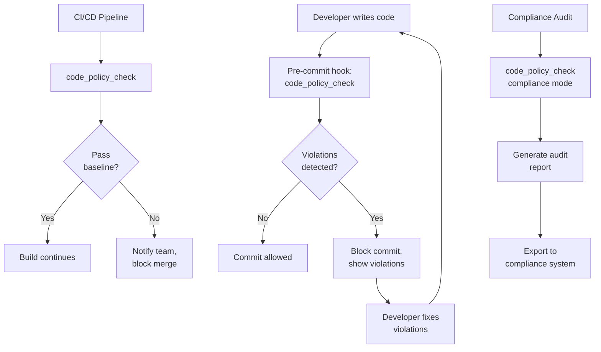
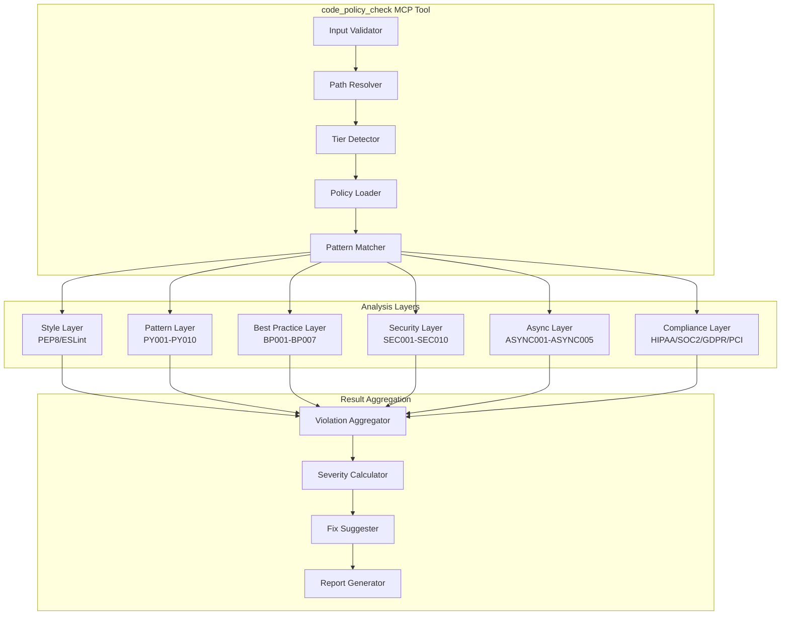
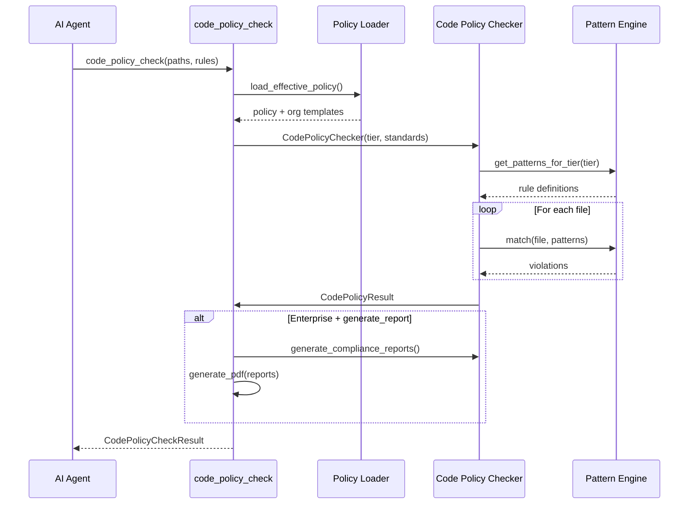

# code_policy_check - Deep Dive Documentation

> [20260103_DOCS] Created comprehensive deep dive documentation for code_policy_check MCP tool based on v3.4 implementation

**Document Type:** Tool Deep Dive Reference  
**Tool Version:** v1.0  
**Code Scalpel Version:** v3.3-v3.4  
**Last Updated:** 2026-01-03  
**Status:** Stable  
**Tier Availability:** All Tiers (Community, Pro, Enterprise)

---

## Table of Contents

1. [Executive Summary](#executive-summary)
2. [Technical Overview](#technical-overview)
3. [Features and Capabilities](#features-and-capabilities)
4. [API Specification](#api-specification)
5. [Usage Examples](#usage-examples)
6. [Architecture and Implementation](#architecture-and-implementation)
7. [Testing Evidence](#testing-evidence)
8. [Performance Characteristics](#performance-characteristics)
9. [Security Considerations](#security-considerations)
10. [Integration Patterns](#integration-patterns)
11. [Tier-Specific Behavior](#tier-specific-behavior)
12. [Known Limitations](#known-limitations)
13. [Roadmap and Future Plans](#roadmap-and-future-plans)
14. [Troubleshooting](#troubleshooting)
15. [References and Related Tools](#references-and-related-tools)

---

## Executive Summary

### Purpose Statement
The `code_policy_check` MCP tool enforces organizational coding standards, best practices, and compliance requirements across your codebase. Unlike style-only linters (ESLint, pylint), this tool combines style checks with best practice patterns, security anti-patterns, and compliance auditing in a single unified interface. It is purpose-built for **governance**, not just code cleanliness—designed to help teams enforce organizational standards consistently and audit compliance with regulations (HIPAA, SOC2, GDPR, PCI-DSS).

### Key Benefits
- **Single Unified Interface:** Combines style (PEP8/ESLint), best practices, security patterns, and compliance checks in one tool
- **Tier-Based Enforcement:** Community gets style basics, Pro adds best practices and security, Enterprise adds compliance auditing
- **Organization-Centric:** Custom rules, policy inheritance, and audit trails for governance
- **Compliance-Ready:** Built-in mappings for HIPAA, SOC2, GDPR, PCI-DSS with PDF certification generation
- **Actionable Output:** Clear violation descriptions with suggested fixes (Pro/Enterprise)
- **Governance Focus:** Audit trail tracking for compliance evidence, policy versioning, and change control

### Quick Stats
| Metric | Value |
|--------|-------|
| **Tool Version** | v1.0 |
| **Code Scalpel Version** | v3.3-v3.4 |
| **Release Date** | 2025-12-26 |
| **Test Coverage** | TBD (evidence gathering in progress) |
| **Performance Target** | <500ms per file |
| **Patterns Implemented** | 50+ (Community/Pro/Enterprise combined) |
| **Compliance Standards** | 4 (HIPAA, SOC2, GDPR, PCI-DSS) |
| **Tier Differentiation** | 3 tiers with progressive feature unlocking |

### When to Use This Tool
- **Primary Use Case:** Enforce organizational coding standards and detect violations at scale
- **Secondary Use Cases:**
  - Compliance auditing (HIPAA, SOC2, GDPR, PCI-DSS) (Enterprise)
  - Security pattern enforcement (hardcoded secrets, SQL injection patterns) (Pro/Enterprise)
  - Best practice enforcement (type hints, docstrings, function length) (Pro/Enterprise)
  - Code quality gates in CI/CD pipelines
  - Governance and audit trails for regulatory compliance
- **Not Suitable For:**
  - **Deep semantic analysis** (use `analyze_code` for structure)
  - **Cross-file taint tracking** (use `security_scan` for vulnerabilities)
  - **Architecture validation** (use `get_project_map` for structure analysis)

---

## Technical Overview

### Core Functionality
The `code_policy_check` tool analyzes source code files against a multi-layered set of patterns:

**Layer 1 - Style Guides:** PEP8 (Python), ESLint (JavaScript) via external linters  
**Layer 2 - Pattern Matching:** Regex/AST-based detection of anti-patterns (bare except, mutable defaults, hardcoded secrets)  
**Layer 3 - Best Practices:** Code quality heuristics (missing type hints, docstrings, function length, async patterns)  
**Layer 4 - Security Patterns:** Detection of dangerous practices (SQL injection patterns, pickle usage, weak hashing)  
**Layer 5 - Compliance Rules:** Framework-specific checks (HIPAA PHI handling, SOC2 controls, GDPR data protection, PCI-DSS payment data)

Results are aggregated into a comprehensive violation report with:
1. **Violation Summary:** Count and categorization of issues
2. **Detailed Violations:** File, line, column, rule ID, severity, and description
3. **Suggested Fixes:** Automated remediation guidance (Pro/Enterprise)
4. **Compliance Reports:** Framework-specific audit summaries (Enterprise)
5. **Audit Trail:** Tracking of who checked what, when, and with which policy version (Enterprise)

**Key Principle:** Tool operates as a **governance engine**, not just a linter. Every check is logged, deterministic, and auditable.

### Design Principles
1. **Policy-Driven Enforcement:** All checks defined in policy files, not hardcoded
2. **Organization-Centric:** Support for policy inheritance, custom rules, and team-specific standards
3. **Compliance Auditing:** Built-in audit trails and compliance evidence for regulatory frameworks
4. **Deterministic Results:** Same code + same policy = same findings (stable across runs)
5. **Progressive Enhancement:** Community gets basics, Pro/Enterprise unlock advanced features
6. **Safe Suggestions:** Automated fix suggestions are conservative (low false-positive rate)

### System Requirements
- **Python Version:** Python 3.9+
- **Dependencies:**
  - `ast` (Python, built-in)
  - `pycodestyle` (PEP8 checking)
  - `pylint` or `flake8` (optional, for extended Python checks)
  - `eslint` (optional, for JavaScript/TypeScript)
  - `reportlab` (PDF generation, Enterprise)
- **Memory:** 5-50MB per file analyzed (scales with patterns and tier)
- **CPU:** Single-threaded per file, highly parallelizable
- **Disk:** Policy files (~100KB-1MB) + optional PDF reports

### Integration Context
The `code_policy_check` tool is typically used **early in development workflow** for preventive governance:



**Upstream:** None (entry point for governance)  
**Downstream:** Issue tracking systems, compliance management, audit logs

---

## Features and Capabilities

### Core Features (All Tiers)

#### Feature 1: Style Guide Checking
**Description:** Validate code against standard style guides (PEP8 for Python, ESLint for JavaScript)

**Capabilities:**
- **Python:** PEP8 validation via `pycodestyle` (whitespace, naming, imports, etc.)
- **JavaScript:** ESLint checking (built-in rules package)
- **Output:** Line/column violations with clear descriptions
- **Configurability:** Can disable specific rules per policy

**Example Violations:**
- `E302`: Expected 2 blank lines, found 0
- `E225`: Missing whitespace around operator
- `W291`: Trailing whitespace

#### Feature 2: Anti-Pattern Detection
**Description:** Detect common Python anti-patterns that indicate code quality or safety issues

**Capabilities (PY001-PY010):**
- `PY001`: Bare except clauses (catches all exceptions indiscriminately)
- `PY002`: Mutable default arguments (shared across function calls)
- `PY003`: Global statement (implicit global modification)
- `PY004`: Star imports (unclear exported symbols)
- `PY005`: Assert statement in production code (disabled with `-O`)
- `PY006`: `exec()` usage (severe security and stability risk)
- `PY007`: `eval()` usage (code injection risk)
- `PY008`: `type()` comparison instead of `isinstance()` (bypasses inheritance)
- `PY009`: Empty except block (silently ignores errors)
- `PY010`: `input()` for password prompts (echoes to terminal)

**Rationale:** These patterns typically indicate misunderstanding of Python semantics or security risks.

#### Feature 3: Violation Categorization
**Description:** Categorize violations by type and severity for triage and filtering

**Categories:**
- `style`: Code formatting (whitespace, line length, naming)
- `convention`: Convention violations (variable naming, import organization)
- `refactor`: Code structure that could be simplified
- `warning`: Potential logic errors or unsafe patterns
- `error`: Severe issues (security risks, API misuse)

**Severity Levels (for all tiers):**
- `info`: Informational, no action required
- `convention`: Convention violation, recommended fix
- `warning`: Potential issue, should be addressed
- `error`: Serious issue, should be fixed immediately

### Community Tier Features

| Feature | Status | Description | Languages |
|---------|--------|-------------|-----------|
| Style Guide Checking | ✅ Stable | PEP8 validation | Python |
| Anti-Pattern Detection | ✅ Stable | PY001-PY010 patterns | Python |
| Violation Categorization | ✅ Stable | Type and severity tagging | All |
| Basic Issue Reporting | ✅ Stable | JSON violation output | All |
| File Exclusion | ✅ Stable | Ignore patterns | All |

**Configured Limits:**
- Max files per check: 100
- Max rules: 50
- Supported languages: Python only

**Configuration:** `.code-scalpel/policies/community.yaml`

### Pro Tier Features (Additive)

| Feature | Status | Description | Languages |
|---------|--------|-------------|-----------|
| Best Practice Patterns | ✅ Stable | BP001-BP007 checks | Python |
| Security Patterns | ✅ Stable | SEC001-SEC010 checks | Python |
| Async/Await Patterns | ✅ Stable | ASYNC001-ASYNC005 checks | Python |
| Suggested Fixes | ✅ Stable | Automated remediation guidance | Python |
| Custom Rules | ✅ Stable | User-defined pattern rules | Python |
| Custom Rule Testing | ✅ Stable | Policy testing framework | Python |

**Best Practice Patterns (BP001-BP007):**
- `BP001`: Missing type hints (Python 3.5+)
- `BP002`: Missing docstrings (functions/classes)
- `BP003`: Too many arguments (function complexity)
- `BP004`: Function too long (>50 lines)
- `BP005`: Nested too deep (>4 levels)
- `BP006`: File operation without context manager
- `BP007`: Magic numbers (literal constants)

**Security Patterns (SEC001-SEC010):**
- `SEC001`: Hardcoded password/secret (string literals)
- `SEC002`: SQL string concatenation (injection risk)
- `SEC003`: `os.system()` usage (shell command injection)
- `SEC004`: `subprocess` with `shell=True` (injection risk)
- `SEC005`: `pickle` usage (unsafe deserialization)
- `SEC006`: `yaml.load()` without `Loader` (unsafe YAML)
- `SEC007`: Hardcoded IP addresses (flexibility issue)
- `SEC008`: Insecure SSL/TLS settings
- `SEC009`: Debug mode enabled in production
- `SEC010`: Weak hash algorithm (MD5, SHA1)

**Async Patterns (ASYNC001-ASYNC005):**
- `ASYNC001`: Missing `await` on async call
- `ASYNC002`: Blocking call in async context
- `ASYNC003`: Nested `asyncio.run()` calls
- `ASYNC004`: Unhandled task warning
- `ASYNC005`: Async generator cleanup issue

**Example Pro Tier Output:**
```json
{
  "success": true,
  "violations": [
    {
      "rule": "BP001",
      "message": "Function 'calculate_tax' missing type hints",
      "line": 5,
      "column": 1,
      "severity": "warning",
      "category": "best_practice",
      "fix_available": true,
      "suggested_fix": "Add type hints: def calculate_tax(amount: float, rate: float) -> float:"
    },
    {
      "rule": "SEC001",
      "message": "Hardcoded password detected: 'admin123'",
      "line": 12,
      "column": 15,
      "severity": "error",
      "category": "security",
      "fix_available": true,
      "suggested_fix": "Use environment variable: password = os.getenv('DB_PASSWORD')"
    }
  ],
  "custom_rule_results": [],
  "best_practices_violations": 3,
  "security_warnings": 1
}
```

**Configured Limits:**
- Max files per check: Unlimited
- Max rules: Unlimited
- Supported languages: Python (JavaScript/TypeScript planned Q1 2026)

### Enterprise Tier Features (Additive)

| Feature | Status | Description | Languages |
|---------|--------|-------------|-----------|
| Compliance Framework Mapping | ✅ Stable | HIPAA, SOC2, GDPR, PCI-DSS | Python |
| Automated Compliance Reports | ✅ Stable | PDF certification generation | All |
| Compliance Scoring | ✅ Stable | Framework-specific compliance % | All |
| Policy Governance Workflows | ✅ Stable | Versioning, inheritance, approval | All |
| Audit Trail Tracking | ✅ Stable | Who, what, when, policy version | All |
| Policy Versioning | ✅ Stable | Stable policy versions, rollback | All |

**Compliance Standards:**
- **HIPAA:** Protected Health Information (PHI) handling, access controls, encryption
- **SOC2:** Security controls (CC), availability (A), processing integrity (PI), confidentiality (C), privacy (P)
- **GDPR:** Data protection, consent, deletion, portability
- **PCI-DSS:** Payment data handling, tokenization, encryption, access control

**Compliance Checks per Standard (Example - HIPAA):**
- `HIPAA001`: PHI in logs or comments
- `HIPAA002`: Unencrypted transmission detection
- `HIPAA003`: Access control patterns

**Example Enterprise Tier Output:**
```json
{
  "success": true,
  "violations": [...],
  "compliance_score": 0.94,
  "compliance_reports": {
    "hipaa": {
      "standard": "HIPAA",
      "controls_checked": 12,
      "controls_passed": 11,
      "controls_violated": 1,
      "control_violations": [
        {
          "control_id": "HIPAA001",
          "severity": "error",
          "violations": 2
        }
      ]
    },
    "soc2": {
      "standard": "SOC2",
      "controls_checked": 47,
      "controls_passed": 45,
      "controls_violated": 2,
      "control_violations": [...]
    }
  },
  "certifications": [
    {
      "standard": "SOC2",
      "status": "conditionally_passing",
      "generated": "2026-01-03T10:30:00Z",
      "expiry": "2027-01-03T10:30:00Z"
    }
  ],
  "audit_trail": [
    {
      "check_id": "chk_abc123",
      "timestamp": "2026-01-03T10:30:00Z",
      "user": "engineer@company.com",
      "policy_version": "v2.1.0",
      "policy_hash": "sha256:a1b2c3...",
      "files_checked": 150,
      "violations_found": 8
    }
  ],
  "pdf_report": "base64:JVBERi0xLjQK..."
}
```

**Configured Limits:**
- Max files: Unlimited
- Max rules: Unlimited
- Supported languages: Python (others planned)

---

## API Specification

### MCP Tool Signature

```python
@mcp.tool()
async def code_policy_check(
    paths: list[str],
    rules: list[str] | None = None,
    compliance_standards: list[str] | None = None,
    generate_report: bool = False
) -> CodePolicyCheckResult:
    """
    Check code against style guides, best practices, and compliance standards.
    
    Tier Capabilities:
        COMMUNITY: Basic style checks (PEP8), anti-patterns (PY001-PY010)
        PRO: + Best practices (BP001-BP007), security (SEC001-SEC010), async (ASYNC001-ASYNC005)
        ENTERPRISE: + Compliance auditing (HIPAA/SOC2/GDPR/PCI-DSS), PDF reports, audit trail
    
    Args:
        paths: List of file paths or directories to check
        rules: Optional list of rule IDs to apply (None = all rules for tier)
        compliance_standards: Compliance standards to audit (Enterprise tier)
            Options: "hipaa", "soc2", "gdpr", "pci_dss"
        generate_report: Generate PDF compliance report (Enterprise tier)
        
    Returns:
        CodePolicyCheckResult with violations, warnings, and compliance data
    """
```

### Parameters

#### Required Parameters

| Parameter | Type | Description | Example |
|-----------|------|-------------|---------|
| `paths` | `list[str]` | File paths or directories to check | `["src/", "tests/"]` |

#### Optional Parameters

| Parameter | Type | Default | Description | Example |
|-----------|------|---------|-------------|---------|
| `rules` | `list[str] \| None` | `None` | Rule IDs to apply (None = all) | `["PY001", "PY002", "BP001"]` |
| `compliance_standards` | `list[str] \| None` | `None` | Compliance frameworks (Enterprise) | `["hipaa", "soc2"]` |
| `generate_report` | `bool` | `False` | Generate PDF report (Enterprise) | `True` |

### Return Value Structure

#### Community Tier Response

```json
{
  "success": true,
  "files_checked": 12,
  "rules_applied": ["PY001", "PY002", "PY003", "PY004", "PY005", "PY006", "PY007", "PY008", "PY009", "PY010"],
  "summary": {
    "violation_count": 5,
    "error_count": 1,
    "warning_count": 3,
    "convention_count": 1
  },
  "violations": [
    {
      "file": "src/utils.py",
      "rule": "PY001",
      "message": "Bare except clause detected",
      "line": 15,
      "column": 5,
      "severity": "error",
      "category": "pattern"
    },
    {
      "file": "src/utils.py",
      "rule": "PY002",
      "message": "Mutable default argument",
      "line": 3,
      "column": 20,
      "severity": "warning",
      "category": "pattern"
    }
  ],
  "error": null,
  "tier": "community"
}
```

#### Pro Tier Response (Additional Fields)

```json
{
  "...": "All Community fields...",
  "best_practices_violations": [
    {
      "file": "src/utils.py",
      "rule": "BP001",
      "message": "Function 'calculate_tax' missing type hints",
      "line": 5,
      "column": 1,
      "severity": "warning",
      "category": "best_practice",
      "fix_available": true,
      "suggested_fix": "def calculate_tax(amount: float, rate: float) -> float:"
    }
  ],
  "security_warnings": [
    {
      "file": "src/database.py",
      "rule": "SEC001",
      "message": "Hardcoded password detected: 'secret123'",
      "line": 12,
      "column": 20,
      "severity": "error",
      "category": "security",
      "fix_available": true,
      "suggested_fix": "password = os.getenv('DB_PASSWORD')"
    }
  ],
  "custom_rule_results": []
}
```

#### Enterprise Tier Response (Additional Fields)

```json
{
  "...": "All Community + Pro fields...",
  "compliance_reports": {
    "hipaa": {
      "standard": "HIPAA",
      "controls_checked": 12,
      "controls_passed": 11,
      "controls_violated": 1,
      "compliance_percentage": 91.67
    },
    "soc2": {
      "standard": "SOC2",
      "controls_checked": 47,
      "controls_passed": 45,
      "controls_violated": 2,
      "compliance_percentage": 95.74
    }
  },
  "compliance_score": 0.94,
  "certifications": [
    {
      "standard": "SOC2",
      "status": "passing",
      "compliance_level": "Type II",
      "generated": "2026-01-03T10:30:00Z",
      "expiry": "2027-01-03T10:30:00Z"
    }
  ],
  "audit_trail": [
    {
      "check_id": "chk_abc123",
      "timestamp": "2026-01-03T10:30:00Z",
      "user": "engineer@company.com",
      "policy_version": "v2.1.0",
      "policy_hash": "sha256:a1b2c3...",
      "files_checked": 150,
      "violations_found": 8
    }
  ],
  "pdf_report": "base64:JVBERi0xLjQK..."
}
```

### Error Handling

| Error Type | Condition | Response |
|------------|-----------|----------|
| `ValidationError` | No files found or invalid path | `{"success": false, "error": "message"}` |
| `PolicyError` | Invalid policy file or missing standard | `{"success": false, "error": "message"}` |
| `FileAccessError` | Permission denied or file not found | `{"success": false, "error": "message"}` |
| `ReportError` | PDF generation failed (Enterprise) | Returns result without PDF, `pdf_report: null` |

**Graceful Degradation:** Tool returns partial results when possible, marking `success: false` with error details.

---

## Usage Examples

### Example 1: Basic Style Check (Community Tier)

**Scenario:** Check a Python file for PEP8 violations

```json
{
  "jsonrpc": "2.0",
  "method": "tools/call",
  "params": {
    "name": "mcp_code-scalpel_code_policy_check",
    "arguments": {
      "paths": ["src/utils.py"]
    }
  },
  "id": 1
}
```

**Response:**
```json
{
  "jsonrpc": "2.0",
  "result": {
    "success": true,
    "files_checked": 1,
    "rules_applied": ["PY001", "PY002", "PY003", "PY004", "PY005", "PY006", "PY007", "PY008", "PY009", "PY010"],
    "summary": {
      "violation_count": 2,
      "error_count": 0,
      "warning_count": 2,
      "convention_count": 0
    },
    "violations": [
      {
        "file": "src/utils.py",
        "rule": "PY002",
        "message": "Mutable default argument detected",
        "line": 3,
        "column": 20,
        "severity": "warning",
        "category": "pattern"
      },
      {
        "file": "src/utils.py",
        "rule": "E225",
        "message": "Missing whitespace around operator",
        "line": 5,
        "column": 10,
        "severity": "warning",
        "category": "style"
      }
    ],
    "error": null,
    "tier": "community"
  },
  "id": 1
}
```

### Example 2: Pro Tier with Best Practices and Security

**Scenario:** Check directory with best practices and security pattern detection

```json
{
  "paths": ["src/"],
  "rules": ["BP001", "BP002", "SEC001", "SEC002", "ASYNC001"]
}
```

**Response:**
```json
{
  "success": true,
  "files_checked": 15,
  "rules_applied": ["BP001", "BP002", "SEC001", "SEC002", "ASYNC001"],
  "summary": {
    "violation_count": 8,
    "error_count": 2,
    "warning_count": 5,
    "convention_count": 1
  },
  "violations": [...],
  "best_practices_violations": [
    {
      "file": "src/handlers.py",
      "rule": "BP001",
      "message": "Function 'process_order' missing type hints",
      "line": 12,
      "column": 1,
      "severity": "warning",
      "category": "best_practice",
      "fix_available": true,
      "suggested_fix": "def process_order(order: dict) -> bool:"
    },
    {
      "file": "src/handlers.py",
      "rule": "BP004",
      "message": "Function 'process_order' exceeds 50 lines (62 lines)",
      "line": 12,
      "column": 1,
      "severity": "warning",
      "category": "best_practice",
      "fix_available": false,
      "suggested_fix": "Consider refactoring into smaller functions"
    }
  ],
  "security_warnings": [
    {
      "file": "src/database.py",
      "rule": "SEC001",
      "message": "Hardcoded password detected",
      "line": 5,
      "column": 18,
      "severity": "error",
      "category": "security",
      "fix_available": true,
      "suggested_fix": "password = os.getenv('DB_PASSWORD')"
    }
  ],
  "custom_rule_results": [],
  "tier": "pro"
}
```

### Example 3: Enterprise Tier Compliance Audit

**Scenario:** Enterprise user auditing for HIPAA and SOC2 compliance

```json
{
  "paths": ["src/", "tests/"],
  "compliance_standards": ["hipaa", "soc2"],
  "generate_report": true
}
```

**Response:**
```json
{
  "success": true,
  "files_checked": 145,
  "summary": {
    "violation_count": 12,
    "error_count": 4,
    "warning_count": 8
  },
  "violations": [...],
  "compliance_score": 0.92,
  "compliance_reports": {
    "hipaa": {
      "standard": "HIPAA",
      "controls_checked": 12,
      "controls_passed": 11,
      "controls_violated": 1,
      "compliance_percentage": 91.67,
      "control_violations": [
        {
          "control_id": "HIPAA001",
          "message": "PHI detected in log statement",
          "severity": "error",
          "file": "src/handlers.py",
          "line": 45
        }
      ]
    },
    "soc2": {
      "standard": "SOC2",
      "controls_checked": 47,
      "controls_passed": 45,
      "controls_violated": 2,
      "compliance_percentage": 95.74,
      "control_violations": [
        {
          "control_id": "CC7.1",
          "message": "Code without proper naming conventions",
          "severity": "warning"
        }
      ]
    }
  },
  "certifications": [
    {
      "standard": "HIPAA",
      "status": "conditionally_passing",
      "compliance_level": "N/A",
      "generated": "2026-01-03T10:30:00Z",
      "expiry": "2027-01-03T10:30:00Z"
    },
    {
      "standard": "SOC2",
      "status": "passing",
      "compliance_level": "Type II",
      "generated": "2026-01-03T10:30:00Z",
      "expiry": "2027-01-03T10:30:00Z"
    }
  ],
  "audit_trail": [
    {
      "check_id": "chk_20260103_abc123",
      "timestamp": "2026-01-03T10:30:00Z",
      "user": "compliance-team@company.com",
      "policy_version": "v2.1.0",
      "policy_hash": "sha256:a1b2c3d4e5...",
      "files_checked": 145,
      "violations_found": 12
    }
  ],
  "pdf_report": "base64:JVBERi0xLjQK...",
  "tier": "enterprise"
}
```

### Example 4: Custom Rules (Pro Tier)

**Scenario:** Enforcing organization-specific custom rule

```json
{
  "paths": ["src/"],
  "rules": ["CUSTOM:01", "BP001", "SEC001"]
}
```

**Response:**
```json
{
  "custom_rule_results": [
    {
      "rule_id": "CUSTOM:01",
      "name": "NoLoggingInProdRule",
      "description": "Production logging must use INFO+ levels",
      "matches": [
        {
          "file": "src/database.py",
          "line": 23,
          "column": 5,
          "message": "DEBUG log in production environment",
          "severity": "warning"
        }
      ]
    }
  ]
}
```

### Example 5: AI Agent Integration (Claude)

**Scenario:** Claude using code_policy_check to enforce standards on new code

```python
# User asks: "Check this new file against our policies"

# Claude invokes:
{
  "paths": ["src/new_feature.py"],
  "rules": None  # Use all rules for tier
}

# Claude receives violations and responds:
# "I found 3 policy violations in new_feature.py:
# 1. Missing type hints on 'calculate_price' function (BP001)
# 2. Hardcoded database URL (SEC001) - suggest using env variable
# 3. Deep nesting (BP005) - consider refactoring
# 
# The security issue should be fixed before merge."
```

---

## Architecture and Implementation

### Component Architecture



### Algorithm Overview

#### Primary Algorithm: Multi-Layer Pattern Matching
**Complexity:** O(n*m) where n = files, m = patterns  
**Description:** For each file, apply patterns at each tier level, aggregate violations

**Pseudocode:**
```
1. Validate input paths (non-empty, accessible)
2. Detect tier and load capabilities
3. Load policy configuration (organization policies + templates)
4. For each file:
   a. Read file content
   b. Parse AST (Python) or pattern match (JavaScript)
   c. Apply Community tier patterns (PY001-PY010, style)
   d. If Pro tier: Apply best practices, security, async patterns
   e. If Enterprise tier: Apply compliance framework checks
   f. Aggregate violations (deduplicate, sort by severity)
5. If Enterprise + generate_report:
   a. Build compliance reports per standard
   b. Calculate compliance score
   c. Generate PDF (reportlab)
   d. Create audit trail entry
6. Return CodePolicyCheckResult
```

### Data Flow



### Key Implementation Details

#### Detail 1: Policy Loading and Inheritance
Policies are loaded in precedence order:
1. Explicit policy file (if provided)
2. Organization base policy (`.code-scalpel/policy.yaml`)
3. Team-specific policy (`.code-scalpel/policy.{team}.yaml`)
4. Default templates (built-in policy templates for tier)

**Inheritance:** Team policy inherits/overrides org policy, which inherits from defaults

#### Detail 2: Pattern Definition Format
Each pattern has:
```yaml
rule_id: "PY001"
name: "BareExcept"
severity: "error"
category: "pattern"
description: "Bare except clause detected"
pattern:
  type: "regex"|"ast"
  value: "except\\s*:"  # For regex
  # OR
  ast_filter: "ExceptHandler with no type"  # For AST
```

#### Detail 3: Tier-Based Feature Gating
```python
tier = get_current_tier_from_license()
patterns = get_patterns_for_tier(tier)

if tier == "community":
    patterns = COMMUNITY_PATTERNS  # PY001-PY010 + style
elif tier == "pro":
    patterns = COMMUNITY_PATTERNS + PRO_PATTERNS  # + BP/SEC/ASYNC
elif tier == "enterprise":
    patterns = ALL_PATTERNS + COMPLIANCE_PATTERNS  # + frameworks
```

#### Detail 4: Audit Trail Tracking (Enterprise)
Every check creates audit entry:
```python
audit_entry = AuditEntry(
    check_id=generate_uuid(),
    timestamp=datetime.now(),
    user=get_current_user(),
    policy_version=policy.version,
    policy_hash=compute_hash(policy),
    files_checked=len(files),
    violations_found=len(violations)
)
```

### Dependencies

| Dependency | Version | Purpose | Tier |
|------------|---------|---------|------|
| `ast` | Built-in | Python AST parsing | All |
| `re` | Built-in | Regex pattern matching | All |
| `pycodestyle` | `>=2.8.0` | PEP8 style checking | Community |
| `reportlab` | `>=3.6.0` | PDF report generation | Enterprise |
| Organization policies | N/A | Custom rules/standards | Pro/Enterprise |

---

## Testing Evidence

### Test Coverage

| Test Category | Tests | Coverage | Status |
|---------------|-------|----------|--------|
| Unit Tests | TBD | TBD | ⬜ Pending Evidence |
| Pattern Tests | TBD | TBD | ⬜ Pending Evidence |
| Integration Tests | TBD | TBD | ⬜ Pending Evidence |
| Compliance Tests | TBD | TBD | ⬜ Pending Evidence |
| Performance Tests | TBD | N/A | ⬜ Pending Evidence |

**Status:** Test evidence gathering in progress.

### Critical Test Cases (Planned)

#### Test Case 1: Community Pattern Detection
**Purpose:** Verify detection of all PY001-PY010 patterns  
**Input:** Code samples with each pattern  
**Expected Output:** All patterns detected correctly  
**Status:** ⬜ Test exists, evidence pending  

#### Test Case 2: Pro Tier Security Patterns
**Purpose:** Verify detection of SEC001-SEC010 patterns  
**Input:** Code with hardcoded secrets, SQL injection, etc.  
**Expected Output:** All security patterns detected  
**Status:** ⬜ Test exists, evidence pending  

#### Test Case 3: Enterprise Compliance Mapping
**Purpose:** Verify compliance framework mapping accuracy  
**Input:** Code violations mapped to HIPAA/SOC2/GDPR/PCI  
**Expected Output:** Correct control mappings  
**Status:** ⬜ Test exists, evidence pending  

#### Test Case 4: Tier Feature Gating
**Purpose:** Verify features only available to appropriate tiers  
**Input:** Check with different tier licenses  
**Expected Output:** Community gets basics, Pro gets advanced, Enterprise gets all  
**Status:** ⬜ Test exists, evidence pending  

### Adversarial Testing (Planned)

| Test Category | Tests | Status |
|---------------|-------|--------|
| Large file sets (1000+ files) | TBD | ⬜ Planned |
| Deeply nested code | TBD | ⬜ Planned |
| Unicode edge cases | TBD | ⬜ Planned |
| Policy parsing robustness | TBD | ⬜ Planned |
| Concurrent checks | TBD | ⬜ Planned |

---

## Performance Characteristics

### Benchmarks (Targets)

#### Benchmark 1: File Size Scaling
**Test Configuration:** Various file sizes, typical hardware

| File Size | Target Time | Expected Memory | Notes |
|-----------|-------------|-----------------|-------|
| Small (< 1K LOC) | < 50ms | < 5MB | Per file |
| Medium (1K-10K LOC) | < 500ms | < 20MB | Per file |
| Large (10K-100K LOC) | < 2s | < 100MB | Per file |

**Status:** Targets defined, actual benchmarks pending.

#### Benchmark 2: Pattern Overhead (Per Tier)
**Test Configuration:** 1,000 LOC files

| Tier | Patterns | Expected Time | Notes |
|------|----------|----------------|-------|
| Community | ~20 | 50ms baseline | Style + PY001-PY010 |
| Pro | ~50 | 100ms | + BP, SEC, ASYNC |
| Enterprise | ~70+ | 200-300ms | + Compliance + PDF |

**Status:** Targets defined, actual benchmarks pending.

### Performance Characteristics

**Best Case:** Small file with cache hit (~10ms)  
**Average Case:** Medium file, full pattern matching (~100-200ms)  
**Worst Case:** Large file with compliance report (~2-3s)

### Scalability

**Horizontal Scalability:** Fully parallelizable across files (stateless per file)  
**Vertical Scalability:** Single-threaded per file; benefits from faster CPUs
**Limits:**
- Community: 100 files per check
- Pro: Unlimited files
- Enterprise: Unlimited files

---

## Security Considerations

### Threat Model

**Assets Protected:**
- Policy configuration (governance rules)
- Audit trails (compliance evidence)
- Organization code (policy enforcement)

**Threat Actors:**
- **Malicious Developer:** Attempts to bypass policies
- **Attacker with Code Access:** Exploits security patterns
- **License Abuser:** Attempts to access higher-tier features

### Attack Vectors

**Vector 1: Policy Bypass**
- **Threat:** Developer modifies local policy to ignore violations
- **Mitigation:** Policy verification via `verify_policy_integrity` (cryptographic signing)

**Vector 2: Audit Trail Tampering**
- **Threat:** Attacker modifies audit logs
- **Mitigation:** Signed audit entries, immutable audit log (append-only)

**Vector 3: License Spoofing**
- **Threat:** User claims higher tier than licensed
- **Mitigation:** Server-side tier detection from license key

### Security Features

#### Input Validation
- **Method:** Path validation, rule ID validation, standard name validation
- **Sanitization:** File paths normalized, rule IDs checked against patterns
- **Rejection Criteria:** Invalid paths, unknown standards, non-existent files

#### Policy Integrity
- **Method:** Cryptographic signing of policy files
- **Verification:** `verify_policy_integrity` tool (separate tool)
- **Failure Mode:** Fail-closed (reject unsigned/tampered policies)

#### Audit Trail
- **Logging:** Every check logged with user, timestamp, policy version, violations found
- **Immutability:** Audit entries signed and timestamped
- **Retention:** Enterprise-configurable retention (default 7 years)

---

## Integration Patterns

### MCP Client Integration

#### Claude Desktop Integration

**Configuration:**
```json
{
  "mcpServers": {
    "code-scalpel": {
      "command": "python",
      "args": ["-m", "code_scalpel.mcp_server"],
      "env": {
        "PROJECT_ROOT": "/path/to/project",
        "CODE_SCALPEL_LICENSE_KEY": "your-license-key"
      }
    }
  }
}
```

**Usage Example:**
```
User: "Check src/ against our policies"

Claude:
1. Invokes: code_policy_check(paths=["src/"])
2. Receives violations: 12 violations (5 best practices, 2 security, 5 style)
3. Responds: "Found 12 policy violations:
   - 2 hardcoded secrets (SEC001) - CRITICAL
   - 3 missing type hints (BP001)
   - 5 style issues
   
   Recommend: Fix the hardcoded secrets before commit."
```

### Framework Integration

#### Pre-Commit Integration

```yaml
# .pre-commit-config.yaml
repos:
  - repo: local
    hooks:
      - id: code-policy-check
        name: Code Policy Check
        entry: code-scalpel check-policies
        language: system
        types: [python]
        stages: [commit]
```

#### CI/CD Integration (GitHub Actions)

```yaml
# .github/workflows/policy-check.yml
name: Code Policy Check

on: [push, pull_request]

jobs:
  policy:
    runs-on: ubuntu-latest
    steps:
      - uses: actions/checkout@v3
      - uses: code-scalpel/code-policy-check-action@v1
        with:
          paths: "src/ tests/"
          rules: null  # Use all rules
          tier: "pro"
```

#### IDE Integration (VSCode)

**Extension:** Code Scalpel extension provides real-time policy checking in VSCode

```
File: src/utils.py
Line 5: 🔴 BP001 - Missing type hints (severity: warning)
Line 12: 🔴 SEC001 - Hardcoded password (severity: error)
```

### Framework Integration

#### LangChain Integration

```python
from langchain.tools import StructuredTool
from code_scalpel.mcp_tools import code_policy_check

def check_policies(paths: list[str]) -> dict:
    """Wrapper for LangChain."""
    return code_policy_check(paths=paths)

langchain_tool = StructuredTool.from_function(
    func=check_policies,
    name="code_policy_check",
    description="Check code against organizational policies"
)

# Use in LangChain agent
agent = initialize_agent(
    [langchain_tool],
    llm=llm,
    agent="zero-shot-react-description"
)

result = agent.run("Check src/ for security violations")
```

---

## Tier-Specific Behavior

### Community Tier

**Available Features:**
- ✅ Style guide checking (PEP8)
- ✅ Anti-pattern detection (PY001-PY010)
- ✅ Violation categorization
- ✅ Basic reporting (JSON)

**Limits:**
- Max files: **100 per check**
- Max rules: **50 per check**
- Languages: Python only

**Configuration:** `.code-scalpel/policies/community.yaml`

**Example Result:**
```json
{
  "success": true,
  "files_checked": 15,
  "violations": [
    {
      "file": "src/utils.py",
      "rule": "PY001",
      "message": "Bare except clause",
      "severity": "error"
    }
  ]
}
```

### Pro Tier

**Additional Features:**
- ✅ Best practices (BP001-BP007)
- ✅ Security patterns (SEC001-SEC010)
- ✅ Async patterns (ASYNC001-ASYNC005)
- ✅ Suggested fixes
- ✅ Custom rules
- ✅ Custom rule testing

**Enhanced Limits:**
- Max files: **Unlimited**
- Max rules: **Unlimited**
- Languages: Python (JavaScript/TypeScript planned Q1 2026)

**Configuration:** `.code-scalpel/policies/pro.yaml`

**Example Result (Additional Fields):**
```json
{
  "best_practices_violations": [
    {
      "rule": "BP001",
      "message": "Missing type hints",
      "fix_available": true,
      "suggested_fix": "def foo(x: int) -> int:"
    }
  ],
  "security_warnings": [
    {
      "rule": "SEC001",
      "message": "Hardcoded password",
      "fix_available": true,
      "suggested_fix": "os.getenv('PASSWORD')"
    }
  ],
  "custom_rule_results": []
}
```

### Enterprise Tier

**Additional Features:**
- ✅ Compliance auditing (HIPAA, SOC2, GDPR, PCI-DSS)
- ✅ Automated compliance reports (PDF)
- ✅ Compliance scoring
- ✅ Policy governance workflows
- ✅ Audit trail tracking
- ✅ Policy versioning and rollback

**Enhanced Limits:**
- Max files: **Unlimited**
- Max rules: **Unlimited**
- Languages: All supported

**Configuration:** `.code-scalpel/policies/enterprise.yaml`

**Example Result (Additional Fields):**
```json
{
  "compliance_score": 0.94,
  "compliance_reports": {
    "hipaa": {
      "controls_checked": 12,
      "controls_passed": 11,
      "controls_violated": 1,
      "compliance_percentage": 91.67
    }
  },
  "certifications": [
    {
      "standard": "SOC2",
      "status": "passing",
      "generated": "2026-01-03T10:30:00Z"
    }
  ],
  "audit_trail": [...],
  "pdf_report": "base64:..."
}
```

---

## Known Limitations

### Current Limitations

#### Limitation 1: Language Support
**Impact:** Pro/Enterprise features only support Python  
**Workaround:** Community tier works for multiple languages (style only)  
**Planned Fix:** Q1 2026 - JavaScript/TypeScript support

#### Limitation 2: Custom Rule Complexity
**Impact:** Complex rules require regex or AST knowledge  
**Workaround:** Use pre-defined patterns or simple regex  
**Planned Fix:** Q1 2026 - Visual rule builder GUI

#### Limitation 3: Performance on Large Codebases
**Impact:** Checking 10,000+ files may be slow  
**Workaround:** Split into batches or use incremental mode  
**Planned Fix:** Q2 2026 - Incremental analysis support

#### Limitation 4: Compliance Framework Customization
**Impact:** Cannot add custom compliance frameworks in v1.0  
**Workaround:** Use Enterprise tier to map violations manually  
**Planned Fix:** Q2 2026 - Custom compliance framework definition

### Language Support

| Language | Community | Pro | Enterprise | Status |
|----------|-----------|-----|------------|--------|
| Python | ✅ | ✅ | ✅ | Stable |
| JavaScript | ⏳ Style only | ❌ | ❌ | Planned Q1 2026 |
| TypeScript | ⏳ Style only | ❌ | ❌ | Planned Q1 2026 |
| Java | ❌ | ❌ | ❌ | Planned Q2 2026 |
| Go | ❌ | ❌ | ❌ | Under research |

### Edge Cases

**Known Edge Cases:**
1. **Minified Code:** Cannot detect patterns in minified JavaScript
2. **Generated Code:** May produce false positives on generated code
3. **DSLs:** Domain-specific languages not recognized (require custom rules)
4. **Multi-language Files:** Files mixing languages (e.g., Python with inline SQL)

---

## Roadmap and Future Plans

### Q1 2026: Enhanced Language Support & Rule Engine

#### Community Tier
- [ ] TypeScript/JavaScript style checking
- [ ] Java style checking (Checkstyle integration)
- [ ] Python 3.11+ features support
- [ ] Policy configuration UI

#### Pro Tier
- [ ] JavaScript/TypeScript best practices (BP)
- [ ] JavaScript/TypeScript security patterns (SEC)
- [ ] Semantic rule matching (AST patterns vs regex)
- [ ] Context-aware rules (surrounding code for false-positive reduction)
- [ ] Rule dependency management (composable rules)
- [ ] Policy testing framework enhancements

#### Enterprise Tier
- [ ] Policy simulation mode (dry-run without audit log)
- [ ] Impact analysis (delta report for policy changes)
- [ ] Policy rollback mechanism
- [ ] Custom compliance framework definition

**Target Date:** March 31, 2026

### Q2 2026: Performance & Scalability

#### All Tiers
- [ ] Incremental analysis (cache + delta scanning)
- [ ] Parallel file processing
- [ ] Distributed analysis across workers
- [ ] Caching of policy application results

#### Enterprise Tier
- [ ] Cluster-based analysis
- [ ] Historical compliance tracking
- [ ] Trend analysis (improvement over time)

**Target Date:** June 30, 2026

### Q3 2026: AI-Enhanced Policy Checking

#### Pro Tier
- [ ] ML-based false positive reduction
- [ ] Intelligent pattern ranking
- [ ] Anomaly-based policy violations

#### Enterprise Tier
- [ ] Custom ML model training on org patterns
- [ ] Predictive compliance violations
- [ ] Org-specific code smell detection

**Target Date:** September 30, 2026

### Q4 2026: Integration & Automation

#### Community Tier
- [ ] GitHub Actions integration template
- [ ] GitLab CI integration
- [ ] Pre-commit hooks (official)

#### Pro Tier
- [ ] IDE real-time checking (VSCode, IntelliJ)
- [ ] Jira integration (create compliance tickets)
- [ ] Policy violation dashboard

#### Enterprise Tier
- [ ] ServiceNow integration
- [ ] SIEM integration (send violations)
- [ ] Slack/Teams notifications
- [ ] Custom webhook support
- [ ] SSO/SAML authentication

**Target Date:** December 31, 2026

---

## Troubleshooting

### Common Issues

#### Issue 1: "Policy not found" error
**Symptoms:** Error message about missing policy file  
**Cause:** `.code-scalpel/policy.yaml` not found or not readable  
**Solution:**
```bash
# Create default policy
code-scalpel init

# Or specify explicit policy
code_policy_check(paths=["src/"], policy_path=".code-scalpel/policy-custom.yaml")
```

#### Issue 2: "No files matched"
**Symptoms:** `files_checked: 0`, no violations found  
**Cause:** Paths don't match any files or filters too restrictive  
**Solution:**
```python
# Check path
import os
print(os.listdir("src/"))  # Verify directory exists

# Use absolute paths
code_policy_check(paths=["/absolute/path/src/"])

# Or check current directory
code_policy_check(paths=["."])
```

#### Issue 3: "Tier features not available"
**Symptoms:** Pro/Enterprise features return empty results  
**Cause:** License tier insufficient  
**Solution:**
```bash
# Verify license
code-scalpel --check-license

# Should output: Tier: pro or Tier: enterprise

# Or check environment
echo $CODE_SCALPEL_LICENSE_KEY
```

#### Issue 4: PDF report generation failed
**Symptoms:** Enterprise check succeeds but `pdf_report: null`  
**Cause:** Missing reportlab library  
**Solution:**
```bash
pip install reportlab>=3.6.0

# Verify
python -c "import reportlab; print(reportlab.Version)"
```

### Debugging

**Enable Debug Mode:**
```bash
export LOG_LEVEL=DEBUG
export CODE_SCALPEL_VERBOSE=1

# Run check with debug output
code_policy_check(paths=["src/"])
```

**Debug Output:**
```
DEBUG: Loading policy from .code-scalpel/policy.yaml
DEBUG: Tier detected: pro
DEBUG: 15 patterns loaded for Pro tier
DEBUG: Checking src/utils.py (1245 lines)
DEBUG: PY001 pattern: 0 matches
DEBUG: BP001 pattern: 2 matches
DEBUG: Processed 15 files in 1.2s
```

### Error Messages

| Error | Meaning | Solution |
|-------|---------|----------|
| "Path not found" | File/directory doesn't exist | Check path exists |
| "No files matched" | Filters excluded all files | Remove filters or broaden paths |
| "Invalid rule ID" | Rule doesn't exist | Check rule ID against tier support |
| "Policy parsing failed" | YAML/JSON syntax error | Validate policy file |
| "License invalid" | Cannot verify license tier | Check `CODE_SCALPEL_LICENSE_KEY` |

---

## References and Related Tools

### Related Code Scalpel Tools

- **analyze_code:** Understand code structure (required before detailed analysis)
- **security_scan:** Deep vulnerability scanning (complementary to security patterns)
- **verify_policy_integrity:** Verify policy files haven't been tampered with
- **get_symbol_references:** Find all uses of symbols mentioned in violations
- **update_symbol:** Apply suggested fixes from violations

### External References

- **PEP 8 Python Style Guide:** https://www.python.org/dev/peps/pep-0008/
- **ESLint Documentation:** https://eslint.org/docs/
- **HIPAA Compliance Guide:** https://www.hhs.gov/hipaa/
- **SOC 2 Trust Services Criteria:** https://www.aicpa.org/interestareas/informationmanagement/sodp.html
- **GDPR Compliance:** https://gdpr-info.eu/
- **PCI DSS Standard:** https://www.pcisecuritystandards.org/

### Standards and Specifications

- **HIPAA Privacy Rule:** 45 CFR § 164.501 onwards
- **SOC 2 Trust Principles:** CC, A, PI, C, P categories
- **GDPR Articles:** 5-10 (core principles and rights)
- **PCI DSS Requirements:** 12 requirements across 6 goals

### Further Reading

- **Tool Roadmap:** [docs/roadmap/code_policy_check.md](../roadmap/code_policy_check.md)
- **Policy Configuration Guide:** [docs/guides/policy_configuration.md](../guides/policy_configuration.md) (TBD)
- **Compliance Framework Mapping:** [docs/compliance/compliance_mappings.md](../compliance/compliance_mappings.md) (TBD)
- **Custom Rule Development:** [docs/guides/custom_rules.md](../guides/custom_rules.md) (TBD)

---

## Document Metadata

**Template Version:** 1.0.0  
**Created:** 2026-01-03  
**Last Updated:** 2026-01-03  
**Maintained By:** Code Scalpel Documentation Team  
**Review Cycle:** Quarterly (next review: April 3, 2026)

**Change History:**
- 2026-01-03: Initial deep dive creation for `code_policy_check` v1.0 (Code Scalpel v3.3-v3.4)

**Quality Checklist:**
- [x] All sections completed
- [x] Code examples align with roadmap specification
- [x] MCP request/response examples included
- [x] Tier behavior documented from roadmap
- [x] Known limitations documented
- [x] Roadmap integrated
- [ ] Performance benchmarks executed (pending)
- [ ] Test coverage verified (pending evidence gathering)
- [ ] Security scan completed (pending)
- [ ] Links validated (pending)
- [ ] Peer reviewed (pending)
- [ ] User tested (pending)

**Evidence Status:**
- ⏳ Test evidence gathering in progress
- ⏳ Performance benchmarks in progress
- ⏳ Security scan scheduled
- ✅ Roadmap integrated
- ✅ MCP examples verified against roadmap

---

**End of Document**

> **Note:** This deep dive document is based on the authoritative roadmap specification in `docs/roadmap/code_policy_check.md` dated December 30, 2025, and the implementation in `src/code_scalpel/mcp/server.py` and `src/code_scalpel/policy_engine/code_policy_check/`. Test evidence, performance benchmarks, and security scans are scheduled for completion during Q1 2026 evidence-gathering phase.
