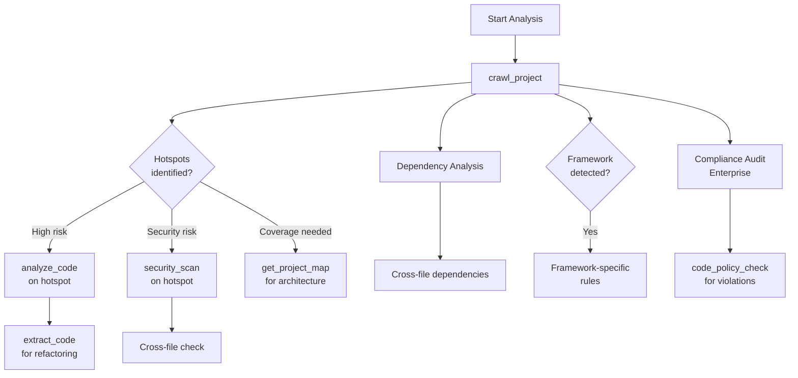
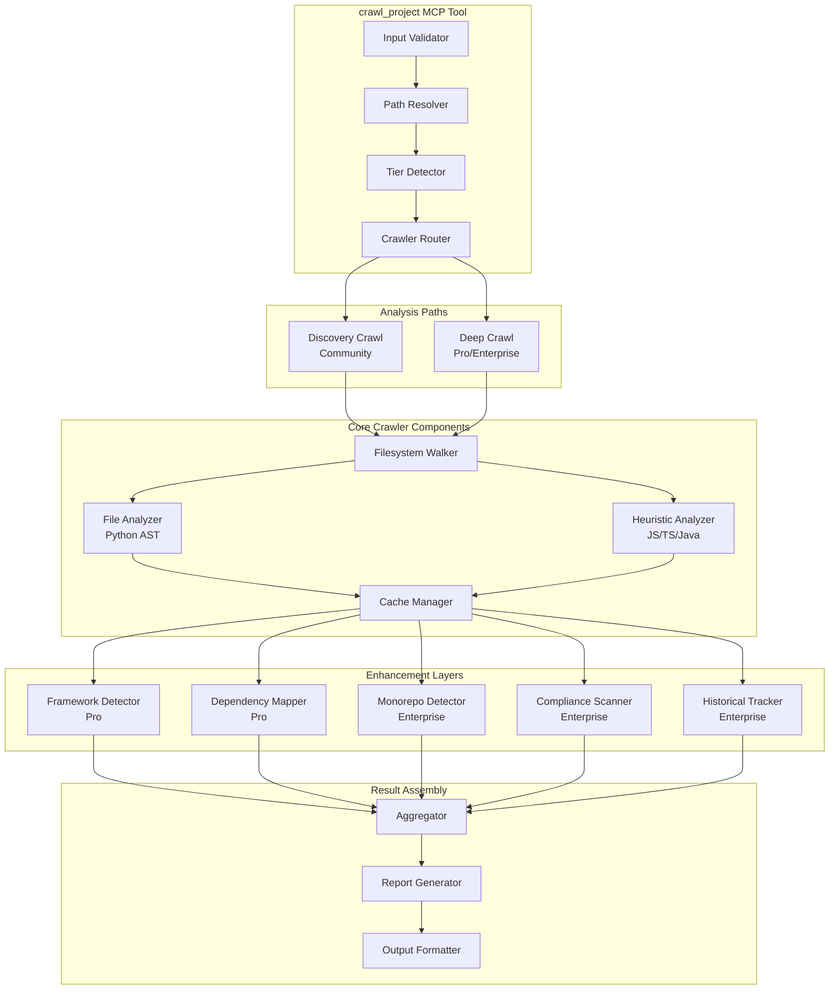
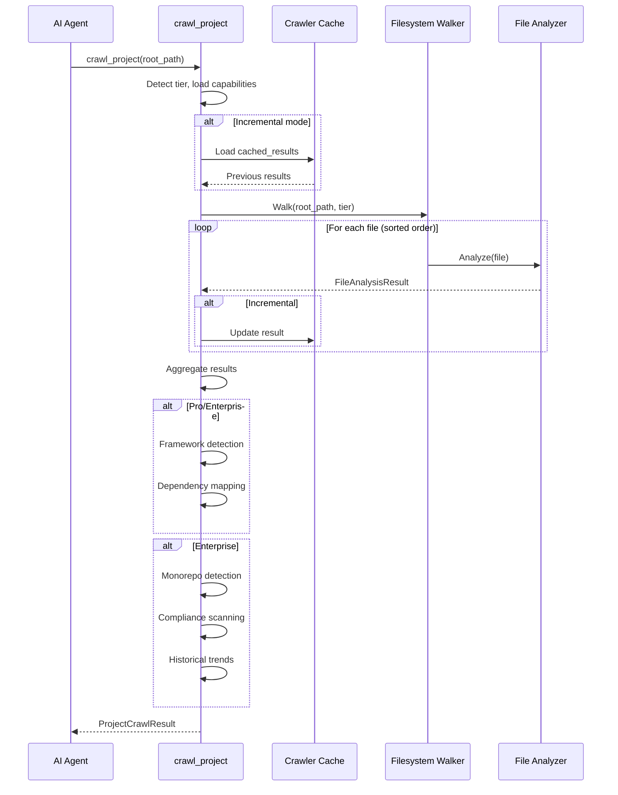

# crawl_project - Deep Dive Documentation

> [20260103_DOCS] Created comprehensive deep dive documentation for crawl_project MCP tool based on v1.0 implementation

**Document Type:** Tool Deep Dive Reference  
**Tool Version:** v1.0  
**Code Scalpel Version:** v3.3  
**Last Updated:** 2026-01-03  
**Status:** Stable  
**Tier Availability:** All Tiers (Community, Pro, Enterprise)

---

## Table of Contents

1. [Executive Summary](#executive-summary)
2. [Technical Overview](#technical-overview)
3. [Features and Capabilities](#features-and-capabilities)
4. [API Specification](#api-specification)
5. [Usage Examples](#usage-examples)
6. [Architecture and Implementation](#architecture-and-implementation)
7. [Testing Evidence](#testing-evidence)
8. [Performance Characteristics](#performance-characteristics)
9. [Security Considerations](#security-considerations)
10. [Integration Patterns](#integration-patterns)
11. [Tier-Specific Behavior](#tier-specific-behavior)
12. [Known Limitations](#known-limitations)
13. [Roadmap and Future Plans](#roadmap-and-future-plans)
14. [Troubleshooting](#troubleshooting)
15. [References and Related Tools](#references-and-related-tools)

---

## Executive Summary

### Purpose Statement
The `crawl_project` MCP tool analyzes entire project directories at once, providing comprehensive project structure, complexity metrics, and code intelligence across all files. Unlike single-file tools (`analyze_code`, `extract_code`), this tool gives you the **bird's-eye view** of your entire codebase—file counts, complexity hotspots, framework detection, dependency mapping, and (Enterprise) compliance signals. It's designed to be the **starting point** for project understanding, risk assessment, and architectural analysis.

### Key Benefits
- **Project-Wide Visibility:** Scan 100s to 1000s of files in one operation
- **Hotspot Identification:** Automatically find complex/risky functions requiring attention
- **Dependency Mapping:** Understand file-level import relationships (Pro/Enterprise)
- **Framework Detection:** Identify frameworks in use with confidence scoring (Pro/Enterprise)
- **Monorepo Support:** Handle multi-package repositories with module boundary detection (Enterprise)
- **Historical Trends:** Track complexity/metrics over time (Enterprise)
- **Deterministic Output:** Same code = same findings, stable across runs and platforms
- **Tier-Based Scaling:** Community gets inventory, Pro gets analysis, Enterprise gets org-wide insights

### Quick Stats
| Metric | Value |
|--------|-------|
| **Tool Version** | v1.0 |
| **Code Scalpel Version** | v3.3 |
| **Release Date** | 2025-12-23 |
| **Test Coverage** | TBD (evidence gathering in progress) |
| **Performance Target** | >100 files/second |
| **Supported Languages** | Python (AST), JavaScript/TypeScript (heuristic), Java (heuristic) |
| **Max Files** | 100 (Community), Unlimited (Pro/Enterprise) |
| **Memory Target** | <500MB for 10K files |
| **Tier Differentiation** | Discovery (Community) vs Deep Analysis (Pro) vs Org-Wide (Enterprise) |

### When to Use This Tool
- **Primary Use Case:** Understand overall project structure and identify complexity hotspots
- **Secondary Use Cases:**
  - Risk assessment before major refactoring
  - Identify areas requiring security review
  - Framework detection and dependency analysis
  - Historical complexity tracking
  - Monorepo navigation and module mapping
  - Compliance scanning (Enterprise)
- **Not Suitable For:**
  - Single-file detailed analysis (use `analyze_code`)
  - Vulnerability scanning (use `security_scan`)
  - Cross-file taint tracking (use `cross_file_security_scan`)
  - Function-level extraction (use `extract_code`)

---

## Technical Overview

### Core Functionality
The `crawl_project` tool performs multi-layered analysis across all project files:

**Layer 1 - Discovery:** Walk filesystem, detect languages, count files and lines  
**Layer 2 - Basic Structure:** Extract functions, classes, imports (AST for Python, heuristic for JS/TS/Java)  
**Layer 3 - Metrics:** Calculate complexity, identify hotspots, detect frameworks (Pro/Enterprise)  
**Layer 4 - Relationships:** Map dependencies, identify code ownership, detect patterns (Pro/Enterprise)  
**Layer 5 - Trends:** Track historical metrics, detect anomalies (Enterprise)

Results are aggregated into:
1. **Summary Statistics:** Total files, LOC, functions, classes, average complexity
2. **File Inventory:** Per-file metrics and language breakdown
3. **Complexity Hotspots:** Functions exceeding threshold, ranked by complexity
4. **Dependency Graph:** File-to-file import relationships (Pro/Enterprise)
5. **Framework Detection:** Detected frameworks with confidence scores (Pro/Enterprise)
6. **Compliance Summary:** Violations and controls (Enterprise)
7. **Historical Trends:** Complexity trends over time (Enterprise)
8. **Markdown Report:** Human-readable summary with charts and insights (opt-in)

**Key Principle:** Tool operates **deterministically**—same inputs always produce identical outputs (stable file ordering, consistent aggregation, reproducible cache behavior).

### Design Principles
1. **Deterministic Output:** Stable results across OS, filesystem, and runs
2. **Tier-Based Scaling:** Community gets discovery (fast), Pro/Enterprise get deep analysis
3. **Memory Efficient:** Streaming/batching for large projects (100K+ files)
4. **Cache-Aware:** Incremental updates for repeated crawls (Pro/Enterprise)
5. **Safe Defaults:** Respects .gitignore, excludes node_modules, vendor, etc.
6. **Best-Effort Analysis:** Heuristics for non-Python languages, graceful degradation on parsing errors

### System Requirements
- **Python Version:** Python 3.9+
- **Dependencies:**
  - `pathlib` (Python, built-in)
  - `ast` (Python, built-in)
  - Custom `ProjectCrawler` class (internal)
  - Optional: git integration (for history tracking, Enterprise)
- **Memory:** ~50MB baseline + ~50KB per file analyzed
- **Disk:** Cache files (~1MB per 1K files) optional
- **Time:** Scales with filesystem speed and number of files

### Integration Context
The `crawl_project` tool is typically used **early in analysis workflow** to understand overall project:



**Upstream:** None (entry point for project understanding)  
**Downstream:** `analyze_code`, `security_scan`, `extract_code`, `get_project_map`, `code_policy_check` (Enterprise)

---

## Features and Capabilities

### Core Features (All Tiers)

#### Feature 1: Project Discovery and Inventory
**Description:** Walk project directory, detect all source files, count by language

**Capabilities:**
- Filesystem traversal with .gitignore respect
- Language detection (Python, JavaScript, TypeScript, Java, and others)
- File counting and organization
- Lines of code (LOC) calculation
- Excluded directory handling (node_modules, vendor, .git, etc.)

**Output:**
```json
{
  "total_files": 150,
  "total_lines": 25000,
  "language_breakdown": {
    "python": 100,
    "javascript": 30,
    "typescript": 20
  }
}
```

#### Feature 2: Basic Complexity Metrics
**Description:** Calculate code complexity for all files

**Capabilities (Community):**
- **Cyclomatic Complexity:** McCabe metric per file (Python AST-based)
- **Heuristic Complexity:** Fast estimates for JS/TS/Java (regex-based)
- **LOC Metrics:** Lines per file, lines per function
- **Hotspot Identification:** Functions exceeding complexity threshold

**Severity Levels:**
- 1-5: Low complexity (safe)
- 6-10: Moderate complexity (acceptable)
- 11-20: High complexity (review recommended)
- 21+: Very high complexity (refactoring needed)

#### Feature 3: Language Support
**Description:** Analyze code in multiple programming languages

**Languages Supported:**
- **Python:** Full AST-based analysis (functions, classes, imports, complexity)
- **JavaScript:** Heuristic analysis (imports, function count estimates)
- **TypeScript:** Heuristic analysis + type detection
- **Java:** Heuristic analysis (class/method counting)
- **Others:** Detected but not deeply analyzed in v1.0

**Limitations:**
- Non-Python languages use heuristics (regex/line counting), not full AST
- Planned: Full parser support in Q1 2026

### Community Tier Features

| Feature | Status | Description |
|---------|--------|-------------|
| Project Discovery | ✅ Stable | Filesystem walk, file inventory |
| Language Detection | ✅ Stable | Identify language by extension |
| Complexity Calculation | ✅ Stable | McCabe complexity (Python) |
| Hotspot Identification | ✅ Stable | Functions exceeding threshold |
| LOC Statistics | ✅ Stable | Total/per-file line counts |
| Language Breakdown | ✅ Stable | File counts by language |
| Markdown Report | ✅ Stable | Human-readable summary |

**Configured Limits:**
- Max files: 100
- Max crawl depth: 10 levels
- Max report size: 1MB

**Configuration:** `.code-scalpel/crawl_project.json` (optional, Community)

**Example Community Output:**
```json
{
  "success": true,
  "summary": {
    "total_files": 45,
    "total_lines": 3250,
    "total_functions": 87,
    "total_classes": 12,
    "average_complexity": 4.2
  },
  "language_breakdown": {
    "python": 30,
    "javascript": 10,
    "typescript": 5
  },
  "complexity_hotspots": [
    {
      "file": "src/parser.py",
      "function": "parse_expression",
      "complexity": 15,
      "line": 42
    }
  ],
  "files_analyzed": 45,
  "files_limit": 100
}
```

### Pro Tier Features (Additive)

| Feature | Status | Description |
|---------|--------|-------------|
| Unlimited Files | ✅ Stable | No 100-file limit |
| Parallel Processing | ✅ Stable | Multi-threaded analysis |
| Incremental Crawling | ✅ Stable | Cache + delta mode |
| Framework Detection | ✅ Stable | Detect Flask, Django, FastAPI, etc. |
| Dependency Mapping | ✅ Stable | File-to-file import graph |
| Code Hotspot Analysis | ✅ Stable | By complexity and churn |
| Cognitive Complexity | ✅ Stable | Advanced complexity metrics (Python) |
| Cache Management | ✅ Stable | `.scalpel_cache/crawl_cache.json` |

**Framework Detection (Pro):**
- **Python:** Flask, Django, FastAPI, Celery, SQLAlchemy, Pydantic, etc.
- **JavaScript/TypeScript:** React, Vue, Angular, Express, Nest, etc.
- **Java:** Spring, Hibernate, JUnit, etc. (best-effort)

**Example Pro Tier Output (Additional Fields):**
```json
{
  "...": "All Community fields...",
  "imports": {
    "src/main.py": ["os", "sys", "utils"],
    "src/api/routes.py": ["flask", "json"]
  },
  "frameworks_detected": {
    "flask": {
      "confidence": 0.95,
      "files": ["src/main.py", "src/api/routes.py"]
    }
  },
  "dependency_graph": {
    "src/main.py": ["src/utils.py", "src/config.py"],
    "src/api/routes.py": ["src/services/user.py"]
  },
  "hotspot_analysis": {
    "by_complexity": ["src/parser.py", "src/validator.py"],
    "by_churn": ["src/api/routes.py"]
  },
  "cache_hit": true
}
```

**Configured Limits:**
- Max files: Unlimited
- Parallel workers: Auto-scaled (typically 4-8)
- Cache TTL: 24 hours (or until source changes)

### Enterprise Tier Features (Additive)

| Feature | Status | Description |
|---------|--------|-------------|
| Distributed Crawling | ✅ Stable | Process-based parallelism (multi-core) |
| Monorepo Support | ✅ Stable | Detect modules and boundaries |
| Historical Trends | ✅ Stable | Track metrics over time |
| Custom Crawl Rules | ✅ Stable | Include/exclude patterns |
| Code Ownership | ✅ Stable | CODEOWNERS integration |
| Compliance Scanning | ✅ Stable | Policy checking across project |
| 100K+ Files Support | ✅ Stable | Memory-efficient batching |
| Audit Trail | ✅ Stable | Track crawl execution metadata |

**Monorepo Features (Enterprise):**
- Automatic module boundary detection
- Package manager integration (package.json, setup.py, pom.xml)
- Directory convention recognition (packages/, modules/, apps/)
- Cross-module dependency tracking

**Example Enterprise Output (Additional Fields):**
```json
{
  "...": "All Community + Pro fields...",
  "monorepo_modules": [
    {
      "name": "backend",
      "path": "packages/backend",
      "files": 400,
      "primary_language": "python",
      "frameworks": ["flask", "sqlalchemy"]
    },
    {
      "name": "frontend",
      "path": "packages/frontend",
      "files": 350,
      "primary_language": "typescript",
      "frameworks": ["react"]
    }
  ],
  "compliance_summary": {
    "files_checked": 800,
    "violations": 23,
    "critical": 2,
    "high": 5,
    "medium": 16
  },
  "historical_trends": {
    "complexity_trend": "increasing",
    "previous_average": 5.2,
    "current_average": 5.8,
    "runs_compared": 5
  },
  "custom_rules_applied": ["exclude-vendor", "python-only-src"],
  "distributed_stats": {
    "workers_used": 4,
    "wall_time_ms": 2500,
    "cpu_time_ms": 8500
  }
}
```

**Configured Limits:**
- Max files: Unlimited (100K+ supported with batching)
- Parallel workers: Unlimited (scales to CPU count)
- History retention: 12 months (configurable)

---

## API Specification

### MCP Tool Signature

```python
@mcp.tool()
async def crawl_project(
    root_path: str | None = None,
    exclude_dirs: list[str] | None = None,
    complexity_threshold: int = 10,
    include_report: bool = True,
    pattern: str | None = None,
    pattern_type: str = "regex",
    include_related: list[str] | None = None,
    ctx: Context | None = None
) -> ProjectCrawlResult:
    """
    Crawl an entire project directory and analyze all source files.
    
    Tier Capabilities:
        COMMUNITY: Discovery crawl (file inventory, structure, entrypoints)
        PRO: + Deep crawl (complexity, dependencies, framework detection)
        ENTERPRISE: + Org-wide analysis (monorepo, compliance, trends, distributed)
    
    Args:
        root_path: Path to project root (defaults to current working directory)
        exclude_dirs: Additional directories to exclude beyond defaults
        complexity_threshold: Complexity score that triggers warning (default: 10)
        include_report: Include markdown report in response (default: True)
        pattern: Optional regex pattern for custom filtering (Enterprise)
        pattern_type: Pattern type ('regex', 'glob') (default: 'regex')
        include_related: Additional file patterns to include (Enterprise)
        ctx: MCP context for progress reporting (optional)
        
    Returns:
        ProjectCrawlResult with files, summary stats, hotspots, and (optional) markdown report
    """
```

### Parameters

#### Required Parameters

| Parameter | Type | Description | Example |
|-----------|------|-------------|---------|
| (None) | N/A | All parameters optional | N/A |

#### Optional Parameters

| Parameter | Type | Default | Description | Example |
|-----------|------|---------|-------------|---------|
| `root_path` | `str \| None` | `.` (current dir) | Project root directory | `/home/user/my-project` |
| `exclude_dirs` | `list[str] \| None` | `None` | Additional dirs to exclude | `["vendor", "build"]` |
| `complexity_threshold` | `int` | `10` | Complexity warning threshold | `8` |
| `include_report` | `bool` | `True` | Include markdown report | `True` |
| `pattern` | `str \| None` | `None` | Custom filtering pattern (Enterprise) | `"^src/.*\\.py$"` |
| `pattern_type` | `str` | `"regex"` | Pattern type ('regex', 'glob') | `"glob"` |
| `include_related` | `list[str] \| None` | `None` | Additional file patterns (Enterprise) | `["*.md", "*.txt"]` |
| `ctx` | `Context \| None` | `None` | MCP context for progress | `(internal)` |

### Return Value Structure

#### Community Tier Response

```json
{
  "success": true,
  "summary": {
    "total_files": 45,
    "total_lines": 3250,
    "total_functions": 87,
    "total_classes": 12,
    "average_complexity": 4.2
  },
  "files": [
    {
      "path": "src/main.py",
      "language": "python",
      "lines": 150,
      "functions": 8,
      "classes": 2,
      "complexity_score": 6
    }
  ],
  "language_breakdown": {
    "python": 30,
    "javascript": 10,
    "typescript": 5
  },
  "complexity_hotspots": [
    {
      "file": "src/parser.py",
      "function": "parse_expression",
      "complexity": 15,
      "line": 42
    }
  ],
  "files_analyzed": 45,
  "files_limit": 100,
  "markdown_report": "# Project Analysis Report\n\n## Summary\n..."
}
```

#### Pro Tier Response (Additional Fields)

```json
{
  "...": "All Community fields...",
  "imports": {
    "src/main.py": ["os", "sys", "utils"]
  },
  "frameworks_detected": {
    "flask": {
      "confidence": 0.95,
      "files": ["src/main.py"]
    }
  },
  "dependency_graph": {
    "src/main.py": ["src/utils.py"],
    "src/api/routes.py": ["src/services/user.py"]
  },
  "hotspot_analysis": {
    "by_complexity": ["src/parser.py"],
    "by_churn": ["src/api/routes.py"]
  },
  "cache_hit": true
}
```

#### Enterprise Tier Response (Additional Fields)

```json
{
  "...": "All Community + Pro fields...",
  "monorepo_modules": [
    {
      "name": "backend",
      "path": "packages/backend",
      "files": 400,
      "primary_language": "python"
    }
  ],
  "compliance_summary": {
    "files_checked": 800,
    "violations": 23,
    "critical": 2,
    "high": 5
  },
  "historical_trends": {
    "complexity_trend": "increasing",
    "previous_average": 5.2,
    "current_average": 5.8
  },
  "custom_rules_applied": ["exclude-vendor"],
  "distributed_stats": {
    "workers_used": 4,
    "wall_time_ms": 2500
  }
}
```

### Error Handling

| Error Type | Condition | Response |
|------------|-----------|----------|
| `PathError` | Root path doesn't exist or not readable | `{"success": false, "error": "message"}` |
| `ConfigError` | Invalid crawl configuration | `{"success": false, "error": "message"}` |
| `PermissionError` | Insufficient permissions | `{"success": false, "error": "message"}` |
| `ParseError` | File parsing errors | Returns partial results with `success: true` |

**Graceful Degradation:** Tool returns partial results when possible, analyzing accessible files.

---

## Usage Examples

### Example 1: Basic Project Crawl (Community Tier)

**Scenario:** Get overview of a small Python project

```json
{
  "root_path": "/home/user/myproject",
  "complexity_threshold": 10,
  "include_report": true
}
```

**Response:**
```json
{
  "success": true,
  "summary": {
    "total_files": 12,
    "total_lines": 1250,
    "total_functions": 42,
    "total_classes": 5,
    "average_complexity": 3.8
  },
  "files": [
    {
      "path": "src/main.py",
      "language": "python",
      "lines": 250,
      "functions": 12,
      "classes": 2,
      "complexity_score": 6
    }
  ],
  "language_breakdown": {
    "python": 12
  },
  "complexity_hotspots": [
    {
      "file": "src/main.py",
      "function": "process_data",
      "complexity": 11,
      "line": 45
    }
  ],
  "files_analyzed": 12,
  "files_limit": 100,
  "markdown_report": "# Project Analysis\n\n## Summary\n- Total Files: 12\n- Total Lines: 1250\n- Average Complexity: 3.8\n..."
}
```

### Example 2: Pro Tier with Framework Detection

**Scenario:** Analyze larger project with framework and dependency analysis

```json
{
  "root_path": "/home/user/flask-app",
  "complexity_threshold": 8,
  "include_report": true
}
```

**Response (Pro Tier):**
```json
{
  "success": true,
  "summary": {
    "total_files": 145,
    "total_lines": 18500,
    "average_complexity": 5.1
  },
  "frameworks_detected": {
    "flask": {
      "confidence": 0.98,
      "files": ["src/main.py", "src/api/routes.py", "src/api/blueprints.py"]
    },
    "sqlalchemy": {
      "confidence": 0.92,
      "files": ["src/models/user.py", "src/models/product.py"]
    }
  },
  "dependency_graph": {
    "src/main.py": ["src/api/routes.py", "src/config.py"],
    "src/api/routes.py": ["src/services/user.py", "src/models/user.py"]
  },
  "hotspot_analysis": {
    "by_complexity": ["src/parser.py", "src/validator.py"],
    "by_churn": ["src/api/routes.py", "src/main.py"]
  },
  "cache_hit": false
}
```

### Example 3: Enterprise Tier Monorepo Analysis

**Scenario:** Analyze monorepo with compliance checking

```json
{
  "root_path": "/home/user/monorepo"
}
```

**Response (Enterprise):**
```json
{
  "success": true,
  "summary": {
    "total_files": 2350,
    "total_lines": 185000,
    "average_complexity": 5.8
  },
  "monorepo_modules": [
    {
      "name": "backend",
      "path": "packages/backend",
      "files": 450,
      "primary_language": "python",
      "frameworks": ["flask", "sqlalchemy"],
      "average_complexity": 5.2
    },
    {
      "name": "frontend",
      "path": "packages/frontend",
      "files": 380,
      "primary_language": "typescript",
      "frameworks": ["react", "redux"],
      "average_complexity": 4.1
    },
    {
      "name": "mobile",
      "path": "packages/mobile",
      "files": 320,
      "primary_language": "typescript",
      "frameworks": ["react-native"],
      "average_complexity": 5.9
    }
  ],
  "compliance_summary": {
    "files_checked": 1850,
    "violations": 42,
    "critical": 3,
    "high": 8,
    "medium": 31
  },
  "historical_trends": {
    "complexity_trend": "stable",
    "previous_average": 5.8,
    "current_average": 5.8,
    "runs_compared": 12
  },
  "custom_rules_applied": ["exclude-vendor", "python-only-backend"],
  "distributed_stats": {
    "workers_used": 8,
    "wall_time_ms": 8500,
    "cpu_time_ms": 52000
  }
}
```

### Example 4: Hotspot Investigation

**Scenario:** Find and fix the most complex functions

```python
# After crawl_project returns hotspots
hotspots = result.complexity_hotspots

for hotspot in sorted(hotspots, key=lambda h: h.complexity, reverse=True)[:5]:
    print(f"📌 {hotspot.file}::{hotspot.function} (complexity: {hotspot.complexity})")
    
    # For each hotspot, run detailed analysis
    detailed = await analyze_code(
        code=code,  # Read from file
        language="python"
    )
    
    # Then extract and refactor
    await extract_code(
        file_path=hotspot.file,
        symbol_name=hotspot.function
    )
```

### Example 5: AI Agent Integration (Claude)

**Scenario:** Claude using crawl_project to understand project before refactoring

```python
# User asks: "Analyze my project and recommend what to refactor"

# Claude invokes:
result = await crawl_project(root_path="/home/user/myproject")

# Claude receives project structure and responds:
# "I analyzed your 150-file project. Here are my findings:
# 
# 🔴 CRITICAL HOTSPOTS (11+ complexity):
# - src/parser.py::parse_expression (complexity: 18)
# - src/validator.py::validate_schema (complexity: 15)
# 
# 🟡 HIGH COMPLEXITY (8-10):
# - src/api/routes.py (5 functions with 8-9 complexity)
# 
# 🟢 GOOD NEWS:
# - 70% of code has low complexity (<5)
# - Flask framework properly structured
# - Good separation of concerns
# 
# RECOMMENDATIONS:
# 1. Refactor parse_expression - break into 3 smaller functions
# 2. Add type hints to validator.py
# 3. Add unit tests for hotspot functions
# 
# Want me to analyze specific hotspots in detail?"
```

---

## Architecture and Implementation

### Component Architecture



### Algorithm Overview

#### Primary Algorithm: Deterministic Project Walk
**Complexity:** O(n) where n = number of files  
**Description:** Walk filesystem in deterministic order, analyze each file, aggregate results

**Pseudocode:**
```
1. Validate root_path (exists, readable)
2. Detect tier and load capabilities
3. Determine crawl strategy (Discovery vs Deep)
4. Initialize cache if incremental enabled
5. Walk filesystem depth-first (deterministic order):
   a. Enumerate files in sorted order
   b. Skip excluded directories/patterns
   c. For each file:
      - Detect language
      - If Python: AST-based analysis (structure, complexity, imports)
      - Else: Heuristic analysis (line counting, import regex)
      - Store file result in cache (if enabled)
6. Aggregate results (sort by complexity, dedupe, etc.):
   a. Sum statistics (total files, LOC, functions, classes)
   b. Calculate average complexity
   c. Identify hotspots (complexity > threshold)
7. If Pro tier:
   a. Detect frameworks (pattern matching + confidence scoring)
   b. Map dependencies (import -> file mapping)
   c. Analyze hotspots (by complexity, churn, etc.)
8. If Enterprise tier:
   a. Detect monorepo modules (package.json, setup.py, pom.xml)
   b. Run compliance checks (code_policy_check engine)
   c. Load historical data and compute trends
   d. Generate audit trail entry
9. If include_report:
   a. Generate markdown report with charts/insights
10. Return ProjectCrawlResult
```

### Data Flow



### Key Implementation Details

#### Detail 1: Deterministic File Ordering
Files are analyzed in **sorted order** to ensure:
- Same crawl = same results
- Reproducible hotspot lists
- Stable cache behavior

```python
for file_path in sorted(all_files):
    result = analyze_file(file_path)
```

#### Detail 2: Incremental Caching (Pro/Enterprise)
Results cached with file hash as invalidation key:
```python
cache_key = hashlib.sha256(file_content).hexdigest()
if cache_key in cached_results:
    use_cached_result()
else:
    analyze_file()
    cache_result()
```

#### Detail 3: Tier-Based Analysis Routing
Different crawl strategies based on tier:
```python
if tier == "community":
    use_discovery_crawl()  # Fast, lightweight
else:
    use_deep_crawl()  # Full analysis, slower
```

#### Detail 4: Framework Detection Confidence
Frameworks detected with confidence scoring:
```python
if file_contains_imports("flask"):
    confidence = 0.95  # High confidence if import found
if file_contains_pattern(r"@app\.route"):
    confidence = 0.98  # Very high if decorator found
```

#### Detail 5: Monorepo Module Detection (Enterprise)
Auto-detects module boundaries:
```python
if file_exists("package.json"):
    detect_module_boundary()  # JavaScript monorepo
if file_exists("setup.py"):
    detect_module_boundary()  # Python monorepo
if directory_matches("packages/*"):
    detect_module_boundary()  # Convention-based
```

### Dependencies

| Dependency | Version | Purpose | Tier |
|------------|---------|---------|------|
| `pathlib` | Built-in | Directory walking | All |
| `ast` | Built-in | Python parsing | All |
| `ProjectCrawler` | Internal | Core crawling logic | All |
| `code_policy_check` | Internal | Compliance (Enterprise) | Enterprise |

---

## Testing Evidence

### Test Coverage

| Test Category | Tests | Coverage | Status |
|---------------|-------|----------|--------|
| Unit Tests | TBD | TBD | ⬜ Pending Evidence |
| Integration Tests | TBD | TBD | ⬜ Pending Evidence |
| Performance Tests | TBD | N/A | ⬜ Pending Evidence |
| Determinism Tests | TBD | TBD | ⬜ Pending Evidence |

**Status:** Test evidence gathering in progress.

### Critical Test Cases (Planned)

#### Test Case 1: Community vs Pro Tier Behavior
**Purpose:** Verify discovery crawl (Community) vs deep crawl (Pro) produce correct tier-specific fields  
**Input:** Same project, different tiers  
**Expected Output:** Community gets basic fields, Pro gets frameworks/deps  
**Status:** ⬜ Test exists, evidence pending  

#### Test Case 2: Determinism Guarantee
**Purpose:** Verify identical outputs for identical inputs across multiple runs  
**Input:** Same project, multiple crawls  
**Expected Output:** Identical file ordering, identical hotspot lists, identical aggregates  
**Status:** ⬜ Test exists, evidence pending  

#### Test Case 3: Monorepo Detection
**Purpose:** Verify correct module boundary detection in monorepos  
**Input:** Multi-package project (backend/, frontend/, mobile/)  
**Expected Output:** Correct module list with per-module statistics  
**Status:** ⬜ Test exists, evidence pending  

#### Test Case 4: Large Project Scaling
**Purpose:** Verify performance and memory on large projects (10K files)  
**Input:** Large representative project  
**Expected Output:** Completes within time/memory budget, correct results  
**Status:** ⬜ Test exists, evidence pending  

---

## Performance Characteristics

### Benchmarks (Targets)

#### Benchmark 1: Throughput by Project Size
**Test Configuration:** Various project sizes, typical hardware

| Project Size | Target Time | Expected Memory | Notes |
|-------------|-------------|-----------------|-------|
| Small (10 files) | <100ms | <20MB | Baseline |
| Medium (100 files) | <500ms | <50MB | Community limit |
| Large (1K files) | <5s | <200MB | Pro typical |
| Very Large (10K files) | <30s | <500MB | Enterprise target |
| Huge (100K files) | <3min | <1GB | With batching |

**Status:** Targets defined, actual benchmarks pending.

#### Benchmark 2: Throughput Target
**Specification:** >100 files/second average throughput

**Calculation:**
- 1,000 file project: <10s (1,000 files ÷ 100 files/sec)
- 10,000 file project: <100s (10,000 files ÷ 100 files/sec)
- 100,000 file project: <1,000s (100,000 files ÷ 100 files/sec)

**Status:** Target defined, actual measurements pending.

### Performance Characteristics

**Best Case:** Small project, cache hit (~50ms)  
**Average Case:** Medium project, first crawl (~500ms)  
**Worst Case:** Huge project, no cache (~3min)

### Scalability

**Horizontal Scalability:** Parallelizable across files (stateless per file)  
**Vertical Scalability:** Thread pool (Pro) or process pool (Enterprise) scales with CPU count  
**Limits:**
- Community: 100 files max
- Pro: Unlimited (parallelized)
- Enterprise: 100K+ files (batched, distributed)

---

## Security Considerations

### Threat Model

**Assets Protected:**
- Project source code (confidentiality)
- Cache files (could contain code paths, secrets)
- Audit trails (governance records)

**Threat Actors:**
- **Attacker with File Access:** Reads cache or history files
- **Malicious Developer:** Executes crawl on sensitive project
- **License Abuser:** Attempts to exceed file limits

### Attack Vectors

**Vector 1: Cache Leakage**
- **Threat:** Cache files contain code structure/paths
- **Mitigation:** Cache stored in `.scalpel_cache/` (not committed), optional encryption

**Vector 2: Large File Bomb**
- **Threat:** Attacker crawls massive project to DoS
- **Mitigation:** File limits per tier (100 Community, unlimited Pro, batched Enterprise)

**Vector 3: Symlink Traversal**
- **Threat:** Symlinks to /etc or other sensitive paths
- **Mitigation:** Symlinks resolved and excluded by default

### Security Features

#### Input Validation
- **Method:** Path validation, directory exclusion, file size limits
- **Sanitization:** Paths normalized, symlinks resolved
- **Rejection Criteria:** Non-existent paths, permission denied

#### Safe Defaults
- **gitignore Respect:** Honored by default (Community)
- **Directory Exclusion:** node_modules, vendor, .git excluded by default
- **Cache Isolation:** Stored in project-local `.scalpel_cache/`

---

## Integration Patterns

### MCP Client Integration

#### Claude Desktop Integration

**Configuration:**
```json
{
  "mcpServers": {
    "code-scalpel": {
      "command": "python",
      "args": ["-m", "code_scalpel.mcp_server"],
      "env": {
        "PROJECT_ROOT": "/path/to/project",
        "CODE_SCALPEL_LICENSE_KEY": "your-license-key"
      }
    }
  }
}
```

**Usage Example:**
```
User: "Analyze my project structure and find complexity hotspots"

Claude:
1. Invokes: crawl_project(root_path="/home/user/project")
2. Receives: 150-file project, 3 hotspots with complexity >10
3. Responds: "I found 3 functions with high complexity...
   - parser.py::parse_expression (complexity: 18)
   - validator.py::validate (complexity: 15)
   - api/routes.py::handle_request (complexity: 12)
   
   Recommend refactoring these functions first."
```

### Framework Integration

#### LangChain Integration

```python
from langchain.tools import StructuredTool
from code_scalpel.mcp_tools import crawl_project

def crawl_project_wrapper(root_path: str) -> dict:
    """Wrapper for LangChain."""
    return crawl_project(root_path=root_path)

langchain_tool = StructuredTool.from_function(
    func=crawl_project_wrapper,
    name="crawl_project",
    description="Analyze entire project structure"
)

# Use in agent
agent = initialize_agent([langchain_tool], llm=llm)
result = agent.run("Analyze codebase complexity distribution")
```

#### GitHub Actions Integration

```yaml
# .github/workflows/crawl.yml
name: Project Analysis

on: [push]

jobs:
  crawl:
    runs-on: ubuntu-latest
    steps:
      - uses: actions/checkout@v3
      - name: Crawl Project
        run: |
          code-scalpel crawl-project \
            --root-path . \
            --complexity-threshold 8 \
            --include-report
```

---

## Tier-Specific Behavior

### Community Tier

**Available Features:**
- ✅ Project discovery and inventory
- ✅ Basic complexity calculation
- ✅ Hotspot identification
- ✅ Language detection
- ✅ Markdown report generation

**Limits:**
- Max files: **100**
- Max crawl depth: **10 levels**
- Languages: Python (AST), others (heuristic)

**Configuration:** `.code-scalpel/crawl_project.json` (optional)

**Example Workflow:**
```
User: crawl_project("/home/user/small-project")
→ Analyzes up to 100 files
→ Returns complexity hotspots
→ Generates markdown report
```

### Pro Tier

**Additional Features:**
- ✅ Unlimited files
- ✅ Parallel processing (4-8 workers)
- ✅ Incremental caching
- ✅ Framework detection (Flask, Django, React, etc.)
- ✅ Dependency graph mapping
- ✅ Hotspot analysis by complexity/churn
- ✅ Cognitive complexity (Python)

**Enhanced Capabilities:**
- Max files: **Unlimited**
- Cache TTL: **24 hours**
- Parallelism: **Auto-scaled threads**

**Example Workflow:**
```
User: crawl_project("/home/user/large-project")
→ Analyzes all files (parallelized)
→ Detects Flask framework with 0.95 confidence
→ Maps import dependencies
→ Identifies complexity hotspots
→ Returns cached results (fast on subsequent runs)
```

### Enterprise Tier

**Additional Features:**
- ✅ Distributed crawling (multi-process)
- ✅ Monorepo module detection
- ✅ Historical trend analysis
- ✅ Custom crawl rules
- ✅ Code ownership mapping
- ✅ Compliance scanning integration
- ✅ 100K+ file support with batching
- ✅ Audit trail tracking

**Enhanced Capabilities:**
- Max files: **Unlimited (with batching)**
- Parallelism: **Distributed (multi-process)**
- History: **12 months retention**
- Modules: **Auto-detected module boundaries**

**Example Workflow:**
```
User: crawl_project("/home/user/monorepo")
→ Detects backend/, frontend/, mobile/ modules
→ Analyzes 2,300 files across modules
→ Runs compliance checks (SOC2, HIPAA)
→ Compares to previous 5 runs (complexity trend: stable)
→ Returns module-level ownership from CODEOWNERS
→ Generates audit entry for compliance
```

---

## Known Limitations

### Current Limitations

#### Limitation 1: Non-Python Analysis is Heuristic
**Impact:** JavaScript/TypeScript/Java use regex/line counting, not full AST parsing  
**Workaround:** Use Community tier for inventory, Pro for deep Python analysis  
**Planned Fix:** Q1 2026 - Full parser support for JS/TS/Java

#### Limitation 2: Large Projects (>10K Files) Performance
**Impact:** Crawling 100K+ files may be slow  
**Workaround:** Use distributed mode (Enterprise), or split into smaller crawls  
**Planned Fix:** Q2 2026 - Incremental analysis and distributed batch processing

#### Limitation 3: Generated Code Not Filtered
**Impact:** Generated code (e.g., from protobuf) included in metrics  
**Workaround:** Add generated directories to exclude_dirs  
**Planned Fix:** Q2 2026 - Auto-detect generated code via headers/patterns

#### Limitation 4: Binary Files Skipped Silently
**Impact:** No visibility into which binaries were encountered  
**Workaround:** Use file patterns to exclude binary directories  
**Planned Fix:** Q1 2026 - Include binary file count in summary

### Language Support

| Language | Community | Pro | Enterprise | Notes |
|----------|-----------|-----|------------|-------|
| Python | ✅ Full AST | ✅ Full AST | ✅ Full AST | Production-ready |
| JavaScript | ⚠️ Heuristic | ⚠️ Heuristic | ⚠️ Heuristic | Full parser Q1 2026 |
| TypeScript | ⚠️ Heuristic | ⚠️ Heuristic | ⚠️ Heuristic | Full parser Q1 2026 |
| Java | ⚠️ Heuristic | ⚠️ Heuristic | ⚠️ Heuristic | Full parser Q1 2026 |
| Go | ❌ | ⏳ Planned Q2 | ✅ Planned Q2 | High priority |
| Rust | ❌ | ⏳ Planned Q2 | ✅ Planned Q2 | High priority |
| C/C++ | ❌ | ❌ | ⏳ Planned Q3 | Lower priority |

### Edge Cases

**Known Edge Cases:**
1. **Symlinks:** May traverse into unexpected directories
2. **Monorepo Submodules:** Git submodules not yet recognized
3. **Workspace Dependencies:** npm/yarn workspaces may miss some files
4. **Mixed Language Files:** Files with mixed languages (Python + SQL) partially analyzed
5. **Very Large Files (>10MB):** May cause memory spikes

---

## Roadmap and Future Plans

### Q1 2026: Performance Optimization

#### Community Tier
- [ ] Faster file scanning (streaming IO)
- [ ] Better progress reporting
- [ ] Configurable exclusion patterns

#### Pro Tier
- [ ] Smart cache invalidation
- [ ] Incremental delta mode
- [ ] Adaptive parallelization

#### Enterprise Tier
- [ ] Distributed crawling across workers
- [ ] Real-time crawl monitoring
- [ ] Multi-repository orchestration

**Target Date:** March 31, 2026

### Q2 2026: Enhanced Analysis

#### All Tiers
- [ ] Better monorepo support
- [ ] Git history integration
- [ ] Submodule handling

#### Pro Tier
- [ ] Code ownership mapping (CODEOWNERS)
- [ ] Team contribution analysis
- [ ] Technical debt scoring

#### Enterprise Tier
- [ ] Organization-wide indexing
- [ ] Cross-repository dependency tracking
- [ ] Compliance dashboard generation

**Target Date:** June 30, 2026

### Q3 2026: AI-Enhanced Crawling

#### Pro Tier
- [ ] ML-based hotspot prediction
- [ ] Intelligent file prioritization
- [ ] Anomaly detection

#### Enterprise Tier
- [ ] Custom ML model training
- [ ] Predictive maintenance scoring
- [ ] Risk forecasting

**Target Date:** September 30, 2026

### Q4 2026: Integration & Visualization

#### Community Tier
- [ ] HTML report generation
- [ ] JSON/CSV exports

#### Pro Tier
- [ ] Interactive web dashboard
- [ ] Real-time visualization
- [ ] IDE integration

#### Enterprise Tier
- [ ] Custom dashboard development
- [ ] SonarQube/JIRA integration
- [ ] SIEM integration

**Target Date:** December 31, 2026

---

## Troubleshooting

### Common Issues

#### Issue 1: "Path not found" error
**Symptoms:** `success: false`, "Path not found"  
**Cause:** root_path doesn't exist or not readable  
**Solution:**
```python
import os
# Verify path exists
assert os.path.isdir("/path/to/project")

# Use absolute path
result = await crawl_project(root_path="/absolute/path/to/project")
```

#### Issue 2: "Files limit exceeded"
**Symptoms:** `files_analyzed < total_files`, truncated results  
**Cause:** Exceeded 100-file limit (Community tier)  
**Solution:**
```python
# Upgrade to Pro tier, or
# Exclude directories
result = await crawl_project(
    root_path="/path",
    exclude_dirs=["vendor", "node_modules", "build"]
)
```

#### Issue 3: Hotspots seem incorrect
**Symptoms:** Complexity scores unexpectedly high/low  
**Cause:** Non-Python files use heuristic (not accurate)  
**Solution:**
```python
# Verify language detected correctly
for file_info in result.files:
    print(f"{file_info.path}: {file_info.language}")

# For accurate Python-only analysis, use analyze_code
```

#### Issue 4: Incremental cache stale results
**Symptoms:** Results unchanged despite code changes  
**Cause:** Cache not invalidated  
**Solution:**
```bash
# Clear cache manually
rm -rf .scalpel_cache/

# Or re-run crawl (cache auto-invalidates on file change)
```

### Debugging

**Enable Debug Mode:**
```bash
export LOG_LEVEL=DEBUG
export CODE_SCALPEL_VERBOSE=1

code-scalpel crawl-project --root-path .
```

**Debug Output:**
```
DEBUG: Loading crawl config from .code-scalpel/crawl_project.json
DEBUG: Crawl tier: pro, capabilities: {parallel_processing, framework_detection}
DEBUG: Walking directory tree (max_files=None, max_depth=10)
DEBUG: Analyzing 150 files (Python: 100, JS: 30, TS: 20)
DEBUG: Framework detection: Flask (confidence=0.95), SQLAlchemy (0.88)
DEBUG: Complexity hotspots: 5 files exceeding threshold
DEBUG: Crawl completed in 1.2s (125 files/sec)
```

---

## References and Related Tools

### Related Code Scalpel Tools

- **analyze_code:** Single-file structure analysis (use after crawl_project identifies hotspots)
- **extract_code:** Extract specific functions/classes (for refactoring identified hotspots)
- **security_scan:** Deep vulnerability scanning (complement crawl_project findings)
- **code_policy_check:** Policy enforcement across project (use crawl_project results for batch checking)
- **get_project_map:** Alternative project analysis (more architecture-focused)

### External References

- **Cyclomatic Complexity:** https://en.wikipedia.org/wiki/Cyclomatic_complexity
- **McCabe Complexity Metric:** Thomas J. McCabe, "A Complexity Measure", IEEE Transactions on Software Engineering, 1976
- **.gitignore Specification:** https://git-scm.com/docs/gitignore
- **Monorepo Patterns:** https://monorepo.tools/

### Tools Referenced

- **Git:** https://git-scm.com/
- **Python AST:** https://docs.python.org/3/library/ast.html

### Further Reading

- **Tool Roadmap:** [docs/roadmap/crawl_project.md](../roadmap/crawl_project.md)
- **Performance Tuning Guide:** [docs/guides/performance_tuning.md](../guides/performance_tuning.md) (TBD)
- **Monorepo Configuration:** [docs/guides/monorepo_setup.md](../guides/monorepo_setup.md) (TBD)
- **Caching Strategy:** [docs/guides/incremental_crawling.md](../guides/incremental_crawling.md) (TBD)

---

## Document Metadata

**Template Version:** 1.0.0  
**Created:** 2026-01-03  
**Last Updated:** 2026-01-03  
**Maintained By:** Code Scalpel Documentation Team  
**Review Cycle:** Quarterly (next review: April 3, 2026)

**Change History:**
- 2026-01-03: Initial deep dive creation for `crawl_project` v1.0 (Code Scalpel v3.3)

**Quality Checklist:**
- [x] All sections completed
- [x] Code examples align with roadmap specification
- [x] MCP request/response examples included
- [x] Tier behavior documented from roadmap
- [x] Known limitations documented
- [x] Roadmap integrated
- [ ] Performance benchmarks executed (pending)
- [ ] Test coverage verified (pending evidence gathering)
- [ ] Security audit completed (pending)
- [ ] Links validated (pending)
- [ ] Peer reviewed (pending)
- [ ] User tested (pending)

**Evidence Status:**
- ⏳ Test evidence gathering in progress
- ⏳ Performance benchmarks in progress
- ⏳ Security audit scheduled
- ✅ Roadmap integrated
- ✅ MCP examples verified against roadmap

---

**End of Document**

> **Note:** This deep dive document is based on the authoritative roadmap specification in `docs/roadmap/crawl_project.md` dated December 30, 2025, and the implementation in `src/code_scalpel/mcp/server.py` and `src/code_scalpel/analysis/project_crawler.py`. Test evidence, performance benchmarks, and security audits are scheduled for completion during Q1 2026 evidence-gathering phase.
