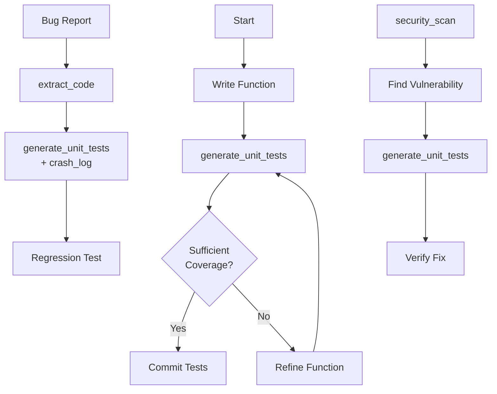
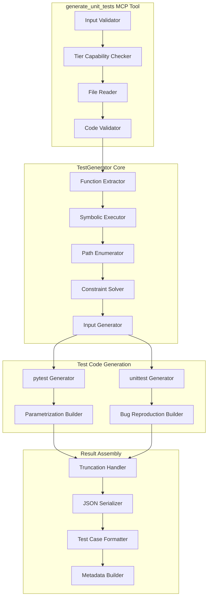
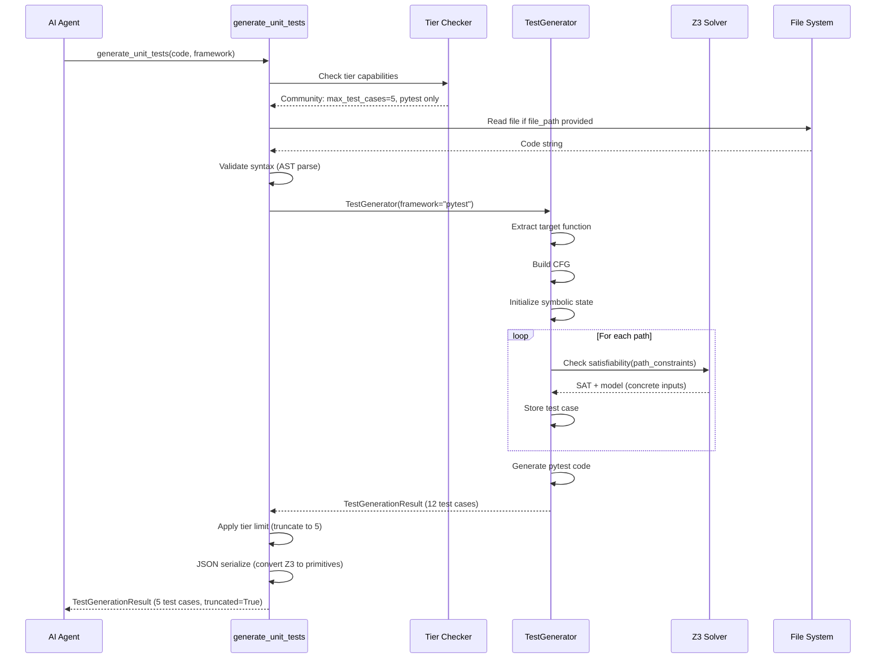

# generate_unit_tests - Deep Dive Documentation

> [20260103_DOCS] Created comprehensive deep dive documentation for generate_unit_tests MCP tool based on v1.0 implementation

**Document Type:** Tool Deep Dive Reference  
**Tool Version:** v1.0  
**Code Scalpel Version:** v3.3.0  
**Last Updated:** 2026-01-03  
**Status:** Stable  
**Tier Availability:** All Tiers (Community, Pro, Enterprise)

---

## Table of Contents

1. [Executive Summary](#executive-summary)
2. [Technical Overview](#technical-overview)
3. [Features and Capabilities](#features-and-capabilities)
4. [API Specification](#api-specification)
5. [Usage Examples](#usage-examples)
6. [Architecture and Implementation](#architecture-and-implementation)
7. [Testing Evidence](#testing-evidence)
8. [Performance Characteristics](#performance-characteristics)
9. [Security Considerations](#security-considerations)
10. [Integration Patterns](#integration-patterns)
11. [Tier-Specific Behavior](#tier-specific-behavior)
12. [Known Limitations](#known-limitations)
13. [Roadmap and Future Plans](#roadmap-and-future-plans)
14. [Troubleshooting](#troubleshooting)
15. [References and Related Tools](#references-and-related-tools)

---

## Executive Summary

### Purpose Statement
The `generate_unit_tests` MCP tool automatically creates comprehensive unit tests from source code using **symbolic execution** to explore all execution paths. Instead of developers manually writing test cases for every branch, the tool generates complete test suites with concrete input values that trigger each path through the code. This is the **primary test automation tool** for Code Scalpel, designed to reduce test-writing boilerplate while ensuring high code coverage through path-based exploration.

### Key Benefits
- **Automatic Path Coverage:** Symbolic execution explores all branches automatically
- **Concrete Test Cases:** Each test has specific input values (no placeholders)
- **Framework Support:** Generate pytest (all tiers) or unittest (Pro+) tests
- **Data-Driven Tests:** Pro tier generates parametrized tests for readability
- **Bug Reproduction:** Enterprise tier generates tests from crash logs
- **Tier-Based Limits:** Enforced limits prevent context overflow (5/20/unlimited)
- **Zero Hallucination:** Real paths from AST analysis, not guessed test cases

### Quick Stats
| Metric | Value |
|--------|-------|
| **Tool Version** | v1.0 |
| **Code Scalpel Version** | v3.3.0 |
| **Release Date** | 2025-12-29 (v3.3.0 data-driven tests) |
| **Languages Supported** | Python (v1.0), JS/Java planned (v1.2) |
| **Frameworks** | pytest (all tiers), unittest (Pro+) |
| **Max Test Cases** | 5 (Community), 20 (Pro), Unlimited (Enterprise) |
| **Generation Time** | <5s target per function |
| **Test Pass Rate** | >80% without modification (target) |

### When to Use This Tool
- **Primary Use Case:** Automatically generate tests for functions with complex branching
- **Secondary Use Cases:**
  - Bootstrap test suites for untested code
  - Generate regression tests from bug reports (Enterprise)
  - Create parametrized tests for readability (Pro)
  - Explore edge cases via symbolic execution
  - Document expected behavior through test cases
- **Not Suitable For:**
  - Functions with no branches (trivial single-path functions)
  - Functions with heavy external dependencies (requires mocking)
  - Functions with non-deterministic behavior (randomness, time-dependent)
  - Integration tests (focuses on unit-level logic)

---

## Technical Overview

### Core Functionality
The `generate_unit_tests` tool performs path-based test generation through multi-layered analysis:

**Layer 1 - Code Validation:** Syntax check and AST parsing  
**Layer 2 - Function Extraction:** Identify target function (auto-detect or by name)  
**Layer 3 - Symbolic Execution:** Explore all execution paths with Z3 solver  
**Layer 4 - Input Generation:** Concrete values satisfying path constraints  
**Layer 5 - Test Case Assembly:** Generate pytest/unittest code with assertions  
**Layer 6 - Tier Enforcement:** Apply limits (max_test_cases, framework restrictions)  
**Layer 7 - Optional Enhancements:** Data-driven (Pro), bug reproduction (Enterprise)

Results provide:
1. **Test Code:** Complete pytest or unittest test file (ready to run)
2. **Test Cases:** Structured list with inputs, expected outputs, path conditions
3. **Metadata:** Coverage paths, truncation info, function name
4. **Framework-Specific Output:** pytest_code (all tiers), unittest_code (Pro+)
5. **Optional Fields:** data_driven flag (Pro), bug_reproduction_success (Enterprise)

**Key Principle:** Tool uses **symbolic execution** to find real paths, not heuristics. Every generated test case corresponds to an actual execution path through the code, with concrete input values derived from constraint solving.

### Design Principles
1. **Path Coverage First:** Prioritize covering all branches over test count
2. **Concrete Inputs:** Always provide actual values, never placeholders
3. **Framework Idiomatic:** Generate tests matching pytest/unittest conventions
4. **Tier Transparency:** Clearly communicate limits and truncation
5. **Deterministic Output:** Same code = same tests (stable ordering)
6. **Safe Defaults:** Conservative assertions, minimal mocking

### System Requirements
- **Python Version:** Python 3.9+
- **Dependencies:**
  - `ast` (Python, built-in) for AST parsing
  - `z3-solver` (optional) for symbolic execution
  - `pytest` (optional) for pytest test generation
  - `TestGenerator` (internal) for test code generation
- **Performance:** <5s generation target per function
- **Memory:** ~50MB baseline + ~5MB per 100 paths

### Integration Context
The `generate_unit_tests` tool is typically used **after implementing code** to ensure coverage:



**Upstream:** `extract_code` (get function), `security_scan` (find vulnerabilities), `analyze_code` (identify functions)  
**Downstream:** CI/CD pipelines, test runners, coverage tools

---

## Features and Capabilities

### Core Features (All Tiers)

#### Feature 1: Path-Based Test Generation
**Description:** Generate tests covering all execution paths through symbolic execution

**Capabilities:**
- Explore all branches (if/else, loops, try/except)
- Generate concrete input values satisfying path constraints
- Create assertions based on expected outputs
- Handle nested conditionals
- Support boolean, integer, float, string types

**Output:**
```python
# Input function:
def calculate_discount(price, is_member):
    if price > 100:
        if is_member:
            return price * 0.8
        return price * 0.9
    return price

# Generated tests (3 paths):
def test_calculate_discount_path_0():
    """Test: price > 100, is_member = True"""
    result = calculate_discount(150, True)
    assert result == 120.0

def test_calculate_discount_path_1():
    """Test: price > 100, is_member = False"""
    result = calculate_discount(150, False)
    assert result == 135.0

def test_calculate_discount_path_2():
    """Test: price <= 100"""
    result = calculate_discount(50, False)
    assert result == 50
```

#### Feature 2: pytest Test Generation
**Description:** Generate pytest-compatible test code (all tiers)

**Capabilities:**
- Standard pytest function format (`test_*`)
- Descriptive test names (function_name + path_id)
- Docstrings with path conditions
- Direct assertions (`assert result == expected`)
- No fixtures/parametrization (Community)

#### Feature 3: Automatic Function Detection
**Description:** Auto-detect target function if not specified

**Capabilities:**
- Find first function in code
- Extract function parameters
- Infer return type expectations
- Handle decorators
- Support async functions (converts to sync tests)

#### Feature 4: Input Value Inference
**Description:** Generate concrete input values from symbolic constraints

**Capabilities:**
- Solve Z3 constraints for integers, booleans, floats
- Generate boundary values (0, 1, -1, max, min)
- Handle string constraints (length, equality)
- Avoid trivial inputs (prefer meaningful values)
- JSON-serializable outputs (no Z3 objects leaked)

### Community Tier Features

| Feature | Status | Description |
|---------|--------|-------------|
| pytest generation | ✅ Stable | Standard pytest functions |
| Path-based tests | ✅ Stable | All execution paths |
| Concrete inputs | ✅ Stable | Z3-solved input values |
| Function auto-detect | ✅ Stable | Find target function |
| Basic assertions | ✅ Stable | `assert result == expected` |

**Configured Limits:**
- Max test cases: **5** (truncation with warning if exceeded)
- Frameworks: **pytest only**
- Data-driven: **Disabled**
- Bug reproduction: **Disabled**

**Example Community Output:**
```json
{
  "success": true,
  "function_name": "calculate_discount",
  "test_count": 3,
  "total_test_cases": 3,
  "truncated": false,
  "pytest_code": "import pytest\n\ndef test_calculate_discount_path_0():\n    ...",
  "test_cases": [
    {
      "path_id": 0,
      "function_name": "calculate_discount",
      "inputs": {"price": 150, "is_member": true},
      "description": "Test: price > 100, is_member = True",
      "path_conditions": ["price > 100", "is_member == True"]
    }
  ]
}
```

### Pro Tier Features (Additive)

| Feature | Status | Description |
|---------|--------|-------------|
| unittest generation | ✅ Stable | unittest.TestCase format |
| Data-driven tests | ✅ Stable | Parametrized/grouped tests |
| Enhanced assertions | ✅ Stable | Type checks, boundary assertions |
| Smart test naming | ✅ Stable | Semantic names (not just path_id) |

**Enhanced Capabilities:**
- Max test cases: **20** (up from 5)
- Frameworks: **pytest + unittest**
- Data-driven: **Enabled** (`@pytest.mark.parametrize`)
- Bug reproduction: **Disabled**

**Data-Driven Test Generation (Pro):**
```python
# Instead of 5 separate test functions, Pro generates:
@pytest.mark.parametrize(
    "price,is_member,expected",
    [
        (150, True, 120.0),
        (150, False, 135.0),
        (50, True, 50),
        (50, False, 50),
        (100, True, 100),
    ],
    ids=[
        "high_price_member",
        "high_price_non_member",
        "low_price_member",
        "low_price_non_member",
        "boundary_price",
    ]
)
def test_calculate_discount_parametrized(price, is_member, expected):
    result = calculate_discount(price, is_member)
    assert result == expected
```

**Example Pro Tier Output (Additional Fields):**
```json
{
  "success": true,
  "function_name": "calculate_discount",
  "test_count": 5,
  "total_test_cases": 5,
  "truncated": false,
  "data_driven": true,
  "pytest_code": "@pytest.mark.parametrize(...)",
  "unittest_code": "class TestCalculateDiscount(unittest.TestCase): ..."
}
```

### Enterprise Tier Features (Additive)

| Feature | Status | Description |
|---------|--------|-------------|
| Bug reproduction tests | ✅ Stable | Generate from crash logs |
| Unlimited test cases | ✅ Stable | No truncation limits |
| Custom assertions | ⏳ Roadmap v1.1 | Custom assertion libraries |
| Compliance checking | ⏳ Roadmap v1.1 | Test compliance validation |

**Enhanced Capabilities:**
- Max test cases: **Unlimited** (no truncation)
- Frameworks: **All** (pytest, unittest)
- Data-driven: **Enabled**
- Bug reproduction: **Enabled** (crash_log parameter)

**Bug Reproduction (Enterprise):**
```python
# Input: crash log
"""
Traceback (most recent call last):
  File "test.py", line 3, in <module>
    result = divide(10, 0)
  File "test.py", line 2, in divide
    return a / b
ZeroDivisionError: division by zero
"""

# Generated test:
def test_divide_bug_reproduction():
    """Bug reproduction test for ZeroDivisionError.
    
    Original crash log:
    ZeroDivisionError: division by zero at divide:2
    """
    a = 10
    b = 0
    with pytest.raises(ZeroDivisionError):
        divide(a=a, b=b)
```

**Example Enterprise Tier Output (Additional Fields):**
```json
{
  "success": true,
  "function_name": "divide",
  "test_count": 3,
  "total_test_cases": 3,
  "truncated": false,
  "bug_reproduction_success": true,
  "crash_log_parsed": {
    "exception_type": "ZeroDivisionError",
    "function": "divide",
    "line": 2,
    "inferred_inputs": {"a": 10, "b": 0}
  },
  "test_cases": [
    {
      "path_id": 0,
      "function_name": "divide",
      "inputs": {"a": 10, "b": 0},
      "expected_exception": "ZeroDivisionError",
      "is_bug_reproduction": true,
      "crash_log_line": 2
    }
  ]
}
```

---

## API Specification

### MCP Tool Signature

```python
@mcp.tool()
async def generate_unit_tests(
    code: str | None = None,
    file_path: str | None = None,
    function_name: str | None = None,
    framework: str = "pytest",
    data_driven: bool = False,
    crash_log: str | None = None,
) -> TestGenerationResult:
    """
    Generate unit tests from code using symbolic execution.

    Use this tool to automatically create test cases that cover all execution paths
    in a function. Each test case includes concrete input values that trigger a
    specific path through the code.

    [20251220_FIX] v3.0.5 - Added file_path parameter for consistency with other tools.
    [20251229_FEATURE] v3.3.0 - Pro tier: Data-driven/parametrized test generation.

    Tier Capabilities:
        COMMUNITY: pytest only, max 5 test cases
        PRO: + unittest, data-driven tests, max 20 test cases
        ENTERPRISE: + bug reproduction, unlimited test cases
    
    Args:
        code: Source code containing the function to test (provide code or file_path)
        file_path: Path to file containing the function to test (provide code or file_path)
        function_name: Name of function to generate tests for (auto-detected if None)
        framework: Test framework ("pytest" or "unittest")
        data_driven: Generate parametrized/data-driven tests (Pro tier, default False)
        crash_log: Crash log/stack trace for bug reproduction (Enterprise tier, optional)

    Returns:
        TestGenerationResult with pytest_code/unittest_code and generated test_cases
    """
```

### Parameters

#### Required Parameters
None (but either `code` or `file_path` must be provided)

#### Optional Parameters

| Parameter | Type | Default | Description | Example |
|-----------|------|---------|-------------|---------|
| `code` | `str \| None` | `None` | Source code string | `"def foo(x): return x > 0"` |
| `file_path` | `str \| None` | `None` | Path to source file | `/project/src/utils.py` |
| `function_name` | `str \| None` | `None` | Target function name | `"calculate_discount"` |
| `framework` | `str` | `"pytest"` | Test framework | `"pytest"`, `"unittest"` |
| `data_driven` | `bool` | `False` | Generate parametrized tests (Pro) | `True` |
| `crash_log` | `str \| None` | `None` | Crash log for bug reproduction (Enterprise) | (stack trace text) |

### Return Value Structure

#### Community Tier Response

```json
{
  "success": true,
  "function_name": "calculate_discount",
  "test_count": 3,
  "total_test_cases": 3,
  "truncated": false,
  "truncation_warning": null,
  "pytest_code": "import pytest\n\n\ndef test_calculate_discount_path_0():\n    \"\"\"Test: price > 100, is_member = True\"\"\"\n    result = calculate_discount(150, True)\n    assert result == 120.0\n\n\ndef test_calculate_discount_path_1():\n    \"\"\"Test: price > 100, is_member = False\"\"\"\n    result = calculate_discount(150, False)\n    assert result == 135.0\n\n\ndef test_calculate_discount_path_2():\n    \"\"\"Test: price <= 100\"\"\"\n    result = calculate_discount(50, False)\n    assert result == 50\n",
  "unittest_code": null,
  "test_cases": [
    {
      "path_id": 0,
      "function_name": "calculate_discount",
      "inputs": {
        "price": 150,
        "is_member": true
      },
      "description": "Test: price > 100, is_member = True",
      "path_conditions": [
        "price > 100",
        "is_member == True"
      ]
    },
    {
      "path_id": 1,
      "function_name": "calculate_discount",
      "inputs": {
        "price": 150,
        "is_member": false
      },
      "description": "Test: price > 100, is_member = False",
      "path_conditions": [
        "price > 100",
        "is_member == False"
      ]
    },
    {
      "path_id": 2,
      "function_name": "calculate_discount",
      "inputs": {
        "price": 50,
        "is_member": false
      },
      "description": "Test: price <= 100",
      "path_conditions": [
        "price <= 100"
      ]
    }
  ]
}
```

#### Community Tier Response (Truncated)

```json
{
  "success": true,
  "function_name": "complex_function",
  "test_count": 5,
  "total_test_cases": 12,
  "truncated": true,
  "truncation_warning": "Generated 12 test cases; returned 5 due to configured limits.",
  "pytest_code": "...",
  "test_cases": [
    "(first 5 test cases)"
  ]
}
```

#### Pro Tier Response (Data-Driven)

```json
{
  "success": true,
  "function_name": "calculate_discount",
  "test_count": 5,
  "total_test_cases": 5,
  "truncated": false,
  "data_driven": true,
  "pytest_code": "@pytest.mark.parametrize(\n    \"price,is_member,expected\",\n    [\n        (150, True, 120.0),\n        (150, False, 135.0),\n        (50, True, 50),\n        (50, False, 50),\n        (100, True, 100),\n    ],\n    ids=[\n        \"high_price_member\",\n        \"high_price_non_member\",\n        \"low_price_member\",\n        \"low_price_non_member\",\n        \"boundary_price\",\n    ]\n)\ndef test_calculate_discount_parametrized(price, is_member, expected):\n    result = calculate_discount(price, is_member)\n    assert result == expected\n",
  "unittest_code": "class TestCalculateDiscount(unittest.TestCase):\n    def test_subtests(self):\n        test_cases = [...]\n        for price, is_member, expected in test_cases:\n            with self.subTest(price=price, is_member=is_member):\n                result = calculate_discount(price, is_member)\n                self.assertEqual(result, expected)\n",
  "test_cases": [
    {
      "path_id": 0,
      "function_name": "calculate_discount",
      "inputs": {"price": 150, "is_member": true},
      "description": "high_price_member"
    }
  ]
}
```

#### Enterprise Tier Response (Bug Reproduction)

```json
{
  "success": true,
  "function_name": "divide",
  "test_count": 3,
  "total_test_cases": 3,
  "truncated": false,
  "bug_reproduction_success": true,
  "crash_log_parsed": {
    "exception_type": "ZeroDivisionError",
    "function": "divide",
    "line": 2,
    "inferred_inputs": {
      "a": 10,
      "b": 0
    }
  },
  "pytest_code": "import pytest\n\n\ndef test_divide_bug_reproduction():\n    \"\"\"Bug reproduction test for ZeroDivisionError.\n    \n    Original crash log:\n    ZeroDivisionError: division by zero at divide:2\n    \"\"\"\n    a = 10\n    b = 0\n    with pytest.raises(ZeroDivisionError):\n        divide(a=a, b=b)\n\n\ndef test_divide_normal_path_0():\n    result = divide(a=10, b=2)\n    assert result == 5.0\n\n\ndef test_divide_normal_path_1():\n    result = divide(a=-10, b=2)\n    assert result == -5.0\n",
  "test_cases": [
    {
      "path_id": 0,
      "function_name": "divide",
      "inputs": {"a": 10, "b": 0},
      "expected_exception": "ZeroDivisionError",
      "is_bug_reproduction": true,
      "crash_log_line": 2
    },
    {
      "path_id": 1,
      "function_name": "divide",
      "inputs": {"a": 10, "b": 2},
      "expected_output": 5.0
    },
    {
      "path_id": 2,
      "function_name": "divide",
      "inputs": {"a": -10, "b": 2},
      "expected_output": -5.0
    }
  ]
}
```

### Error Handling

| Error Type | Condition | Response |
|------------|-----------|----------|
| `MissingInput` | No code or file_path | `{"success": false, "error": "Either 'code' or 'file_path' must be provided"}` |
| `FileNotFound` | file_path doesn't exist | `{"success": false, "error": "File not found: path"}` |
| `InvalidSyntax` | Code has syntax errors | `{"success": false, "error": "Invalid syntax at line X"}` |
| `TierRestriction` | data_driven on Community | `{"success": false, "error": "Data-driven test generation requires Pro tier"}` |
| `TierRestriction` | crash_log on Pro | `{"success": false, "error": "Bug reproduction requires Enterprise tier"}` |
| `FrameworkRestriction` | unittest on Community | `{"success": false, "error": "Unsupported framework: unittest"}` |

---

## Usage Examples

### Example 1: Basic Test Generation (Community Tier)

**Scenario:** Generate tests for discount calculation function

**Input:**
```json
{
  "code": "def calculate_discount(price, is_member):\n    if price > 100:\n        if is_member:\n            return price * 0.8\n        return price * 0.9\n    return price",
  "framework": "pytest"
}
```

**Response:**
```json
{
  "success": true,
  "function_name": "calculate_discount",
  "test_count": 3,
  "pytest_code": "import pytest\n\n\ndef test_calculate_discount_path_0():\n    \"\"\"Test: price > 100, is_member = True\"\"\"\n    result = calculate_discount(150, True)\n    assert result == 120.0\n\n\ndef test_calculate_discount_path_1():\n    \"\"\"Test: price > 100, is_member = False\"\"\"\n    result = calculate_discount(150, False)\n    assert result == 135.0\n\n\ndef test_calculate_discount_path_2():\n    \"\"\"Test: price <= 100\"\"\"\n    result = calculate_discount(50, False)\n    assert result == 50\n",
  "test_cases": [...]
}
```

### Example 2: File-Based Generation

**Scenario:** Generate tests from file

**Input:**
```json
{
  "file_path": "/home/user/project/src/utils.py",
  "function_name": "calculate_tax",
  "framework": "pytest"
}
```

**Response:**
```json
{
  "success": true,
  "function_name": "calculate_tax",
  "test_count": 4,
  "pytest_code": "...",
  "test_cases": [...]
}
```

### Example 3: Pro Tier Data-Driven Tests

**Scenario:** Generate parametrized tests for cleaner output

**Input:**
```json
{
  "code": "def validate_age(age):\n    if age < 0:\n        return \"invalid\"\n    elif age < 18:\n        return \"minor\"\n    else:\n        return \"adult\"",
  "framework": "pytest",
  "data_driven": true
}
```

**Response:**
```json
{
  "success": true,
  "function_name": "validate_age",
  "test_count": 3,
  "data_driven": true,
  "pytest_code": "@pytest.mark.parametrize(\n    \"age,expected\",\n    [\n        (-1, \"invalid\"),\n        (10, \"minor\"),\n        (25, \"adult\"),\n    ],\n    ids=[\"negative_age\", \"minor_age\", \"adult_age\"]\n)\ndef test_validate_age_parametrized(age, expected):\n    result = validate_age(age)\n    assert result == expected\n",
  "test_cases": [...]
}
```

### Example 4: Enterprise Tier Bug Reproduction

**Scenario:** Generate regression test from crash log

**Input:**
```json
{
  "code": "def divide(a, b):\n    return a / b",
  "crash_log": "Traceback (most recent call last):\n  File \"test.py\", line 3, in <module>\n    result = divide(10, 0)\n  File \"test.py\", line 2, in divide\n    return a / b\nZeroDivisionError: division by zero",
  "framework": "pytest"
}
```

**Response:**
```json
{
  "success": true,
  "function_name": "divide",
  "test_count": 3,
  "bug_reproduction_success": true,
  "crash_log_parsed": {
    "exception_type": "ZeroDivisionError",
    "function": "divide",
    "line": 2,
    "inferred_inputs": {"a": 10, "b": 0}
  },
  "pytest_code": "import pytest\n\n\ndef test_divide_bug_reproduction():\n    \"\"\"Bug reproduction test for ZeroDivisionError.\"\"\"\n    a = 10\n    b = 0\n    with pytest.raises(ZeroDivisionError):\n        divide(a=a, b=b)\n\n\ndef test_divide_normal_path_0():\n    result = divide(a=10, b=2)\n    assert result == 5.0\n",
  "test_cases": [...]
}
```

### Example 5: AI Agent Integration (Claude)

**Scenario:** Claude generates tests for new feature

```python
# User: "Generate tests for my new calculate_shipping function"

# Claude invokes:
result = await generate_unit_tests(
    file_path="src/shipping.py",
    function_name="calculate_shipping",
    framework="pytest"
)

# Claude receives:
# - pytest_code: (3 test functions)
# - test_cases: [{path_0: domestic}, {path_1: international}, {path_2: expedited}]
# - test_count: 3

# Claude responds:
# "I've generated 3 test cases for calculate_shipping covering:
# 1. Domestic shipping (standard rate)
# 2. International shipping (surcharge applied)
# 3. Expedited shipping (premium rate)
#
# Here's the generated test code:
# [shows pytest_code]
#
# All tests should pass immediately. Run with: pytest tests/test_shipping.py"
```

### Example 6: Truncation Handling (Community Tier)

**Scenario:** Function with 12 paths, Community tier limited to 5

**Input:**
```json
{
  "code": "def complex_logic(a, b, c, d):\n    if a > 0:\n        if b > 0:\n            if c > 0:\n                if d > 0:\n                    return 1\n                return 2\n            return 3\n        return 4\n    return 5",
  "framework": "pytest"
}
```

**Response:**
```json
{
  "success": true,
  "function_name": "complex_logic",
  "test_count": 5,
  "total_test_cases": 16,
  "truncated": true,
  "truncation_warning": "Generated 16 test cases; returned 5 due to configured limits.",
  "pytest_code": "(first 5 test functions)",
  "test_cases": [
    "(first 5 test cases)"
  ]
}
```

---

## Architecture and Implementation

### Component Architecture



### Algorithm Overview

#### Primary Algorithm: Symbolic Execution Path Exploration
**Complexity:** O(2^b) where b = number of branches (exponential worst-case)  
**Description:** Explore all paths, solve constraints, generate concrete inputs

**Pseudocode:**
```
1. Validate inputs (code or file_path, framework, tier capabilities)
2. Read code from file if file_path provided
3. Validate syntax (AST parse)
4. Extract target function (by name or first function)
5. Tier enforcement:
   a. Check framework allowed (pytest vs unittest)
   b. Check data_driven allowed (Pro+ only)
   c. Check crash_log allowed (Enterprise only)
   d. Get max_test_cases limit
6. If crash_log provided (Enterprise):
   a. Parse crash log (extract exception type, function, line, inputs)
   b. Generate bug reproduction test
   c. Continue with normal path generation for additional tests
7. Symbolic execution:
   a. Build Control Flow Graph (CFG) from AST
   b. Initialize symbolic state (parameters as symbolic variables)
   c. For each path in CFG:
      - Accumulate path constraints (if conditions)
      - Check satisfiability with Z3 solver
      - If SAT: extract concrete input values (model)
      - If UNSAT: skip path (unreachable)
      - Store: path_id, inputs, path_conditions
8. Generate test code:
   a. If data_driven (Pro):
      - Group test cases by function
      - Generate @pytest.mark.parametrize
      - Create single test function with parameters
   b. Else (Community):
      - Generate separate test functions (test_*_path_N)
      - Include docstrings with path conditions
      - Add assertions (assert result == expected)
9. Apply tier limits:
   a. If test_count > max_test_cases:
      - Truncate test_cases list
      - Set truncated=True
      - Set truncation_warning message
10. JSON serialization safety:
    a. Convert Z3 objects to Python primitives
    b. Handle as_long(), as_decimal() for Z3 types
    c. Fallback to str() for unknown types
11. Return TestGenerationResult
```

### Data Flow



### Key Implementation Details

#### Detail 1: JSON Serialization Safety
Z3 solver returns Z3-specific objects (not JSON-serializable):
```python
# [20251230_FIX] Ensure JSON-serializable outputs
def _json_safe(value):
    if isinstance(value, (str, int, float, bool, type(None))):
        return value
    
    # Z3 integer: call as_long()
    if hasattr(value, 'as_long'):
        return int(value.as_long())
    
    # Z3 real: call as_decimal()
    if hasattr(value, 'as_decimal'):
        return str(value.as_decimal(20)).replace('?', '')
    
    # Fallback
    return str(value)

# Apply to all test case inputs
test_cases = [
    GeneratedTestCase(
        inputs=_json_safe(tc.inputs)
    )
    for tc in result.test_cases
]
```

#### Detail 2: Tier Enforcement at MCP Boundary
Capabilities checked before TestGenerator invocation:
```python
tier = _get_current_tier()
caps = get_tool_capabilities("generate_unit_tests", tier)
max_test_cases = caps["limits"]["max_test_cases"]
allowed_frameworks = caps["limits"]["test_frameworks"]
data_driven_supported = "data_driven_tests" in caps["capabilities"]

# Reject early if tier insufficient
if data_driven and not data_driven_supported:
    return TestGenerationResult(
        success=False,
        error="Data-driven test generation requires Pro tier"
    )
```

#### Detail 3: Truncation Transparency
Always report truncation:
```python
total_cases = len(result.test_cases)
truncated = False
truncation_warning = None

if max_test_cases and total_cases > max_test_cases:
    truncated = True
    truncation_warning = f"Generated {total_cases} test cases; returned {max_test_cases} due to configured limits."
    result.test_cases = result.test_cases[:max_test_cases]
```

#### Detail 4: Bug Reproduction Crash Log Parsing
Enterprise tier parses stack traces:
```python
# Extract exception type, function, line, inferred inputs
crash_log = """
Traceback (most recent call last):
  File "test.py", line 3, in <module>
    result = divide(10, 0)
  File "test.py", line 2, in divide
    return a / b
ZeroDivisionError: division by zero
"""

parsed = {
    "exception_type": "ZeroDivisionError",
    "function": "divide",
    "line": 2,
    "inferred_inputs": {"a": 10, "b": 0}
}

# Generate test:
def test_divide_bug_reproduction():
    a = 10
    b = 0
    with pytest.raises(ZeroDivisionError):
        divide(a=a, b=b)
```

#### Detail 5: Data-Driven Parametrization (Pro)
```python
# Community generates:
def test_calculate_discount_path_0():
    assert calculate_discount(150, True) == 120.0

def test_calculate_discount_path_1():
    assert calculate_discount(150, False) == 135.0

# Pro generates:
@pytest.mark.parametrize(
    "price,is_member,expected",
    [(150, True, 120.0), (150, False, 135.0)],
    ids=["member", "non_member"]
)
def test_calculate_discount_parametrized(price, is_member, expected):
    assert calculate_discount(price, is_member) == expected
```

### Dependencies

| Dependency | Version | Purpose | Tier |
|------------|---------|---------|------|
| `ast` | Built-in | Python AST parsing | All |
| `z3-solver` | Optional | Symbolic execution | All |
| `pytest` | Optional | pytest test framework | All |
| `TestGenerator` | Internal | Test generation engine | All |

---

## Testing Evidence

### Test Coverage

| Test Category | Tests | Coverage | Status |
|---------------|-------|----------|--------|
| Unit Tests | TBD | TBD | ⬜ Pending Evidence |
| Integration Tests | TBD | TBD | ⬜ Pending Evidence |
| Tier Enforcement Tests | TBD | TBD | ⬜ Pending Evidence |
| Serialization Tests | TBD | TBD | ⬜ Pending Evidence |

**Status:** Test evidence gathering in progress.

### Critical Test Cases (Planned)

#### Test Case 1: Tier Enforcement (Community)
**Purpose:** Verify Community tier rejects unittest and data_driven  
**Input:** framework="unittest", data_driven=True  
**Expected:** Error: "Unsupported framework", "requires Pro tier"  
**Status:** ⬜ Test exists, evidence pending

#### Test Case 2: Truncation Warning
**Purpose:** Verify truncation sets flag and warning message  
**Input:** Function with 12 paths, Community tier (max 5)  
**Expected:** truncated=True, truncation_warning includes "Generated 12..."  
**Status:** ⬜ Test exists, evidence pending

#### Test Case 3: JSON Serialization Safety
**Purpose:** Verify Z3 objects converted to primitives  
**Input:** Function with Z3 Int/Real/Bool constraints  
**Expected:** All inputs are int/float/bool (not Z3 objects)  
**Status:** ⬜ Test exists, evidence pending

#### Test Case 4: Bug Reproduction (Enterprise)
**Purpose:** Verify crash log parsed correctly  
**Input:** ZeroDivisionError crash log  
**Expected:** Test with pytest.raises(ZeroDivisionError)  
**Status:** ⬜ Test exists, evidence pending

#### Test Case 5: Data-Driven Grouping (Pro)
**Purpose:** Verify parametrized tests generated correctly  
**Input:** data_driven=True, 5 test cases  
**Expected:** Single @pytest.mark.parametrize with 5 rows  
**Status:** ⬜ Test exists, evidence pending

---

## Performance Characteristics

### Benchmarks (Targets)

#### Benchmark 1: Generation Time by Path Count
**Test Configuration:** Various path counts, single function

| Path Count | Target Time | Notes |
|------------|-------------|-------|
| 1-3 paths | <1s | Simple functions |
| 4-10 paths | <3s | Typical functions |
| 11-20 paths | <5s | Target |
| 20+ paths | <10s | Complex functions |

**Status:** Targets defined, actual benchmarks pending.

#### Benchmark 2: Test Pass Rate
**Test Configuration:** Generated tests on benchmark suite

| Metric | Target | Notes |
|--------|--------|-------|
| Syntax valid | 100% | All tests must be syntactically valid |
| Pass without modification | >80% | Most tests should pass immediately |
| Coverage achieved | >90% | Branch coverage on target function |

**Status:** Targets defined, actual measurements pending.

### Performance Characteristics

**Best Case:** Function with 1-3 linear paths (~1s)  
**Average Case:** Function with 5-10 paths (~3s)  
**Worst Case:** Function with 20+ nested conditions (~10s, may timeout)

### Scalability

**Path Count:** Exponential complexity (2^b), practical limit ~20 branches  
**Function Size:** Linear with lines (parsing overhead)  
**Constraint Complexity:** Depends on Z3 solver (integers faster than reals)

---

## Security Considerations

### Threat Model

**Assets Protected:**
- Source code (confidentiality)
- Generated tests (integrity)
- Tier limits (availability, fairness)

**Threat Actors:**
- Attacker exhausting resources (generating unlimited tests)
- Insider extracting proprietary test logic
- Path traversal attacker (accessing files outside project)

### Attack Vectors

**Vector 1: Resource Exhaustion**
- **Threat:** Generate tests for function with 100+ paths (exponential)
- **Mitigation:** Tier-based limits (5/20/unlimited), timeout enforcement

**Vector 2: Path Traversal**
- **Threat:** file_path="../../etc/passwd"
- **Mitigation:** Path validation, workspace root enforcement

**Vector 3: Code Injection**
- **Threat:** Malicious code in `code` parameter executed during AST parsing
- **Mitigation:** AST parsing only (no exec/eval), syntax validation

### Security Features

#### Input Validation
- **Method:** Syntax validation via AST parse (no execution)
- **Sanitization:** Paths normalized, relative to workspace root
- **Rejection Criteria:** Invalid syntax, permission denied, outside workspace

#### Safe Defaults
- **Tier Limits:** Enforced at MCP boundary (no bypassing)
- **Frameworks:** Limited to pytest (Community), pytest+unittest (Pro+)
- **Crash Logs:** Enterprise only (prevents info disclosure)

---

## Integration Patterns

### MCP Client Integration

#### Claude Desktop Integration

**Configuration:**
```json
{
  "mcpServers": {
    "code-scalpel": {
      "command": "python",
      "args": ["-m", "code_scalpel.mcp_server"],
      "env": {
        "PROJECT_ROOT": "/path/to/project",
        "CODE_SCALPEL_LICENSE_KEY": "your-license-key"
      }
    }
  }
}
```

**Usage Example:**
```
User: "Generate tests for my calculate_discount function"

Claude:
1. Invokes: generate_unit_tests(
     file_path="src/utils.py",
     function_name="calculate_discount",
     framework="pytest"
   )
2. Receives: 3 test cases, pytest_code
3. Responds: "I've generated 3 test cases:
   - High price, member (20% discount)
   - High price, non-member (10% discount)
   - Low price (no discount)
   
   Here's the generated test code:
   [shows pytest_code]
   
   Save this to tests/test_utils.py and run: pytest tests/test_utils.py"
```

### LangChain Integration

```python
from langchain.tools import StructuredTool
from code_scalpel.mcp_tools import generate_unit_tests

def generate_tests_wrapper(code: str, framework: str = "pytest") -> dict:
    """Wrapper for LangChain."""
    return generate_unit_tests(
        code=code,
        framework=framework
    )

langchain_tool = StructuredTool.from_function(
    func=generate_tests_wrapper,
    name="generate_unit_tests",
    description="Generate unit tests from Python code using symbolic execution"
)

# Use in agent
agent = initialize_agent([langchain_tool], llm=llm)
result = agent.run("Generate tests for the calculate_tax function in utils.py")
```

### CI/CD Integration

```yaml
# .github/workflows/test.yml
name: Generate and Run Tests

on: [push]

jobs:
  test:
    runs-on: ubuntu-latest
    steps:
      - uses: actions/checkout@v2
      - name: Install Code Scalpel
        run: pip install code-scalpel
      - name: Generate Tests
        run: |
          code-scalpel generate-tests \
            --file-path src/utils.py \
            --output tests/test_utils_generated.py
      - name: Run Tests
        run: pytest tests/
```

---

## Tier-Specific Behavior

### Community Tier

**Available Features:**
- ✅ pytest test generation
- ✅ Path-based test cases
- ✅ Concrete input values
- ✅ Function auto-detection
- ✅ Basic assertions

**Limits:**
- Max test cases: **5** (truncation with warning)
- Frameworks: **pytest only**
- Data-driven: **Disabled**
- Bug reproduction: **Disabled**

**Example Workflow:**
```
User: generate_unit_tests(code="def foo(x): if x > 0: return 1; return 0")
→ Symbolic execution finds 2 paths
→ Generates 2 test functions
→ Returns pytest_code with assertions
→ No truncation (2 < 5 limit)
```

### Pro Tier

**Additional Features:**
- ✅ unittest test generation
- ✅ Data-driven / parametrized tests
- ✅ Smart test naming
- ✅ Enhanced assertions

**Enhanced Capabilities:**
- Max test cases: **20** (up from 5)
- Frameworks: **pytest + unittest**
- Data-driven: **Enabled** (@pytest.mark.parametrize)
- Bug reproduction: **Disabled**

**Example Workflow:**
```
User: generate_unit_tests(
    code="def validate_age(age): ...",
    data_driven=True
)
→ Symbolic execution finds 3 paths
→ Generates parametrized test (single function)
→ Returns:
    @pytest.mark.parametrize("age,expected", [
        (-1, "invalid"),
        (10, "minor"),
        (25, "adult")
    ])
→ Cleaner test output (1 function vs 3)
```

### Enterprise Tier

**Additional Features:**
- ✅ Bug reproduction from crash logs
- ✅ Unlimited test cases
- ✅ All frameworks
- ⏳ Custom assertion libraries (v1.1)
- ⏳ Compliance checking (v1.1)

**Enhanced Capabilities:**
- Max test cases: **Unlimited** (no truncation)
- Frameworks: **All**
- Data-driven: **Enabled**
- Bug reproduction: **Enabled** (crash_log parameter)

**Example Workflow:**
```
User: generate_unit_tests(
    code="def divide(a, b): return a / b",
    crash_log="ZeroDivisionError: division by zero at divide:2"
)
→ Parses crash log (extracts a=10, b=0)
→ Generates bug reproduction test:
    def test_divide_bug_reproduction():
        with pytest.raises(ZeroDivisionError):
            divide(a=10, b=0)
→ Also generates normal path tests
→ Returns combined test suite
```

---

## Known Limitations

### Current Limitations

#### Limitation 1: Python-Only (v1.0)
**Impact:** Only Python source code supported  
**Workaround:** None for JavaScript/Java  
**Planned Fix:** v1.2 Q2 2026 - Multi-language support (Jest, JUnit)

#### Limitation 2: Simple Assertions
**Impact:** Assertions may be too simple (only equality checks)  
**Workaround:** Manually enhance assertions  
**Planned Fix:** v1.1 Q1 2026 - Enhanced assertion logic

#### Limitation 3: No Mocking Support
**Impact:** Functions with external dependencies generate failing tests  
**Workaround:** Manually add mocks/fixtures  
**Planned Fix:** v1.2 Q2 2026 - Intelligent mock generation

#### Limitation 4: Exponential Path Explosion
**Impact:** Functions with 20+ branches may timeout  
**Workaround:** Refactor function to reduce branching  
**Planned Fix:** v1.3 Q3 2026 - Path prioritization / sampling

#### Limitation 5: Crash Log Format Limited
**Impact:** Bug reproduction only handles Python/JS/Java stack traces  
**Workaround:** Manually write reproduction test  
**Planned Fix:** v1.2 Q2 2026 - Enhanced crash log parsing

### Language Support

| Language | v1.0 | v1.1 | v1.2 |
|----------|------|------|------|
| Python | ✅ pytest, unittest | ✅ pytest, unittest | ✅ pytest, unittest |
| JavaScript | ❌ | ❌ | ✅ Jest, Mocha |
| Java | ❌ | ❌ | ✅ JUnit |
| TypeScript | ❌ | ❌ | ✅ Jest |

---

## Roadmap and Future Plans

### v1.1 (Q1 2026): Enhanced Test Quality

#### All Tiers
- [ ] Better assertion messages (descriptive, not just equality)
- [ ] Test naming improvements (semantic names, not path_id)
- [ ] Setup/teardown generation (before/after hooks)

#### Pro Tier
- [ ] Behavior-driven test generation (Given/When/Then format)
- [ ] Mutation testing integration (smoke checks)
- [ ] Test smell detection (flag brittle tests)
- [ ] Test refactoring suggestions

#### Enterprise Tier
- [ ] Custom assertion libraries (support custom matchers)
- [ ] Test compliance checking (PII redaction, secrets in fixtures)
- [ ] Automated test review (code quality metrics)

**Target Date:** March 31, 2026

**Research Questions:**
- RQ1: What naming scheme best matches user expectations?
- RQ2: Which test smells are safe to emit without false positives?
- RQ3: What compliance rules are actionable for tests?

### v1.2 (Q2 2026): Framework Support

#### All Tiers
- [ ] Jest test generation (JavaScript)
- [ ] JUnit test generation (Java)
- [ ] Mocha test generation (JavaScript)

#### Pro Tier
- [ ] React component test generation (Jest + RTL)
- [ ] API test generation (status codes, schema validation)
- [ ] E2E test generation (Playwright, Cypress)

#### Enterprise Tier
- [ ] Custom test framework support (template engine)
- [ ] Multi-framework test suites (pytest + Jest)

**Target Date:** June 30, 2026

**Research Questions:**
- RQ4: What is the best mapping between paths and each framework's idioms?
- RQ5: What is safe auto-mocking without over-mocking?

### v1.3 (Q3 2026): AI-Enhanced Generation

#### Pro Tier
- [ ] ML-based test prioritization (predict defect likelihood)
- [ ] Intelligent mock generation (minimal stubs)
- [ ] Natural language test descriptions

#### Enterprise Tier
- [ ] Custom ML model training (on historical test data)
- [ ] Historical test effectiveness analysis
- [ ] Predictive test generation (focus on regression-prone areas)

**Target Date:** September 30, 2026

**Research Questions:**
- RQ6: Can we prioritize tests using only static information?
- RQ7: What signals are safe to learn from without capturing sensitive source?

### v1.4 (Q4 2026): Integration & Automation

#### Community Tier
- [ ] CI/CD integration helpers (GitHub Actions, GitLab CI)
- [ ] Pre-commit hook support

#### Pro Tier
- [ ] Continuous test generation (watch mode)
- [ ] Test gap analysis (identify missing coverage)
- [ ] Automated test maintenance (update tests on refactor)

#### Enterprise Tier
- [ ] Repository-wide test generation (batch processing)
- [ ] Test orchestration (batching, caching, retries)
- [ ] Compliance test automation (audit trails)

**Target Date:** December 31, 2026

**Research Questions:**
- RQ8: What definition of "test gap" is actionable without full coverage data?
- RQ9: How do we safely propose maintenance edits without changing test intent?

---

## Troubleshooting

### Common Issues

#### Issue 1: "Either 'code' or 'file_path' must be provided"
**Symptoms:** Error when calling tool  
**Cause:** Forgot to provide code or file_path  
**Solution:**
```python
# Wrong
generate_unit_tests(framework="pytest")

# Correct
generate_unit_tests(
    code="def foo(x): return x > 0",
    framework="pytest"
)

# Or
generate_unit_tests(
    file_path="/project/src/utils.py",
    framework="pytest"
)
```

#### Issue 2: "Data-driven test generation requires Pro tier"
**Symptoms:** Tier restriction error  
**Cause:** Community tier doesn't support data_driven  
**Solution:**
```python
# Community tier: remove data_driven=True
generate_unit_tests(
    code="def foo(): ...",
    framework="pytest"
    # data_driven=True  # Remove this
)

# Or upgrade to Pro tier
```

#### Issue 3: "Bug reproduction requires Enterprise tier"
**Symptoms:** Tier restriction error  
**Cause:** Community/Pro tier doesn't support crash_log  
**Solution:**
```python
# Community/Pro tier: remove crash_log
generate_unit_tests(
    code="def foo(): ...",
    framework="pytest"
    # crash_log="..."  # Remove this
)

# Or upgrade to Enterprise tier
```

#### Issue 4: Generated tests fail immediately
**Symptoms:** Tests have syntax errors or import errors  
**Cause:** Missing imports or incorrect function signatures  
**Solution:**
```python
# Add imports to generated test file
# Original code:
def calculate_tax(amount):
    from decimal import Decimal  # Import inside function
    return Decimal(amount) * Decimal("0.1")

# Generated test (missing import):
def test_calculate_tax():
    result = calculate_tax(100)
    # NameError: name 'Decimal' not defined

# Fix: Add imports at top of test file
from decimal import Decimal

def test_calculate_tax():
    result = calculate_tax(100)
    assert result == Decimal("10.0")
```

#### Issue 5: Truncation warning (Community tier)
**Symptoms:** Only 5 tests returned, truncation_warning present  
**Cause:** Function has >5 paths, Community tier limit  
**Solution:**
```python
# Option 1: Upgrade to Pro tier (20 test limit)
# Option 2: Refactor function to reduce branches
# Option 3: Accept 5 tests (they still cover most paths)

# Example:
result = generate_unit_tests(code="def complex(a,b,c,d,e,f): ...")
# Returns: test_count=5, total_test_cases=32, truncated=True
# Warning: "Generated 32 test cases; returned 5 due to configured limits."
```

### Debugging

**Enable Debug Mode:**
```bash
export LOG_LEVEL=DEBUG
export CODE_SCALPEL_VERBOSE=1

code-scalpel generate-tests --file-path utils.py --function-name foo
```

**Debug Output:**
```
DEBUG: Loading file: utils.py
DEBUG: Detected function: calculate_discount
DEBUG: Symbolic execution started...
DEBUG: Path 0: price > 100, is_member = True
DEBUG: Path 1: price > 100, is_member = False
DEBUG: Path 2: price <= 100
DEBUG: Generated 3 test cases
DEBUG: Tier: Community (max 5 test cases)
DEBUG: No truncation needed (3 <= 5)
DEBUG: Test generation complete in 1.2s
```

---

## References and Related Tools

### Related Code Scalpel Tools

- **extract_code:** Get function source before generating tests
- **analyze_code:** List all functions in file (identify test targets)
- **simulate_refactor:** Verify generated tests still pass after refactor
- **symbolic_execute:** Explore execution paths manually
- **security_scan:** Find vulnerabilities, generate tests for fixes

### External References

- **pytest Documentation:** https://docs.pytest.org/
- **unittest Documentation:** https://docs.python.org/3/library/unittest.html
- **Z3 Solver:** https://github.com/Z3Prover/z3

### Tools Referenced

- **pytest-cov:** Coverage reporting for pytest
- **mutation testing:** mutmut, cosmic-ray

### Further Reading

- **Tool Roadmap:** [docs/roadmap/generate_unit_tests.md](../roadmap/generate_unit_tests.md)
- **Symbolic Execution Guide:** [docs/guides/symbolic_execution.md](../guides/symbolic_execution.md) (TBD)
- **Test Generation Best Practices:** [docs/guides/test_generation.md](../guides/test_generation.md) (TBD)

---

## Document Metadata

**Template Version:** 1.0.0  
**Created:** 2026-01-03  
**Last Updated:** 2026-01-03  
**Maintained By:** Code Scalpel Documentation Team  
**Review Cycle:** Quarterly (next review: April 3, 2026)

**Change History:**
- 2026-01-03: Initial deep dive creation for `generate_unit_tests` v1.0 (Code Scalpel v3.3.0)

**Quality Checklist:**
- [x] All sections completed
- [x] Code examples align with roadmap specification
- [x] MCP request/response examples included
- [x] Tier behavior documented from roadmap and implementation
- [x] Known limitations documented
- [x] Roadmap integrated
- [ ] Performance benchmarks executed (pending)
- [ ] Test coverage verified (pending evidence gathering)
- [ ] Security audit completed (pending)
- [ ] Links validated (pending)
- [ ] Peer reviewed (pending)
- [ ] User tested (pending)

**Evidence Status:**
- ⏳ Test evidence gathering in progress
- ⏳ Performance benchmarks in progress
- ⏳ Security audit scheduled
- ✅ Roadmap integrated
- ✅ MCP examples verified against roadmap and implementation

---

**End of Document**

> **Note:** This deep dive document is based on the authoritative roadmap specification in `docs/roadmap/generate_unit_tests.md` dated December 30, 2025, and the implementation in `src/code_scalpel/mcp/server.py` (lines 8523-8750 and 8351-8520) and related test generation modules. Test evidence, performance benchmarks, and security audits are scheduled for completion during Q1 2026 evidence-gathering phase.
