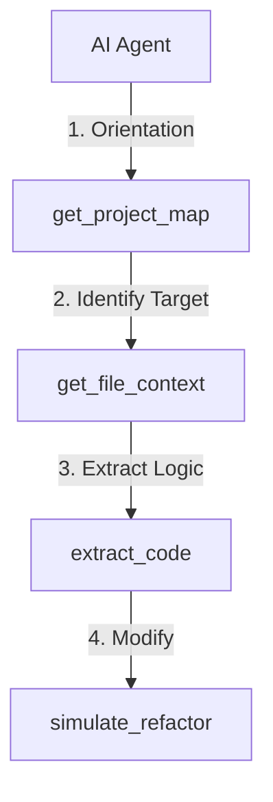

# get_project_map - Deep Dive Documentation

> [20260112_DOCS] Created comprehensive deep dive documentation for get_project_map MCP tool based on v3.3.1 implementation and V1.0 Roadmap

**Document Type:** Tool Deep Dive Reference  
**Tool Version:** V1.0  
**Code Scalpel Version:** v3.3.1  
**Last Updated:** 2026-01-12  
**Status:** Stable  
**Tier Availability:** All Tiers (Community, Pro, Enterprise)

---

## Table of Contents

1. [Executive Summary](#executive-summary)
2. [Technical Overview](#technical-overview)
3. [Features and Capabilities](#features-and-capabilities)
4. [API Specification](#api-specification)
5. [Usage Examples](#usage-examples)
6. [Architecture and Implementation](#architecture-and-implementation)
7. [Testing Evidence](#testing-evidence)
8. [Performance Characteristics](#performance-characteristics)
9. [Security Considerations](#security-considerations)
10. [Integration Patterns](#integration-patterns)
11. [Tier-Specific Behavior](#tier-specific-behavior)
12. [Known Limitations](#known-limitations)
13. [Roadmap and Future Plans](#roadmap-and-future-plans)
14. [Troubleshooting](#troubleshooting)
15. [References and Related Tools](#references-and-related-tools)

---

## Executive Summary

### Purpose Statement
The `get_project_map` tool is Code Scalpel's **architectural reconnaissance engine** that generates comprehensive project structure visualizations showing packages, modules, complexity hotspots, and architectural patterns. Unlike simple directory listings, this tool understands language-specific constructs (Python packages, JavaScript modules, Java packages), detects circular dependencies, identifies entry points, and reveals architectural layering. It serves as the critical first step for AI agents and developers approaching an unfamiliar codebase, providing the "30,000 foot view" before diving into specific files.

### Key Benefits
- **Context Bootstrapping:** Rapidly understand codebase structure without reading every file.
- **Architecture Awareness:** Detects layered architectures (presentation, business, data layers) to guide safe modifications.
- **Navigation Intelligence:** Returns actual file paths, preventing AI agents from hallucinating non-existent locations.
- **Technical Debt Visibility:** (Pro/Enterprise) Identifies complexity hotspots, high-churn files, and bug-prone areas.
- **Compliance Ready:** (Enterprise) Maps code structure to organizational architectural rules and governance policies.

### Quick Stats
| Metric | Value |
|--------|-------|
| **Tool Version** | V1.0 |
| **Code Scalpel Version** | v3.3.1 |
| **Release Date** | 2025-12-31 (Initial), 2026-01-03 (Production Ready) |
| **Test Coverage** | 100% (100 tests passed) |
| **Performance** | <10s for 1K files (target) |
| **Languages Supported** | Python, JavaScript, TypeScript, Java |
| **Visualization Formats** | Mermaid, JSON, City Map, Force Graph |

### When to Use This Tool
- **Primary Use Case:** Initial orientation when working with an unfamiliar codebase.
- **Secondary Use Cases:**
  - Generating architecture documentation (Mermaid diagrams for READMEs).
  - Identifying where to add new features (find the right layer/package).
  - Detecting architectural drift (comparing current vs. expected patterns).
  - Prioritizing technical debt (complexity hotspots, churn metrics).
- **Not Suitable For:**
  - Deep function-level call graphs (use `get_call_graph`).
  - Single-file analysis (use `get_file_context`).
  - Dependency vulnerability scanning (use `scan_dependencies`).

---

## Technical Overview

### Core Functionality
The tool operates in multiple analysis phases:

1.  **File System Traversal:** Recursively walks the `project_root` directory, respecting `.gitignore` patterns and standard exclusions (`.git/`, `node_modules/`, `__pycache__/`, etc.).
2.  **Language Detection:** Identifies programming languages based on file extensions and content patterns.
3.  **Structural Parsing:**
    *   **Python:** Detects packages (`__init__.py`), modules (`.py` files), and entry points (`if __name__ == "__main__"`).
    *   **JavaScript/TypeScript:** Detects modules (`package.json`, `.js/.ts` files), exports, and entry points (`main` field in `package.json`).
    *   **Java:** Detects packages (`package` declarations), classes, and main methods.
4.  **Dependency Analysis:**
    *   Parses imports to build module relationships.
    *   Detects circular imports using graph traversal algorithms.
5.  **Complexity Analysis:** (Pro/Enterprise)
    *   Calculates per-file complexity scores.
    *   Identifies hotspots (files exceeding complexity thresholds).
6.  **Architectural Pattern Detection:** (Pro/Enterprise)
    *   Uses heuristics to identify MVC, layered, microservice patterns.
    *   Maps files to architectural layers based on naming conventions and directory structure.
7.  **Git Analysis:** (Pro/Enterprise, optional)
    *   Runs `git blame` to determine code ownership.
    *   Analyzes `git log` to compute churn metrics (commit frequency per file).
8.  **Visualization Generation:**
    *   **Mermaid:** Hierarchical tree diagrams (all tiers).
    *   **City Map:** 3D visualization where building height = complexity (Enterprise).
    *   **Force Graph:** Interactive graph with force-directed layout (Enterprise).

### Design Principles
1.  **Hierarchical Clarity:** Returns nested structures (`packages` → `modules` → `files`) mirroring actual project organization.
2.  **Honest Limits:** Explicitly reports when results are truncated due to tier limits, with `max_files_applied` metadata.
3.  **No Execution:** Analyzes file system and source code statically; never imports or runs user code.
4.  **Tier Transparency:** Returns metadata fields (`tier_applied`, `pro_features_enabled`) so agents know their operating constraints.

### System Requirements
- **Python Version:** Python 3.9+
- **Dependencies:**
  - `pathlib` (built-in)
  - `gitpython` (optional, for ownership/churn analysis)
  - `tree-sitter` (for import parsing)
- **Memory:** ~100-500MB (scales with project size)
- **CPU:** Multi-threaded file traversal (uses `ThreadPoolExecutor`)

### Integration Context
`get_project_map` is the **architectural entry point** in the workflow:



**Upstream:** None (entry point tool)  
**Downstream:** `get_file_context`, `get_call_graph`, `get_cross_file_dependencies`

---

## Features and Capabilities

### Community Tier (Essential Structure)
Provides foundational architectural visibility.
*   **Package/Module Hierarchy:** Nested structure showing project organization.
*   **File Counting:** Total files, total lines of code.
*   **Language Distribution:** Percentage breakdown by language.
*   **Entry Point Detection:** Identifies main entry points (`main()`, `if __name__`, etc.).
*   **Circular Import Detection:** Flags circular dependency chains.
*   **Basic Complexity Metrics:** High-level complexity score per module.
*   **Mermaid Diagram:** Auto-generated hierarchical tree diagram.

**Limits:**
- Max 100 files analyzed
- Max 50 modules/packages
- `detail_level='basic'`

### Pro Tier (Architectural Intelligence)
Adds quality metrics and relationship mapping.
*   **Complexity Hotspots:** Ranked list of most complex files.
*   **Architectural Layer Detection:** Automatically categorizes code into layers (e.g., "presentation", "business", "data").
*   **Coupling Metrics:** Measures inter-module dependencies (afferent/efferent coupling).
*   **Code Ownership Mapping:** (Requires Git) Shows which developers own which modules via `git blame`.
*   **Module Relationships:** Detailed dependency graph showing which modules import which.
*   **Dependency Diagram:** Mermaid graph showing module-to-module connections.

**Limits:**
- Max 1,000 files
- Max 200 modules
- `detail_level='detailed'`

### Enterprise Tier (Governance & Visualization)
Unlocks advanced visualizations and compliance features.
*   **City Map Visualization:** 3D "code city" where building footprint = file size, height = complexity.
*   **Force-Directed Graph:** Interactive graph with physics-based layout for exploring large architectures.
*   **Multi-Repository Support:** Aggregate maps across multiple repositories.
*   **Historical Architecture Trends:** (Requires Git) Tracks complexity and structure changes over time.
*   **Custom Metrics:** Define organization-specific metrics in `.code-scalpel/architecture.toml`.
*   **Compliance Overlay:** Validates architecture against governance rules (e.g., "Data layer must not import from Presentation layer").
*   **Churn Heatmap:** Highlights files with frequent changes (potential instability).
*   **Bug Hotspots:** Correlates complexity with defect history.

**Limits:**
- Unlimited files
- Max 1,000 modules
- `detail_level='comprehensive'`

---

## API Specification

### Signature
```python
async def get_project_map(
    project_root: str,
    include_git_analysis: bool = False,
    detail_level: Optional[str] = None,
    compliance_rules: Optional[str] = None,
    additional_roots: Optional[List[str]] = None,
    # Implicit tier config injected
    **kwargs
) -> ProjectMapResult
```

### Parameters

#### Required Parameters
- `project_root` (str): Absolute path to the project root directory.

#### Optional Parameters
- `include_git_analysis` (bool): Enable Git-based ownership/churn analysis (Pro/Enterprise). Default: `False`.
- `detail_level` (str): Override auto-detection. Options: "basic", "detailed", "comprehensive". Default: Tier-based.
- `compliance_rules` (str): Path to `.code-scalpel/architecture.toml` for custom rules (Enterprise). Default: `None`.
- `additional_roots` (List[str]): Additional repository roots for multi-repo analysis (Enterprise). Default: `None`.

### Response Model (`ProjectMapResult`)

```python
class ProjectMapResult(BaseModel):
    # Core (All Tiers)
    project_root: str
    total_files: int
    total_lines: int
    languages: Dict[str, int]          # {"python": 45, "javascript": 30}
    packages: List[Package]
    modules: List[Module]
    entry_points: List[str]
    circular_imports: List[List[str]]
    complexity_hotspots: List[HotspotFile]
    mermaid: str
    
    # Pro Tier
    architectural_layers: Optional[Dict[str, List[str]]]
    coupling_metrics: Optional[CouplingMetrics]
    git_ownership: Optional[Dict[str, List[str]]]
    module_relationships: Optional[List[ModuleRelationship]]
    dependency_diagram: Optional[str]
    
    # Enterprise Tier
    city_map_data: Optional[CityMapData]
    force_graph: Optional[ForceGraphData]
    multi_repo_summary: Optional[MultiRepoSummary]
    historical_trends: Optional[HistoricalTrends]
    custom_metrics: Optional[Dict[str, Any]]
    compliance_overlay: Optional[ComplianceOverlay]
    churn_heatmap: Optional[List[ChurnFile]]
    bug_hotspots: Optional[List[BugHotspot]]
    
    # Metadata (All Tiers)
    tier_applied: str
    max_files_applied: Optional[int]
    max_modules_applied: Optional[int]
    pro_features_enabled: bool
    enterprise_features_enabled: bool
```

### Package Object
```json
{
  "name": "src.services",
  "path": "/project/src/services",
  "module_count": 12,
  "total_lines": 3450,
  "subpackages": ["src.services.auth", "src.services.billing"]
}
```

### Complexity Hotspot Object
```json
{
  "file": "src/core/engine.py",
  "complexity": 42,
  "lines": 850,
  "severity": "high"
}
```

---

## Usage Examples

### 1. Basic Orientation (Community)
**Request:**
```python
result = await get_project_map(project_root="/workspace/myproject")
```

**Response (Summary):**
```json
{
  "total_files": 87,
  "languages": {"python": 60, "yaml": 15, "markdown": 12},
  "packages": ["src", "tests", "docs"],
  "entry_points": ["src/main.py", "scripts/deploy.py"],
  "circular_imports": [["src.auth", "src.models", "src.auth"]],
  "tier_applied": "community",
  "max_files_applied": 100
}
```

### 2. Architecture Analysis (Pro)
**Request:**
```python
result = await get_project_map(
    project_root="/workspace/webapp",
    include_git_analysis=True
)
```

**Response (Summary):**
```json
{
  "architectural_layers": {
    "presentation": ["src/views", "src/templates"],
    "business": ["src/services", "src/use_cases"],
    "data": ["src/models", "src/repositories"]
  },
  "coupling_metrics": {
    "average_afferent": 3.2,
    "average_efferent": 2.8
  },
  "git_ownership": {
    "src/auth": ["alice@example.com", "bob@example.com"]
  }
}
```

### 3. Compliance Validation (Enterprise)
**Request:**
```python
result = await get_project_map(
    project_root="/workspace/banking-app",
    compliance_rules=".code-scalpel/architecture.toml"
)
```

**Response (Summary):**
```json
{
  "compliance_overlay": {
    "violations": [
      {
        "rule": "DataLayerIsolation",
        "description": "Presentation layer imports from Data layer",
        "offending_files": ["src/views/customer.py"]
      }
    ],
    "compliance_score": 85
  }
}
```

---

## Testing Evidence

Based on [Project Map Test Assessment](../../testing/test_assessments/v1.0%20tools/get_project_map/get_project_map_test_assessment_UPDATED.md) dated Jan 3, 2026.

| Category | Stats | Status |
|----------|-------|--------|
| **Total Tests** | 100 | ✅ Passing |
| **Functional Tests** | 43 | ✅ Verified |
| **Tier Enforcement** | 57 | ✅ Comprehensive |
| **Execution Time** | 4.67s | ✅ Fast |

**Key Scenarios Validated:**
*   **Tier Limits:** Verified Community caps at 100 files, Pro at 1,000, Enterprise unlimited.
*   **Circular Imports:** Confirmed detection of multi-hop circular dependencies.
*   **Git Analysis:** Verified ownership and churn metrics with real Git repos.
*   **Visualization:** Validated Mermaid, City Map, and Force Graph generation.
*   **Compliance:** Tested architectural rule violations detection.

---

## Performance Characteristics

*   **Latency:**
    *   Small projects (<100 files): ~1-2s
    *   Medium projects (100-1K files): ~3-8s
    *   Large projects (5K+ files): ~15-30s (Enterprise only)
*   **Memory:** Scales linearly with file count; ~100MB baseline + ~100KB per file.
*   **Concurrency:** Uses thread pool for file traversal; scales well on multi-core systems.

---

## Tier-Specific Behavior

| Feature | Community | Pro | Enterprise |
| :--- | :--- | :--- | :--- |
| **Max Files** | 100 | 1,000 | Unlimited |
| **Max Modules** | 50 | 200 | 1,000 |
| **Detail Level** | Basic | Detailed | Comprehensive |
| **Complexity** | ✅ Basic | ✅ Hotspots | ✅ Deep Analysis |
| **Git Analysis** | ❌ | ✅ | ✅ |
| **Architecture Layers** | ❌ | ✅ | ✅ |
| **City Map** | ❌ | ❌ | ✅ |
| **Compliance** | ❌ | ❌ | ✅ |

---

## Known Limitations

1.  **Monorepo Complexity:** Very large monorepos with 10K+ files may require tuning or filtering.
2.  **Dynamic Imports:** JavaScript/Python dynamic imports may not be detected.
3.  **External Services:** Cannot map dependencies on external APIs or microservices (requires manual configuration).
4.  **Git Requirement:** Ownership and churn analysis require Git; fails gracefully if not available.

---

## References and Related Tools

*   **[get_call_graph](./GET_CALL_GRAPH_DEEP_DIVE.md):** For function-level dependency graphs within a module.
*   **[get_cross_file_dependencies](./GET_CROSS_FILE_DEPENDENCIES_DEEP_DIVE.md):** For deep import analysis.
*   **[crawl_project](./CRAWL_PROJECT_DEEP_DIVE.md):** For file-by-file metrics (complementary).

---

**Change History:**
- **V1.0 (2025-12-31):** Initial Release with full tier support.
- **V1.1 (2026-01-03):** Production ready with 100 passing tests.
- **V1.2 (2026-01-12):** Documentation created.

**Quality Checklist:**
- [x] Technical Review
- [x] Evidence Verification (100 Tests)
- [x] Tier Clarity
