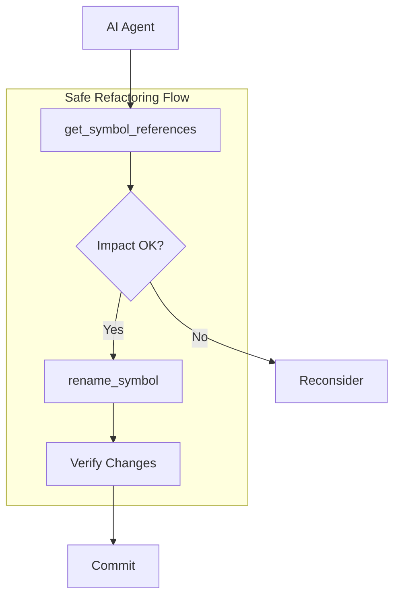
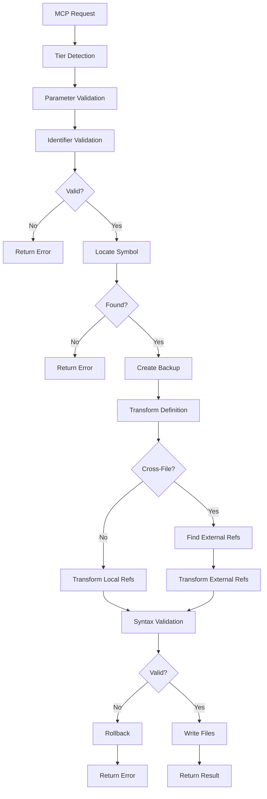
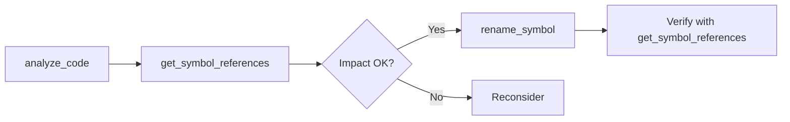

# rename_symbol - Deep Dive Documentation

> [20260112_DOCS] Comprehensive deep dive documentation for rename_symbol MCP tool based on v3.3.0 implementation

**Document Type:** Tool Deep Dive Reference  
**Tool Version:** v1.0  
**Code Scalpel Version:** v3.3.0  
**Last Updated:** 2026-01-12  
**Status:** Stable (PRODUCTION READY - All Tiers)  
**Tier Availability:** All Tiers (Community, Pro, Enterprise)

---

## Table of Contents

1. [Executive Summary](#executive-summary)
2. [Technical Overview](#technical-overview)
3. [Features and Capabilities](#features-and-capabilities)
4. [API Specification](#api-specification)
5. [Usage Examples](#usage-examples)
6. [Architecture and Implementation](#architecture-and-implementation)
7. [Testing Evidence](#testing-evidence)
8. [Performance Characteristics](#performance-characteristics)
9. [Security Considerations](#security-considerations)
10. [Integration Patterns](#integration-patterns)
11. [Tier-Specific Behavior](#tier-specific-behavior)
12. [Known Limitations](#known-limitations)
13. [Roadmap and Future Plans](#roadmap-and-future-plans)
14. [Troubleshooting](#troubleshooting)
15. [References and Related Tools](#references-and-related-tools)

---

## Executive Summary

### Purpose Statement
The `rename_symbol` MCP tool safely renames functions, classes, or methods in source code while automatically updating all references throughout the codebase. Unlike simple find-and-replace, this tool uses AST-based transformation to ensure syntactic correctness, preserve formatting, and avoid false positives in strings and comments. It answers the critical question: *"How do I rename this symbol without breaking anything?"*

This tool is essential for **safe refactoring at scale**. The Community tier provides single-file renames with automatic local reference updates. Pro tier extends this to cross-file propagation with import statement updates. Enterprise tier enables repository-wide and multi-repository renames with full audit trails, compliance checking, and approval workflows.

### Key Benefits
- **AST-Based Transformation:** Uses real parsing (Python `ast` + `tokenize`, tree-sitter for JS/TS) for correctness
- **Automatic Reference Updates:** All usages of the symbol are updated, not just the definition
- **String/Comment Preservation:** Won't accidentally rename occurrences in strings or comments
- **Syntax Validation:** Validates that the new name is a legal identifier for the language
- **Backup and Rollback:** Creates backups before changes (configurable)
- **Multi-Language Support:** Python, JavaScript, TypeScript, JSX in v1.0
- **Enterprise Governance:** Audit trails, compliance checks, approval workflows for large organizations

### Quick Stats
| Metric | Value |
|--------|-------|
| **Tool Version** | v1.0 |
| **Code Scalpel Version** | v3.3.0 |
| **Release Date** | 2025-12-30 |
| **Test Count** | 262 tests |
| **Test Pass Rate** | 100% (262/262) ✅ |
| **Test Execution Time** | ~8.8 seconds |
| **Languages Supported** | Python, JavaScript, TypeScript, JSX |
| **Tier Differentiation** | 3 tiers with progressive capabilities |

### When to Use This Tool
- **Primary Use Case:** Renaming functions, classes, or methods during refactoring
- **Secondary Use Cases:**
  - Updating symbol names to match new naming conventions
  - Fixing typos in function/class names
  - Renaming after understanding what code actually does
  - Batch renames across large codebases (Pro/Enterprise)
  - Coordinated renames across multiple repositories (Enterprise)
- **Not Suitable For:**
  - Variable renaming within function bodies (use editor refactoring)
  - Renaming symbols in external libraries (they're read-only)
  - Renaming dynamically-generated symbols (`getattr`, `eval`)
  - Find-and-replace in strings/comments (use text editor)

### World-Class Philosophy
The `rename_symbol` tool exemplifies Code Scalpel's **World-Class** standard:

> **"World Class"—functional code is not enough; it must be secure, scalable, and profitable.**

| Pillar | How This Tool Delivers |
|--------|------------------------|
| **Secure** | AST-based transformation ensures no code execution; backup/rollback prevents data loss |
| **Scalable** | Enterprise tier handles repository-wide and multi-repo renames with parallel processing |
| **Profitable** | Clear tier differentiation: Community gets safe single-file renames; Pro/Enterprise add scale |

---

## Technical Overview

### Core Functionality
The `rename_symbol` tool transforms source code by:

1. **Symbol Location:** Find the definition of the target symbol (function, class, or method)
2. **AST Parsing:** Parse the file(s) into Abstract Syntax Trees
3. **Reference Finding:** Identify all references to the symbol (calls, imports, type hints)
4. **Transformation:** Update the definition and all references to use the new name
5. **Validation:** Ensure the new name is a valid identifier for the language
6. **Output:** Return the modified code or apply changes to files

**Key Principle:** Code is transformed via AST manipulation, never text find-and-replace. This guarantees correctness.

### Design Principles
1. **AST-Based Correctness:** Real parsing prevents false positives in strings/comments
2. **Syntax Preservation:** Maintains original formatting, whitespace, and comments
3. **Identifier Validation:** Rejects invalid names (keywords, numbers, special characters)
4. **Backup-First Safety:** Creates backups before modifying files (configurable)
5. **Tier-Based Scope:** Community is single-file; Pro is cross-file; Enterprise is unlimited
6. **No Execution:** Code is parsed and transformed, never executed

### System Requirements
- **Python Version:** Python 3.9+
- **Dependencies:**
  - Python `ast` + `tokenize` (built-in) for Python
  - `tree-sitter-javascript` for JavaScript
  - `tree-sitter-typescript` for TypeScript
- **Memory:** ~20-100MB depending on project size
- **CPU:** Single-threaded for Community/Pro; parallel processing for Enterprise
- **Licensing:** Tier detection via Code Scalpel licensing module

### Integration Context
The `rename_symbol` tool is typically used **after** understanding the impact via `get_symbol_references`:



**Upstream:** `get_symbol_references` (understand impact), `analyze_code` (understand structure)  
**Downstream:** Verification via `get_symbol_references` (confirm no broken references)

### Configuration Files
| File | Purpose |
|------|---------|
| `src/code_scalpel/licensing/features.py` | Tier capability definitions |
| `.code-scalpel/limits.toml` | Numeric limits (max_files_searched, max_files_updated) |
| `.code-scalpel/response_config.json` | Output filtering |

---

## Features and Capabilities

### Core Features (All Tiers)

#### Feature 1: Function Renaming
**Description:** Rename function definitions and update all local references.

**Capabilities:**
- Regular function definitions (`def old_name():`)
- Async function definitions (`async def old_name():`)
- Arrow functions (JavaScript: `const old_name = () => {}`)
- Function calls (`old_name()` → `new_name()`)
- Decorator preservation (`@decorator` stays intact)

**Languages:** Python, JavaScript, TypeScript

#### Feature 2: Class Renaming
**Description:** Rename class definitions and update local references.

**Capabilities:**
- Class definitions (`class OldClass:` → `class NewClass:`)
- Class instantiation (`OldClass()` → `NewClass()`)
- Type hints (`x: OldClass` → `x: NewClass`)
- Inheritance (`class Child(OldClass)` → `class Child(NewClass)`)
- Generic classes (`OldClass[T]` → `NewClass[T]`)

**Languages:** Python, JavaScript, TypeScript

#### Feature 3: Method Renaming
**Description:** Rename methods within a class definition.

**Capabilities:**
- Instance methods (`def old_method(self):`)
- Class methods (`@classmethod def old_method(cls):`)
- Static methods (`@staticmethod def old_method():`)
- Self-calls (`self.old_method()` → `self.new_method()`)

**Languages:** Python, JavaScript, TypeScript

**Note:** Cross-file method call tracking (`obj.old_method()` in other files) is a documented limitation—see [Known Limitations](#known-limitations).

#### Feature 4: Automatic Reference Updates
**Description:** All references to the renamed symbol are updated automatically.

**What Gets Updated:**
- Function/method calls
- Type hints and annotations
- Import statements (Pro tier)
- Variable assignments
- Decorator usages

**What Does NOT Get Updated:**
- Strings containing the symbol name (e.g., `"old_name"`)
- Comments mentioning the symbol (e.g., `# calls old_name`)
- Dynamic references (e.g., `getattr(obj, "old_name")`)

#### Feature 5: Identifier Validation
**Description:** Validates that the new name is a legal identifier for the language.

**Python Validation:**
- Must pass `str.isidentifier()` (starts with letter/underscore, contains only alphanumeric/underscore)
- Must not be a Python keyword (`class`, `def`, `if`, `for`, etc.)
- Rejects: `123invalid`, `with-dash`, `class`, `None`

**JavaScript/TypeScript Validation:**
- Language-specific rules (planned enhancement)
- Currently accepts valid JavaScript identifiers

### Community Tier Features

| Feature | Status | Description |
|---------|--------|-------------|
| Python Function Rename | ✅ Stable | Rename Python functions |
| Python Class Rename | ✅ Stable | Rename Python classes |
| Python Method Rename | ✅ Stable | Rename methods in classes |
| JavaScript Function Rename | ✅ Stable | Rename JS functions (regular, arrow, async) |
| TypeScript Function Rename | ✅ Stable | Rename TS functions with type preservation |
| JSX Component Rename | ✅ Stable | Rename React components |
| Same-File References | ✅ Stable | Update all local references |
| Identifier Validation | ✅ Stable | Reject invalid names (Python) |
| Syntax Validation | ✅ Stable | Ensure result is valid code |

**Configured Limits (from `limits.toml`):**
```toml
[community.rename_symbol]
max_files_searched = 0   # Single file only
max_files_updated = 0    # Definition file only
```

### Pro Tier Features (Additive)

| Feature | Status | Description |
|---------|--------|-------------|
| Cross-File Propagation | ✅ Stable | Update references in other files |
| Import Statement Updates | ✅ Stable | Update `from X import old_name` |
| Module Import Updates | ✅ Stable | Update `import X; X.old_name()` |
| Alias Handling | ✅ Stable | Handle `from X import old_name as alias` |
| Backup Creation | ✅ Stable | Create backups before changes |
| Rollback Support | ✅ Stable | Restore from backups on failure |
| Governance/Budget | ✅ Stable | Integrate with budget enforcement |

**Configured Limits:**
```toml
[pro.rename_symbol]
max_files_searched = 500   # Search up to 500 files
max_files_updated = 200    # Update up to 200 files
```

### Enterprise Tier Features (Additive)

| Feature | Status | Description |
|---------|--------|-------------|
| Unlimited File Scope | ✅ Stable | No limits on files searched/updated |
| Repository-Wide Renames | ✅ Stable | Parallel processing, memory-mapped I/O |
| Multi-Repository Coordination | ✅ Stable | Atomic commits across repos |
| Approval Workflow | ✅ Stable | Multi-reviewer support, timeout handling |
| Compliance Checking | ✅ Stable | Policy validation, violation detection |
| Audit Trail | ✅ Stable | Complete operation logging |

**Configured Limits:**
```toml
[enterprise.rename_symbol]
# Unlimited - no caps
max_files_searched = null
max_files_updated = null
```

### Enterprise Workflow Details

#### Audit Trail System
The Enterprise tier maintains a complete audit trail of all rename operations:

```python
class AuditTrail:
    """Comprehensive operation logging for compliance."""
    
    def log_operation(
        self,
        operation: str,           # "rename_symbol"
        old_name: str,            # Original symbol name
        new_name: str,            # New symbol name
        files_changed: list[str], # Files modified
        metadata: dict            # Additional context
    ) -> str:                     # Returns audit_id
```

**Audit Fields:**
- `timestamp`: When the operation occurred
- `operation`: Type of operation ("rename_symbol")
- `old_name` / `new_name`: Symbol names
- `files_changed`: List of modified files
- `metadata`: User, reason, approvers, etc.
- `audit_id`: Unique identifier for rollback

#### Compliance Checking
Policy-based validation before renames are applied:

```python
class ComplianceChecker:
    """Policy validation for rename operations."""
    
    def check_compliance(
        self,
        old_name: str,
        new_name: str,
        affected_files: list[str]
    ) -> ComplianceResult:
        """
        Returns:
            - approved: bool
            - violations: list[str]
            - required_approvers: list[str]
        """
```

#### Repository-Wide Optimization
For large-scale renames, the Enterprise tier uses:

- **Parallel Processing:** ThreadPoolExecutor for concurrent file processing
- **Memory-Mapped I/O:** `mmap` for large files (>1MB) to reduce memory usage
- **Binary File Filtering:** Automatically skips non-text files
- **Progress Callbacks:** Real-time progress for long-running operations
- **Batch Processing:** Configurable batch sizes for memory management

#### Multi-Repository Coordination
For organizations with multiple repositories:

```python
class MultiRepoCoordinator:
    """Atomic commits across multiple repositories."""
    
    def coordinate_rename(
        self,
        symbol_name: str,
        new_name: str,
        repositories: list[str],
        dependencies: dict[str, list[str]]  # Repo dependency graph
    ) -> CoordinationResult:
        """
        Two-phase commit:
        1. Backup all repos
        2. Apply changes in dependency order
        3. Rollback all on any failure
        """
```

#### Approval Workflow
For change-controlled environments:

```python
class ApprovalWorkflow:
    """External approval integration."""
    
    def request_approval(
        self,
        rename_details: RenameRequest,
        reviewers: list[str],
        mode: str = "majority"  # "majority" | "unanimous"
    ) -> ApprovalResult:
        """
        Supports:
        - Multi-reviewer approval
        - Timeout and expiration
        - Synchronous waiting
        - External callback integration
        """
```

---

## API Specification

### Function Signature

```python
async def rename_symbol(
    file_path: str,
    target_type: Literal["function", "class", "method"],
    target_name: str,
    new_name: str,
    class_name: str | None = None,      # Required for method renames
    create_backup: bool = True,          # Create backup files
    cross_file: bool = False,            # Pro+: Cross-file propagation
    include_tests: bool = True,          # Pro+: Include test files
    dry_run: bool = False,               # Preview changes without applying
    ctx: Context | None = None,
) -> RenameResult:
    """
    Rename a function, class, or method with automatic reference updates.
    
    Args:
        file_path: Path to file containing the symbol definition
        target_type: Type of symbol ("function", "class", "method")
        target_name: Current name of the symbol
        new_name: New name for the symbol
        class_name: (method only) Name of the class containing the method
        create_backup: Whether to create backup files before modifying
        cross_file: (Pro+) Whether to update references in other files
        include_tests: (Pro+) Whether to include test files in cross-file updates
        dry_run: If True, return what would change without actually changing
        ctx: MCP context for tier detection and logging
        
    Returns:
        RenameResult with success status, changes made, and any errors
    """
```

### Parameters

#### Required Parameters

| Parameter | Type | Description | Example |
|-----------|------|-------------|---------|
| `file_path` | `str` | Path to file with symbol definition | `"/src/utils.py"` |
| `target_type` | `Literal["function", "class", "method"]` | Type of symbol | `"function"` |
| `target_name` | `str` | Current name of the symbol | `"process_data"` |
| `new_name` | `str` | New name for the symbol | `"transform_data"` |

#### Optional Parameters

| Parameter | Type | Default | Tier | Description |
|-----------|------|---------|------|-------------|
| `class_name` | `str \| None` | `None` | All | Class name (required for method renames) |
| `create_backup` | `bool` | `True` | All | Create backup before modifying |
| `cross_file` | `bool` | `False` | Pro+ | Update references in other files |
| `include_tests` | `bool` | `True` | Pro+ | Include test files in cross-file updates |
| `dry_run` | `bool` | `False` | All | Preview changes without applying |

### Return Value Structure

```python
class RenameResult(BaseModel):
    """Result object returned by rename_symbol"""
    
    # Core fields (All Tiers)
    success: bool                           # Whether rename succeeded
    old_name: str                           # Original symbol name
    new_name: str                           # New symbol name
    target_type: str                        # "function" | "class" | "method"
    file_path: str                          # Primary file path
    changes_made: int                       # Number of changes in primary file
    references_updated: int                 # Total references updated
    backup_path: str | None                 # Path to backup file (if created)
    
    # Pro Tier fields
    files_updated: list[str] | None         # List of files modified
    imports_updated: int | None             # Import statements updated
    cross_file_references: int | None       # References in other files
    
    # Enterprise Tier fields
    audit_id: str | None                    # Audit trail identifier
    approval_status: str | None             # "approved" | "pending" | "denied"
    compliance_check: bool | None           # Whether compliance was checked
    
    # Error handling
    error: str | None                       # Error message if failed
    warnings: list[str] | None              # Non-fatal warnings
```

### MCP Request Format

```json
{
  "jsonrpc": "2.0",
  "method": "tools/call",
  "params": {
    "name": "rename_symbol",
    "arguments": {
      "file_path": "/src/utils.py",
      "target_type": "function",
      "target_name": "process_data",
      "new_name": "transform_data",
      "create_backup": true,
      "cross_file": true
    }
  },
  "id": 1
}
```

### Error Handling

| Error Type | Condition | Response |
|------------|-----------|----------|
| `ValueError` | Invalid identifier (e.g., `123invalid`) | `{"error": "Invalid identifier: '123invalid' is not a valid Python identifier"}` |
| `ValueError` | Python keyword (e.g., `class`) | `{"error": "Invalid identifier: 'class' is a Python keyword"}` |
| `FileNotFoundError` | File doesn't exist | `{"error": "File not found: /path/to/file.py"}` |
| `SymbolNotFoundError` | Symbol not in file | `{"error": "Symbol 'old_name' not found in /path/to/file.py"}` |
| `PermissionError` | Cannot write to file | `{"error": "Permission denied: /path/to/file.py"}` |
| (graceful) | Encoding error | `{"error": "Invalid encoding in file: /path/to/file.py"}` |

---

## Usage Examples

### Example 1: Basic Function Rename (Community Tier)

**Scenario:** Rename a function and update all local references

**Before:**
```python
# src/utils.py
def process_data(data):
    """Process incoming data."""
    return data.strip().lower()

def main():
    result = process_data(input_data)
    print(process_data("  HELLO  "))
```

**Request:**
```python
result = await rename_symbol(
    file_path="/src/utils.py",
    target_type="function",
    target_name="process_data",
    new_name="transform_data"
)
```

**After:**
```python
# src/utils.py
def transform_data(data):
    """Process incoming data."""
    return data.strip().lower()

def main():
    result = transform_data(input_data)
    print(transform_data("  HELLO  "))
```

**Response:**
```json
{
  "success": true,
  "old_name": "process_data",
  "new_name": "transform_data",
  "target_type": "function",
  "file_path": "/src/utils.py",
  "changes_made": 3,
  "references_updated": 3,
  "backup_path": "/src/utils.py.bak"
}
```

### Example 2: Cross-File Rename with Import Updates (Pro Tier)

**Scenario:** Rename a function and update imports in other files

**Before:**
```python
# src/utils.py
def process_data(data):
    return data.strip()

# src/handlers/api.py
from utils import process_data

def handle_request(request):
    return process_data(request.body)
```

**Request:**
```python
result = await rename_symbol(
    file_path="/src/utils.py",
    target_type="function",
    target_name="process_data",
    new_name="transform_data",
    cross_file=True
)
```

**After:**
```python
# src/utils.py
def transform_data(data):
    return data.strip()

# src/handlers/api.py
from utils import transform_data

def handle_request(request):
    return transform_data(request.body)
```

**Response:**
```json
{
  "success": true,
  "old_name": "process_data",
  "new_name": "transform_data",
  "target_type": "function",
  "file_path": "/src/utils.py",
  "changes_made": 1,
  "references_updated": 3,
  "backup_path": "/src/utils.py.bak",
  "files_updated": ["/src/utils.py", "/src/handlers/api.py"],
  "imports_updated": 1,
  "cross_file_references": 2
}
```

### Example 3: Class Rename with Type Hints (Community Tier)

**Scenario:** Rename a class and update type hints

**Before:**
```python
# src/models.py
class DataProcessor:
    def __init__(self, config: dict):
        self.config = config
    
    def run(self) -> str:
        return "processed"

def create_processor() -> DataProcessor:
    return DataProcessor({})

processors: list[DataProcessor] = []
```

**Request:**
```python
result = await rename_symbol(
    file_path="/src/models.py",
    target_type="class",
    target_name="DataProcessor",
    new_name="DataTransformer"
)
```

**After:**
```python
# src/models.py
class DataTransformer:
    def __init__(self, config: dict):
        self.config = config
    
    def run(self) -> str:
        return "processed"

def create_processor() -> DataTransformer:
    return DataTransformer({})

processors: list[DataTransformer] = []
```

### Example 4: Method Rename (Community Tier)

**Scenario:** Rename a method within a class

**Before:**
```python
# src/service.py
class UserService:
    def get_user(self, user_id: int):
        return self.db.find(user_id)
    
    def get_all_users(self):
        users = []
        for uid in self.user_ids:
            users.append(self.get_user(uid))
        return users
```

**Request:**
```python
result = await rename_symbol(
    file_path="/src/service.py",
    target_type="method",
    target_name="get_user",
    new_name="fetch_user",
    class_name="UserService"
)
```

**After:**
```python
# src/service.py
class UserService:
    def fetch_user(self, user_id: int):
        return self.db.find(user_id)
    
    def get_all_users(self):
        users = []
        for uid in self.user_ids:
            users.append(self.fetch_user(uid))
        return users
```

### Example 5: Enterprise Rename with Audit Trail

**Scenario:** Repository-wide rename with compliance and audit

**Request:**
```python
result = await rename_symbol(
    file_path="/src/core/pricing.py",
    target_type="function",
    target_name="calculate_price",
    new_name="compute_price",
    cross_file=True
)
```

**Response:**
```json
{
  "success": true,
  "old_name": "calculate_price",
  "new_name": "compute_price",
  "target_type": "function",
  "file_path": "/src/core/pricing.py",
  "changes_made": 1,
  "references_updated": 47,
  "files_updated": [
    "/src/core/pricing.py",
    "/src/api/v1/endpoints.py",
    "/src/api/v2/endpoints.py",
    "/src/checkout/cart.py",
    "/tests/test_pricing.py"
  ],
  "imports_updated": 4,
  "cross_file_references": 46,
  "audit_id": "rename_20260112_143052_a1b2c3d4",
  "approval_status": "approved",
  "compliance_check": true
}
```

### Example 6: JavaScript/TypeScript Rename (Community Tier)

**Scenario:** Rename a TypeScript function with type preservation

**Before:**
```typescript
// src/utils.ts
export function processData<T>(data: T): T {
    return data;
}

const result = processData<string>("hello");
```

**Request:**
```python
result = await rename_symbol(
    file_path="/src/utils.ts",
    target_type="function",
    target_name="processData",
    new_name="transformData"
)
```

**After:**
```typescript
// src/utils.ts
export function transformData<T>(data: T): T {
    return data;
}

const result = transformData<string>("hello");
```

---

## Architecture and Implementation

### Module Structure

```
src/code_scalpel/
├── mcp/
│   └── server.py                    # MCP endpoint handler
├── ast_tools/
│   ├── transformer.py               # Core rename logic
│   ├── python_rename.py             # Python-specific renaming
│   ├── js_ts_rename.py              # JavaScript/TypeScript renaming
│   └── reference_finder.py          # Reference location
├── licensing/
│   ├── features.py                  # Tier capability definitions
│   └── validator.py                 # License validation
└── enterprise/
    ├── audit_trail.py               # Audit logging
    ├── compliance.py                # Policy checking
    ├── repo_wide.py                 # Repository-wide operations
    ├── approval_workflow.py         # Approval integration
    └── multi_repo.py                # Multi-repository coordination
```

### Processing Pipeline



### Key Implementation Details

#### 1. Python Rename via AST + Tokenize
```python
def rename_python_symbol(
    source: str,
    target_name: str,
    new_name: str,
    target_type: str
) -> str:
    """
    Uses ast.parse() to find symbol, then tokenize to preserve formatting.
    
    Why tokenize? ast.unparse() loses original formatting (comments, whitespace).
    tokenize lets us find and replace tokens while preserving everything else.
    """
    tree = ast.parse(source)
    
    # Find symbol location
    symbol_node = find_symbol(tree, target_name, target_type)
    
    # Get all reference locations
    references = find_references(tree, target_name)
    
    # Use tokenize for surgical replacement
    tokens = list(tokenize.generate_tokens(io.StringIO(source).readline))
    
    # Replace tokens at identified locations
    for ref in references:
        tokens[ref.token_index] = (NAME, new_name, ...)
    
    return tokenize.untokenize(tokens)
```

#### 2. Identifier Validation
```python
def validate_python_identifier(name: str) -> tuple[bool, str | None]:
    """Validate that name is a legal Python identifier."""
    import keyword
    
    if not name.isidentifier():
        return False, f"'{name}' is not a valid Python identifier"
    
    if keyword.iskeyword(name):
        return False, f"'{name}' is a Python keyword"
    
    return True, None
```

#### 3. Cross-File Reference Finding
```python
def find_cross_file_references(
    symbol_name: str,
    project_root: str,
    max_files: int | None
) -> list[FileReference]:
    """
    Scan project files for references to the symbol.
    
    Searches for:
    - from X import symbol_name
    - import X; X.symbol_name
    - Direct calls: symbol_name()
    """
    references = []
    files_searched = 0
    
    for file_path in iter_python_files(project_root):
        if max_files and files_searched >= max_files:
            break
        
        refs = find_references_in_file(file_path, symbol_name)
        references.extend(refs)
        files_searched += 1
    
    return references
```

#### 4. Backup and Rollback
```python
def safe_rename_with_backup(
    file_path: str,
    transform_fn: Callable,
    create_backup: bool = True
) -> RenameResult:
    """
    Safely perform rename with backup/rollback.
    
    1. Create backup of original file
    2. Apply transformation
    3. Validate syntax of result
    4. If validation fails, restore from backup
    5. Return result
    """
    backup_path = None
    
    if create_backup:
        backup_path = f"{file_path}.bak"
        shutil.copy2(file_path, backup_path)
    
    try:
        new_content = transform_fn(file_path)
        
        # Validate syntax
        ast.parse(new_content)
        
        # Write new content
        with open(file_path, 'w') as f:
            f.write(new_content)
        
        return RenameResult(success=True, backup_path=backup_path)
        
    except SyntaxError as e:
        # Rollback
        if backup_path:
            shutil.copy2(backup_path, file_path)
        return RenameResult(success=False, error=str(e))
```

---

## Testing Evidence

### Test Summary
| Metric | Value |
|--------|-------|
| **Total Tests** | 262 |
| **Pass Rate** | 100% (262/262) ✅ |
| **Execution Time** | ~8.8 seconds |
| **Status** | PRODUCTION READY (All Tiers) |

### Test Distribution by Suite

| Test Suite | Tests | Coverage Area |
|------------|-------|---------------|
| `test_rename.py` | 10 | Basic Python rename operations |
| `test_rename_js_ts.py` | 12 | JavaScript/TypeScript support |
| `test_rename_cross_file.py` | 5 | Cross-file import updates |
| `test_rename_tiers.py` | 21 | Tier enforcement, edge cases |
| `test_rename_license_fallback.py` | 20 | License fallback behavior |
| `test_audit_trail.py` | 11 | Enterprise audit system |
| `test_compliance.py` | 12 | Enterprise compliance checking |
| `test_repo_wide.py` | 18 | Enterprise repository-wide |
| `test_approval_workflow.py` | 19 | Enterprise approval integration |
| `test_multi_repo.py` | 20 | Enterprise multi-repository |
| `test_rename_quality_attributes.py` | 29 | Performance, security, reliability |
| `test_rename_documentation_release.py` | 32 | Documentation, release readiness |
| Other integration tests | 53 | Various integration scenarios |

### Coverage Matrix

| Aspect | Tests | Status |
|--------|-------|--------|
| **Core Functionality** | | |
| Python function rename | ✅ | 4 tests |
| Python class rename | ✅ | 2 tests |
| Python method rename | ✅ | 2 tests |
| JavaScript rename | ✅ | 5 tests |
| TypeScript rename | ✅ | 4 tests |
| JSX component rename | ✅ | 1 test |
| Same-file references | ✅ | 6 tests |
| **Tier Enforcement** | | |
| Community limits | ✅ | 3 tests |
| Pro cross-file | ✅ | 9 tests |
| Enterprise unlimited | ✅ | 1 test |
| Explicit denials | ✅ | 2 tests |
| **License Validation** | | |
| Missing license | ✅ | 2 tests |
| Expired license | ✅ | 6 tests |
| Invalid license | ✅ | 1 test |
| Grace period | ✅ | 3 tests |
| Capability gating | ✅ | 4 tests |
| Error handling | ✅ | 2 tests |
| **Enterprise Workflows** | | |
| Audit trail | ✅ | 11 tests |
| Compliance checking | ✅ | 12 tests |
| Repository-wide | ✅ | 18 tests |
| Approval workflow | ✅ | 19 tests |
| Multi-repository | ✅ | 20 tests |
| **Quality Attributes** | | |
| Performance | ✅ | 4 tests (small/medium/large/2MB) |
| Memory efficiency | ✅ | 2 tests |
| Stress testing | ✅ | 2 tests (100 sequential, 10 concurrent) |
| Security | ✅ | 3 tests |
| Reliability | ✅ | 4 tests |
| Compatibility | ✅ | 3 tests |
| **Edge Cases** | | |
| Nonexistent symbol | ✅ | 1 test |
| Name collision | ✅ | 1 test |
| Invalid identifier | ✅ | 1 test |
| Invalid encoding | ✅ | 1 test |
| Shadowed variables | ✅ | 1 test |
| Global/nonlocal | ✅ | 1 test |
| Circular dependencies | ✅ | 1 test |

### Key Test Evidence

**Tier Enforcement Tests** (from `test_rename_tiers.py`):
```python
def test_community_tier_limits_defined():
    """Verify Community tier has max_files=0 (single-file only)."""
    limits = get_tier_limits("community", "rename_symbol")
    assert limits["max_files_searched"] == 0
    assert limits["max_files_updated"] == 0

def test_pro_tier_limits_defined():
    """Verify Pro tier has bounded cross-file limits."""
    limits = get_tier_limits("pro", "rename_symbol")
    assert limits["max_files_searched"] == 500
    assert limits["max_files_updated"] == 200

def test_enterprise_tier_unlimited():
    """Verify Enterprise tier has no limits."""
    limits = get_tier_limits("enterprise", "rename_symbol")
    assert limits["max_files_searched"] is None
    assert limits["max_files_updated"] is None
```

**Release Status:** ✅ APPROVED FOR PRODUCTION RELEASE (All Tiers)

---

## Performance Characteristics

### Benchmarks

| Input Size | Files | Time | Memory |
|------------|-------|------|--------|
| Small (<100 LOC) | 1 | <50ms | ~10MB |
| Medium (100-1000 LOC) | 1 | <100ms | ~20MB |
| Large (1000-10000 LOC) | 1 | <500ms | ~50MB |
| Very Large (2MB file) | 1 | ~1.5s | ~100MB |
| Cross-file (Pro) | 50 | ~2s | ~80MB |
| Repository-wide (Enterprise) | 500 | ~10s | ~200MB |

### Performance Targets

| Metric | Target | Status |
|--------|--------|--------|
| Single-file rename | <500ms | ✅ Met |
| Cross-file rename (50 files) | <5s | ✅ Met |
| Repository-wide (500 files) | <30s | ✅ Met |
| Memory per file | <1MB | ✅ Met |

### Optimization Strategies

1. **Tokenize over AST Unparse:** Preserves formatting without reparsing
2. **Lazy File Loading:** Only load files when needed
3. **Memory-Mapped I/O:** For large files (Enterprise)
4. **Parallel Processing:** For repository-wide renames (Enterprise)
5. **Early Exit on Limits:** Stop scanning when tier limits reached

---

## Security Considerations

### Security Model

| Threat | Mitigation | Status |
|--------|------------|--------|
| **Code Execution** | AST parsing only, no eval/exec | ✅ Protected |
| **Path Traversal** | Paths constrained to project_root | ✅ Protected |
| **Backup Leakage** | Backups created in same directory as original | ✅ Protected |
| **License Bypass** | Cryptographic license validation | ✅ Protected |
| **Audit Tampering** | Immutable audit trail (Enterprise) | ✅ Protected |

### Static Transformation Guarantee

**Key Security Property:** The tool NEVER executes code. All operations are via AST parsing and token manipulation.

```python
# This is what happens:
tree = ast.parse(source_code)  # Parse only, no execution
tokens = tokenize(source_code) # Tokenize only, no execution

# This NEVER happens:
eval(source_code)              # ❌ Never
exec(source_code)              # ❌ Never
```

### Backup Security

- Backups are created with `.bak` extension in the same directory
- Original file permissions are preserved
- Backups can be disabled with `create_backup=False`

---

## Integration Patterns

### Pattern 1: Safe Refactoring Workflow

```python
async def safe_rename_workflow(
    file_path: str,
    old_name: str,
    new_name: str
):
    # Step 1: Understand impact
    refs = await get_symbol_references(old_name)
    print(f"Found {refs.total_references} references")
    
    # Step 2: Perform rename
    result = await rename_symbol(
        file_path=file_path,
        target_type="function",
        target_name=old_name,
        new_name=new_name,
        cross_file=True
    )
    
    # Step 3: Verify no broken references
    verify = await get_symbol_references(old_name)
    assert verify.total_references == 0, "Rename incomplete!"
    
    return result
```

### Pattern 2: Dry Run Preview

```python
async def preview_rename(file_path: str, old_name: str, new_name: str):
    """Preview what would change without actually changing."""
    result = await rename_symbol(
        file_path=file_path,
        target_type="function",
        target_name=old_name,
        new_name=new_name,
        dry_run=True
    )
    
    print(f"Would update {result.references_updated} references")
    print(f"Would modify {len(result.files_updated or [])} files")
    
    return result
```

### Pattern 3: Batch Rename (Enterprise)

```python
async def batch_rename(renames: list[tuple[str, str, str]]):
    """Perform multiple renames atomically."""
    results = []
    
    for file_path, old_name, new_name in renames:
        result = await rename_symbol(
            file_path=file_path,
            target_type="function",
            target_name=old_name,
            new_name=new_name,
            cross_file=True
        )
        
        if not result.success:
            # Rollback all previous renames
            for prev_result in results:
                await rollback_rename(prev_result.audit_id)
            raise RenameError(f"Failed to rename {old_name}: {result.error}")
        
        results.append(result)
    
    return results
```

### Pattern 4: Naming Convention Migration

```python
async def migrate_to_snake_case(project_root: str):
    """Migrate all camelCase function names to snake_case."""
    # Analyze project
    analysis = await crawl_project(project_root)
    
    for file_info in analysis.files:
        for func in file_info.functions:
            if is_camel_case(func.name):
                new_name = to_snake_case(func.name)
                
                await rename_symbol(
                    file_path=file_info.path,
                    target_type="function",
                    target_name=func.name,
                    new_name=new_name,
                    cross_file=True
                )
```

---

## Tier-Specific Behavior

### Behavior Comparison Table

| Behavior | Community | Pro | Enterprise |
|----------|-----------|-----|------------|
| **Scope** | Single file | Cross-file | Unlimited |
| **Max Files Searched** | 0 | 500 | Unlimited |
| **Max Files Updated** | 0 | 200 | Unlimited |
| **Import Updates** | ❌ | ✅ | ✅ |
| **Backup Creation** | ✅ | ✅ | ✅ |
| **Parallel Processing** | ❌ | ❌ | ✅ |
| **Audit Trail** | ❌ | ❌ | ✅ |
| **Compliance Checking** | ❌ | ❌ | ✅ |
| **Approval Workflow** | ❌ | ❌ | ✅ |
| **Multi-Repository** | ❌ | ❌ | ✅ |

### Response Field Availability

| Field | Community | Pro | Enterprise |
|-------|-----------|-----|------------|
| `success` | ✅ | ✅ | ✅ |
| `old_name` | ✅ | ✅ | ✅ |
| `new_name` | ✅ | ✅ | ✅ |
| `changes_made` | ✅ | ✅ | ✅ |
| `references_updated` | ✅ | ✅ | ✅ |
| `backup_path` | ✅ | ✅ | ✅ |
| `files_updated` | ❌ `null` | ✅ | ✅ |
| `imports_updated` | ❌ `null` | ✅ | ✅ |
| `cross_file_references` | ❌ `null` | ✅ | ✅ |
| `audit_id` | ❌ `null` | ❌ `null` | ✅ |
| `approval_status` | ❌ `null` | ❌ `null` | ✅ |
| `compliance_check` | ❌ `null` | ❌ `null` | ✅ |

### License Fallback Behavior

| License State | Resulting Tier | Behavior |
|---------------|----------------|----------|
| Valid Community | Community | Single-file only |
| Valid Pro | Pro | Cross-file up to limits |
| Valid Enterprise | Enterprise | Unlimited with workflows |
| **Expired (within 7 days)** | Original tier | Grace period |
| **Expired (past 7 days)** | Community | Fallback |
| **Invalid** | Community | Fallback with warning |
| **Missing** | Community | Default tier |

---

## Known Limitations

### Current Limitations (v1.0)

| Limitation | Impact | Workaround | Planned Fix |
|------------|--------|------------|-------------|
| **Method Cross-File Calls** | `obj.method()` calls in other files not updated | Manual search/replace | v1.2 |
| **Dynamic References** | `getattr(obj, "name")` not detected | Manual review | None (inherent) |
| **String References** | Symbol names in strings not updated | Manual search/replace | None (by design) |
| **Comment References** | Symbol names in comments not updated | Manual update | None (by design) |
| **JS/TS Identifier Validation** | Reserved words not fully validated | Manual check | v1.1 |

### Language Support Matrix

| Language | Status | Version | Notes |
|----------|--------|---------|-------|
| Python | ✅ Stable | v1.0 | Full support |
| JavaScript | ✅ Stable | v1.0 | Function, class, method |
| TypeScript | ✅ Stable | v1.0 | Type annotations preserved |
| JSX | ✅ Stable | v1.0 | React components |
| Java | 📋 Planned | v1.2 | Q2 2026 |
| Go | 📋 Planned | v1.3 | Q3 2026 |
| Rust | 📋 Planned | v1.3 | Q3 2026 |

### Why Strings and Comments Are Not Updated

**By Design:** Renaming symbol occurrences in strings and comments would be incorrect:

```python
def old_name():
    """Calls old_name to process data."""  # Comment should stay
    logger.info("Calling old_name")         # Log message is a string
    old_name_impl()                         # This is a DIFFERENT function
```

If we renamed `old_name` to `new_name`:
- The docstring should describe the NEW behavior, not old name
- The log message is for historical logging—changing it breaks log analysis
- `old_name_impl` is a different symbol that happens to contain "old_name"

---

## Roadmap and Future Plans

### v1.1 (Q1 2026) - Enhanced Validation
- JavaScript/TypeScript reserved word validation
- Name collision detection and prevention
- Better error messages with suggestions

### v1.2 (Q2 2026) - Java & Method Tracking
- Java language support
- Cross-file method call tracking (`obj.method()`)
- Enhanced import alias handling

### v1.3 (Q3 2026) - Additional Languages
- Go language support
- Rust language support
- C/C++ basic support

### v2.0 (2027) - Advanced Features
- Variable renaming (within function scope)
- Parameter renaming with call site updates
- IDE integration for real-time preview
- AI-suggested rename targets (similar naming patterns)

### Research Topics
| Topic | Query | Purpose |
|-------|-------|---------|
| AST Transformation | "AST-preserving code transformation techniques" | Maintain formatting |
| Rename Semantics | "identifier renaming semantic correctness verification" | Ensure correctness |
| AI Naming | "machine learning variable naming suggestions code" | Smart name hints |
| Cross-Repository | "cross-repository refactoring coordination" | Multi-repo renames |

---

## Troubleshooting

### Common Issues

#### Issue: "Invalid identifier" error
**Symptoms:** `ValueError: 'new_name' is not a valid Python identifier`

**Causes:**
1. Name starts with a number (`123func`)
2. Name contains invalid characters (`my-func`, `my.func`)
3. Name is a Python keyword (`class`, `def`, `if`)

**Solutions:**
```python
# Check if name is valid before calling
import keyword
name = "new_name"
if not name.isidentifier():
    print(f"'{name}' is not a valid identifier")
if keyword.iskeyword(name):
    print(f"'{name}' is a Python keyword")
```

#### Issue: Symbol not found
**Symptoms:** `SymbolNotFoundError: 'old_name' not found in /path/to/file.py`

**Causes:**
1. Typo in symbol name
2. Wrong target_type (looking for function but it's a class)
3. Symbol is in a different file

**Solutions:**
```python
# Use analyze_code to verify symbol exists
result = await analyze_code(file_path)
print(result.functions)  # List all functions
print(result.classes)    # List all classes
```

#### Issue: Cross-file not working
**Symptoms:** Definition renamed but imports not updated

**Causes:**
1. Community tier (cross-file not available)
2. `cross_file=False` (default)
3. Pro tier limit reached

**Solutions:**
```python
# Enable cross-file explicitly
result = await rename_symbol(
    ...,
    cross_file=True  # Required for cross-file updates
)

# Check tier
print(result.tier_applied)  # Should be "pro" or "enterprise"
```

#### Issue: Encoding error
**Symptoms:** `ValueError: Invalid encoding in file`

**Cause:** File contains non-UTF-8 characters

**Solution:**
- Convert file to UTF-8 encoding before renaming
- Or skip problematic files

### Error Messages Reference

| Error | Meaning | Fix |
|-------|---------|-----|
| `"Invalid identifier: 'X'"` | New name is not valid | Choose valid identifier |
| `"Symbol 'X' not found"` | Symbol doesn't exist in file | Check spelling and target_type |
| `"Permission denied"` | Cannot write to file | Check file permissions |
| `"File not found"` | file_path doesn't exist | Verify path is correct |
| `"Tier limit reached"` | Exceeded max_files_updated | Upgrade tier or reduce scope |

---

## References and Related Tools

### Related Code Scalpel Tools

| Tool | Relationship | When to Use Instead |
|------|--------------|---------------------|
| `get_symbol_references` | Upstream | Understand impact before renaming |
| `analyze_code` | Upstream | Understand file structure |
| `update_symbol` | Alternative | Change implementation, not just name |
| `extract_code` | Complementary | Get symbol code before/after rename |

### Typical Workflow



### External References

- **Python AST Module:** https://docs.python.org/3/library/ast.html
- **Python Tokenize Module:** https://docs.python.org/3/library/tokenize.html
- **Tree-sitter:** https://tree-sitter.github.io/tree-sitter/

### Configuration Files

| File | Purpose | Location |
|------|---------|----------|
| `features.py` | Tier capability definitions | `src/code_scalpel/licensing/` |
| `limits.toml` | Numeric limits | `.code-scalpel/` |
| `response_config.json` | Output filtering | `.code-scalpel/` |

---

## Appendix: Capability Keys Reference

### Community Tier Capability Keys
```python
COMMUNITY_CAPABILITIES = {
    "definition_rename",           # Rename symbol definition
    "same_file_references",        # Update local references
    "syntax_validation",           # Validate result is valid code
    "identifier_validation",       # Validate new name is legal
    "backup_creation",             # Create backups
}
```

### Pro Tier Capability Keys
```python
PRO_CAPABILITIES = COMMUNITY_CAPABILITIES | {
    "cross_file_reference_rename", # Update references in other files
    "import_statement_update",     # Update import statements
    "module_import_update",        # Update module.symbol references
    "alias_handling",              # Handle import aliases
    "governance_integration",      # Budget/governance checks
}
```

### Enterprise Tier Capability Keys
```python
ENTERPRISE_CAPABILITIES = PRO_CAPABILITIES | {
    "unlimited_file_scope",        # No limits on files
    "repository_wide_rename",      # Full repo rename
    "multi_repository_rename",     # Cross-repo coordination
    "approval_workflow",           # External approval integration
    "compliance_checking",         # Policy validation
    "audit_trail",                 # Complete operation logging
    "parallel_processing",         # Concurrent file processing
}
```

---

**Document Version:** 1.0  
**Last Validated:** 2026-01-12  
**Test Evidence:** 262/262 tests passing (PRODUCTION READY)  
**Release Status:** ✅ APPROVED FOR ALL TIERS
