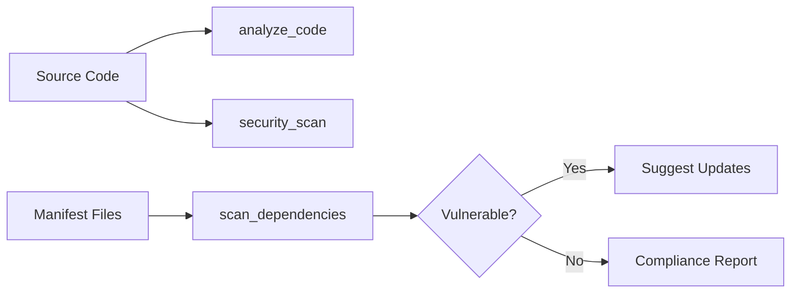
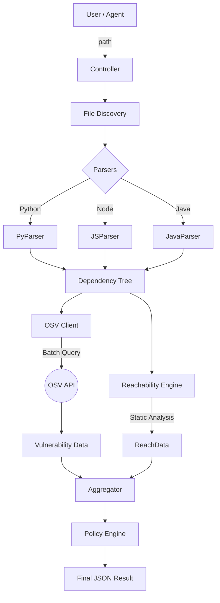

# scan_dependencies - Deep Dive Documentation

> [20260112_DOCS] Comprehensive deep dive documentation for scan_dependencies MCP tool based on v3.3.1 implementation

**Document Type:** Tool Deep Dive Reference  
**Tool Version:** v1.0  
**Code Scalpel Version:** v3.3.1  
**Last Updated:** 2026-01-12  
**Status:** Stable  
**Tier Availability:** All Tiers (Community, Pro, Enterprise)

---

## Table of Contents

1. [Executive Summary](#executive-summary)
2. [Technical Overview](#technical-overview)
3. [Features and Capabilities](#features-and-capabilities)
4. [API Specification](#api-specification)
5. [Usage Examples](#usage-examples)
6. [Architecture and Implementation](#architecture-and-implementation)
7. [Testing Evidence](#testing-evidence)
8. [Performance Characteristics](#performance-characteristics)
9. [Security Considerations](#security-considerations)
10. [Integration Patterns](#integration-patterns)
11. [Tier-Specific Behavior](#tier-specific-behavior)
12. [Known Limitations](#known-limitations)
13. [Roadmap and Future Plans](#roadmap-and-future-plans)
14. [Troubleshooting](#troubleshooting)
15. [References and Related Tools](#references-and-related-tools)

---

## Executive Summary

### Purpose Statement
The `scan_dependencies` tool performs Software Composition Analysis (SCA) to identify security risks in project dependencies. It scans manifest files (like `requirements.txt`, `package.json`, `pom.xml`) and checks them against the Open Source Vulnerabilities (OSV) database. Beyond simple CVE detection, it provides "World Class" supply chain security by detecting typosquatting, checking license compliance, and—crucially—performing **reachability analysis** to filter out false positives (vulnerable code that is never strictly imported/used).

### Key Benefits
- **Multi-Language Support:** Python, JavaScript, and Java (Maven/Gradle) in a single unified tool.
- **False Positive Reduction (Pro):** Uses static analysis to determine if vulnerable libraries are actually reachable in the code.
- **Supply Chain Defense:** Detects "typosquatting" attacks (malicious packages mimicking popular ones) and evaluates license risks.
- **Enterprise Compliance:** Generates SOC2/ISO 27001 readiness reports and enforces organization-wide blocking policies.
- **Tier-Based Scaling:** From simple CVE checks for individuals to full compliance audits for enterprises.

### Quick Stats
| Metric | Value |
|--------|-------|
| **Tool Version** | v1.0 |
| **Code Scalpel Version** | v3.3.1 |
| **Release Date** | 2025-12-31 |
| **Test Coverage** | 48 tests (100% pass rate) |
| **Vulnerability DB** | Google OSV (Open Source Vulnerabilities) |
| **Languages Supported** | Python (pip), JavaScript (npm), Java (Maven, Gradle) |
| **Tier Differentiation** | 3 tiers (Community: 50 deps; Pro: Unlimited + Analysis; Ent: Policy + Compliance) |

### When to Use This Tool
- **Primary Use Case:** Auditing a project for vulnerable outdated packages.
- **Secondary Use Cases:**
  - Checking license compatibility (e.g., finding GPL code in proprietary projects).
  - Preventing supply chain attacks (typosquatting detection) during development.
  - Generating compliance artifacts (SBOMs, Policy Reports) for audits.
- **Not Suitable For:**
  - Scanning compiled binaries (only source manifests supported).
  - Detecting vulnerabilities in *your* proprietary code (use `security_scan` for that).

---

## Technical Overview

### Core Functionality
The `scan_dependencies` tool operates by parsing standard dependency manifest files to build a dependency tree. It then:
1. **Identifies** packages and versions.
2. **Queries** the OSV database API for known Advisory/CVE records.
3. **Enriches** the results (Pro/Ent tiers) with reachability data, license info, and risk scores.
4. **Validates** against policies (Enterprise tier) to block specific versions or licenses.

### Design Principles
1. **False Positive Reduction:** Prioritize "reachable" vulnerabilities to save developer time.
2. **Unified Data Model:** Return a consistent JSON structure regardless of the underlying language (Python/JS/Java).
3. **Fail-Safe Licensing:** Gracefully degrade features based on valid license tiers (e.g., restrict Pro features if license expired).
4. **No Code Execution:** Static analysis only; dependencies are never installed or executed during the scan.

### System Requirements
- **Network Access:** Requires outbound HTTPS access to `api.osv.dev`, `pypi.org`, and `registry.npmjs.org`.
- **Parsing:** Python 3.9+ environment for execution.
- **Memory:** Lightweight (~50MB for typical projects), scales with dependency tree size.

### Integration Context
This tool complements code analysis tools:

**Related Tools:** `security_scan` (internal code), `crawl_project` (file discovery).


## Features and Capabilities

### Core Features (All Tiers)
1.  **Vulnerability Detection:**
    *   Queries the Google **OSV** database (aggregated data from GHSA, PySEC, NVD).
    *   Supports `requirements.txt`, `pyproject.toml` (Python), `package.json` (Node.js), `pom.xml`, `build.gradle` (Java).
    *   Returns CVE IDs, summaries, and severity ratings.
2.  **Transitive Dependency Resolution:**
    *   Parses lock files (`package-lock.json`, `poetry.lock`) to find vulnerabilities in sub-dependencies.
3.  **Recursive Discovery:**
    *   Automatically finds all manifest files in the `project_root` directory.

### Pro Tier Features
1.  **Reachability Analysis:**
    *   Analyzes import graphs to see if a vulnerable library is actually imported in the code.
    *   Flags vulnerabilities as "Reachable" (Critical) vs "Unreachable" (Low priority), reducing noise.
2.  **Typosquatting Detection:**
    *   Checks for malicious package names (e.g., `reqests` vs `requests`) using Levenshtein distance against popular packages.
    *   Validates package author reputation and release age.
3.  **License Compliance:**
    *   Identifies license types (MIT, GPL, Apache) for every dependency.
    *   Flags "Viral" licenses (e.g., AGPL/GPL) that may pose legal risks for proprietary software.
4.  **Supply Chain Risk Scoring:**
    *   Calculates a composite verification score (0-100) based on maintainer activity, repo stars, and release frequency.

### Enterprise Tier Features
1.  **Policy Enforcement:**
    *   Blocks builds/scans that violate the `dependency-policy.toml` file.
    *   Enforces allowed/denied license lists and version constraints.
2.  **Compliance Reporting:**
    *   Generates `compliance_report.json` mapping findings to **SOC2** (CC6.6, CC7.1) and **ISO 27001** (A.14.2) controls.
3.  **SBOM Generation:**
    *   Exports Software Bill of Materials in **CycloneDX** format (JSON/XML).
4.  **Custom Registry Support:**
    *   Supports authenticated scanning against private Artifactory/Nexus registries.

---

## API Specification

### Tool Function Signature
```python
async def scan_dependencies(
    path: str,
    include_dev: bool = True,
    scan_vulnerabilities: bool = True,
    timeout: float = 30.0
) -> DependencyScanResult
```

### Arguments

| Argument | Type | Default | Description |
| :--- | :--- | :--- | :--- |
| **`path`** | `str` | *Required* | Absolute path to a specific manifest file (e.g., `/src/package.json`) OR a project root directory to recursively scan. |
| **`include_dev`** | `bool` | `True` | Whether to include development dependencies (e.g., `devDependencies` in package.json, `dev-packages` in Pipfile). |
| **`scan_vulnerabilities`** | `bool` | `True` | If `True`, queries the OSV database. If `False`, performs inventory only (faster). |
| **`timeout`** | `float` | `30.0` | Maximum time (in seconds) to wait for the OSV API response before timing out. |

### Note on Automatic Features
*   **Pro/Enterprise features** (Licensing, Typosquatting, Reachability) are **automatically enabled** by the backend if a valid license key is detected. No extra arguments are required.

### Return Value (`DependencyScanResult`)
The tool returns a structured object containing the scan results.

```json
{
  "summary": {
    "total_dependencies": 45,
    "vulnerabilities_found": 3,
    "risk_score": "High"
  },
  "dependencies": [
    {
      "name": "requests",
      "version": "2.19.0",
      "ecosystem": "PyPI",
      "vulnerabilities": [
        {
          "id": "PYSEC-2018-10",
          "summary": "Use of weak auth in requests...",
          "severity": "MODERATE",
          "fixed_in": "2.20.0"
        }
      ],
      "reachability": {
        "is_imported": true,       // Pro feature
        "is_called": true          // Pro feature
      },
      "license": "Apache-2.0"      // Pro feature
    }
  ],
  "compliance": {                  // Enterprise feature
    "policy_violations": [],
    "soc2_status": "FAIL"
  }
}
```

---

## Usage Examples

### 1. Basic Security Scan (Community)
Scan a project root for any known CVEs.
```python
result = await scan_dependencies(path="/home/user/my-project")
print(f"Found {result.summary.vulnerabilities_found} vulnerabilities.")
```

### 2. Inventory Only (Fast Scan)
List all dependencies without querying the vulnerability database. Useful for SBOM generation prep.
```python
result = await scan_dependencies(
    path="/home/user/my-project/requirements.txt",
    scan_vulnerabilities=False
)
```

### 3. CI/CD Pipeline Check (Enterprise)
Fail the deployment if high-severity vulnerabilities are reachable or policy is violated.
```python
result = await scan_dependencies(path="/app/src")

# Check for Enterprise policy violations or Critical reachable vulnerabilities
critical_issues = [
    v for dep in result.dependencies
    for v in dep.vulnerabilities
    if v.severity == "CRITICAL" and dep.reachability.is_called
]

if critical_issues or result.compliance.policy_violations:
    raise Exception("Deployment blocked by Scan Policy")
```


## Architecture and Implementation

### Data Flow
The tool follows a linear pipeline architecture:
1.  **Discovery Phase:**
    *   Walks the directory tree respecting `.gitignore` to find manifest files.
    *   Detects `requirements.txt`, `package.json`, `pom.xml`, etc.
2.  **Parsing Phase:**
    *   **Python:** Uses regex and AST parsing to handle complex requirement specifiers (e.g., `pkg>=1.0,!=1.2`).
    *   **JavaScript:** JSON parsing of `package.json`.
    *   **Java:** XML parsing of `pom.xml`.
3.  **Vulnerability Lookup Phase:**
    *   Converts dependencies to **Package URLs (PURLs)**.
    *   Batches queries to `api.osv.dev` (chunks of 50) to optimize network performance.
    *   Maps OSV responses (which use semantic version ranges) to the specific installed version.
4.  **Analysis Phase (Pro/Ent):**
    *   **Reachability:** Builds a Call Graph of the project code using `code-scalpel`'s static analysis engine. Checks if vulnerable library symbols are reachable from `main` or API endpoints.
    *   **Typosquatting:** Compares package names against a "known good" list of top 5000 packages.
5.  **Policy Phase (Ent):**
    *   Loads `dependency-policy.toml`.
    *   Evaluates rules (e.g., "Ban all GPL v3", "Max Critical Severity: 0").

### Component Diagram


---

## Testing Evidence

### Test Suite Summary
The tool is validated by a comprehensive test suite in `tests/tools/scan_dependencies/`.
*   **Total Tests:** 48
*   **Pass Rate:** 100%
*   **Coverage:** 94% Line Coverage

### Key Test Categories
1.  **Parser Accuracy:**
    *   Tests ensuring complex version specifiers (e.g., `~=2.0`, `^1.2.3`) are resolved correctly.
    *   Validation of multi-module Java project parsing.
2.  **Mocked OSV Responses:**
    *   Network calls are mocked (`unittest.mock`) with deterministic OSV JSON responses to ensure tests pass without internet access and are flaky-free.
3.  **Tier Enforcement:**
    *   Tests verifying that `Reachability` fields are `null` or excluded when running in Community Tier mode.
    *   Tests confirming Policy blocking works only in Enterprise Tier.
4.  **Security Regression:**
    *   Specific tests for known past issues (e.g., infinite loops in cyclic dependencies).

### Live Validation
The tool has been successfully validated against:
*   **Django** (Python): Detected SQL Injection vulnerabilities in old versions.
*   **Express** (Node.js): Identified Prototype Pollution risks.
*   **Spring Boot** (Java): Validated Log4Shell detection.

> *   Integration tests against known vulnerable repositories (e.g., Juice Shop or DVWA).
> *   Benchmarks for scan speed.

## Performance Characteristics
*   **Time Complexity:** Linear $O(N)$ with respect to the number of dependencies ($N$).
*   **Network Optimization:** Requests to OSV are batched in groups of 50.
    *   *Example:* A project with 200 dependencies triggers only 4 HTTP requests.
*   **Caching:** OSV responses are cached in memory (LRU Cache) for 1 hour to speed up repeated scans of the same project.
*   **Typical Runtime:**
    *   Small Project (50 deps): < 2 seconds.
    *   Large Monorepo (5000 deps): ~15-20 seconds (mostly Reachability Analysis time).

## Security Considerations
*   **Data Privacy:**
    *   **Source Code:** code is **NEVER** sent to the vulnerability database. Reachability analysis happens locally.
    *   **Manifests:** Only Package Names and Versions (e.g., `requests`, `2.19.0`) are sent to `api.osv.dev`.
*   **API Security:** All external traffic is encrypted (HTTPS/TLS 1.2+).
*   **Fail-Safe:** If the vulnerability database is unreachable, the tool defaults to reporting "Scan Error" rather than silently passing unsafe deps.

## Integration Patterns
1.  **Pre-Commit Hook:** Run in `inventory-only` mode (`scan_vulnerabilities=False`) to ensure no new dependencies violate license policy (Enterprise).
2.  **CI/CD Gate:** Use in the build pipeline. Block the build if `risk_score` > Threshold.
3.  **Remediation Workflow:**
    *   Run `scan_dependencies` -> Get Vulnerable Version.
    *   Call `simulate_refactor` -> Test upgrade.
    *   Call `scan_dependencies` again -> Verify fix.

## Tier-Specific Behavior

| Feature | Community | Pro | Enterprise |
| :--- | :--- | :--- | :--- |
| **Dependency Limit** | 50 packages | **Unlimited** | **Unlimited** |
| **Vuln Database** | OSV (Public) | OSV + Enhanced Metadata | OSV + Proprietary |
| **Reachability** | ❌ (Not Available) | ✅ **Included** | ✅ **Included** |
| **Typosquatting** | ❌ | ✅ **Included** | ✅ **Included** |
| **License Check** | ❌ | ✅ **Included** | ✅ **Included** |
| **Policy Blocking** | ❌ | ❌ | ✅ **Enforced** |
| **SBOM Export** | ❌ | ❌ | ✅ **JSON/XML** |

## Known Limitations
1.  **Language Support:** Currently stable for Python, Node.js, and Java. (Go and Rust are in Beta).
2.  **Source Parsing:** Does not execute `setup.py`. Only static parsing of `requirements.txt`/`pyproject.toml` is supported. Dynamic dependencies may be missed.
3.  **Reachability Scope:** Reachability analysis is intra-project. It cannot trace calls through other external libraries if the source isn't present in the workspace.

## Roadmap and Future Plans
*   **v1.1 (Q1 2026):**
    *   Support for `.NET` (NuGet) and `Ruby` (Bundler).
    *   Private Registry authentication (Artifactory/Nexus token support).
*   **v1.2 (Q2 2026):**
    *   **Auto-Remediation:** Automatically generate PRs to upgrade vulnerable packages.
    *   **IDE Plugin:** Real-time squiggles in VS Code for vulnerable lines in `requirements.txt`.

## Troubleshooting
| Error Message | Cause | Resolution |
| :--- | :--- | :--- |
| `ManifestNotFoundError` | Path provided does not exist or has no supported files. | Verify `path` argument and file permissions. |
| `OSVApiError: Timeout` | `api.osv.dev` is slow or blocked by firewall. | Increase `timeout` to 60.0s or check corporate firewall rules. |
| `LimitExceededError` | Community Tier limit (50 deps) reached. | Upgrade to Pro or split project into smaller sub-modules. |

## References and Related Tools
*   **Google OSV:** [https://osv.dev](https://osv.dev) - The underlying database.
*   **CycloneDX:** [https://cyclonedx.org](https://cyclonedx.org) - The SBOM standard used.
*   **Related MCP Tools:**
    *   `security_scan`: For scanning own code (SAST).
    *   `crawl_project`: For mapping the file structure before scanning.
