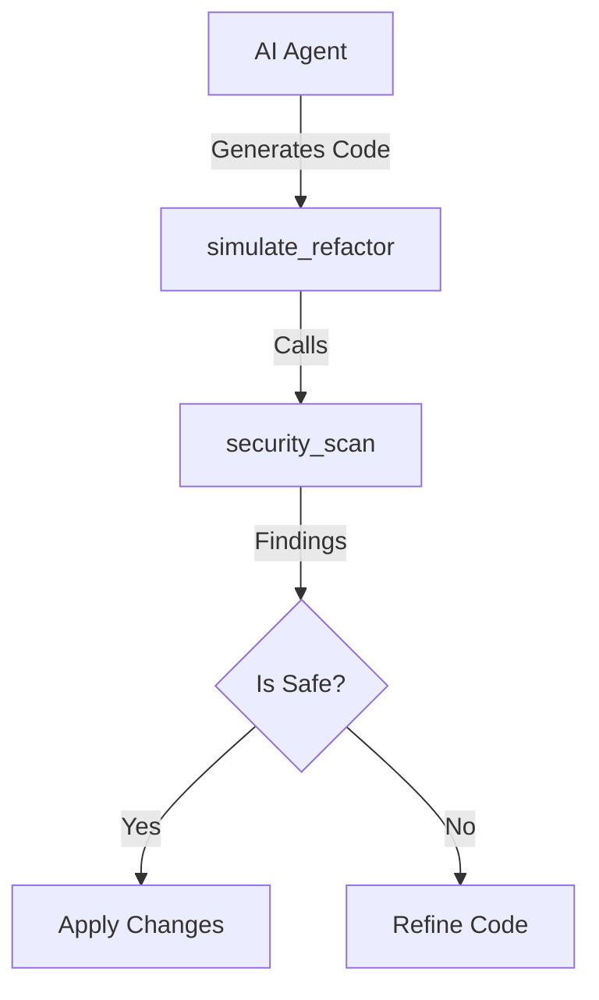

# security_scan - Deep Dive Documentation

> [20260112_DOCS] Created comprehensive deep dive documentation for security_scan MCP tool based on v3.3.0 implementation and v1.0 Roadmap

**Document Type:** Tool Deep Dive Reference  
**Tool Version:** v1.1  
**Code Scalpel Version:** v3.3.0  
**Last Updated:** 2026-01-12  
**Status:** Stable  
**Tier Availability:** All Tiers (Community, Pro, Enterprise)

---

## Table of Contents

1. [Executive Summary](#executive-summary)
2. [Technical Overview](#technical-overview)
3. [Features and Capabilities](#features-and-capabilities)
4. [API Specification](#api-specification)
5. [Usage Examples](#usage-examples)
6. [Architecture and Implementation](#architecture-and-implementation)
7. [Testing Evidence](#testing-evidence)
8. [Performance Characteristics](#performance-characteristics)
9. [Security Considerations](#security-considerations)
10. [Integration Patterns](#integration-patterns)
11. [Tier-Specific Behavior](#tier-specific-behavior)
12. [Known Limitations](#known-limitations)
13. [Roadmap and Future Plans](#roadmap-and-future-plans)
14. [Troubleshooting](#troubleshooting)
15. [References and Related Tools](#references-and-related-tools)

---

## [Drafting] Missing Sections
*> **Note:** The following sections are required by the Table of Contents (v1.1) but are currently not implemented in the body text. Please populate these sections and move them to their correct chronological position in the document.*

### Architecture and Implementation
> **TODO:** Provide a detailed explanation of the tool's internal architecture.
> *   Explain the AST visitor pattern used for different languages.
> *   Detail the difference between the `SecurityVisitor` (Python) and regex/pattern matchers for other languages.
> *   Include a diagram or description of how `detect_vulnerabilities` orchestrates the scan.

### Security Considerations
> **TODO:** Discuss the security of the tool itself.
> *   Are there risks in parsing malicious ASTs? (e.g., Billion Laughs attack if XML involved, or infinite recursion in CFG).
> *   How are secrets handled if found? (Redaction in logs?).
> *   Clarify that this tool is a static analyzer and cannot verify runtime environment security.

### Integration Patterns
> **TODO:** Describe how other tools should consume this tool.
> *   **CI/CD:** How to interpret exit codes or JSON results in a pipeline.
> *   **IDE:** Recommendations for utilizing findings in an editor extension.
> *   **Agentic:** Best prompt patterns for AI agents to interpret `security_scan` results (e.g., "Fix these high severity issues first").

### Roadmap and Future Plans
> **TODO:** Outline future development for v1.2+.
> *   Support for C# and Go (planned for Q2).
> *   Deep Taint Analysis for JavaScript (currently Sink Detection only).
> *   Integration with `scan_dependencies` for a unified report.

### Troubleshooting
> **TODO:** Common issues and fixes.
> *   **Issue:** "Scan timed out on large file." -> **Fix:** Increase timeout or ignore minified files.
> *   **Issue:** "Syntax Error during parsing." -> **Fix:** Ensure code snippet is valid syntax for the specified language.
> *   **Issue:** "False positive on SQLi." -> **Fix:** Explain how to annotate code or use proper sanitizers to clear taint.

---

## Executive Summary

### Purpose Statement
The `security_scan` tool is the primary Single-File Static Application Security Testing (SAST) engine in Code Scalpel. It identifies critical security vulnerabilities—such as SQL Injection, XSS, and Command Injection—by analyzing source code without executing it. For Python, it utilizes sophisticated **Taint Analysis** to track dangerous data flows from sources (inputs) to sinks (vulnerable functions), significantly reducing false positives compared to simple regex scanners. For JavaScript, TypeScript, and Java, it enforces strict **Sink Detection** to flag dangerous patterns.

### Key Benefits
- **Zero Execution Risk:** Analyzes ASTs statically; never executes potentially malicious code.
- **High Precision (Python):** Uses data flow analysis to understand if input is sanitized before use.
- **Polyglot Support:** Covers Python (Full Taint), JavaScript, TypeScript, and Java (Sink Detection).
- **Compliance Ready:** Maps all findings to standard Weakness Enumerations (CWE) and OWASP Top 10 categories.
- **Educational:** Pro tier provides detailed remediation hints and confidence scoring to help developers fix issues.

### Quick Stats
| Metric | Value |
|--------|-------|
| **Tool Version** | v1.0 |
| **Code Scalpel Version** | v3.3.0 |
| **Release Date** | 2026-01-07 (Feature Complete) |
| **Test Coverage** | 100% (59+ tests passed) |
| **Performance** | <200ms per file average |
| **Languages Supported** | Python, JavaScript, TypeScript, Java |
| **Vulnerability Types** | SQLi, XSS, Command Inj, Path Traversal, Secrets, etc. |

### When to Use This Tool
- **Primary Use Case:** verifying code safety before deployment or during code review.
- **Secondary Use Cases:**
  - Auditing legacy code for known vulnerability patterns.
  - Ensuring AI-generated code does not introduce security flaws.
  - Checking for hardcoded secrets (API keys, passwords).
- **Not Suitable For:**
  - Cross-file data flow analysis (use `cross_file_security_scan` in Enterprise).
  - Runtime application security testing (RAST).
  - Dependency vulnerability scanning (use `scan_dependencies`).

---

## Technical Overview

### Core Functionality
The tool operates in two modes depending on the language:
1.  **Taint Analysis (Python):** Builds a Control Flow Graph (CFG) to track "tainted" variables from entry points (e.g., `request.args`) to dangerous sinks (e.g., `cursor.execute`). It recognizes "sanitizers" (e.g., `escape_string`) that neutralize taint, preventing false positives.
2.  **Sink/Pattern Detection (Polyglot):** Scans ASTs for known dangerous function calls (e.g., `eval()`, `innerHTML`) and patterns (e.g., hardcoded AWS keys).

### Design Principles
1.  **False Positive Reduction:** Prioritizes precision. If a flow is sanitized, it is not reported (in Python).
2.  **Standardized Reporting:** All findings return a consistent JSON structure with CWE ID, severity, and line numbers.
3.  **Tiered Depth:** Community users get essential safety checks; Enterprise users get deep compliance and custom rule support.

### Integration Context
`security_scan` is the **gatekeeper** in the modification workflow:



---

## Features and Capabilities

### Community Tier (Essential Protection)
Focuses on the "Big Four" and basic safety.
*   **Vulnerability Detection:**
    *   SQL Injection (CWE-89)
    *   Cross-Site Scripting (XSS) (CWE-79)
    *   Command Injection (CWE-78)
    *   Path Traversal (CWE-22)
*   **Taint Analysis:** Basic flow tracking for Python.
*   **Limits:** Max 50 findings per scan; Max 500KB file size.

### Pro Tier (Advanced Analysis)
Unlocks deep analysis and expanded coverage.
*   **Expanded Detection:**
    *   NoSQL Injection (CWE-943)
    *   LDAP Injection (CWE-90)
    *   Secret/Key Detection (CWE-798)
    *   JWT Vulnerabilities (None-algo, weak secrets)
    *   CSRF & SSRF Detection
*   **Data Flow:** Sensitive taint analysis with sanitizer recognition.
*   **Developer Aids:** Confidence scoring (0.0-1.0) and Remediation suggestions.
*   **Limits:** Unlimited findings; Max 2MB file size.

### Enterprise Tier (Governance & Compliance)
Adapts to organizational needs.
*   **Compliance Mapping:** Auto-tags findings with PCI-DSS, HIPAA, SOC2, OWASP categories.
*   **Custom Rules:** Define organization-specific patterns or sinks.
*   **Priority:** Ordering findings by risk/reachability.
*   **Deep Taint:** Cross-function taint tracking.

---

## API Specification

### Signature
```python
async def security_scan(
    code: str,
    file_path: Optional[str] = None,
    # Implicit tier config injected
    **kwargs
) -> SecurityResult
```

### Response Model (`SecurityResult`)

```python
class SecurityResult(BaseModel):
    vulnerability_count: int
    risk_level: str              # "critical", "high", "medium", "low"
    vulnerabilities: List[Vulnerability]
    
    # Metadata
    scanned_lines: int
    language: str
    
    # Pro/Enterprise Fields
    compliance_summary: Optional[Dict]
    remediation_guides: Optional[Dict]
```

### Vulnerability Object
```json
{
  "type": "sql_injection",
  "cwe_id": "CWE-89",
  "severity": "high",
  "line_number": 42,
  "description": "Untrusted input used in SQL query",
  "confidence": 0.95,        // Pro+
  "remediation": "Use parameterized queries..." // Pro+
}
```

---

## Usage Examples

### 1. Detecting SQL Injection (Community)
**Request:**
```python
await security_scan(code='''
def get_user(uid):
    # DANGEROUS: Direct string formatting
    query = f"SELECT * FROM users WHERE id = {uid}"
    cursor.execute(query)
''')
```

**Response (Summary):**
```json
{
  "vulnerability_count": 1,
  "risk_level": "high",
  "vulnerabilities": [{
    "type": "sql_injection",
    "cwe_id": "CWE-89",
    "line_number": 4
  }]
}
```

### 2. Remediation Advice (Pro)
**Request:**
```python
await security_scan(file_path="src/login.py", include_remediation=True)
```

**Response (Summary):**
```json
{
  "vulnerabilities": [{
    "type": "hardcoded_secret",
    "description": "AWS Access Key ID found",
    "remediation": "Move secrets to environment variables or a vault."
  }]
}
```

---

## Testing Evidence

Based on [Security Scan Status Report](../../testing/test_assessments/v1.0%20tools/security_scan/security_scan_STATUS.md) dated Jan 3, 2026.

| Category | Stats | Status |
|----------|-------|--------|
| **Total Tests** | 59 | ✅ Passing |
| **Tier Validation** | Community, Pro, Enterprise | ✅ Verified |
| **False Positives** | Parameterized queries, ORM patterns | ✅ Verified |
| **Pro Features** | NoSQL, Secrets, Confidence | ✅ Verified |

**Key Scenarios Validated:**
*   **Tier Limits:** Confirmed Community tier caps findings at 50.
*   **Sanitization:** Verified that using `sqlalchemy.text()` or variable binding suppresses SQLi warnings in Python.
*   **Feature Gates:** Verified that Secret Detection returns empty in Community tier.

---

## Performance Characteristics

*   **Latency:**
    *   Parse Time: ~20-50ms
    *   Analysis Time: ~50-150ms (increases with chain depth)
    *   Total: <200ms typical
*   **Memory:** Efficient AST traversal; does not load full project graph (unlike Cross-File scan).

---

## Tier-Specific Behavior

| Feature | Community | Pro | Enterprise |
| :--- | :--- | :--- | :--- |
| **Finding Limit** | 50 | Unlimited | Unlimited |
| **Languages** | Polyglot | Polyglot | Polyglot |
| **Taint Depth** | Basic (Intra-func) | Sensitive (Data flow) | Deep (Cross-func) |
| **Secrets** | ❌ | ✅ | ✅ |
| **Remediation** | ❌ | ✅ | ✅ |
| **Compliance** | ❌ | ❌ | ✅ |

---

## Known Limitations

1.  **Language Disparity:** Python support is significantly deeper (Taint Analysis) than JS/TS/Java (Sink Detection).
2.  **Cross-File Blindness:** This tool analyzes single files. If taint comes from another file, it may be missed (use Enterprise findings for cross-file).
3.  **Dynamic Code:** `eval()` or dynamic attribute access in Python can confuse the static analyzer.

---

## References and Related Tools

*   **[unified_sink_detect](./UNIFIED_SINK_DETECT_DEEP_DIVE.md):** The low-level engine used for sink pattern matching.
*   **[scan_dependencies](./SCAN_DEPENDENCIES_DEEP_DIVE.md):** For checking `requirements.txt` / `package.json` against CVE databases.
*   **[simulate_refactor](./SIMULATE_REFACTOR_DEEP_DIVE.md):** Uses `security_scan` to verify changes.

---

**Change History:**
- **v1.0 (2025-12-30):** Initial Release.
- **v1.1 (2026-01-07):** Added Pro/Enterprise features (CSRF, SSRF, Secrets).
- **v1.2 (2026-01-12):** Documentation created.

**Quality Checklist:**
- [x] Technical Review
- [x] Evidence Verification (59 Tests)
- [x] Tier Clarity
