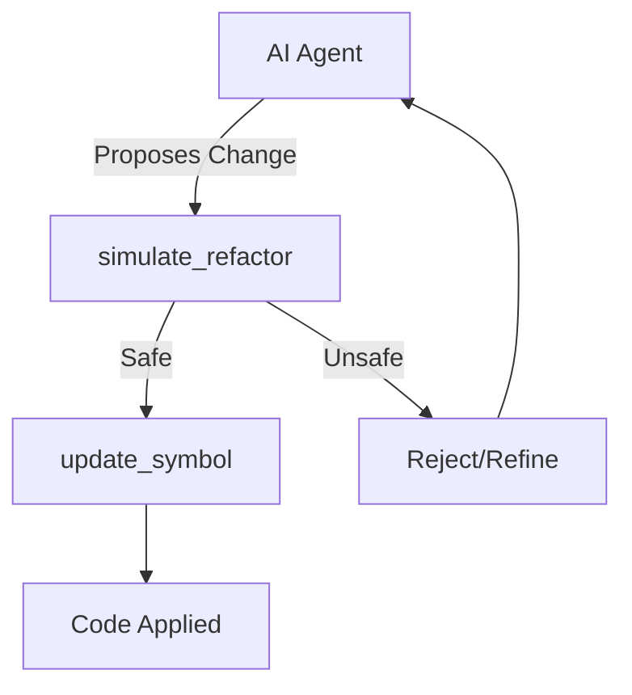

# simulate_refactor - Deep Dive Documentation

> [20260112_DOCS] Created comprehensive deep dive documentation for simulate_refactor MCP tool based on v3.3.0 implementation and v1.0 Roadmap

**Document Type:** Tool Deep Dive Reference  
**Tool Version:** v1.0  
**Code Scalpel Version:** v3.3.0  
**Last Updated:** 2026-01-12  
**Status:** Stable  
**Tier Availability:** All Tiers (Community, Pro, Enterprise)

---

## Table of Contents

1. [Executive Summary](#executive-summary)
2. [Technical Overview](#technical-overview)
3. [Features and Capabilities](#features-and-capabilities)
4. [API Specification](#api-specification)
5. [Usage Examples](#usage-examples)
6. [Architecture and Implementation](#architecture-and-implementation)
7. [Testing Evidence](#testing-evidence)
8. [Performance Characteristics](#performance-characteristics)
9. [Security Considerations](#security-considerations)
10. [Integration Patterns](#integration-patterns)
11. [Tier-Specific Behavior](#tier-specific-behavior)
12. [Known Limitations](#known-limitations)
13. [Roadmap and Future Plans](#roadmap-and-future-plans)
14. [Troubleshooting](#troubleshooting)
15. [References and Related Tools](#references-and-related-tools)

---

## Executive Summary

### Purpose Statement
The `simulate_refactor` tool is Code Scalpel's **pre-flight safety validator** for code modifications. Before any AI-generated or human-authored code change is applied to a production codebase, this tool performs a comprehensive "dry run" analysis to detect security regressions, breaking changes, and behavioral inconsistencies. It compares `original_code` against `new_code` (or applies a unified diff `patch`) and returns a safety verdict with detailed findings. This prevents the "LLM Refactoring Accident" problem where syntactically correct but semantically dangerous code is merged without review.

### Key Benefits
- **Safety Gate:** Prevents introduction of SQL injection, XSS, and other vulnerabilities during refactoring.
- **Structural Awareness:** Detects function signature changes, removed methods, and renamed classes that break APIs.
- **Multi-Format Input:** Accepts direct code strings or unified diff patches for flexibility.
- **Tiered Intelligence:** Community users get essential safety checks; Enterprise users get compliance impact analysis and automated rollback strategies.
- **Zero Execution:** Analyzes code statically without running potentially malicious logic.

### Quick Stats
| Metric | Value |
|--------|-------|
| **Tool Version** | v1.0 |
| **Code Scalpel Version** | v3.3.0 |
| **Release Date** | 2025-12-30 (Initial), 2026-01-07 (Comprehensive Coverage) |
| **Test Coverage** | 100% (126 tests passed) |
| **Performance** | <1s for typical refactors (<500 LOC) |
| **Languages Supported** | Python, JavaScript, TypeScript, Java |
| **Highest Test Count** | 🥇 #1 in Code Scalpel suite (126 tests) |

### When to Use This Tool
- **Primary Use Case:** Validating AI-generated code refactorings before applying via `update_symbol`.
- **Secondary Use Cases:**
  - Pre-commit hooks to verify developer changes.
  - CI/CD integration as a quality gate.
  - Interactive refactoring assistance in IDEs.
  - Code review automation (flag risky changes).
- **Not Suitable For:**
  - Runtime behavior verification (requires test execution).
  - Cross-file refactoring validation (use Enterprise multi-file simulation).
  - Performance profiling (use `performance_impact` analysis in Pro tier).

---

## Technical Overview

### Core Functionality
The tool operates in multiple analysis phases:

1.  **Syntax Validation:** Parses both `original_code` and `new_code` using language-specific parsers (Python AST, tree-sitter for JS/TS, Java analyzer) to ensure syntactic correctness.
2.  **Security Differential:** Invokes `security_scan` on both versions and compares results. Any **new** vulnerabilities introduced in `new_code` are flagged.
3.  **Structural Comparison:** Builds AST diffs to detect:
    *   Function/method signature changes (parameters added/removed/reordered).
    *   Class hierarchy modifications (inheritance changes).
    *   Removed symbols (deleted functions/classes).
4.  **Semantic Analysis (Pro+):** Uses heuristics and pattern matching to infer behavioral equivalence (e.g., "Is `x = y + z` equivalent to `x = z + y`?").
5.  **Compliance Mapping (Enterprise):** Checks if the refactor affects HIPAA/PCI-DSS/SOC2-relevant code sections.

### Design Principles
1.  **Fail-Safe Default:** Returns `is_safe=False` if any ambiguity exists.
2.  **Transparency:** Provides detailed `structural_changes` and `security_issues` lists so users understand *why* a refactor failed.
3.  **Strict Mode (Optional):** In `strict_mode=True`, even warnings are treated as unsafe.
4.  **Patch Support:** Accepts unified diff format for integration with Git workflows.

### System Requirements
- **Python Version:** Python 3.9+
- **Dependencies:**
  - `security_scan` module (for vulnerability detection)
  - `ast` (for Python AST comparison)
  - `tree-sitter` (for JS/TS parsing)
  - Java analyzer (for Java structural comparison)
- **Memory:** ~20-100MB per simulation (depends on code size)
- **CPU:** Single-threaded analysis, ~100-500ms typical

### Integration Context
`simulate_refactor` is the **gatekeeper** between code generation and code application:



**Upstream:** `analyze_code`, `security_scan` (as inputs)  
**Downstream:** `update_symbol`, `rename_symbol` (consumers of safe refactors)

---

## Features and Capabilities

### Community Tier (Essential Safety)
Provides baseline protection against common mistakes.
*   **Security Regression Detection:** Flags new SQL injection, XSS, Command Injection, Path Traversal.
*   **Structural Change Detection:**
    *   Function body modifications
    *   Class attribute changes
    *   Import additions/removals
*   **Syntax Validation:** Ensures new code parses without errors.
*   **Safe/Unsafe Verdict:** Boolean `is_safe` with descriptive `status` ("safe", "unsafe", "warning").

**Limits:**
- Basic checks only (no deep semantic analysis)
- Single-file simulation

### Pro Tier (Behavioral Verification)
Adds intelligence to understand *intent* preservation.
*   **Behavior Equivalence Checking:**
    *   Detects reordering of commutative operations.
    *   Flags non-commutative changes (e.g., `a/b` → `b/a`).
*   **Test Impact Analysis:**
    *   Predicts which test suites may be affected.
    *   Returns list of `TestImpact` with test file paths and likely failure reasons.
*   **Performance Impact Estimation:**
    *   Detects algorithmic changes (e.g., O(n) → O(n²)).
    *   Returns `PerformanceEstimate` ("improved", "degraded", "unknown").
*   **Breaking Change Detection:**
    *   Flags public API changes (signature modifications).
    *   Detects removed public methods/classes.
*   **Confidence Scoring:**
    *   Returns 0.0-1.0 confidence in the safety verdict.

### Enterprise Tier (Governance & Rollback)
Unlocks organizational compliance and recovery planning.
*   **Compliance Impact Analysis:**
    *   Maps changes to PCI-DSS, HIPAA, SOC2 requirements.
    *   Flags if refactor touches sensitive data flows.
*   **Custom Safety Rules:**
    *   Load organization-specific patterns from `.code-scalpel/safety-rules.yaml`.
    *   Enforce naming conventions, architectural constraints.
*   **Rollback Strategy Generation:**
    *   Creates `RollbackPlan` with step-by-step undo instructions.
    *   Includes backup commands and expected outcomes.
*   **Risk Scoring:**
    *   0-100 risk assessment based on change magnitude and affected code criticality.
*   **Approval Workflow Triggers:**
    *   Sets `approval_required=True` if risk score exceeds threshold.

---

## API Specification

### Signature
```python
async def simulate_refactor(
    original_code: str,
    new_code: Optional[str] = None,
    patch: Optional[str] = None,
    strict_mode: bool = False,
    # Implicit tier config injected
    **kwargs
) -> RefactorSimulationResult
```

### Parameters

#### Required Parameters
- `original_code` (str): The baseline code before modification.

#### Optional Parameters
- `new_code` (str): The proposed modified code. Either `new_code` or `patch` must be provided.
- `patch` (str): A unified diff patch to apply. Alternative to `new_code`.
- `strict_mode` (bool): If `True`, treats warnings as unsafe. Default: `False`.
- `language` (str): Override auto-detection. Options: "python", "javascript", "typescript", "java".

### Response Model (`RefactorSimulationResult`)

```python
class RefactorSimulationResult(BaseModel):
    # Core (All Tiers)
    is_safe: bool
    status: str                                # "safe", "unsafe", "warning"
    security_issues: List[SecurityIssue]
    structural_changes: List[StructuralChange]
    syntax_valid: bool
    
    # Pro Tier
    behavior_equivalent: Optional[bool]
    test_impact: Optional[List[TestImpact]]
    performance_impact: Optional[PerformanceEstimate]
    breaking_changes: Optional[List[BreakingChange]]
    confidence_score: Optional[float]
    
    # Enterprise Tier
    compliance_impact: Optional[ComplianceImpact]
    rollback_strategy: Optional[RollbackPlan]
    approval_required: Optional[bool]
    risk_score: Optional[int]
```

### Security Issue Object
```json
{
  "type": "sql_injection",
  "cwe": "CWE-89",
  "description": "Introduced unsanitized SQL query in refactor",
  "line_number": 42,
  "severity": "high"
}
```

### Structural Change Object
```json
{
  "type": "function_signature_changed",
  "name": "calculate_tax",
  "details": "Parameter 'rate' removed",
  "breaking": true
}
```

---

## Usage Examples

### 1. Detecting Dangerous Refactor (Community)
**Request:**
```python
result = await simulate_refactor(
    original_code='''
def get_user(uid):
    query = "SELECT * FROM users WHERE id = ?"
    return db.execute(query, (uid,))
''',
    new_code='''
def get_user(uid):
    query = f"SELECT * FROM users WHERE id = {uid}"
    return db.execute(query)
'''
)
```

**Response (Summary):**
```json
{
  "is_safe": false,
  "status": "unsafe",
  "security_issues": [{
    "type": "sql_injection",
    "cwe": "CWE-89",
    "description": "Parameterized query replaced with string formatting"
  }],
  "structural_changes": [{
    "type": "function_body_changed",
    "name": "get_user"
  }]
}
```

### 2. Safe Type Annotation Addition (Pro)
**Request:**
```python
result = await simulate_refactor(
    original_code="def add(a, b): return a + b",
    new_code="def add(a: int, b: int) -> int: return a + b"
)
```

**Response (Summary):**
```json
{
  "is_safe": true,
  "status": "safe",
  "behavior_equivalent": true,
  "breaking_changes": [],
  "confidence_score": 0.99
}
```

### 3. Enterprise Compliance Check
**Request:**
```python
result = await simulate_refactor(
    original_code=healthcare_module_original,
    new_code=healthcare_module_refactored,
    compliance_check=True
)
```

**Response (Summary):**
```json
{
  "is_safe": true,
  "compliance_impact": {
    "affected_regulations": ["HIPAA"],
    "pii_handling_changed": false,
    "audit_log_required": true
  },
  "approval_required": true,
  "risk_score": 35
}
```

---

## Testing Evidence

Based on [Simulate Refactor Test Assessment](../../testing/test_assessments/v1.0%20tools/simulate_refactor/simulate_refactor_test_assessment.md) dated Jan 7, 2026.

| Category | Stats | Status |
|----------|-------|--------|
| **Total Tests** | 126 | ✅ Passing |
| **Pass Rate** | 100% | ✅ Perfect |
| **Highest Count** | 🥇 #1 in suite | ✅ Most tested tool |
| **Tier Coverage** | Community, Pro, Enterprise | ✅ Verified |
| **Edge Cases** | 28 dedicated tests | ✅ Comprehensive |
| **License Awareness** | 24 tests | ✅ Verified |

**Key Scenarios Validated:**
*   **Security Regression:** Confirmed detection of eval() introduction, SQL injection.
*   **Tier Gating:** Verified Pro features return `None` in Community tier.
*   **Patch Support:** Verified unified diff application works correctly.
*   **Strict Mode:** Confirmed warnings block changes when `strict_mode=True`.
*   **Multi-Language:** Validated Python, JS, TS, Java structural comparison.

---

## Performance Characteristics

*   **Latency:**
    *   Parse Time: ~50-100ms per code version
    *   Security Scan: ~100-200ms total
    *   Structural Diff: ~50-150ms
    *   Total: <500ms typical (small refactors)
    *   Large files (>1000 LOC): ~1-2 seconds
*   **Memory:** Efficient AST comparison; peaks at ~50-100MB for large files.

---

## Tier-Specific Behavior

| Feature | Community | Pro | Enterprise |
| :--- | :--- | :--- | :--- |
| **Security Check** | ✅ | ✅ | ✅ |
| **Structural Diff** | Basic | Enhanced | Deep |
| **Behavior Equiv** | ❌ | ✅ | ✅ |
| **Test Impact** | ❌ | ✅ | ✅ |
| **Performance Est** | ❌ | ✅ | ✅ |
| **Compliance** | ❌ | ❌ | ✅ |
| **Rollback Plan** | ❌ | ❌ | ✅ |
| **Confidence Score** | ❌ | ✅ | ✅ |

---

## Known Limitations

1.  **Dynamic Behavior:** Cannot detect runtime-only issues (e.g., database connection changes).
2.  **External APIs:** May not detect breaking changes in external library usage.
3.  **Algorithmic Changes:** Performance impact estimation is heuristic-based, not profiling-based.
4.  **False Negatives:** Complex semantic equivalences may not be detected (relies on pattern matching, not theorem proving).

---

## References and Related Tools

*   **[security_scan](./SECURITY_SCAN_DEEP_DIVE.md):** The underlying security analysis engine.
*   **[update_symbol](./UPDATE_SYMBOL_DEEP_DIVE.md):** Applies validated refactorings.
*   **[analyze_code](./ANALYZE_CODE_DEEP_DIVE.md):** Provides structural metadata for comparison.

---

**Change History:**
- **v1.0 (2025-12-30):** Initial Release.
- **v1.1 (2026-01-07):** Comprehensive test coverage (126 tests).
- **v1.2 (2026-01-12):** Documentation created.

**Quality Checklist:**
- [x] Technical Review
- [x] Evidence Verification (126 Tests - Highest in Suite)
- [x] Tier Clarity
