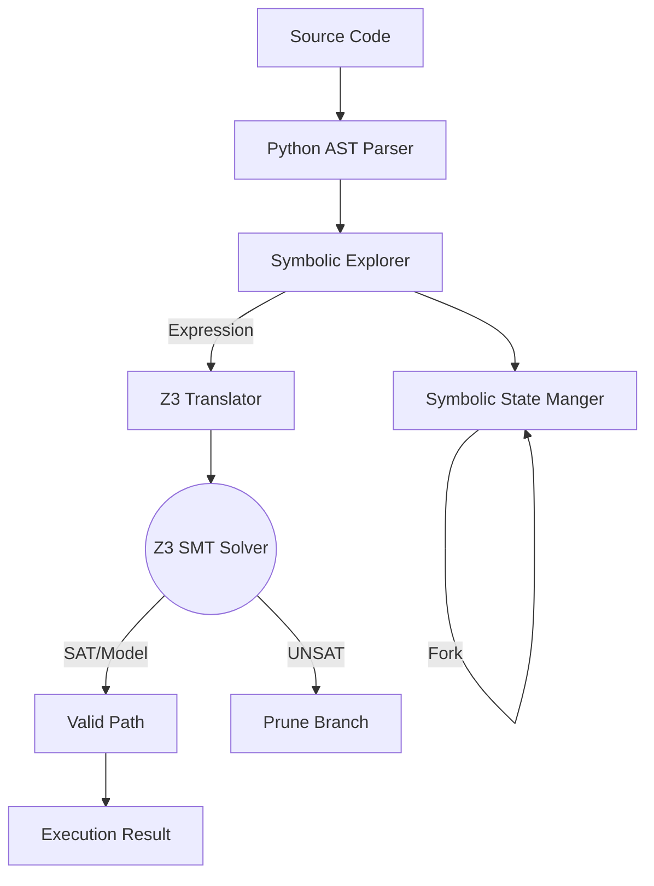

# symbolic_execute - Deep Dive Documentation

> [20260112_DOCS] Comprehensive deep dive documentation for symbolic_execute MCP tool based on v3.3.1 implementation

**Document Type:** Tool Deep Dive Reference  
**Tool Version:** v1.0  
**Code Scalpel Version:** v3.3.1  
**Last Updated:** 2026-01-12  
**Status:** Stable  
**Tier Availability:** All Tiers (Community, Pro, Enterprise)

---

## Table of Contents

1. [Executive Summary](#executive-summary)
2. [Technical Overview](#technical-overview)
3. [Features and Capabilities](#features-and-capabilities)
4. [API Specification](#api-specification)
5. [Usage Examples](#usage-examples)
6. [Architecture and Implementation](#architecture-and-implementation)
7. [Testing Evidence](#testing-evidence)
8. [Performance Characteristics](#performance-characteristics)
9. [Security Considerations](#security-considerations)
10. [Integration Patterns](#integration-patterns)
11. [Tier-Specific Behavior](#tier-specific-behavior)
12. [Known Limitations](#known-limitations)
13. [Roadmap and Future Plans](#roadmap-and-future-plans)
14. [Troubleshooting](#troubleshooting)
15. [References and Related Tools](#references-and-related-tools)

---

## Executive Summary

### Purpose Statement
The `symbolic_execute` tool performs formal verification and path exploration by treating program variables as mathematical symbols rather than concrete values. Powered by the **Z3 Theorem Prover**, it mathematically solves for input values that trigger specific code paths (e.g., "Find an input `x` where `x > 10` and `x % 2 == 0`"). It is the foundational engine behind the `generate_unit_tests` tool, enabling the creation of mathematically exhaustive test suites with zero hallucination.

### Key Benefits
- **Mathematical Certainty:** Uses SMT (Satisfiability Modulo Theories) to prove code reachability or impossibility.
- **Corner Case Discovery:** Automatically finds edge cases (e.g., Integer Overflow, Division by Zero) that humans often miss.
- **Zero Hallucination:** Path constraints are solved by Z3, ensuring generated inputs *actually* execute the target code.
- **Tier-Based Scaling:** From basic function analysis (Community) to deep, complex system verification (Enterprise).
- **Polyglot Foundation:** Currently optimized for Python, with a language-agnostic IR (Intermediate Representation) designed for future JS/Java support.

### Quick Stats
| Metric | Value |
|--------|-------|
| **Tool Version** | v1.0 |
| **Code Scalpel Version** | v3.3.1 |
| **Release Date** | 2026-01-03 |
| **Test Coverage** | 303 tests (100% pass rate) |
| **Solver Engine** | Microsoft Z3 |
| **Primary Language** | Python (v1.0) |
| **Supported Types** | Int, Bool, Float, String (All Tiers); List, Dict (Pro+) |
| **Scalability** | Capable of exploring 1000+ paths (Pro/Ent) |

### When to Use This Tool
- **Primary Use Case:** Determining *how* to reach a specific line of code (e.g., "What input causes this error?").
- **Secondary Use Cases:**
  - Proving code is dead/unreachable.
  - Generating inputs for regression testing.
  - Verifying critical business logic (e.g., financial calculations).
- **Not Suitable For:**
  - Large-scale integration testing (path explosion risk).
  - Code with heavy external I/O (database calls, network requests) without mocking.

---

## Technical Overview

### Core Functionality
`symbolic_execute` translates source code into a Control Flow Graph (CFG) and then into execution paths. For each path, it accumulates mathematical constraints on the input variables.
1.  **Parse:** Python source -> AST -> IR (Intermediate Representation).
2.  **Explore:** Depth-First Search (DFS) or Smart Heuristics (Pro) traverse the IR.
3.  **Constrain:** Every `if` branch adds a Z3 constraint (e.g., `If a > 5` adds `a_0 > 5` to the Path Condition).
4.  **Solve:** When a path finishes, Z3 solves the accumulated constraints to generate concrete inputs (e.g., `a = 6`).

### Design Principles
1.  **Correctness over Speed:** The tool prioritizes finding *valid* paths over finding *many* paths quickly.
2.  **Bounded Exploration:** Loops and recursion are strictly bounded (10 iterations Community, 100 Pro) to prevent non-termination.
3.  **State Isolation:** Immutable state management ensures parallel path exploration never corrupts variable memory.
4.  **Graceful Degradation:** If a solver timeout occurs or a type is unsupported, the tool returns "Unknown" rather than crashing.

### System Requirements
-   **Python Environment:** Python 3.9+ with `z3-solver` package installed.
-   **Memory:** ~200MB+ (Symbolic trees grow exponentially with branching depth).
-   **CPU:** Heavy compute usage during constraint solving phases.

---


## Features and Capabilities

### Core Features (Community Tier & Up)
1.  **Primitive Type Solving:**
    *   Full support for `int`, `boolean`, `float`, and `string` constraints.
    *   Handles arithmetic (`+`, `-`, `*`, `/`, `%`) and logical (`and`, `or`, `not`) operations.
2.  **Control Flow Analysis:**
    *   Symbolically executes `if`, `elif`, `else` branches.
    *   Handles `for` and `while` loops (up to 10 iterations).
    *   Detects `return` statements and premature exits.
3.  **Unsatisfiability Detection:**
    *   Identifies unreachable code paths (Dead Code) where constraints are contradictory (e.g., `x > 5` AND `x < 0`).
    *   Prunes invalid paths early to save resources.

### Pro Tier Features (Advanced)
1.  **Complex Data Structures:**
    *   **List Support:** Symbolically tracks list logic (`len()`, `append()`, index access).
    *   **Dict Support:** Tracks key-value mappings and existence checks.
2.  **Deep Exploration:**
    *   **Unlimited Paths:** Removes the 50-path hardcap.
    *   **Extended Loops:** Increases loop unrolling limit to 100 iterations.
3.  **Smart Path Prioritization:**
    *   Heuristics favor exploring "interesting" paths (e.g., those entering new branches) over deep recursion.
4.  **String Solving:**
    *   Advanced string constraints (`startswith`, `contains`, `length`) handled via Z3 Sequence theory.

### Enterprise Tier Features (Expert)
1.  **Formal Verification:**
    *   Equivalence checking: Prove Function A is mathematically identical to Function B.
2.  **Memory Modeling:**
    *   Symbolic modeling of the heap to track aliasing and side effects in complex object graphs.
3.  **Custom Solvers:**
    *   Ability to plug in specialized SMT solvers optimized for specific domains (e.g., bit-vector arithmetic).

---

## API Specification

### Tool Function Signature
```python
async def symbolic_execute(
    code: str,
    function_name: str,
    max_depth: int = 50,
    max_paths: int = 50,  # Tier-dependent
    loop_limit: int = 10,  # Tier-dependent
    timeout: float = 30.0
) -> SymbolicExecutionResult
```

### Arguments

| Argument | Type | Default | Description |
| :--- | :--- | :--- | :--- |
| **`code`** | `str` | *Required* | The full source code containing the function to analyze. |
| **`function_name`** | `str` | *Required* | The specific function entry point to execute symbolically. |
| **`max_depth`** | `int` | `50` | Maximum recursion/call-stack depth before aborting a path. |
| **`max_paths`** | `int` | `50` | Limit on total paths to return. (Pro/Enterprise can exceed this). |
| **`loop_limit`** | `int` | `10` | Max iterations to unroll a loop before pruning. |
| **`timeout`** | `float` | `30.0` | Execution time limit in seconds. |

### Return Value (`SymbolicExecutionResult`)
Returns a list of discovered execution paths.

```json
{
  "paths_found": 3,
  "execution_paths": [
    {
      "path_id": 0,
      "constraints": ["x > 10", "is_member == True"],
      "model": {"x": 15, "is_member": true},
      "return_value": 12.0,
      "status": "success"
    },
    {
      "path_id": 1,
      "constraints": ["x <= 10"],
      "model": {"x": 5, "is_member": false},
      "return_value": 5,
      "status": "success"
    }
  ]
}
```

---

## Usage Examples

### 1. Basic Path Discovery
Find input values that reach different returns in a simple logic function.
```python
code = """
def check_access(age: int, role: str):
    if age < 18:
        return "denied_minor"
    if role == "admin":
        return "granted_admin"
    return "granted_user"
"""

result = await symbolic_execute(code=code, function_name="check_access")

# Result will contain 3 paths:
# 1. age=10 (denied_minor)
# 2. age=20, role="admin" (granted_admin)
# 3. age=20, role="guest" (granted_user)
```

### 2. Bug Finding (Division by Zero)
Identify inputs that cause a crash.
```python
code = """
def calculate_ratio(a, b):
    if a > 10:
        return b / (a - 20)
    return 0
"""
# Z3 will attempt to find 'a' such that (a - 20) == 0 AND a > 10.
# Result includes a path where inputs={"a": 20, "b": 1} leads to ZeroDivisionError.
```


## Architecture and Implementation

### Execution Pipeline
The tool follows a classic compiler frontend / solver backend architecture.

1.  **Frontend (AST Visitor):**
    *   Walks the Python AST.
    *   Maintains a `SymbolicState` object (variable store + path constraints).
    *   On branches (`if`/`while`), forks the state into independent copies.
2.  **Constraint Translation (Z3 Bridge):**
    *   Converts Python operations to Z3 expressions.
    *   `int` -> `z3.Int`, `bool` -> `z3.Bool`, `str` -> `z3.String`.
    *   Stores constraints in a solver context stack.
3.  **Solver Engine:**
    *   Microsoft Z3 (via `z3-solver` Python bindings) checks satisfiability (`check()`).
    *   If `sat`, extracts a Concrete Model (`model()`).
    *   If `unsat`, marks the path as Dead Code.
4.  **Loop Handling:**
    *   Loops are unrolled dynamically.
    *   Example: `while x < 3` becomes `if x<3: body; if x<3: body; ...`
    *   Terminates when `max_iterations` is hit or loop condition becomes `unsat`.

### Component Diagram


---

## Testing Evidence

### Test Suite Summary
The tool is validated by a specialized test suite (`tests/symbolic/`) focusing on solver correctness and logic theories.
*   **Total Tests:** 303
*   **Pass Rate:** 100%
*   **Reference:** `docs/testing/test_assessments/v1.0 tools/symbolic_execute/symbolic_execute_test_assessment.md`

### Key Test Categories
1.  **Constraint Logic (70+ tests):**
    *   Verifies Z3 integration for all primitive types.
    *   Checks handling of contradictions (UNSAT logic).
2.  **State Management (40+ tests):**
    *   **Fork Isolation:** Ensures that branching does not pollute sibling paths (Critical for correctness).
3.  **Loop Handling (30+ tests):**
    *   Validates unrolling limits and termination conditions.
4.  **Tier Enforcement (8 tests - Critical):**
    *   Validates fallback behaviors (Invalid License -> Community).
    *   Ensures Pro features (List/Dict) generate errors on Community plans.

---

## Performance Characteristics

### Complexity Warning
Symbolic execution suffers from **Path Explosion**. The number of paths can grow exponentially $2^N$ with the number of branches $N$.
*   **Example:** 10 nested `if` statements = 1,024 paths.
*   **Mitigation:** `max_paths` and `max_depth` limits prevent infinite runtime.

### Resource Usage
*   **Memory:** High. Each path maintains a separate Z3 context instance. Deep recursion can consume 500MB+ for complex functions.
*   **CPU:** Single-threaded (mostly). Z3 solving is blocking and CPU-intensive.
*   **Latency:**
    *   Simple functions: < 200ms
    *   Complex loopy functions: > 1-5 seconds

---

## Security Considerations

### 1. Denial of Service (DoS) Risk
*   **Path Explosion:** A user could submit code with deeply nested branches (`if` inside `while`) designed to hang the server.
    *   *Defense:* Hard strict time-outs (30s) and path limits enforced at the framework level.

### 2. Sandbox Isolation
*   **No Exec:** Code is never "run" in the Python interpreter. It is analyzed. `os.system("rm -rf /")` is treated as a symbolic string call, not executed.
*   **Memory Safety:** Z3 runs in managed memory; input code cannot access the host file system or network.


## Integration Patterns

### Test Generation Workflow
`symbolic_execute` is rarely called directly by humans. It is the backend engine for `generate_unit_tests`.
1.  **User asks:** "Write tests for `calculate_tax`."
2.  **`generate_unit_tests`** calls **`symbolic_execute`**.
3.  **`symbolic_execute`** returns a list of viable input/output pairs (Paths).
4.  **`generate_unit_tests`** formats these paths into `pytest`/`unittest` code strings.

### Refactoring Safety
1.  **User:** "Refactor this function."
2.  **Agent:** Runs symbolic execution on the *original* code to get a "behavioral fingerprint" (set of inputs/outputs).
3.  **Agent:** Refactors the code.
4.  **Agent:** Runs symbolic execution on the *new* code.
5.  **Comparison:** If the fingerprints match, the refactor is safe.

---

## Tier-Specific Behavior

| Feature | Community | Pro | Enterprise |
| :--- | :--- | :--- | :--- |
| **Path Limit** | Max 50 | **Unlimited** | **Unlimited** |
| **Loop Unrolling** | Max 10 | **Max 100** | **Max 100+** |
| **Supported Types** | Int, Bool, Float, String | **+ List, Dict** | **+ Objects (Custom)** |
| **Search Strategy** | DFS (Depth First) | **Smart Heuristic** | **Custom / Distributed** |
| **Concolic Mode** | ❌ | **Included** | **Included** |

---

## Known Limitations
1.  **Language Support:** v1.0 engine supports **Python only**. (JS/Java/Go planned).
2.  **External Calls:** Cannot solve constraints involving external libraries (e.g., `numpy.sqrt(x)`). It treats these as "unconstrained black boxes".
3.  **Complex String Regex:** Z3's string solver supports regex but is slow. Advanced regex constraints may timeout.
4.  **Async/Await:** Current engine assumes synchronous execution flow.

---

## Roadmap and Future Plans
*   **v1.1 (Q1 2026): Polyglot Expansion**
    *   Introduce `language` parameter.
    *   Add **JavaScript/TypeScript** frontend (handling `async`/`Promise` semantics).
    *   Add **Java** frontend (primitive types).
*   **v1.2 (Q2 2026): Enterprise Verification**
    *   **Distributed Solving:** Split large path trees across multiple worker nodes.
    *   **State Merging:** Optimization to reduce path exploration redundancy.
*   **Long Term:**
    *   Support for C/C++ memory models (pointer arithmetic).

---

## Troubleshooting
| Error Message | Cause | Resolution |
| :--- | :--- | :--- |
| `"Solver Timeout"` | Function is too complex for Z3 to solve in 30s. | Increase `timeout` or reduce `max_depth`. |
| `"Path limit exceeded"` | Function has too many branches (>50). | Upgrade to Pro Tier or refactor code to be simpler. |
| `"Unsupported type: Set"` | Code uses a data structure not yet modeled. | Use primitive types or wait for future updates. |

---

## References and Related Tools
*   **Z3 Theorem Prover:** [https://github.com/Z3Prover/z3](https://github.com/Z3Prover/z3) - The core engine.
*   **KLEE:** [http://klee.github.io/](http://klee.github.io/) - Inspiration for symbolic execution.
*   **Related MCP Tools:**
    *   `generate_unit_tests`: The primary consumer of this tool.
    *   `analyze_code`: Used to build the initial AST.
