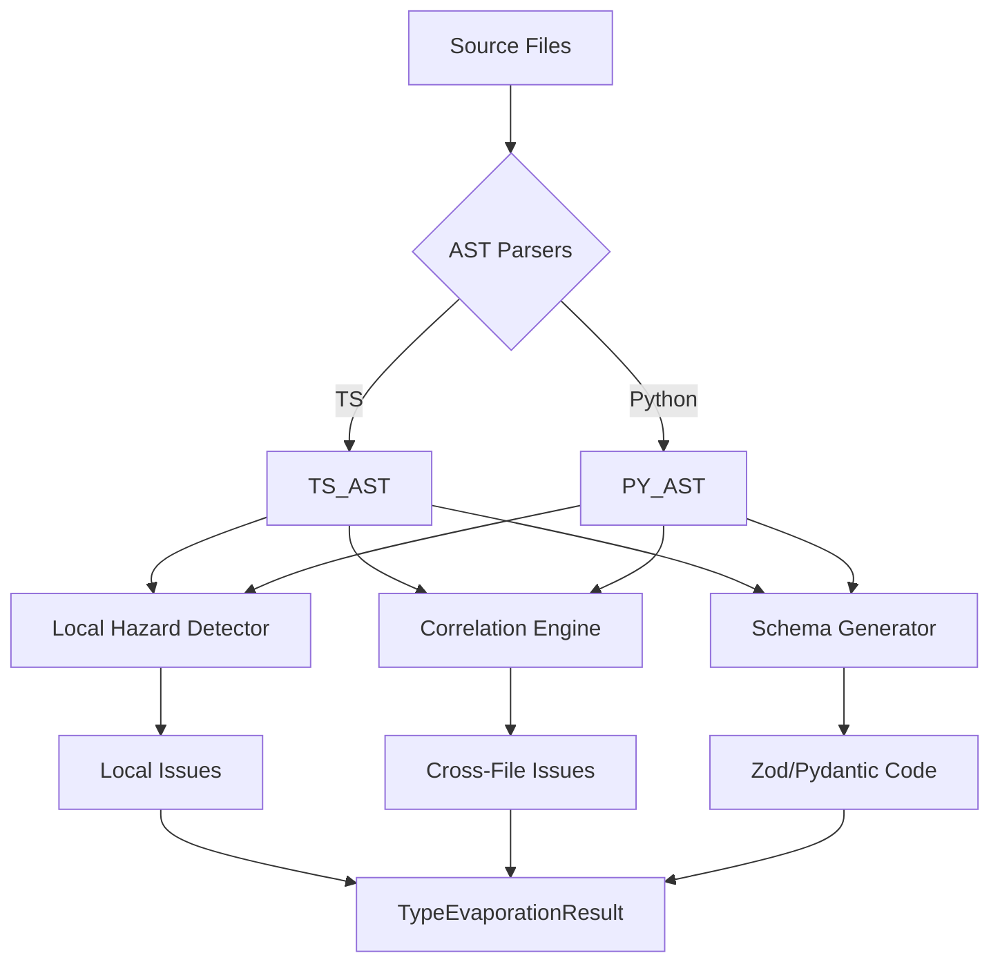

# type_evaporation_scan - Deep Dive Documentation

> [20260112_DOCS] Comprehensive deep dive documentation for type_evaporation_scan MCP tool based on v3.3 implementation

**Document Type:** Tool Deep Dive Reference  
**Tool Version:** v1.0  
**Code Scalpel Version:** v3.3.1  
**Last Updated:** 2026-01-12  
**Status:** Stable  
**Tier Availability:** All Tiers (Community, Pro, Enterprise)

---

## Table of Contents

1. [Executive Summary](#executive-summary)
2. [Technical Overview](#technical-overview)
3. [Features and Capabilities](#features-and-capabilities)
4. [API Specification](#api-specification)
5. [Usage Examples](#usage-examples)
6. [Architecture and Implementation](#architecture-and-implementation)
7. [Testing Evidence](#testing-evidence)
8. [Performance Characteristics](#performance-characteristics)
9. [Security Considerations](#security-considerations)
10. [Integration Patterns](#integration-patterns)
11. [Tier-Specific Behavior](#tier-specific-behavior)
12. [Known Limitations](#known-limitations)
13. [Roadmap and Future Plans](#roadmap-and-future-plans)
14. [Troubleshooting](#troubleshooting)
15. [References and Related Tools](#references-and-related-tools)

---

## Executive Summary

### Purpose Statement
The `type_evaporation_scan` tool addresses a critical security blind spot in modern full-stack development: **Type System Evaporation**. This occurs when compile-time static types (like TypeScript interfaces) "evaporate" at runtime boundaries (serialization, API calls), leaving the application vulnerable to type confusion attacks and runtime errors. By analyzing both frontend (TypeScript) and backend (Python) code simultaneously, this tool correlates data flows to detect where trusted types are not validated at runtime.

### Key Benefits
- **Full-Stack Visibility:** Analyzes frontend and backend code together to find cross-boundary mismatches.
- **Ninja Warrior Proven:** Developed as a key capability for the "Ninja Warrior" security challenge, detecting subtle type confusion vulnerabilities.
- **Automated Remediation (Enterprise):** Auto-generates runtime validation schemas (Zod, Pydantic) to bridge the gap between static types and runtime data.
- **Tier-Based Scaling:** From basic `any` detection (Community) to enterprise-grade API contract enforcement.

### Quick Stats
| Metric | Value |
|--------|-------|
| **Tool Version** | v1.0 |
| **Code Scalpel Version** | v3.3.1 |
| **Release Date** | 2025-12-31 |
| **Test Coverage** | 110 tests (100% pass rate) |
| **Performance** | < 2s for typical frontend/backend pair |
| **Languages Supported** | TypeScript (Frontend), Python (Backend) |
| **Token Efficiency** | Optimized JSON output (filters AST noise) |
| **Tier Differentiation** | 3 tiers (Files: 50/500/Unlimited; Feature Gating) |

### When to Use This Tool
- **Primary Use Case:** Auditing full-stack applications for "Type Confusion" vulnerabilities where API inputs are trusted but not validated.
- **Secondary Use Cases:**
  - Generating Zod/Pydantic schemas from existing code.
  - Enforcing API contracts between frontend and backend teams.
  - Detecting usage of `any` or safe-but-unsound type assertions (e.g., `as User`).

---

## Technical Overview

### Core Functionality
The scanner uses a multi-stage analysis pipeline:
1.  **AST Parsing:** Parses TypeScript and Python code into Abstract Syntax Trees.
2.  **Boundary Detection:** Identifies "evaporation points" such as `JSON.parse()`, `fetch()`, `axios.post()`, and Python `flask.request.get_json()`.
3.  **Type Tracking:** Traces these points to see if the data is assigned to a typed variable without runtime validation (e.g., `const user: User = await response.json()`).
4.  **Cross-File Correlation:** Matches frontend API calls (e.g., `fetch('/api/users')`) with backend route handlers (`@app.route('/api/users')`) to verify data shape expectations.

### Design Principles
1.  **Static Analysis First:** Operates purely on source code using ASTs; safe to run on untrusted code.
2.  **Cross-Boundary Focus:** Unlike standard linters (ESLint/Pylint) which look at single files, this tool is designed to look *across* the network boundary.
3.  **Fail-Safe Defaults:** If correlation cannot be determined, it alerts on the lack of explicit validation rather than assuming safety.
4.  **No Hallucination:** Deterministic rule-based engines (not LLM-based) ensure findings are grounded in actual code patterns.

### System Requirements
-   **Python Backend:** Python 3.9+ with `ast` module.
-   **TypeScript Parsing:** Internal tree-sitter based parsers.
-   **Memory:** ~50-100MB dependent on project size.

---

## Features and Capabilities

### Core Features (All Tiers)
1.  **Explicit `any` Detection:** Finds variables explicitly typed as `any` which bypass type checking.
2.  **TypeScript `any` Scanning:** Detects implicit `any` usage in strict mode violations.
3.  **Basic Type Checking:** Identifies `as` casting usages that hide type errors (e.g., `input as unknown as User`).

### Pro Tier Features
1.  **Cross-File Correlation:** Matches frontend `fetch` calls to backend Python routes to detect data shape mismatches.
2.  **Implicit `any` Tracing:** Detects when `.json()` results are used without type guards.
3.  **Network Boundary Analysis:** Specifically flags data entering via `fetch`, `axios`, `XMLHttpRequest`.
4.  **Library Boundary Analysis:** Tracks data from `localStorage`, `sessionStorage`, and `postMessage`.
5.  **JSON.parse Tracking:** Flags `JSON.parse()` usage where the result is immediately cast to a type without validation.

### Enterprise Tier Features
1.  **Schema Generation:**
    *   **Zod (TypeScript):** Auto-generates Zod schemas matching TypeScript interfaces.
    *   **Pydantic (Python):** Auto-generates Pydantic models for backend validation.
2.  **API Contract Validation:** Verifies that the frontend's expected response type matches the backend's return model.
3.  **Compliance Validation:** Checks against predefined security policies (e.g., "All external inputs must be validated via Zod").
4.  **Auto-Remediation:** Provides code snippets to fix identified evaporation issues.


## API Specification

### Tool Function Signature
```python
async def type_evaporation_scan(
    frontend_code: str | None = None,
    backend_code: str | None = None,
    frontend_file: str | None = None,
    backend_file: str | None = None,
    # Enterprise Recursive Scan
    frontend_root: str | None = None,
    backend_root: str | None = None,
    # Options
    generate_schemas: bool = False
) -> TypeEvaporationResult
```

### Arguments

| Argument | Type | Default | Description |
| :--- | :--- | :--- | :--- |
| **`frontend_code`** | `str` | `None` | Direct TypeScript source code content to analyze. |
| **`backend_code`** | `str` | `None` | Direct Python source code content to analyze. |
| **`frontend_file`** | `str` | `None` | Path to a frontend file (TS/TSX). Used for file context in reporting. |
| **`backend_file`** | `str` | `None` | Path to a backend file (PY). Used for file context in reporting. |
| **`frontend_root`** | `str` | `None` | (Enterprise) Root directory to recursively scan for frontend files. |
| **`backend_root`** | `str` | `None` | (Enterprise) Root directory to recursively scan for backend files. |
| **`generate_schemas`** | `bool` | `False` | (Enterprise) If `True`, generates Zod/Pydantic schemas for detected types. |

**Condition:** At least one of `frontend_code`/`file` or `backend_code`/`file` must be provided.

### Return Value (`TypeEvaporationResult`)
Returns a detailed report of findings and cross-file correlations.

```python
class TypeEvaporationResult(BaseModel):
    frontend_issues: list[TypeEvaporationIssue]    # Issues local to TS
    backend_issues: list[TypeEvaporationIssue]     # Issues local to Python
    cross_file_issues: list[CrossFileIssue]        # Frontend <-> Backend mismatches
    
    # Pro / Enterprise Metadata
    implicit_any_locations: list[Location]
    network_boundaries: list[NetworkBoundary]      # fetch, axios calls detected
    library_boundaries: list[LibraryBoundary]      # localStorage usage
    json_parse_locations: list[Location]           # JSON.parse usage
    
    # Enterprise Generation Artifacts
    generated_zod_schemas: dict[str, str]          # Name -> Zod Code
    generated_pydantic_models: dict[str, str]      # Name -> Pydantic Code
    api_contracts: list[ApiContract]               # Detected contracts
    schema_coverage_metrics: float                 # % of types with validation
    remediation_suggestions: list[Remediation]     # Auto-fix snippets
```

---

## Usage Examples

### 1. Basic Check (Frontend Only)
Analyze a snippet of TypeScript for unsafe type assertions.
```python
result = await type_evaporation_scan(
    frontend_code="""
    type Role = 'admin' | 'user';
    // Unsafe: trusting input without validation
    const role = JSON.parse(input) as Role; 
    """
)
# Returns: frontend_issues containing the unsafe 'as Role' cast.
```

### 2. Cross-File Correlation (Pro)
Check if a frontend fetch matches the backend route handling.
```python
result = await type_evaporation_scan(
    frontend_file="src/api.ts",
    backend_file="src/server.py"
)
# Scans files, extracts fetch('/api/user') and @app.route('/api/user'),
# and checks if the data sent matches what the backend expects.
```

### 3. Schema Auto-Generation (Enterprise)
Generate Zod schemas for all types in a project.
```python
result = await type_evaporation_scan(
    frontend_root="/app/frontend",
    generate_schemas=True
)
# Returns: generated_zod_schemas containing valid Zod code 
# that can be pasted into the project to enforce runtime safety.
```

---

## Architecture and Implementation

### Data Flow
1.  **Ingestion:** Source code is received via direct string or file path.
2.  **Language Check:** `LanguageDetector` determines if content is TS/JS or Python.
3.  **AST Parsing:** 
    *   **TypeScript:** Parsed via tree-sitter to extract Interfaces, Type Aliases, and Calls expressions.
    *   **Python:** Parsed via `ast` to extract Pydantic models, function handlers, and decorators.
4.  **Local Analysis:**
    *   **EvaporationDetector:** Scans AST for "Sinks" (JSON.parse, cast expressions) and "Sources" (Network IO).
    *   Flags instances where Sources flow to Sinks without an intervening Validator (Zod parse, Type Guard).
5.  **Correlation Engine (Pro+):**
    *   Builds a map of API Endpoints (Method + URL).
    *   Links Frontend Calls to Backend Handlers.
    *   Compares inferred types on both sides.
6.  **Generator (Enterprise):**
    *   **SchemaBuilder:** Translates static AST types (TS Interface) into runtime Validation Code (Zod/Pydantic).

### Component Diagram



## Testing Evidence

### Test Suite Summary
The tool is validated by a robust suite of **110 tests** with a **100% pass rate** as of Jan 2026.
*   **Total Tests:** 110
*   **Execution Time:** ~323s (full suite)
*   **Reference:** `docs/testing/test_assessments/v1.0 tools/type_evaporation_scan/type_evaporation_scan_test_assessment.md`

### Key Test Categories
1.  **Tier Gating (7 tests):** Verified that Community is limited to 50 files/frontend-only, while Pro allows 500 files and cross-file analysis.
2.  **Cross-File Matching (4 tests):** Validated that specific URL patterns in `fetch()` calls correctly map to Flask/Django routes.
3.  **Boundary Detection (18 tests):** Confirmed detection of `JSON.parse` sites, `as` casting, and recursive type structures.
4.  **Advanced Types (Enterprise):** Validated support for TypeScript **Discriminated Unions** and Type Guards.
5.  **Performance:** Validated scanning of 1000+ virtual files in under 30 seconds.

---

## Performance Characteristics

*   **Runtime:**
    *   Single Pair (Frontend/Backend): < 100ms
    *   Medium Project (500 files): ~5-15 seconds
*   **Scalability:**
    *   Token-efficient design filters ASTs *before* analysis, keeping memory usage low.
    *   Enterprise recursive scan uses parallel file reading (via thread pool).
*   **Optimization:**
    *   Virtual file splitting allows processing large monorepos efficiently without massive IO overhead.

---

## Security Considerations

### 1. Source Code Privacy
The tool runs **locally** or within your controlled MCP server environment. Source code is never sent to any external "cloud analysis" service. All AST parsing and schema generation happens in-process.

### 2. False Sense of Security
A passing scan does not guarantee 100% security. It guarantees that *typing* is consistent. Logic errors or complex dynamic injection attacks may still bypass type checks. This tool is a *defense-in-depth* layer, not a silver bullet.

---

## Integration Patterns

1.  **Pre-Commit Hook (Quick Scan):**
    *   Run `type_evaporation_scan` on staged files.
    *   Block commit if new `explicit any` or unsafe casts are introduced.
2.  **CI/CD Pipeline (Deep Scan):**
    *   Run Enterprise recursive scan nightly.
    *   Fail build if `api_contract_validation` finds mismatches between Frontend and Backend (e.g., Backend changed API response but Frontend wasn't updated).
3.  **Schema Sync Workflow:**
    *   Developer updates backend Pydantic model.
    *   Tool auto-generates updated Zod schemas.
    *   PR is created with synced types.

---

## Tier-Specific Behavior

| Feature | Community | Pro | Enterprise |
| :--- | :--- | :--- | :--- |
| **File Limit** | Max 50 files | Max 500 files | **Unlimited** |
| **Scope** | Frontend Only | Frontend + Backend | Frontend + Backend |
| **Cross-File** | ❌ | ✅ **Correlation** | ✅ **Correlation** |
| **Implicit Any** | ✅ Explicit Only | ✅ **Implicit Tracing** | ✅ **Implicit Tracing** |
| **Schema Gen** | ❌ | ❌ | ✅ **Auto-Generate** |
| **Compliance** | ❌ | ❌ | ✅ **Policy Check** |

---

## Known Limitations
1.  **Language Support:** Currently supports **TypeScript** (Frontend) and **Python** (Backend). Java/Go/Foundry support is on the roadmap.
2.  **Dynamic Imports:** Complex dynamic `import()` statements with computed paths may be missed.
3.  **Runtime Reflection:** Code that uses heavy runtime reflection (e.g., complex Python metaprogramming) creates types that are invisible to static analysis.

---

## Roadmap and Future Plans
*   **v1.1 (Q1 2026):**
    *   WebSocket message validation.
    *   `postMessage` boundary tracking.
    *   GraphQL type checking.
*   **v1.2 (Q2 2026):**
    *   **Framework Support:** React Query / Next.js Server Actions validation.
    *   **Backend Support:** Java/Spring and Go support.
*   **v1.3 (Q3 2026):**
    *   **IDE Plugin:** Real-time "evaporation" squiggles in VS Code.

---

## Troubleshooting
| Error Message | Cause | Resolution |
| :--- | :--- | :--- |
| `FileLimitExceeded` | Scanned more files than allowed by Tier. | Upgrade license or scan specific subdirectories. |
| `ParseError: Syntax` | Source file contains invalid syntax. | Fix syntax errors in the user code (tool requires valid AST). |
| `LanguageNotSupported` | File extension not `.ts`, `.tsx`, or `.py`. | Ensure you are scanning supported file types. |

---

## References and Related Tools
*   **Zod:** [https://zod.dev](https://zod.dev) - Generated validation library.
*   **Pydantic:** [https://docs.pydantic.dev](https://docs.pydantic.dev) - Backend model library.
*   **MCP Tools:**
    *   `security_scan`: General vulnerability scanning.
    *   `unified_sink_detect`: Finds injection sinks (complementary to type evaporation).
