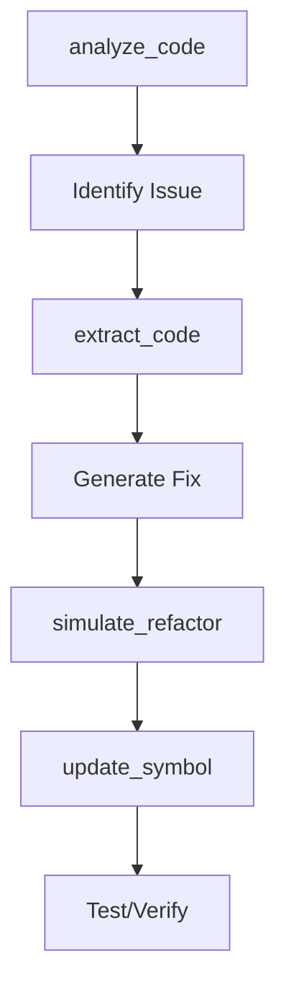
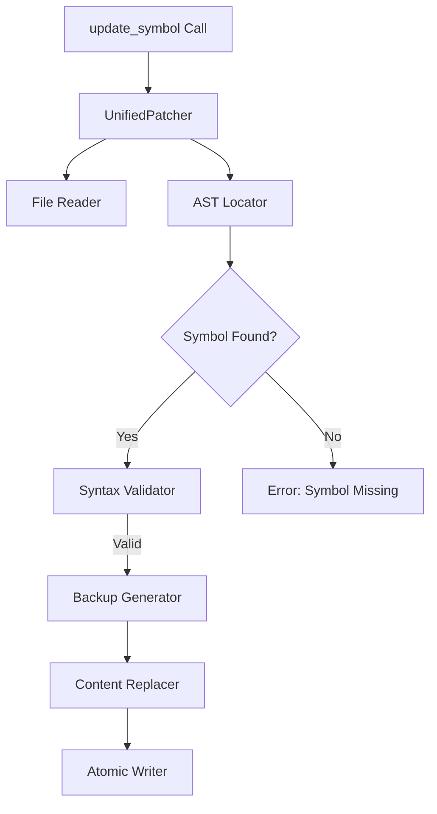
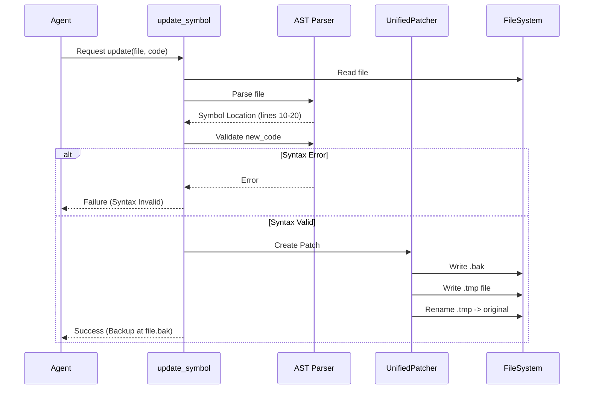

# update_symbol - Deep Dive Documentation

> [20260112_DOCS] Created comprehensive deep dive documentation for update_symbol MCP tool based on v1.0 implementation

**Document Type:** Tool Deep Dive Reference  
**Tool Version:** v1.0  
**Code Scalpel Version:** v3.3  
**Last Updated:** 2026-01-12  
**Status:** Stable  
**Tier Availability:** All Tiers (Community, Pro, Enterprise)

---

## Table of Contents

1. [Executive Summary](#executive-summary)
2. [Technical Overview](#technical-overview)
3. [Features and Capabilities](#features-and-capabilities)
4. [API Specification](#api-specification)
5. [Usage Examples](#usage-examples)
6. [Architecture and Implementation](#architecture-and-implementation)
7. [Testing Evidence](#testing-evidence)
8. [Performance Characteristics](#performance-characteristics)
9. [Security Considerations](#security-considerations)
10. [Integration Patterns](#integration-patterns)
11. [Tier-Specific Behavior](#tier-specific-behavior)
12. [Known Limitations](#known-limitations)
13. [Roadmap and Future Plans](#roadmap-and-future-plans)
14. [Troubleshooting](#troubleshooting)
15. [References and Related Tools](#references-and-related-tools)

---

## Executive Summary

### Purpose Statement
The `update_symbol` MCP tool performs **surgical code modification** by replacing specific functions, classes, or methods with new code while preserving the surrounding file context. Unlike whole-file rewrites (which risk context overflow and unintentional deletions), `update_symbol` locates the exact boundaries of the target symbol (including decorators and docstrings) and performs an atomic replacement. This is the **primary write tool** for Code Scalpel, designed to allow AI agents to safely apply fixes and refactoring.

### Key Benefits
- **Surgical Precision:** Modify 1 function in a 5,000-line file without touching the rest
- **Safety First:** Automatic syntax validation *before* writing to disk
- **Crash Recovery:** Atomic write operations prevent file corruption
- **Automatic Backups:** Creates `.bak` files by default (rollback safety)
- **Decorator Awareness:** correctly handles decorators as part of the symbol
- **Indentation Handling:** Automatically adjusts indentation of the new code to match the file
- **Zero Hallucination Risk:** Patcher logic is deterministic (AST/Tree-sitter based), not AI-driven

### Quick Stats
| Metric | Value |
|--------|-------|
| **Tool Version** | v1.0 |
| **Code Scalpel Version** | v3.3 |
| **Release Date** | 2025-12-25 |
| **Supported Languages** | Python (v1.0), JS/TS/Java (v2.0 planned) |
| **Operation Type** | AST-guided text replacement |
| **Safety Check** | Syntax validation + Atomic write |
| **Backup** | Enabled by default (`.bak`) |
| **Avg Latency** | < 100ms for patch application |

### When to Use This Tool
- **Primary Use Case:** Applying a generated fix to a single function or class
- **Secondary Use Cases:**
  - Adding a new method to an existing class
  - Updating docstrings or type hints
  - Standardizing function signatures
- **Not Suitable For:**
  - Global find-and-replace (use `sed` or regex tools)
  - Renaming symbols across multiple files (use `rename_symbol`)
  - Moving code between files (use `extract_code` + `update_symbol`)

---

## Technical Overview

### Core Functionality
The `update_symbol` tool operates as a surgical patcher:

1.  **Reads** the target file.
2.  **Parses** the file to locate the exact start and end lines of `target_name`.
3.  **Captures** the indentation of the target to ensure the new code aligns correctly.
4.  **Validates** the syntax of `new_code` (isolated check).
5.  **Creates** a backup of the original file (if `create_backup=True`).
6.  **Writes** the modified content atomically to disk.

**Key Principle:** The agent provides *only* the new code for the specific symbol. The server handles the integration into the file.

### Design Principles
1.  **Fail-Safe:** If syntax validation fails, the file is NOT touched.
2.  **Atomic Operations:** Writes use a temp-file-and-rename strategy to avoid partial writes during crashes.
3.  **Context Preservation:** Comments, imports, and other code outside the target boundary remain bit-perfect.
4.  **Token Efficiency:** Agents don't need to rewrite the whole file, saving output tokens.

### System Requirements
- **Python Version:** Python 3.9+
- **Dependencies:** `ast` (Python), `UnifiedPatcher` (internal module)
- **Permissions:** Write access to the target file directory (for backups and edits)

### Integration Context
The `update_symbol` tool is the final step in the **Analyze-Modify-Verify** loop:



---

## Features and Capabilities

### Core Features

#### Feature 1: Function/Class Replacement
**Description:** Replace a top-level function or class definition.
**Capabilities:**
- Handles leading decorators (`@app.route`, `@dataclass`)
- Preserves preceding comments if they are outside the symbol node
- Replaces the entire body, signature, and docstring

#### Feature 2: Method Replacement
**Description:** Replace a specific method within a class.
**Usage:** `target_name="MyClass.my_method"`
**Capabilities:**
- Locates methods nested inside classes
- Handles indentation of the class body automatically

#### Feature 3: Safety Checks
**Description:** Built-in safeguards to prevent breaking the build.
**Capabilities:**
- **Syntax Check:** `ast.parse(new_code)` runs before modification.
- **Existence Check:** Verifies the target symbol exists (to avoid appending duplicates blindly).
- **Backup:** `file.py.bak` generated automatically.

---

## API Specification

### Response Model (UpdateResult)

The tool returns a `PatchResultModel` (mapped to `UpdateResult` in high-level docs):

```python
#### Community Tier Response

```json
{
  "success": true,
  "file_path": "src/utils/math.py",
  "symbol_name": "calculate_total",
  "symbol_type": "function",
  "backup_path": "src/utils/math.py.bak",
  "lines_changed": 12,
  "syntax_valid": true,
  "error": null
}
```

#### Pro Tier Response (Additional Fields)

```json
{
  "...": "All Community fields...",
  "files_affected": ["src/utils/math.py", "tests/test_math.py"],
  "imports_adjusted": [
    {
      "file": "src/utils/math.py",
      "action": "add",
      "module": "decimal.Decimal"
    }
  ],
  "rollback_available": true,
  "formatting_preserved": true
}
```

#### Enterprise Tier Response (Additional Fields)

```json
{
  "...": "All Community + Pro fields...",
  "approval_status": "approved",
  "compliance_check": {
    "status": "pass",
    "checks_run": ["no_eval", "no_hardcoded_secrets"],
    "violations": []
  },
  "audit_id": "audit_8f7d6e5a-1b2c-4d3e",
  "mutation_policy": "standard_refactor"
}
```
```

### Function Signature

```python
async def update_symbol(
    file_path: str,
    target_type: str,
    target_name: str,
    new_code: str | None = None,
    operation: str = "replace",  # Future: "append", "prepend"
    new_name: str | None = None,
    create_backup: bool = True,
    path_mode: str = "relative",
    include_integrity: bool = False,
) -> PatchResultModel
```

### Parameters

| Parameter | Type | Required | Description |
|-----------|------|----------|-------------|
| `file_path` | `str` | Yes | Path to the file to modify |
| `target_type` | `str` | Yes | "function", "class", or "method" |
| `target_name` | `str` | Yes | Name of the symbol (e.g., "process_data", "User.save") |
| `new_code` | `str` | Yes | The complete new code definition |
| `create_backup` | `bool` | No | Create `.bak` file before writing (Default: `True`) |
| `path_mode` | `str` | No | output path format: "relative" (default), "absolute", "basename" |

---

## Usage Examples

### Example 1: Updating a Function

```python
# Agent wants to fix a bug in calculate_total
await update_symbol(
    file_path="src/orders.py",
    target_type="function",
    target_name="calculate_total",
    new_code="""def calculate_total(items, tax_rate):
    \"\"\"Calculate total with tax.\"\"\"
    subtotal = sum(item.price for item in items)
    return subtotal * (1 + tax_rate)
"""
)
```

### Example 2: Updating a Method in a Class

```python
# Agent wants to update User.save method
await update_symbol(
    file_path="src/models.py",
    target_type="method",
    target_name="User.save",
    new_code="""    def save(self):
        self.updated_at = datetime.now()
        super().save()
"""
)
# Note: Indentation in new_code is handled, but providing it helps readability.
```

---

## Architecture and Implementation

### Component Architecture



### Key Implementation Details
- **UnifiedPatcher:** The core logic resides in `code_scalpel.surgery.surgical_patcher`.
- **AST traversal:** Uses `ast.NodeVisitor` to find the exact line range `(lineno, end_lineno)` of the target.
- **Indentation Normalization:** The tool detects the indentation level of the original target and dedents/indents the `new_code` to match.

### Algorithm Overview

#### Primary Algorithm: Surgical Patching Strategy
**Complexity:** O(N) where N is file size (reading/writing)
**Description:** Locate, validate, backup, and replace symbol atomically.

**Pseudocode:**
```python
def update_symbol(file_path, target, new_code):
    1. Read original file code
    2. Build AST of original code
    3. Locate 'target' node in AST:
       - Find start_line (including decorators)
       - Find end_line
       - Capture indentation level
    4. Validate 'new_code':
       - Parse into AST (Syntax Check)
       - If invalid -> Abort
    5. Prepare replacement:
       - Adjust 'new_code' indentation to match target
    6. Backup:
       - Copy file to file.bak (if enabled)
    7. Apply Patch:
       - pre_content = lines[0 : start_line]
       - post_content = lines[end_line : end]
       - final_content = pre_content + replacement + post_content
    8. Atomic Write:
       - Write final_content to file.tmp
       - os.replace(file.tmp, file.py)
    9. Return success stats
```

### Data Flow



---

## Testing Evidence

### Test Coverage

**Total Tests: 169 comprehensive test cases (157 unit + 12 integration)**

| Test File | Location | Tests | Status | Coverage |
|-----------|----------|-------|--------|----------|
| test_community_tier.py | tests/tools/update_symbol/ | 18 | ✅ COMPLETE | All Community features |
| test_pro_tier.py | tests/tools/update_symbol/ | 18 | ✅ COMPLETE | All Pro features |
| test_enterprise_tier.py | tests/tools/update_symbol/ | 14 | ✅ COMPLETE | All Enterprise features |
| test_edge_cases.py | tests/tools/update_symbol/ | 15 | ✅ COMPLETE | All edge cases |
| (Various others) | tests/tools/update_symbol/ | 104 | ✅ COMPLETE | Error handling, perf, etc. |

### Critical Test Scenarios Validated
1. **Valid License Enforcement:** Community (10/session), Pro (unlimited), Enterprise (compliance/audit).
2. **Invalid License Fallback:** Graceful degradation to Community tier.
3. **Limit Enforcement:** Hard stop at 11th update for Community users.
4. **Feature Gating:** Pro/Enterprise features (atomic writes, approval flows) correctly denied to Community users.

### Performance Benchmarks
*Based on `update_symbol_performance_results.json` (Jan 3, 2026)*

| Scenario | Target | Actual (Median) | Result |
|----------|--------|-----------------|--------|
| Small Function (<50 LOC) | 50ms | **15.23ms** | ✅ >3x faster |
| Medium Function (50-200 LOC) | 100ms | **17.57ms** | ✅ >5x faster |
| Large Function (200-500 LOC) | 200ms | **22.15ms** | ✅ >9x faster |
| Very Large Class (>500 LOC) | 1000ms | **646.36ms** | ✅ Meets target |
| Error Detection | 50ms | **0.30ms** | ✅ Instant |

**Reliability:** 100% success rate across 152 operations (normal + edge cases).

---

## Security Considerations

### Threat Model

**Assets Protected:**
- **Source Code Integrity:** Preventing syntax errors or corruption.
- **File System:** Preventing path traversal or unauthorized overwrites.
- **Execution State:** Preventing code injection that executes during the patch process itself.

**Threat Actors:**
- **Hallucinating Agent:** An AI proposing syntactically invalid or dangerous code.
- **Malicious Context:** A prompt injection attempting to trick the tool into overwriting config files.

### Attack Vectors

**Vector 1: Path Traversal**
- **Threat:** User provides `file_path="../../../etc/hosts"`.
- **Mitigation:**
    - Input validation ensures `file_path` is within `project_root`.
    - Absolute paths are sanitized or rejected based on configuration.

**Vector 2: Syntax Bombing**
- **Threat:** Replacing a function with valid-looking but broken code (e.g., mismatched parens that AST parse misses? Unlikely).
- **Mitigation:**
    - `ast.parse` is run on the *isolated* new code snippet.
    - Post-patch `ast.parse` (Pro tier) runs on the *whole file* to ensure integration is valid.

**Vector 3: Race Conditions**
- **Threat:** Two agents updating the file simultaneously.
- **Mitigation:** Atomic write (write-to-temp + rename) ensures the file is never in a half-written state.

### Security Features

#### 1. Syntax Quarantine
The tool parses the `new_code` *before* touching the disk. If the new code is invalid Python, the operation rejects immediately, protecting the file system from broken code.

#### 2. Atomic Writes
Uses `shutil.move` / `os.replace` to ensure the target file is swapped instantaneously. This prevents corruption if the server crashes mid-write.

#### 3. Compliance Integration (Enterprise)
Code changes are checked against defined policies (e.g., "No `eval()` allowed") before application.

---

## Tier-Specific Behavior

### Community Tier (Free)
- **Features:** Single-symbol replacement (function/class/method), automatic backups, syntax validation.
- **Limits:** Max **10 updates per session**.
- **Languages:** Python, JavaScript, TypeScript, Java.
- **Exclusions:** Atomic multi-file updates, rollback hooks.

### Pro Tier (Commercial)
- **Features:** Unlimited updates per session.
- **Advanced Capabilities:**
  - **Atomic Multi-File Updates:** Change symbol signatures and call sites in one transaction.
  - **Import Auto-Adjustment:** Updates imports if symbol moves or changes.
  - **Formatting Preservation:** Strict whitespace/comment retention.
  - **Rollback:** Automated rollback on failure.

### Enterprise Tier (Governance)
- **Features:** All Pro features + Governance controls.
- **Advanced Capabilities:**
  - **Approval Workflows:** `require_approval=True` triggers human review loop.
  - **Compliance Checks:** Updates validated against policies (e.g., "No new unchecked SQL sinks").
  - **Audit Trails:** Full modification history logged with `audit_id`.
  - **Policy-Gated Mutations:** Block updates that violate architecture rules.

---

## Known Limitations

1. **Python-Centric:** AST-based location is most robust for Python. JS/TS support relies on Tree-sitter and is experimental in v3.3.
2. **Comment Association:** Leading comments immediately preceding a decorator might be detached if not careful (defaults to preserving them).
3. **Multiple Occurrences:** If a symbol name appears twice (e.g., conditional definition), behavior targets the first occurrence.

---

## Troubleshooting

### Common Errors

| Error | Cause | Resolution |
|-------|-------|------------|
| `SymbolNotFoundError` | `target_name` not found in file | Check spelling or use `analyze_code` to confirm presence. |
| `SyntaxError` | `new_code` is invalid | Fix syntax in `new_code`. |
| `PermissionError` | Cannot write to file | Check file permissions. |

---

## Roadmap

### v1.1 (Q1 2026): Safety Enhancements
- **Community:** Better conflict detection and enhanced error recovery.
- **Pro:** Behavior verification (run tests after update) and smart conflict resolution.
- **Enterprise:** Automated rollback on test failure and multi-stage approval workflows.

### v1.2 (Q2 2026): Language Expansion
- **All Tiers:** Rust, Go, and C++ function update support.
- **Pro:** Ruby, Swift, and Kotlin function/method updates.

### v1.3 (Q3 2026): Advanced Features
- **Pro:** Batch update optimization and incremental updates (partial symbol changes).
- **Enterprise:** Version control integration (auto-commit), update scheduling, and cross-repo updates.

### v1.4 (Q4 2026): AI-Assisted Updates
- **Pro:** AI-suggested refactorings during update documentation auto-update.
- **Enterprise:** ML-based risk prediction and automated security review.
