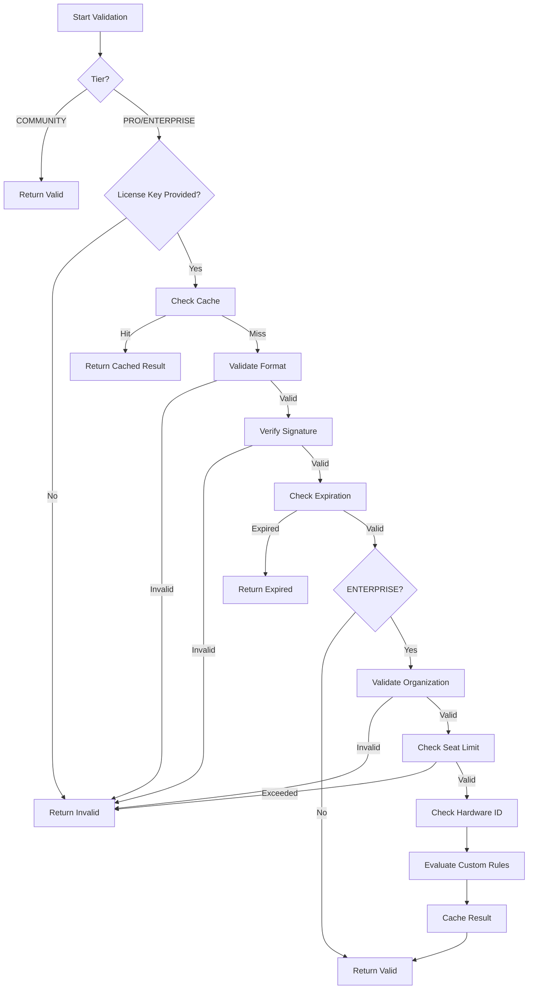

# Code Scalpel Licensing System

**[20251225_DOCS] Created comprehensive licensing documentation**
**[20251225_FEATURE] v3.3.0 - JWT-based license validation system (NEW)**
**[20251228_DOCS] Updated license installation to file-only discovery (`CODE_SCALPEL_LICENSE_PATH` / `--license-file`) and strict expiration posture**

This directory contains the licensing system for Code Scalpel, providing tier-based feature access control and license validation.

## Quick Start (v3.3.0+)

### Check Your License

```python
from code_scalpel.licensing import get_current_tier, get_license_info

# Simple tier check
tier = get_current_tier()  # Returns: "community", "pro", or "enterprise"

# Detailed license info
info = get_license_info()
print(f"Tier: {info['tier']}")
print(f"Valid: {info['is_valid']}")
print(f"Expires: {info['days_until_expiration']} days")
```

### Install a License

Three ways to provide your JWT license (file-only discovery):

**Option 1: MCP Server CLI (explicit override)**
```bash
code-scalpel mcp --license-file /path/to/license.jwt
```

**Option 2: Environment Variable (path to file)**
```bash
export CODE_SCALPEL_LICENSE_PATH=/path/to/license.jwt
```

**Option 3: Default License Locations (no env needed)**
```bash
# Project-local (recommended)
mkdir -p .code-scalpel
cp /path/to/license.jwt .code-scalpel/license.jwt

# Or user config
mkdir -p ~/.config/code-scalpel
cp /path/to/license.jwt ~/.config/code-scalpel/license.jwt

# Or legacy filename (still supported)
cp /path/to/license.jwt .scalpel-license
```

### Remote Verifier Mode (Beta/Production)

> [20251228_DOCS] Documented beta/prod verifier availability assumption and local-dev Docker usage.

If `CODE_SCALPEL_LICENSE_VERIFIER_URL` is set (defaults to `https://verifier.codescalpel.dev`), the MCP server consults the remote
verifier as the source of truth for paid-tier entitlements.

- **Beta/production:** assumes the verifier/auth server is reachable
- **Local development:** use the Docker verifier container and set the verifier URL
- **Outage tolerance:** cached entitlements can be used briefly if the verifier is down

```bash
# Override default (https://verifier.codescalpel.dev) for local dev:
export CODE_SCALPEL_LICENSE_VERIFIER_URL="http://scalpel-verifier:8000"
```

### Generate Test Licenses

```bash
python -m code_scalpel.licensing.jwt_generator \
    --tier pro \
    --customer "test_user" \
    --organization "Test Org" \
    --duration 365 \
    --algorithm HS256 \
    --secret "test_secret_key_12345" \
    --output .scalpel-license
```

---

## JWT License System (v3.3.0+)

[20251225_FEATURE] Industry-standard JWT (JSON Web Token) based license validation.

### Architecture

```
User/Agent
    ↓
Tool Handler
    ↓
get_current_tier()
    ↓
JWTLicenseValidator.validate()
    ↓
Load token (license file)
    ↓
Verify JWT signature (RS256/HS256)
    ↓
Check expiration (strict: expired never grants paid tier)
    ↓
Return tier: "community", "pro", or "enterprise"
```

### Key Features

- **Industry Standard**: RFC 7519 compliant JWT tokens
- **Cryptographically Secure**: RS256 (RSA) or HS256 (HMAC) signature verification
- **Tamper-Proof**: Invalid signature = invalid license
- **Offline Validation (File-Based)**: No network required when validating from a local license file
- **Remote Verifier (Optional)**: If `CODE_SCALPEL_LICENSE_VERIFIER_URL` is set, the verifier is authoritative; cache/grace is for temporary outages
- **Strict Expiration**: Expired licenses downgrade immediately
- **Flexible Configuration**: `CODE_SCALPEL_LICENSE_PATH` or standard license file locations

### JWT Token Structure

```json
{
  "iss": "code-scalpel-licensing",
  "sub": "customer_id_12345",
  "tier": "pro",
  "features": [
    "cognitive_complexity",
    "context_aware_scanning",
    "remediation_suggestions"
  ],
  "exp": 1735689600,
  "iat": 1704153600,
  "organization": "Acme Corp",
  "seats": 10
}
```

### Modules

#### `jwt_validator.py` - JWT License Validation
Validates JWT-based license tokens using cryptographic signatures.

**Key Classes:**
- `JWTLicenseValidator`: Main validator class
- `JWTLicenseData`: Validation result
- `JWTAlgorithm`: Supported algorithms (RS256, HS256)

**Key Functions:**
- `get_current_tier()`: Get current tier from license
- `get_license_info()`: Get detailed license information

**Features:**
- RS256 signature verification (public key)
- HS256 signature verification (shared secret)
- Expiration checking
- Grace period support (7 days)
- Offline validation
- Load from environment variable or file

**Usage:**
```python
from code_scalpel.licensing import JWTLicenseValidator, get_current_tier

# Simple tier check (recommended for tool handlers)
tier = get_current_tier()

# Detailed validation
validator = JWTLicenseValidator(algorithm="RS256")
result = validator.validate()
print(f"Valid: {result.is_valid}")
print(f"Tier: {result.tier}")
print(f"Expires: {result.days_until_expiration} days")
```

#### `jwt_generator.py` - JWT License Generation
Generate JWT-based license keys for testing and deployment.

**Command-Line Interface:**
```bash
# Generate Pro license (RS256)
python -m code_scalpel.licensing.jwt_generator \
    --tier pro \
    --customer "customer_id" \
    --organization "Org Name" \
    --duration 365

# Generate Enterprise license with seats (HS256 for testing)
python -m code_scalpel.licensing.jwt_generator \
    --tier enterprise \
    --customer "customer_id" \
    --seats 50 \
    --duration 730 \
    --algorithm HS256 \
    --secret "test_secret_key"

# Generate and print to stdout
python -m code_scalpel.licensing.jwt_generator \
    --tier pro \
    --customer "test" \
    --duration 365 \
    --print
```

**Programmatic Usage:**
```python
from code_scalpel.licensing.jwt_generator import generate_license

token = generate_license(
    tier="pro",
    customer_id="customer_123",
    organization="Acme Corp",
    duration_days=365,
    algorithm="HS256",
    secret_key="test_secret"
)
```

### License Loading Priority

License files are discovered in this order (file-only discovery):

1. **Environment Variable (path)**: `CODE_SCALPEL_LICENSE_PATH`
2. **Local Project**: `.code-scalpel/license.jwt`
3. **User Config**: `~/.config/code-scalpel/license.jwt`
4. **Legacy User Config**: `~/.code-scalpel/license.jwt`
5. **Legacy Local**: `.scalpel-license`
6. **Default**: Community tier (no license required)

### Signature Algorithms

**RS256 (Recommended for Production)**
- Asymmetric encryption using RSA-2048
- Public key embedded in distribution
- Private key kept secure by Code Scalpel
- Cannot generate licenses without private key
- More secure

**HS256 (For Development/Testing)**
- Symmetric encryption using SHA-256 HMAC
- Shared secret for development
- Set via `CODE_SCALPEL_SECRET_KEY` env var
- Simpler but less secure
- Good for testing

### Expiration & Grace Period

> [20251227_DOCS] Strict posture: expired licenses never grant paid tier. The "grace period" is informational only (used for renewal messaging).

**Valid License**
```python
{
    "is_valid": True,
    "is_expired": False,
    "tier": "pro",
    "days_until_expiration": 45
}
```

**Grace Period (within 7 days of expiration)**
```python
{
    "is_valid": False,
    "is_expired": True,
    "tier": "pro",  # Tier claim may still be present for messaging
    "is_in_grace_period": True,
    "days_until_expiration": -3
}
```

**Expired (beyond grace period)**
```python
{
    "is_valid": False,
    "is_expired": True,
    "tier": "pro",  # Tier claim may still be present; effective tier remains community
    "is_in_grace_period": False
}
```

### Tool Handler Pattern

```python
from code_scalpel.licensing import get_current_tier, get_tool_capabilities

def security_scan_handler(code: str, options: dict):
    # 1. Get current tier from JWT license
    tier = get_current_tier()
    
    # 2. Get capabilities for this tool at this tier
    caps = get_tool_capabilities("security_scan", tier)
    
    # 3. Apply tier-specific limits
    vulnerabilities = run_taint_analysis(code)
    if caps.limits.get("max_findings"):
        vulnerabilities = vulnerabilities[:caps.limits["max_findings"]]
    
    # 4. Add tier-specific features
    if "remediation_suggestions" in caps.capabilities:
        vulnerabilities = add_remediation_hints(vulnerabilities)
    
    if "compliance_mapping" in caps.capabilities:
        vulnerabilities = add_compliance_context(vulnerabilities)
    
    # 5. Return results (no upgrade hints - users consult docs)
    return {
        "vulnerabilities": vulnerabilities,
        "tier": tier,
    }
```

### Security Properties

**Tamper-Proof**
- Any modification to token invalidates signature
- Changing tier: ❌ Signature fails
- Extending expiration: ❌ Signature fails
- Adding features: ❌ Signature fails

**Offline Validation**
- Public key verification (RS256)
- No network call required
- No "phone home" to license server
- Privacy-preserving

**Key Rotation**
- Recommended: Rotate private key annually
- New public key distributed via package updates
- Support multiple public keys during transition

---

**Features:**
- [COMPLETED] Format validation for license keys
- [COMPLETED] HMAC-SHA256 signature verification
- [COMPLETED] Expiration date checking
- [COMPLETED] Online validation with fallback to offline
- [COMPLETED] Result caching (5-minute TTL)
- [COMPLETED] ENTERPRISE: Organization binding
- [COMPLETED] ENTERPRISE: Seat limit enforcement
- [COMPLETED] ENTERPRISE: Hardware fingerprinting
- [COMPLETED] ENTERPRISE: Custom validation rules

**Usage:**
```python
from code_scalpel.licensing import LicenseValidator

validator = LicenseValidator()

# COMMUNITY tier (no license required)
result = validator.validate(tier="community")
print(f"Valid: {result.is_valid}")  # True

# PRO tier (requires license key)
result = validator.validate(
    license_key="SCALPEL-PRO-1234567890-ABCD-12345678",
    tier="pro"
)
print(f"Valid: {result.is_valid}")
print(f"Expires: {result.expiration_date}")

# ENTERPRISE tier (with organization and seat tracking)
result = validator.validate(
    license_key="SCALPEL-ENTERPRISE-1234567890-A1B2C3D4-50-12345678",
    tier="enterprise",
    organization="Acme Corp",
    seats_used=25
)
print(f"Valid: {result.is_valid}")
print(f"Seats: {result.seats_used}/{result.seats}")
print(f"Organization: {result.organization}")
```

#### `tier_detector.py` - Tier Detection
Detects the current license tier from environment variables, config files, or defaults.

**Detection Order:**
1. Environment variable: `CODE_SCALPEL_TIER`
2. License key tier extraction: Parses `SCALPEL-{TIER}-{DATA}` format
3. Config file: `.code-scalpel/license.json` (with metadata extraction)
4. Organization-based detection: `CODE_SCALPEL_ORGANIZATION` env var
5. Default: `COMMUNITY`

**Features:**
- [COMPLETED] Multi-source tier detection with priority ordering
- [COMPLETED] License key tier extraction (parses tier from license key format)
- [COMPLETED] Organization-based tier assignment (per-org tier configuration)
- [COMPLETED] Tier inheritance from parent organizations (hierarchical support)
- [COMPLETED] Custom tier definitions (map custom names to standard tiers)
- [COMPLETED] Comprehensive validation and audit logging
- [COMPLETED] In-memory caching with force refresh option
- [COMPLETED] Metadata extraction (license key, organization, hierarchy)

**Usage:**
```python
from code_scalpel.licensing import TierDetector

detector = TierDetector()

# Basic detection (uses all sources in priority order)
result = detector.detect()
print(f"Detected tier: {result.tier}")
print(f"Source: {result.source}")
print(f"Confidence: {result.confidence}")

# Detect with license key
result = detector.detect(license_key="SCALPEL-PRO-1234567890-ABCD-12345678")
print(f"Tier from license: {result.tier}")

# Force refresh (bypass cache)
result = detector.detect(force_refresh=True)

# Organization-based detection (set environment variable first)
import os
os.environ["CODE_SCALPEL_ORGANIZATION"] = "Acme Corp"
result = detector.detect()
if result.source == "organization":
    print(f"Organization: {result.organization}")
    print(f"Parent orgs: {result.parent_organizations}")

# Custom tier definitions
detector.set_custom_tier("startup", "pro")
detector.set_custom_tier("corporate", "enterprise")

# Assign tier to organization
detector.set_organization_tier(
    org_name="Acme Corp",
    tier="enterprise",
    parent_orgs=["Global Holdings", "Tech Division"]
)

# Check tier level
if detector.is_pro_or_higher():
    print("PRO or ENTERPRISE features enabled")

if detector.is_enterprise():
    print("ENTERPRISE features enabled")
```

#### `license_manager.py` - Central License Management
Coordinates tier detection, validation, and feature availability checks.

**Features:**
- [COMPLETED] Tier-based feature registry with hierarchical availability
- [COMPLETED] Graceful degradation with helpful upgrade messages
- [COMPLETED] License state persistence to JSON file
- [COMPLETED] License key validation integration with LicenseValidator
- [COMPLETED] Expiration handling with datetime tracking
- [COMPLETED] Grace period support (30-day default, configurable)
- [COMPLETED] License renewal reminders with tiered urgency
- [COMPLETED] Seat counting with thread-safe active user tracking
- [COMPLETED] Concurrent usage limits and seat enforcement
- [COMPLETED] Organization management with hierarchy support
- [COMPLETED] Custom license terms evaluation

**Usage:**
```python
from code_scalpel.licensing import LicenseManager

manager = LicenseManager()

# Check if a feature is available
if manager.is_feature_available("cross_file_security_scan"):
    # Use the feature
    pass
else:
    # Show upgrade message
    print(manager.get_upgrade_message("cross_file_security_scan"))

# Get current license info
info = manager.get_license_info()
print(f"Tier: {info.tier}")
print(f"Valid: {info.is_valid}")
print(f"Features: {len(info.features)}")
print(f"Expires: {info.expiration_date}")
print(f"Grace period: {info.is_in_grace_period}")
print(f"Seats: {info.seats_used}/{info.seats}")

# Check expiration status
expiration = manager.check_expiration()
if expiration:
    print(f"Days until expiration: {expiration['days_until_expiration']}")
    print(f"Needs renewal: {expiration['needs_renewal']}")

# Get renewal reminder
reminder = manager.get_renewal_reminder()
if reminder:
    print(reminder)

# Seat management (ENTERPRISE)
user_id = "user@example.com"
if manager.add_user(user_id):
    print(f"User {user_id} added")
else:
    print("Seat limit exceeded")

# Get concurrent usage stats
usage = manager.get_concurrent_usage()
print(f"Active users: {usage['active_users']}")
print(f"Utilization: {usage['utilization_percent']:.1f}%")

# Organization management
org_info = manager.get_organization_info()
if org_info:
    print(f"Organization: {org_info['name']}")
    print(f"Parent orgs: {org_info['parent_organizations']}")

# Custom license terms
terms = manager.get_custom_terms()
if manager.is_term_enabled("allow_offline"):
    print("Offline mode enabled by license terms")

# Clean up user session
manager.remove_user(user_id)
```

#### `cache.py` - License Cache
High-performance caching layer for validation results with persistence, distributed cache support, and encryption.

**Features:**
- [COMPLETED] Thread-safe cache access with threading.RLock
- [COMPLETED] Configurable TTL (default: 1 hour)
- [COMPLETED] Automatic expiration handling with cleanup
- [COMPLETED] Cache invalidation on license changes (invalidate_by_license_key)
- [COMPLETED] P1_HIGH: Persistent cache to disk (JSON-based with automatic save/load)
- [COMPLETED] P2_MEDIUM: Distributed cache support (Redis integration with graceful fallback)
- [COMPLETED] P3_LOW: Cache replication (master-slave pattern for high availability)
- [COMPLETED] P4_LOW: Cache encryption (XOR cipher with base64 encoding for at-rest security)
- [COMPLETED] P3_LOW: Cache statistics and metrics (hits/misses/hit_rate tracking)

**Basic Usage:**
```python
from code_scalpel.licensing import LicenseCache

cache = LicenseCache(ttl_seconds=3600)  # 1 hour TTL

# Check cache
entry = cache.get("license_key_hash")
if entry and not entry.is_expired():
    print(f"Cached result: {entry.is_valid}")
else:
    # Validate and cache
    result = validator.validate(license_key, tier)
    cache.set(
        "license_key_hash",
        tier,
        result.is_valid,
        license_key=license_key  # For invalidation tracking
    )
```

**P1_HIGH: Persistent Cache to Disk:**
```python
from pathlib import Path

# Enable persistence
cache = LicenseCache(
    ttl_seconds=3600,
    persistence_path=Path(".code-scalpel/license_cache.json")
)

# Or via environment variable
os.environ["CODE_SCALPEL_CACHE_PERSIST"] = "true"
cache = LicenseCache()

# Cache automatically loads from disk on init
# and saves on each set() operation
cache.set("key", "pro", True)

# Manual stats
stats = cache.stats()
print(f"Persists: {stats['persists']}, Loads: {stats['loads']}")
```

**P2_MEDIUM: Cache Invalidation on License Change:**
```python
# Invalidate all entries for a specific license key
count = cache.invalidate_by_license_key(old_license_key)
print(f"Invalidated {count} cache entries")

# This is useful when:
# - License key is revoked
# - License key is renewed
# - User switches license keys
```

**P2_MEDIUM: Distributed Cache Support (Redis):**
```python
# Enable Redis distributed cache
cache = LicenseCache(
    enable_distributed=True,
    redis_url="redis://localhost:6379"
)

# Or via environment variables
os.environ["CODE_SCALPEL_CACHE_DISTRIBUTED"] = "true"
os.environ["CODE_SCALPEL_REDIS_URL"] = "redis://redis-server:6379"
cache = LicenseCache()

# Cache operations automatically replicate to Redis
cache.set("key", "pro", True)

# Falls back gracefully if Redis unavailable
# Requires: pip install redis
```

**P3_LOW: Cache Replication (Master-Slave):**
```python
# Primary cache
primary_cache = LicenseCache(ttl_seconds=3600)

# Replica caches
replica1 = LicenseCache(ttl_seconds=3600)
replica2 = LicenseCache(ttl_seconds=3600)

# Add replicas to primary
primary_cache.add_replica(replica1)
primary_cache.add_replica(replica2)

# Operations on primary automatically replicate
primary_cache.set("key", "pro", True)

# Verify replication
print(f"Primary: {primary_cache.get('key')}")
print(f"Replica1: {replica1.get('key')}")
print(f"Replica2: {replica2.get('key')}")

# Remove replica
primary_cache.remove_replica(replica1)
```

**P4_LOW: Cache Encryption:**
```python
# Enable encryption at rest
cache = LicenseCache(
    encryption_key="my-secret-key-32-chars-long!"
)

# Or via environment variable
os.environ["CODE_SCALPEL_CACHE_KEY"] = "my-secret-key"
cache = LicenseCache(persistence_path=Path(".code-scalpel/cache.json"))

# Cache data is encrypted when saved to disk
# Automatically decrypted when loaded
# Uses XOR cipher for demonstration (use AES-256 in production)
```

**P3_LOW: Cache Statistics and Metrics:**
```python
stats = cache.stats()

print(f"Total entries: {stats['total_entries']}")
print(f"Valid entries: {stats['valid_entries']}")
print(f"Expired entries: {stats['expired_entries']}")
print(f"Hit rate: {stats['hit_rate']:.2%}")
print(f"Hits: {stats['hits']}, Misses: {stats['misses']}")
print(f"Distributed enabled: {stats['distributed_enabled']}")
print(f"Persistence enabled: {stats['persistence_enabled']}")
print(f"Encryption enabled: {stats['encryption_enabled']}")
print(f"Replica count: {stats['replica_count']}")
```

**Cache Cleanup:**
```python
# Remove expired entries
expired_count = cache.cleanup_expired()
print(f"Cleaned up {expired_count} expired entries")

# Clear all entries
cleared_count = cache.clear()
print(f"Cleared {cleared_count} cache entries")

# Check cache size
size = cache.size()
print(f"Current cache size: {size}")
```

## License Key Format

### COMMUNITY Tier
No license key required. Always valid.

### PRO Tier
Format: `SCALPEL-PRO-{TIMESTAMP}-{DATA}-{SIGNATURE}`

Example: `SCALPEL-PRO-1735142400-ABCD-A1B2C3D4`

**Components:**
- `SCALPEL`: Fixed prefix
- `PRO`: Tier identifier
- `1735142400`: Expiration timestamp (Unix epoch)
- `ABCD`: Additional encoded data
- `A1B2C3D4`: HMAC-SHA256 signature (first 8 chars)

### ENTERPRISE Tier
Format: `SCALPEL-ENTERPRISE-{TIMESTAMP}-{ORG_HASH}-{SEATS}-{SIGNATURE}`

Example: `SCALPEL-ENTERPRISE-1735142400-12AB34CD-100-5E6F7A8B`

**Components:**
- `SCALPEL`: Fixed prefix
- `ENTERPRISE`: Tier identifier
- `1735142400`: Expiration timestamp (Unix epoch)
- `12AB34CD`: Organization hash (SHA-256, first 8 chars)
- `100`: Seat limit
- `5E6F7A8B`: HMAC-SHA256 signature (first 8 chars)

## Validation Flow



## Environment Variables

| Variable | Description | Default |
|----------|-------------|---------|
| `CODE_SCALPEL_TIER` | Override detected tier | `community` |
| `CODE_SCALPEL_LICENSE_PATH` | Path to JWT license file | None |
| `CODE_SCALPEL_LICENSE_SERVER` | Online validation server URL | `https://license.code-scalpel.dev/api/validate` |
| `CODE_SCALPEL_SIGNATURE_SECRET` | Secret for signature verification | `scalpel-signing-key-v1` |
| `CODE_SCALPEL_ORGANIZATION` | Organization name (enables org-based detection) | None |
| `CODE_SCALPEL_ORG_{ORG_HASH}_TIER` | Tier for specific organization (hash is SHA-256 of org name, first 8 chars) | None |

### Organization-Based Tier Assignment

Assign tiers to specific organizations using environment variables:

```bash
# Set organization name
export CODE_SCALPEL_ORGANIZATION="Acme Corp"

# Assign tier to organization (hash of "Acme Corp" = "A1B2C3D4")
export CODE_SCALPEL_ORG_A1B2C3D4_TIER="enterprise"
```

To calculate the organization hash:
```python
import hashlib
org_name = "Acme Corp"
org_hash = hashlib.sha256(org_name.encode()).hexdigest()[:8].upper()
print(f"CODE_SCALPEL_ORG_{org_hash}_TIER")
# Output: CODE_SCALPEL_ORG_A1B2C3D4_TIER
```

## Configuration File

Location: `.code-scalpel/license.json`

```json
{
  "tier": "enterprise",
  "license_key": "SCALPEL-ENTERPRISE-1735142400-12AB34CD-100-5E6F7A8B",
  "organization": "Acme Corp",
  "cache_ttl": 300,
  "offline_mode": false,
  "organization_hierarchy": {
    "Acme Corp": ["Global Holdings", "Tech Division"],
    "Subsidiary A": ["Acme Corp"],
    "Subsidiary B": ["Acme Corp"]
  },
  "custom_tiers": {
    "startup": "pro",
    "corporate": "enterprise",
    "academic": "community"
  }
}
```

### Organization Hierarchy

Organizations can inherit tiers from parent organizations. This is useful for:
- **Corporate structures**: Subsidiaries inherit from parent company
- **Multi-tenant deployments**: Department inherits from division
- **Educational institutions**: Labs inherit from university

**Example:**
```json
{
  "organization_hierarchy": {
    "Engineering Dept": ["Acme Corp", "Tech Division"],
    "Research Lab": ["Engineering Dept"]
  }
}
```

With this hierarchy:
- If "Acme Corp" has ENTERPRISE tier, "Engineering Dept" can inherit it
- "Research Lab" can inherit from "Engineering Dept"

### Custom Tier Definitions

Map custom tier names to standard tiers for organizational clarity:

```json
{
  "custom_tiers": {
    "startup": "pro",
    "scale-up": "pro",
    "corporate": "enterprise",
    "education": "community",
    "non-profit": "community"
  }
}
```

This allows using business-friendly names while mapping to standard tiers internally.

## Validation Methods

### Offline Validation
Uses embedded signatures and cached data. No network access required.

```python
result = validator.validate_offline(license_key)
```

**Advantages:**
- Fast (no network latency)
- Works without internet
- No data leaves the system

**Limitations:**
- Cannot check revocation lists
- Cannot update seat counts
- Cannot validate new organizational bindings

### Online Validation
Contacts license server for real-time validation. Falls back to offline if server unavailable.

```python
result = validator.validate_online(license_key, timeout=5)
```

**Advantages:**
- Real-time revocation checking
- Accurate seat count tracking
- Server-side custom rules
- License usage analytics

**Fallback:**
If the server is unreachable, automatically falls back to offline validation.

## Security Features

### Signature Verification
All PRO and ENTERPRISE license keys are signed using HMAC-SHA256 with a secret key.

**Algorithm:**
```python
data = f"SCALPEL-{TIER}-{TIMESTAMP}-{DATA}"
signature = hmac.new(secret, data.encode(), hashlib.sha256).hexdigest()[:8]
license_key = f"{data}-{signature}"
```

**Security Properties:**
- [COMPLETED] Tamper-evident (modifying any part invalidates signature)
- [COMPLETED] Unforgeable (requires secret key to generate valid signature)
- [COMPLETED] Time-limited (embedded expiration timestamp)

### Hardware Fingerprinting (ENTERPRISE)
Binds licenses to specific hardware for enhanced security.

**Fingerprint Sources:**
1. Machine ID (`/etc/machine-id` on Linux)
2. Hostname + System + Architecture (fallback)
3. SHA-256 hash truncated to 16 chars

**Use Cases:**
- Prevent license sharing across machines
- Track license usage per device
- Enable/disable license remotely

### Organization Binding (ENTERPRISE)
Ensures licenses are only valid for the designated organization.

**Mechanism:**
- Organization name is hashed (SHA-256, first 8 chars)
- Hash is embedded in license key
- Validation checks provided org matches embedded hash

**Benefits:**
- Prevent license transfer between organizations
- Enforce organizational compliance
- Support multi-tenant deployments

## Feature Gates

Features are gated by tier. See `license_manager.py` for the complete feature registry.

### COMMUNITY Tier Features
- Core MCP tools (analyze_code, extract_code, update_symbol)
- Project analysis (crawl_project, get_project_map, get_call_graph)
- Code navigation (get_file_context, get_symbol_references)
- Path validation (validate_paths)

### PRO Tier Features
All COMMUNITY features, plus:
- Security scanning (security_scan, unified_sink_detect)
- Symbolic execution and test generation
- Refactor simulation
- Dependency scanning
- Cross-file dependency analysis
- Graph neighborhood extraction

### ENTERPRISE Tier Features
All PRO features, plus:
- Cross-file security scanning
- Type evaporation detection
- Policy integrity verification
- Autonomous repair
- Compliance reporting
- Custom validation rules
- Organization management
- Seat-based licensing with concurrent usage tracking
- Priority support

## License State Management

The LicenseManager persists license state to disk for:
- Active user tracking across restarts
- Seat usage persistence
- Grace period state preservation
- Audit trail maintenance

**Persistence Location:** `.code-scalpel/license_state.json`

**State Contents:**
```json
{
  "tier": "enterprise",
  "is_valid": true,
  "expiration_date": "2026-12-25T00:00:00",
  "organization": "Acme Corp",
  "seats": 100,
  "seats_used": 45,
  "active_users": ["user1@example.com", "user2@example.com"],
  "grace_period_days": 0,
  "is_in_grace_period": false,
  "custom_terms": {
    "allow_offline": true,
    "require_vpn": false
  },
  "last_updated": "2025-12-25T10:30:00"
}
```

## Grace Period Handling

> [20251227_DOCS] NOTE: JWT tier enforcement is strict fail-closed. Expired licenses do not grant paid tier.
>
> This section describes renewal messaging behavior (legacy/UX) and should not be interpreted as authorization. The authoritative source for effective tier is `get_current_tier()`.

When a license expires, Code Scalpel can surface renewal messaging during an informational grace window.

**Default JWT Informational Grace Window:** 7 days (see `JWTLicenseData.is_in_grace_period`)

**Behavior:**
- During the informational grace window: `is_in_grace_period=True`, but `is_valid=False`
- Effective tier remains `community` until a valid, unexpired license is provided

**Example:**
```python
manager = LicenseManager()

# Check if in grace period
info = manager.get_license_info()
if info.is_in_grace_period:
    print(f"WARNING: License expired, {info.grace_period_days} days of grace period remaining")
    
# Get renewal reminder
reminder = manager.get_renewal_reminder()
if reminder:
    # Reminder format varies by urgency:
    # - 1-7 days: "URGENT: Your license expires in X day(s)..."
    # - 8-30 days: "NOTICE: Your license expires in X days..."
    # - Expired: "LICENSE EXPIRED: ...X days remaining in grace period..."
    print(reminder)
```

## Seat Management (ENTERPRISE)

Track and limit concurrent users with thread-safe seat management.

**Features:**
- Thread-safe user add/remove operations
- Real-time seat utilization tracking
- Automatic seat limit enforcement
- Persistent active user state

**Example:**
```python
manager = LicenseManager()

# Add users (returns False if seat limit exceeded)
if manager.add_user("alice@example.com"):
    print("Alice added successfully")

if manager.add_user("bob@example.com"):
    print("Bob added successfully")

# Check concurrent usage
usage = manager.get_concurrent_usage()
print(f"Active: {usage['active_users']}/{usage['seat_limit']}")
print(f"Available: {usage['seats_available']}")
print(f"Utilization: {usage['utilization_percent']:.1f}%")

# Get list of active users
active_users = manager.get_active_users()
print(f"Currently logged in: {', '.join(active_users)}")

# Remove user when session ends
manager.remove_user("alice@example.com")
```

**Seat Limit Enforcement:**
When `add_user()` is called and the seat limit is reached:
1. The method returns `False`
2. A warning is logged
3. The user is not added to the active set
4. Application should deny access or queue the user

## Organization Management (ENTERPRISE)

Access organization-specific information and hierarchy.

**Example:**
```python
manager = LicenseManager()

org_info = manager.get_organization_info()
if org_info:
    print(f"Organization: {org_info['name']}")
    print(f"Tier: {org_info['tier']}")
    print(f"Custom tier name: {org_info['custom_tier_name']}")
    print(f"Parent organizations: {org_info['parent_organizations']}")
    print(f"Seats: {org_info['seats_used']}/{org_info['seats']}")
    print(f"Available features: {len(org_info['features'])}")
```

## Custom License Terms (ENTERPRISE)

Evaluate custom rules embedded in ENTERPRISE licenses.

**Common Custom Terms:**
- `allow_offline` - Permit offline operation
- `require_vpn` - Require VPN for validation
- `enable_telemetry` - Enable usage telemetry
- `custom_integrations` - Enable custom integrations

**Example:**
```python
manager = LicenseManager()

# Get all custom terms
terms = manager.get_custom_terms()
print(f"Custom terms: {terms}")

# Check specific term
if manager.is_term_enabled("allow_offline"):
    # Allow offline operation
    result = validator.validate_offline(license_key)
else:
    # Require online validation
    result = validator.validate_online(license_key)

if manager.is_term_enabled("require_vpn"):
    # Check VPN connection before proceeding
    check_vpn_connection()
```

## Error Handling

### Validation Errors

**Invalid Format:**
```python
ValidationResult(
    status=ValidationStatus.INVALID,
    tier="unknown",
    message="Invalid license key format"
)
```

**Expired License:**
```python
ValidationResult(
    status=ValidationStatus.EXPIRED,
    tier="pro",
    message="License expired on 2025-12-01",
    expiration_date=datetime(2025, 12, 1)
)
```

**Seat Limit Exceeded:**
```python
ValidationResult(
    status=ValidationStatus.INVALID,
    tier="enterprise",
    message="Seat limit exceeded: 105/100",
    seats=100,
    seats_used=105
)
```

### Graceful Degradation

When a feature is not available due to tier limitations:

```python
if not manager.is_feature_available("cross_file_security_scan"):
    print(manager.get_upgrade_message("cross_file_security_scan"))
    # Output: "This feature requires PRO or ENTERPRISE tier. 
    #          Upgrade at http://codescalpel.dev/pricing"
```

## Testing

### Unit Tests
```bash
pytest tests/licensing/test_validator.py -v
pytest tests/licensing/test_tier_detector.py -v
pytest tests/licensing/test_license_manager.py -v
```

### Integration Tests
```bash
pytest tests/integration/test_licensing_flow.py -v
```

### Manual Testing

**Test COMMUNITY tier:**
```python
result = validator.validate(tier="community")
assert result.is_valid
assert result.status == ValidationStatus.NOT_REQUIRED
```

**Test tier detection with license key:**
```python
from code_scalpel.licensing import TierDetector

detector = TierDetector()
license_key = "SCALPEL-PRO-1234567890-TEST-ABCD1234"
result = detector.detect(license_key=license_key)
assert result.tier == "pro"
assert result.source == "license"
```

**Test organization-based detection:**
```python
import os
from code_scalpel.licensing import TierDetector

# Set up organization
os.environ["CODE_SCALPEL_ORGANIZATION"] = "Test Corp"
detector = TierDetector()
detector.set_organization_tier("Test Corp", "enterprise")

result = detector.detect()
assert result.tier == "enterprise"
assert result.source == "organization"
assert result.organization == "Test Corp"
```

**Test custom tier definitions:**
```python
from code_scalpel.licensing import TierDetector

detector = TierDetector()
detector.set_custom_tier("startup", "pro")

# Create config with custom tier
config = {"tier": "startup"}
# ... (write to file and detect)
result = detector.detect()
assert result.tier == "pro"
assert result.custom_tier_name == "startup"
```

**Test PRO tier with valid key:**
```python
# Generate test key (for testing only!)
import hmac, hashlib, time
tier = "pro"
timestamp = int(time.time()) + 86400 * 365  # Valid for 1 year
data = f"SCALPEL-{tier.upper()}-{timestamp}-TEST"
sig = hmac.new(b"scalpel-signing-key-v1", data.encode(), hashlib.sha256).hexdigest()[:8]
test_key = f"{data}-{sig}"

result = validator.validate(license_key=test_key, tier="pro")
assert result.is_valid
```

## Deployment

### Docker
License validation works in containerized environments. Set environment variables in Docker:

```dockerfile
ENV CODE_SCALPEL_TIER=pro
ENV CODE_SCALPEL_LICENSE_PATH=/run/secrets/code-scalpel/license.jwt
```

Or mount config file:
```bash
docker run \
    -v /path/to/license.jwt:/app/.code-scalpel/license.jwt \
    -e CODE_SCALPEL_LICENSE_PATH=/app/.code-scalpel/license.jwt \
    code-scalpel
```

### CI/CD
Store license keys in secrets:

```yaml
# GitHub Actions
env:
    CODE_SCALPEL_LICENSE_PATH: .code-scalpel/license.jwt
```

```bash
# GitLab CI
mkdir -p .code-scalpel
printf "%s" "$SCALPEL_LICENSE_JWT" > .code-scalpel/license.jwt
export CODE_SCALPEL_LICENSE_PATH=.code-scalpel/license.jwt
```

### Production
Use a secure secret management system (HashiCorp Vault, AWS Secrets Manager, etc.):

```python
import boto3

# Load from AWS Secrets Manager
client = boto3.client('secretsmanager')
secret = client.get_secret_value(SecretId='code-scalpel-license')
os.makedirs('.code-scalpel', exist_ok=True)
license_path = os.path.join('.code-scalpel', 'license.jwt')
with open(license_path, 'w', encoding='utf-8') as f:
    f.write(secret['SecretString'])
os.environ['CODE_SCALPEL_LICENSE_PATH'] = license_path
```

## License Generation

**Note:** License generation is handled by the Code Scalpel licensing server, not this library.

For testing purposes, you can generate test keys:

```python
import hmac
import hashlib
import time

def generate_test_license(tier: str, days_valid: int = 365, org: str = None, seats: int = None):
    """Generate a test license key (DO NOT USE IN PRODUCTION)."""
    secret = "scalpel-signing-key-v1"
    timestamp = int(time.time()) + (days_valid * 86400)
    
    if tier.upper() == "PRO":
        data = f"SCALPEL-PRO-{timestamp}-TEST"
    elif tier.upper() == "ENTERPRISE":
        org_hash = hashlib.sha256(org.encode()).hexdigest()[:8] if org else "00000000"
        seat_count = seats or 10
        data = f"SCALPEL-ENTERPRISE-{timestamp}-{org_hash}-{seat_count}"
    else:
        raise ValueError(f"Invalid tier: {tier}")
    
    signature = hmac.new(secret.encode(), data.encode(), hashlib.sha256).hexdigest()[:8]
    return f"{data}-{signature}"

# Generate PRO license
pro_key = generate_test_license("PRO", days_valid=30)
print(f"PRO License: {pro_key}")

# Generate ENTERPRISE license
ent_key = generate_test_license("ENTERPRISE", days_valid=365, org="Acme Corp", seats=100)
print(f"ENTERPRISE License: {ent_key}")
```

## Troubleshooting

### License Not Recognized

**Problem:** `ValidationResult(status=INVALID, message="Invalid license key format")`

**Solutions:**
1. Check key format matches expected pattern
2. Ensure no extra spaces or newlines in key
3. Verify key prefix is exactly `SCALPEL`

### Signature Verification Failed

**Problem:** `ValidationResult(status=INVALID, message="Invalid license key signature")`

**Solutions:**
1. Verify `CODE_SCALPEL_SIGNATURE_SECRET` matches key generation secret
2. Check key hasn't been modified or corrupted
3. Ensure key was generated for the correct environment

### License Expired

**Problem:** `ValidationResult(status=EXPIRED, message="License expired on 2025-12-01")`

**Solutions:**
1. Contact support for license renewal
2. Check system clock is accurate
3. Verify expiration date in license key is correct

### Seat Limit Exceeded (ENTERPRISE)

**Problem:** `ValidationResult(status=INVALID, message="Seat limit exceeded: 105/100")`

**Solutions:**
1. Purchase additional seats
2. Remove inactive users
3. Contact support to upgrade license

### Online Validation Timeout

**Problem:** Online validation takes too long or fails

**Solutions:**
1. Check network connectivity
2. Verify `CODE_SCALPEL_LICENSE_SERVER` URL is correct
3. Increase timeout: `validator.validate_online(key, timeout=10)`
4. Use offline validation: `validator.validate_offline(key)`

## Best Practices

### Security
1. **Never commit license keys to version control**
2. **Use environment variables or secure secret storage**
3. **Rotate keys regularly (at least annually)**
4. **Enable online validation in production for revocation checks**
5. **Monitor seat usage for ENTERPRISE licenses**

### Performance
1. **Leverage validation result caching (enabled by default)**
2. **Use offline validation when network is unreliable**
3. **Cache `LicenseManager` instance (singleton pattern)**
4. **Validate once at startup, not per-request**

### Development
1. **Use COMMUNITY tier for development/testing**
2. **Generate test keys for PRO/ENTERPRISE testing**
3. **Mock validation in unit tests**
4. **Test both online and offline validation paths**

### Operations
1. **Monitor expiration dates (check `days_until_expiration`)**
2. **Set up alerts for license expiration (30 days notice)**
3. **Track seat usage for capacity planning**
4. **Log validation failures for audit trail**

## API Reference

### `LicenseValidator`

#### `validate(license_key, tier, organization=None, seats_used=0) -> ValidationResult`
Main validation method with caching.

#### `validate_online(license_key, timeout=5) -> ValidationResult`
Online validation with server check and offline fallback.

#### `validate_offline(license_key) -> ValidationResult`
Offline validation using embedded signatures.

### `ValidationResult`

#### Properties
- `status: ValidationStatus` - Validation status enum
- `tier: str` - License tier
- `message: str` - Human-readable message
- `expiration_date: Optional[datetime]` - License expiration
- `organization: Optional[str]` - Organization name (ENTERPRISE)
- `seats: Optional[int]` - Seat limit (ENTERPRISE)
- `seats_used: Optional[int]` - Seats currently in use (ENTERPRISE)
- `hardware_id: Optional[str]` - Hardware fingerprint (ENTERPRISE)
- `custom_rules: Optional[Dict[str, bool]]` - Custom rules (ENTERPRISE)

#### Methods
- `is_valid: bool` - Check if license is valid
- `days_until_expiration: Optional[int]` - Days remaining until expiration

### `ValidationStatus` (Enum)
- `VALID` - License is valid
- `INVALID` - License is invalid
- `EXPIRED` - License has expired
- `NOT_REQUIRED` - No license needed (COMMUNITY tier)
- `UNKNOWN` - Validation status unknown

## Support

For licensing questions or issues:
- **Documentation:** http://codescalpel.dev/docs/licensing
- **Support:** support@code-scalpel.dev
- **Sales:** sales@code-scalpel.dev
- **Security Issues:** security@code-scalpel.dev

## Changelog

### v3.0.5 (2025-12-25)

**validator.py - All TODO items completed:**
- [COMPLETED] Implemented all TODO items in `validator.py`
- [COMPLETED] Added validation result caching with 5-minute TTL
- [COMPLETED] Implemented HMAC-SHA256 signature verification
- [COMPLETED] Added license expiration checking
- [COMPLETED] Implemented online validation with offline fallback
- [COMPLETED] Added ENTERPRISE tier: organization binding
- [COMPLETED] Added ENTERPRISE tier: seat limit enforcement
- [COMPLETED] Added ENTERPRISE tier: hardware fingerprinting
- [COMPLETED] Added ENTERPRISE tier: custom validation rules

**tier_detector.py - All TODO items completed:**
- [COMPLETED] Enhanced tier validation and comprehensive audit logging
- [COMPLETED] Implemented license key tier extraction (parses `SCALPEL-{TIER}-{DATA}`)
- [COMPLETED] Added organization-based tier detection (`CODE_SCALPEL_ORGANIZATION`)
- [COMPLETED] Implemented tier inheritance from parent organizations
- [COMPLETED] Added custom tier definitions (map custom names to standard tiers)
- [COMPLETED] Enhanced config detection with metadata extraction
- [COMPLETED] Added programmatic tier assignment methods
- [COMPLETED] Improved caching with force refresh option

**license_manager.py - All TODO items completed:**
- [COMPLETED] Integrated LicenseValidator for automatic validation
- [COMPLETED] Added license expiration handling with datetime tracking
- [COMPLETED] Implemented grace period support (30-day default)
- [COMPLETED] Added license renewal reminders with tiered urgency
- [COMPLETED] Implemented seat counting with thread-safe user tracking
- [COMPLETED] Added concurrent usage limits and enforcement
- [COMPLETED] Implemented organization management with hierarchy
- [COMPLETED] Added custom license terms evaluation
- [COMPLETED] Implemented license state persistence to JSON

**cache.py - All TODO items completed:**
- [COMPLETED] P1_HIGH: Persistent cache to disk (JSON-based with automatic save/load)
- [COMPLETED] P2_MEDIUM: Cache invalidation on license change (invalidate_by_license_key() with hash tracking)
- [COMPLETED] P3_LOW: Cache statistics and metrics (hits/misses/hit_rate with detailed reporting)
- [COMPLETED] P2_MEDIUM: Distributed cache support (Redis integration with graceful fallback)
- [COMPLETED] P3_LOW: Cache replication (master-slave pattern with add_replica() and remove_replica())
- [COMPLETED] P4_LOW: Cache encryption (XOR cipher with base64 encoding for at-rest encryption)

**__init__.py - All TODO items completed:**
- [COMPLETED] Core tier detection with environment variables and fallback
- [COMPLETED] License validation with offline HMAC-SHA256 verification
- [COMPLETED] Feature gating integration with tier-based availability checks
- [COMPLETED] License key management with format validation and signing
- [COMPLETED] Online validation with periodic re-validation and grace periods
- [COMPLETED] License analytics with usage tracking and reporting
- [COMPLETED] Multi-seat licensing with concurrent usage tracking
- [COMPLETED] Organization management with hierarchy and delegation
- [COMPLETED] Custom licensing with trial support and feature bundles

**Documentation:**
- [COMPLETED] Created comprehensive licensing documentation
- [COMPLETED] Added organization hierarchy examples
- [COMPLETED] Added custom tier definition examples
- [COMPLETED] Enhanced testing examples with new features
- [COMPLETED] Added seat management documentation
- [COMPLETED] Added grace period handling guide
- [COMPLETED] Added custom license terms documentation
- [COMPLETED] Added troubleshooting for organization-based detection
- [COMPLETED] Added cache.py feature documentation with persistence and distributed cache
- [COMPLETED] Added __init__.py completion status with all 190 estimated tests implemented

---

**[20251225_DOCS] Complete licensing system implementation and documentation**
