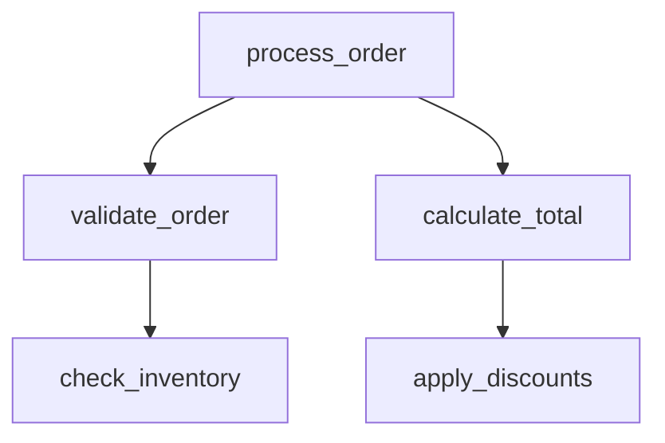

# Examples

Practical examples demonstrating Code Scalpel's capabilities across different use cases.

## Table of Contents

- [Basic Extraction](#basic-extraction)
- [Security Scanning](#security-scanning)
- [Safe Refactoring](#safe-refactoring)
- [Test Generation](#test-generation)
- [Cross-File Analysis](#cross-file-analysis)
- [Compliance Checking](#compliance-checking)
- [Real-World Scenarios](#real-world-scenarios)

---

## Basic Extraction

### Extract a Function

```python
# Extract a specific function without reading the entire file
result = extract_code(
    file_path="/project/utils.py",
    target_type="function",
    target_name="calculate_tax"
)

print(result.target_code)
# Output: Only the calculate_tax function (50 lines instead of 5000)
```

### Extract with Dependencies

```python
# Extract function with its dependencies
result = extract_code(
    file_path="/project/services/order.py",
    target_type="function",
    target_name="process_order",
    include_cross_file_deps=True
)

# Returns:
# - process_order function
# - Imported classes (Order, Payment, etc.)
# - Helper functions it calls
```

### Extract React Component

```python
# Extract TypeScript React component
result = extract_code(
    file_path="/src/components/UserProfile.tsx",
    target_type="function",
    target_name="UserProfile",
    language="tsx"
)

# Returns JSX component with props interface
```

---

## Security Scanning

### Detect SQL Injection

```python
# Scan code for SQL injection vulnerabilities
vulnerable_code = """
def get_user(user_id):
    user_id = request.args.get("id")
    query = "SELECT * FROM users WHERE id=" + user_id
    cursor.execute(query)
    return cursor.fetchone()
"""

result = security_scan(
    code=vulnerable_code,
    entry_points=["get_user"]
)

# Result:
# {
#   "vulnerabilities": [
#     {
#       "cwe": "CWE-89",
#       "severity": "critical",
#       "description": "SQL injection via user input",
#       "source_line": 2,
#       "sink_line": 4,
#       "taint_flow": [
#         "user_id = request.args.get('id')",
#         "query = ... + user_id",
#         "cursor.execute(query)"
#       ]
#     }
#   ]
# }
```

### Safe Version with Parameterized Query

```python
safe_code = """
def get_user_safe(user_id):
    user_id = request.args.get("id")
    query = "SELECT * FROM users WHERE id = %s"
    cursor.execute(query, (user_id,))
    return cursor.fetchone()
"""

result = security_scan(code=safe_code)
# Result: No vulnerabilities found ✅
```

### Cross-File Security Analysis

```python
# Detect vulnerabilities spanning multiple files
result = cross_file_security_scan(
    entry_file="api/handlers.py",
    entry_points=["handle_request"],
    max_depth=5
)

# Example vulnerability:
# File 1 (api/handlers.py):
#   user_input = request.GET['id']
#   services.process(user_input)
#
# File 2 (services.py):
#   def process(data):
#       db.execute(f"SELECT * WHERE id={data}")
#
# Detection: Tracks taint from File 1 → File 2 → SQL sink
```

### Type Evaporation Detection

```python
# Frontend TypeScript code
frontend_code = """
type Role = 'admin' | 'user';

function updateRole(input: HTMLInputElement) {
    const role = input.value as Role;  // ⚠️ No runtime validation
    
    fetch('/api/users', {
        method: 'POST',
        body: JSON.stringify({ role })
    });
}
"""

# Backend Python code
backend_code = """
@app.route('/api/users', methods=['POST'])
def update_user():
    role = request.get_json()['role']  # ⚠️ Accepts ANY value
    user.role = role
"""

result = type_evaporation_scan(
    frontend_code=frontend_code,
    backend_code=backend_code
)

# Result: Detects that TypeScript union type evaporates at JSON boundary
```

---

## Safe Refactoring

### Simulate Before Applying

```python
# Step 1: Extract current implementation
current = extract_code(
    file_path="payment.py",
    target_name="process_payment"
)

# Step 2: Create improved version
improved = """
def process_payment(amount, currency='USD'):
    if currency not in SUPPORTED_CURRENCIES:
        raise ValueError(f"Unsupported currency: {currency}")
    
    if amount <= 0:
        raise ValueError("Amount must be positive")
    
    # ... enhanced logic
    return payment_result
"""

# Step 3: Simulate the refactor
simulation = simulate_refactor(
    original_code=current.target_code,
    new_code=improved
)

# Step 4: Check if safe
if simulation.is_safe and not simulation.security_issues:
    print("✅ Safe to apply")
    
    # Step 5: Apply the change
    update_symbol(
        file_path="payment.py",
        target_name="process_payment",
        new_code=improved
    )
else:
    print("⚠️ Issues detected:")
    for issue in simulation.security_issues:
        print(f"  - {issue}")
```

### Rename Symbol Across Project

```python
# Find all usages before renaming
refs = get_symbol_references("calculate_tax")
print(f"Found {len(refs.references)} usages:")
for ref in refs.references:
    print(f"  {ref.file}:{ref.line}")

# Rename consistently everywhere
result = rename_symbol(
    file_path="utils.py",
    target_type="function",
    target_name="calculate_tax",
    new_name="compute_tax_amount"
)

print(f"✅ Renamed in {len(result.files_modified)} files")
```

---

## Test Generation

### Auto-Generate Unit Tests

```python
# Function to test
function_code = """
def validate_password(password):
    if len(password) < 8:
        raise ValueError("Password too short")
    
    if not any(c.isupper() for c in password):
        raise ValueError("Password must contain uppercase")
    
    if not any(c.isdigit() for c in password):
        raise ValueError("Password must contain digit")
    
    return True
"""

# Generate tests using symbolic execution
result = generate_unit_tests(
    code=function_code,
    framework="pytest",
    max_paths=10
)

print(result.test_code)
```

**Generated Tests:**

```python
import pytest

def test_validate_password_too_short():
    """Test password length < 8 raises ValueError."""
    with pytest.raises(ValueError, match="Password too short"):
        validate_password("Ab1")

def test_validate_password_no_uppercase():
    """Test password without uppercase raises ValueError."""
    with pytest.raises(ValueError, match="must contain uppercase"):
        validate_password("abcdefgh1")

def test_validate_password_no_digit():
    """Test password without digit raises ValueError."""
    with pytest.raises(ValueError, match="must contain digit"):
        validate_password("Abcdefgh")

def test_validate_password_valid():
    """Test valid password returns True."""
    result = validate_password("Abcdefgh1")
    assert result is True
```

### Symbolic Execution Analysis

```python
# Explore all execution paths
function = """
def calculate_discount(price, is_member, quantity):
    discount = 0
    
    if is_member:
        discount += 0.1
    
    if quantity > 10:
        discount += 0.05
    
    final_price = price * (1 - discount)
    return final_price
"""

result = symbolic_execute(
    code=function,
    max_paths=10
)

# Results:
# Path 1: is_member=True, quantity>10 → discount=0.15
# Path 2: is_member=True, quantity<=10 → discount=0.10
# Path 3: is_member=False, quantity>10 → discount=0.05
# Path 4: is_member=False, quantity<=10 → discount=0
```

---

## Cross-File Analysis

### Project Structure Mapping

```python
# Get high-level project overview
project_map = get_project_map(
    root_path="/project",
    max_depth=3
)

print(f"Project: {project_map.project_root}")
print(f"Total files: {project_map.total_files}")
print(f"Total lines: {project_map.total_lines}")
print(f"Languages: {project_map.languages}")
print(f"Entry points: {project_map.entry_points}")
```

### Dependency Analysis

```python
# Analyze file dependencies
deps = get_cross_file_dependencies(
    file_path="/project/services/order.py",
    resolve_transitive=True
)

print("Direct imports:")
for imp in deps.direct_imports:
    print(f"  - {imp}")

print("\nTransitive dependencies:")
for dep in deps.transitive_dependencies:
    print(f"  - {dep}")
```

### Call Graph Generation

```python
# Generate call graph for a file
graph = get_call_graph(
    file_path="/project/services/order.py",
    max_depth=3,
    include_external=False
)

# Visualize as Mermaid diagram
print(graph.mermaid_diagram)
```

**Output:**


---

## Compliance Checking

### Basic Policy Check (Community Tier)

```python
# Check for common anti-patterns
result = code_policy_check(
    paths=["src/"],
    rules=["PY001", "PY002", "SEC001", "SEC002"]
)

# Detected violations:
# - PY001: Bare except clause
# - SEC001: Hardcoded password
# - SEC002: SQL string concatenation
```

### Enterprise Compliance Audit

```python
# Full HIPAA compliance check (Enterprise tier)
result = code_policy_check(
    paths=["src/"],
    compliance_standards=["hipaa", "soc2"],
    generate_report=True
)

# Generates:
# - PDF compliance certificate
# - Audit trail
# - Compliance score (0-100%)
# - Remediation checklist
```

---

## Real-World Scenarios

### Scenario 1: API Endpoint Security Review

```python
# Extract API handler
handler = extract_code(
    file_path="api/endpoints.py",
    target_name="create_user_endpoint"
)

# Scan for vulnerabilities
security = security_scan(code=handler.target_code)

# Check input validation
if any(v.cwe == "CWE-20" for v in security.vulnerabilities):
    print("⚠️ Missing input validation")

# Find all callers
refs = get_symbol_references("create_user_endpoint")
print(f"Endpoint called from {len(refs.references)} locations")
```

### Scenario 2: Legacy Code Refactoring

```python
# Step 1: Understand the code
context = get_file_context(file_path="legacy/processor.py")
print(f"Complexity: {context.complexity_score}")
print(f"Functions: {context.functions}")

# Step 2: Extract complex function
func = extract_code(
    file_path="legacy/processor.py",
    target_name="process_transaction",
    include_context=True
)

# Step 3: Generate tests for current behavior
tests = generate_unit_tests(code=func.target_code)

# Step 4: Refactor
refactored = """
def process_transaction(transaction):
    # Simplified logic
    validate_transaction(transaction)
    result = execute_transaction(transaction)
    log_transaction(result)
    return result
"""

# Step 5: Verify behavior preserved
sim = simulate_refactor(
    original_code=func.target_code,
    new_code=refactored
)

if sim.is_safe:
    update_symbol(
        file_path="legacy/processor.py",
        target_name="process_transaction",
        new_code=refactored
    )
```

### Scenario 3: Dependency Vulnerability Scan

```python
# Scan project dependencies for CVEs
deps = scan_dependencies(
    project_root="/project",
    include_dev=False
)

critical_vulns = [
    d for d in deps.dependencies 
    if any(v.severity == "critical" for v in d.vulnerabilities)
]

if critical_vulns:
    print("⚠️ Critical vulnerabilities found:")
    for dep in critical_vulns:
        print(f"\n{dep.name} {dep.version}")
        for vuln in dep.vulnerabilities:
            if vuln.severity == "critical":
                print(f"  {vuln.cve}: {vuln.description}")
                print(f"  Fix: Upgrade to {vuln.fixed_in}")
```

### Scenario 4: Pre-Commit Security Hook

```bash
#!/bin/bash
# .git/hooks/pre-commit

# Scan staged Python files
for file in $(git diff --cached --name-only --diff-filter=ACMR | grep '.py$'); do
    echo "Scanning $file..."
    
    python -c "
from code_scalpel.mcp.helpers.security_helpers import security_scan

with open('$file') as f:
    code = f.read()

result = security_scan(code=code, min_confidence=0.8)

if result.vulnerabilities:
    print(f'⚠️ Security issues in $file:')
    for v in result.vulnerabilities:
        print(f'  {v.cwe}: {v.description} (line {v.source_line})')
    exit(1)
    "
done

echo "✅ Security scan passed"
```

---

## More Examples

See the `examples/` directory in the repository for additional examples:

- **`security_analysis_example.py`** - Comprehensive security scanning
- **`polyglot_extraction_demo.py`** - Multi-language extraction
- **`jsx_tsx_extraction_example.py`** - React component extraction
- **`policy_engine_example.py`** - Custom policy rules
- **`compliance_reporting_demo.py`** - Enterprise compliance
- **`graph_engine_example.py`** - Call graph analysis

---

**Related Pages:**
- [MCP Tools Reference](MCP-Tools-Reference) - Complete API documentation
- [Getting Started](Getting-Started) - First steps tutorial
- [Troubleshooting](Troubleshooting) - Common issues
